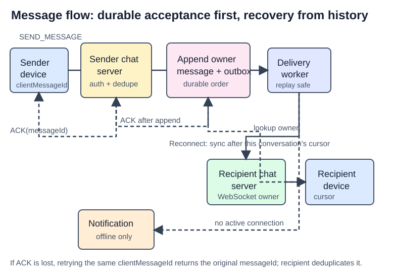

# Chat System

## What the system does

Design a Messenger-style text chat system for mobile and web. The scope from Alex Xu pages 178-199 is one-to-one chat, small groups, presence, multiple devices, durable history, and push notifications.

```text
50M DAU
1:1 chat plus groups of at most 100 members
Text messages only, up to 100,000 characters
Low delivery latency; history retained indefinitely
No end-to-end encryption in the base design
```

## Mental model

There are two very different server roles:

```text
HTTP API servers: stateless login, profile, and settings requests
Chat servers: stateful owners of persistent WebSocket connections
```

A message is durable before it is treated as delivered. The sender's chat server assigns an ordered message ID, persists the message, then routes it to every currently connected recipient device. Offline devices catch up from stored history; push notifications only wake them up.

## Interview blueprint

1. Clarify one-to-one vs group chat, group-size limit, text/media, DAU/concurrent users, ordering, history retention, multi-device support, presence, and E2EE.
2. Estimate concurrent WebSocket connections, messages/sec, storage growth, and group fanout. Do not confuse DAU with concurrent connections.
3. State the split: HTTP for normal APIs, WebSocket for low-latency bidirectional messaging.
4. Draw API servers, service discovery, chat servers, message store, presence store, notification system, and message routing/sync queue.
5. Deep dive on message ordering, multi-device synchronization, group fanout, and presence heartbeats.
6. Close with reconnect, retries, duplicate suppression, and the extensions deliberately left out.

## High-level architecture


```text
login/profile -> load balancer -> stateless API servers
                                      -> service discovery -> selected chat server

client <== persistent WebSocket ==> chat server
chat server -> durable message store + recipient sync stream
            -> recipient chat server when online
            -> notification system when offline
```

Service discovery returns a healthy, nearby chat-server endpoint with connection capacity. The client keeps that WebSocket until it disconnects; normal HTTP load balancing alone cannot route a server-originated message to the connection's owner.

## Transport choice

| Approach | Interview position |
| --- | --- |
| Polling | Easy but repeatedly asks when no message exists; wasteful at scale |
| Long polling | Better than polling, but reconnect churn and connection ownership make routing awkward |
| WebSocket | Strong default: client-initiated upgrade, persistent, bidirectional, uses ports 80/443 |

Use WebSocket for message send and receive to simplify the client and server protocol. Keep signup, login, profiles, search, and settings as ordinary HTTP APIs.

## Data and storage

Use relational storage for account/profile/settings/friend data. Use a horizontally scalable wide-column or key-value message store for message history: writes are huge, recent history is hot, reads also need random access for search or jump-to-message.

| Data | Key / access shape |
| --- | --- |
| User/profile/settings | `userId` |
| Connection registry | `userId -> connected chat-server/device IDs` |
| 1:1 message | conversation key plus ordered `messageId` |
| Group message | `(channelId, messageId)`; partition by `channelId` |
| Per-device cursor | `(userId, deviceId) -> lastSeenMessageId` |
| Presence | `userId -> online, lastActiveAt, heartbeat expiry` |

For a conversation, message IDs must be unique and sortable in the required order. A global Snowflake-like ID is acceptable; a per-conversation sequence is simpler when only order within that conversation matters. Do not order solely by `created_at`: simultaneous writes can share timestamps or arrive out of order.

## One-to-one message flow



1. Sender sends a WebSocket message to its connected chat server.
2. Server authenticates, authorizes the conversation, assigns `messageId`, and writes the message durably.
3. Server writes/routs a recipient sync event after the durable write.
4. If a recipient device is online, its owning chat server pushes the message through its WebSocket.
5. If no recipient device is online, invoke the notification system; history remains in the message store.
6. Recipient acknowledges receipt/read separately. A timeout or reconnect can cause retry, so receiver-side dedupe uses `messageId`.

The book shows a message sync queue. Treat it as a durable per-recipient delivery stream/inbox, not necessarily a physical Kafka topic for every user. Its job is to decouple persistence and live delivery, and to give devices a catch-up source.

## Multiple devices and synchronization

Each device tracks its own cursor, such as `lastSyncedMessageId`. On connection or reconnect, it asks for messages after that cursor for conversations it belongs to. A message is new to a device when it is for that user and its message ID is greater than the device cursor.

Never use one cursor for the whole account: a phone and laptop can be at different points. The server can fan out live events to all connected devices, while a reconnecting device pulls missed durable history. This gives at-least-once delivery; `messageId` makes replay safe.

## Small group chat

For a small capped group, fan out one message to each member's sync stream/inbox. This makes read and device sync simple because every recipient consumes its own inbox.

```text
group message -> persist once by channelId -> fan out references to group members' inboxes
```

This is suitable only because group size is bounded. For large communities, per-member copies make one send far too expensive; use a channel log plus read-time pull or a hybrid approach. State that boundary clearly rather than pretending the small-group solution scales indefinitely.

## Presence

Presence is soft state, not proof that a user will read a message.

1. On WebSocket connect, store `online=true` and `lastActiveAt` with a TTL/expiry in the presence store.
2. Client sends periodic heartbeats; each heartbeat extends the expiry.
3. Explicit logout marks offline immediately.
4. A missing heartbeat beyond the grace window marks offline, avoiding UI flapping on short network drops.
5. Presence service publishes changes to interested friends over WebSocket.

For small friend lists, publish status changes to subscribers. For very large groups, do not fan out every online/offline change; fetch presence when a user opens the group or refreshes the member list.

## Failure modes and guarantees

| Failure | Handling |
| --- | --- |
| Chat server dies | Service discovery stops assigning it; clients reconnect to a new server and sync from durable history |
| Sender retries after uncertain response | Sender reuses client message ID/idempotency key; server returns existing message |
| Live push fails | Recipient pulls missed messages after its cursor on reconnect |
| Duplicate sync event | Client or receiver deduplicates by `messageId` |
| Presence disconnect flaps | Heartbeat grace window instead of immediate offline state |
| Notification provider fails | Notification retries/DLQ; message history is still available when app opens |
| Group grows beyond bound | Move from per-recipient inbox copies to a channel log/read-time strategy |

Use **at-least-once delivery with per-conversation ordering** as the base answer. Global total ordering across all chats is unnecessary and expensive.

## What to leave as extensions

- Media upload, object storage, compression, thumbnails, and CDN delivery.
- End-to-end encryption and key management.
- Full-text message search.
- Large public channels/Discord-scale fanout.
- Client-side cache and geo-edge acceleration.

Mention them only if time remains. The core interview design is WebSocket connection ownership, durable ordered messages, reconnect sync, small-group fanout, and presence.

## Quick recall

**Q. Why WebSocket rather than HTTP polling?**  
A. It gives a persistent bidirectional channel, so servers can push messages without repeated empty requests.

**Q. Why are chat servers stateful?**  
A. Each active WebSocket connection is owned by a specific server until disconnect; API servers remain stateless.

**Q. What does service discovery return?**  
A. A healthy chat-server endpoint selected using location and connection capacity.

**Q. How is message order defined?**  
A. By a unique, sortable message ID within a conversation/channel, not by wall-clock timestamp alone.

**Q. How does a second device catch up?**  
A. It reads durable messages after its own last synced message ID.

**Q. Why is per-member group fanout acceptable here?**  
A. The group is capped at 100; it would not be acceptable for a huge public channel.

