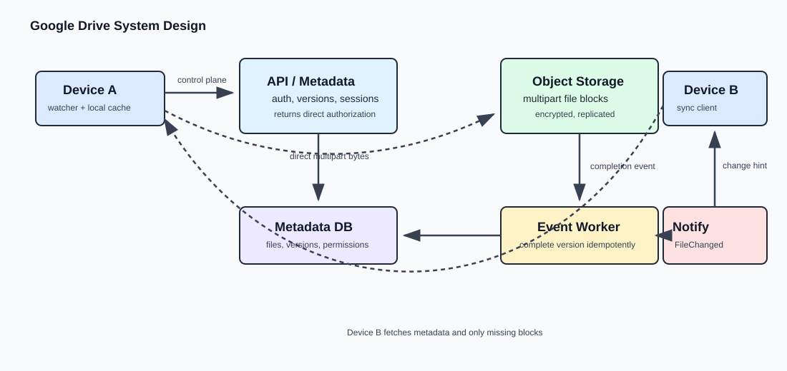

# Google Drive System Design

Design a file-storage and synchronization service for web, desktop, and mobile clients. This module covers Alex Xu's Google Drive chapter (PDF pages 244-269) plus the Dropbox-specific sync mechanics needed for a strong SDE-2 answer. It supports upload, download, cross-device sync, sharing, revisions, and change notifications. Real-time collaborative document editing is out of scope.

## Scope and interview frame

Clarify the following before drawing components:

- Are we syncing arbitrary files across a user's devices, or building Google Docs-style simultaneous editing? The base design is the former.
- What file-size limit, client platforms, encryption, version-history, sharing, and regional requirements apply?
- Can we use managed object storage and its multipart upload API? The default interview answer is yes.

For the book's estimate, assume 50M registered users, 10M DAU, two 500 KB uploads per daily user, and a 1:1 read/write ratio. That gives about 240 average upload requests per second and 480 peak. The useful observation is not the exact number: file systems must estimate upload/download bandwidth and storage growth as well as metadata QPS. A workload can have modest request QPS but enormous byte throughput.

For a different interview assumption, 10M DAU with 10% of users uploading 1 GB per day produces roughly 1 PB of new bytes per day. That is intentionally an aggressive assumption, not a universal Dropbox number. State the assumption, calculate its consequence, and call out that byte throughput and storage growth, rather than only API QPS, drive the design. A reasonable control-plane target is that metadata operations such as listing a folder or obtaining an upload session complete within about 500 ms; large-file transfer time is governed by the data plane instead.

## Mental model

Keep metadata, file bytes, and device synchronization as separate concerns:

```text
Control plane: client -> API service -> metadata DB -> authorization, versions, upload sessions
Data plane:    client <-> object storage -> direct multipart upload and direct download
Sync plane:    durable file-change event -> notification -> device sync client pulls metadata and bytes
```



The API tier must never relay a 10 GB upload. It authenticates the caller, creates metadata and a short-lived scoped upload authorization, then the client transfers bytes directly to object storage. A notification means only "something changed"; synchronization is the later metadata comparison and download of the required data.

## Architecture

| Component | Responsibility |
| --- | --- |
| Device sync client | Watches the local filesystem, tracks local versions and chunk hashes, retries transfers, maintains local cache, and applies remote changes. |
| API / metadata service | Authentication, sharing authorization, file metadata, version checks, upload-session coordination, and download authorization. Stateless behind a load balancer. |
| Metadata database | Users, devices, namespaces/folders, files, immutable file versions, block references, permissions, and upload state. A relational DB is a reasonable default when version and permission updates need transactions. |
| Object storage | Durable encrypted file blocks and completed versions. Replicate across failure domains and, when required, regions. |
| Event bus and workers | Consume object-storage completion events, validate the upload, update metadata idempotently, and publish `FileChanged`. |
| Notification service | Long polling or a push channel that tells online devices to fetch fresh sync metadata. |
| Offline event store | Retains change markers for devices that were offline, so reconnection can catch them up. |
| Optional metadata cache / CDN | Add only for measured hot metadata, public links, popular folders, or repeated authorization checks. Private-file workloads do not automatically justify either. |

## Core data model

```text
File(file_id, owner_id, namespace_id, name, current_version, status, created_at, updated_at)
FileVersion(file_id, version, base_version, object_key, size_bytes, checksum, created_at)
FileBlock(version_id, ordinal, block_hash, object_key, size_bytes)
FilePermission(file_id, principal_id, role)
Device(device_id, user_id, push_id, last_seen_change)
```

`FilePermission` represents sharing and roles such as owner, read, and write. `FileVersion` is append-only, which preserves revision history and makes a completed version immutable. A system without version history can keep only `current_version`, but the separate table is valuable for restore, audit, and conflicts.

## Upload and update flow

1. The client detects a local save through its filesystem watcher and calls `POST /files` or `POST /files/{id}/uploads` with the version it edited from.
2. The API authenticates and authorizes the request, creates an `UPLOADING` record and multipart upload session, then returns an upload ID and scoped pre-signed URLs or credentials.
3. The client splits a large file into upload parts and sends them directly to object storage. Completed parts survive a network failure; only failed or missing parts are retried.
4. Object storage emits a durable completion event after multipart finalization. A worker validates object size/checksum, writes the new version and block mapping, and changes state to `READY`.
5. The worker publishes `FileChanged(fileId, version)`. It must be idempotent because object-storage events and queues can be delivered more than once.
6. The notification service tells relevant online devices to sync. Offline devices discover retained changes when they reconnect.

```text
POST /files/{fileId}/upload-sessions  -> uploadId + direct multipart authorization
POST /files/{fileId}/uploads/complete -> optional client hint; storage event remains authoritative
GET  /files/{fileId}/download          -> authorized short-lived direct download URL
GET  /files/{fileId}/revisions?limit=20
```

A client completion callback is useful for responsiveness but cannot be the sole source of truth: the client can crash after object storage accepted the file. The storage completion event closes that gap. Expire abandoned sessions, clean incomplete parts, and mark the metadata `FAILED` or deleted after a timeout.

### Chunking is a transfer concern

Dropbox-style chunking happens during upload and synchronization. It allows resumable multipart upload and, as an advanced optimization, changed-block sync:

```text
Old: [A][B][C][D]
New: [A][B][X][D]

Compare hashes -> upload X and update the new version's block map
```

This is different from YouTube segmentation. Video platforms upload the source first and server workers later transcode it into playback renditions. File-sync chunks exist to avoid restarting a large transfer and to avoid re-uploading unchanged bytes.

## Download and cross-device sync

On a remote `FileChanged` notification, a device does not blindly download the entire file. Its sync client fetches metadata, compares its local version and block hashes, requests an authorized direct download URL or block URLs, downloads what is missing, reconstructs the version, and atomically updates the local file.

```text
Device A saves V5 -> direct upload -> storage completion -> V6 metadata -> FileChanged
Device B receives notification -> fetches metadata -> local V5 is stale -> downloads required data -> applies V6
```

Local caching is more important than a server-side Redis cache for the basic problem. If the local copy is already current, opening it needs no network round trip. Periodic metadata reconciliation is still useful as recovery when a device was offline or missed a notification; it should not be the primary steady-state sync mechanism.

Long polling is a reasonable default for infrequent server-to-client change hints. WebSocket also works, but its bidirectional capability is not required for the basic sync notification path.

## Consistency, conflicts, and regions

Use a version precondition on every update. If a device writes based on V5 but the current server version is already V6, reject a silent overwrite and preserve the later update as a conflicted copy. Automatic merge, CRDTs, and OT are not required for arbitrary binary files or this base interview scope.

```text
Device A uploads based on V5 -> server accepts V6
Device B uploads baseVersion=V5 -> mismatch -> create "conflicted copy" and notify the user
```

Within the metadata authority, version updates and cache invalidation need strong enough consistency that different devices do not receive contradictory current versions. Do not claim that adding a cache makes this automatic: invalidate or update cache entries with the metadata write and treat the database state as authoritative.

For multi-region availability, route users to a nearby region, replicate metadata and object bytes asynchronously across regions, and accept bounded cross-region staleness where product requirements allow it. Version preconditions still detect concurrent cross-region edits. Replication improves availability and read scale, but backups, snapshots, and point-in-time recovery are separately required to recover from accidental deletion or corruption.

## Reliability and cost

| Failure or concern | Interview-level handling |
| --- | --- |
| Interrupted upload | Multipart/resumable upload; retry only missing parts and expire abandoned sessions. |
| API instance fails | Stateless instances behind a load balancer; another instance continues from durable metadata. |
| Worker fails | Durable event plus idempotent processing lets another worker retry. |
| Metadata writer fails | Replicated DB, promotion/failover, and healthy read replicas. |
| Object-storage region fails | Replicated data in another failure domain/region, with a defined recovery objective. |
| Notification server fails | Devices reconnect gradually with backoff; reconcile from durable change state. |
| Duplicate event | State transitions and version writes use idempotency keys/conditional updates. |
| Storage growth | Deduplicate identical blocks within an account, retain a bounded/value-weighted revision history, and tier cold revisions to cheaper storage. |

The book routes uploads through block servers so chunking, compression, and encryption are centralized. A direct-to-object-storage design is usually the simpler modern default because it keeps bytes off application servers. Defend either approach: centralized block servers simplify client logic and enforcement; direct upload reduces a network hop and API bandwidth. In both cases, use HTTPS, encrypted storage, scoped short-lived credentials, and authorization checks before exposing a download.

## Interview blueprint

1. Set the scope: arbitrary-file sync, not collaborative editing; clarify size, sharing, history, encryption, and regions.
2. Estimate metadata QPS plus byte throughput and storage growth.
3. Separate metadata control plane, direct object-storage data plane, and notification-driven sync plane.
4. Walk through multipart upload, authoritative storage completion event, immutable version write, and `FileChanged` notification.
5. Deep dive on local cache, changed-block sync, version conflict copies, regional replication, and idempotent recovery.

## Common traps

- Do not store multi-GB file blobs in the metadata database or proxy them through application servers.
- Do not rely solely on a client callback to declare a direct upload complete.
- Do not confuse upload chunks with video-transcoding segments.
- Do not make cache or CDN mandatory merely because they appear in many HLD diagrams.
- Do not say replication protects against bad deletes; logical errors replicate too, so retain backups/PITR.
- Do not jump to CRDTs or operational transforms unless real-time collaborative editing is in scope.

## Quick recall

**Q. Why use direct multipart upload?**
A. It keeps large bytes off API servers and lets failed portions of a large upload retry independently.

**Q. How does the backend know a direct upload completed?**
A. Object storage emits a completion event; a worker validates it and updates metadata idempotently. A client callback is only a hint.

**Q. What does a sync notification contain?**
A. A small change hint such as file ID and version. The device then fetches authoritative metadata and required bytes.

**Q. How are simultaneous offline edits handled?**
A. Each write carries `baseVersion`; a mismatch creates a conflict, normally preserved as a separate conflicted copy.

**Q. Why is a local client cache important?**
A. Current files open without network traffic, reducing latency and object-storage egress.
