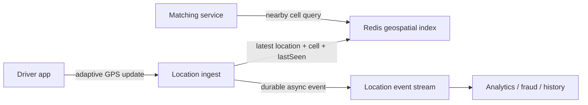

# Design

## Design Uber / Ride-Sharing

This is the interview blueprint for a ride-sharing backend. Keep the first version focused on ride request, nearby driver discovery, matching, trip lifecycle, and tracking. Payments, fraud, promotions, and support can be follow-ups.

## Clarifying questions

- Are we designing rider booking only, or driver onboarding, payments, pricing, and support too?
- Is this one city, one country, or global multi-region?
- Do riders need real-time driver tracking?
- How often do drivers send location updates?
- Do we optimize by nearest distance, ETA, driver rating, vehicle type, or price?
- Can a driver reject a ride?
- Do we need scheduled rides, pooled rides, surge pricing, or cancellations?

Reasonable scope:

```text
Riders request rides.
Drivers publish live location.
System finds nearby available drivers.
System assigns one driver and tracks trip state.
Rider sees ETA and driver movement.
```

## Functional requirements

- Driver can go online/offline.
- Driver app sends location updates every few seconds.
- Rider can receive a fare/ETA estimate before confirming a ride.
- Rider requests a ride from pickup to drop-off.
- System finds candidate available drivers near pickup.
- System assigns/reserves a driver.
- Rider and driver can see trip status.
- Trip moves through states: requested, assigned, arrived, started, completed/cancelled.

## Non-functional requirements

- Low-latency matching: rider should get candidates/assignment quickly.
- Fresh driver locations: stale drivers must not be matched.
- High write throughput: driver location updates are frequent.
- High availability: matching should degrade by region, not globally fail.
- Consistency where it matters: one driver should not be assigned to two rides at the same time.
- Regional locality: a Bangalore ride should not depend on a US region hot path.

## Back-of-envelope estimation

Use simple round numbers in an interview:

```text
1M active drivers
location update every 5 seconds
location updates = 1M / 5 = 200K writes/sec

100K ride requests/min at peak
ride requests = ~1.7K/sec
```

Design implication:

| Estimate | Implication |
|----------|-------------|
| Location writes dominate | Store latest active locations in Redis / in-memory spatial index |
| Matching reads need low latency | Query nearby cells, not the full driver table |
| Trip state changes are fewer but critical | Persist trip state in durable DB |
| Region traffic is local | Partition by city/region/geospatial cell |

Do not store every GPS update in the primary relational DB hot path. Keep latest state in a fast store, and stream history asynchronously for analytics/audit if needed.

## APIs

```text
PATCH /drivers/me/status
body: { status: "AVAILABLE" | "OFFLINE" }

POST /drivers/me/location
body: { lat, lon, clientObservedAt }

POST /fare-estimates
body: { pickupLat, pickupLon, dropoffLat, dropoffLon, vehicleType }

POST /rides
body: { fareQuoteId, pickupLat, pickupLon, dropoffLat, dropoffLon, vehicleType }

POST /rides/{rideId}/accept
body: { offerId }

POST /rides/{rideId}/events
body: { event: "ARRIVED" | "STARTED" | "COMPLETED" | "CANCELLED" }

GET /rides/{rideId}
```

The authenticated session determines the rider or driver identity. The server records receipt time, verifies that a fare quote is valid, and calculates authoritative fare data; a client-supplied `riderId`, `driverId`, price, or server timestamp is not trusted.

## Data model

Durable tables:

```text
Driver(driver_id, status, vehicle_type, rating)
Rider(rider_id, ...)
FareQuote(fare_quote_id, rider_id, pickup, dropoff, vehicle_type, estimated_fare, expires_at)
Ride(ride_id, rider_id, driver_id, pickup, dropoff, status, offer_expires_at, created_at)
RideEvent(ride_id, event_type, timestamp, actor_id)
```

Hot location store:

```text
driver:{driverId} -> {lat, lon, geohash/h3_cell, status, lastSeen}
cell:{h3_cell} -> set(driverIds)
```

The cell index can be Geohash, H3, or S2. The key idea is the same: turn nearby search into "look in this cell and neighboring cells", then rank candidates by exact distance/ETA.

## High-level architecture

```text
Driver App -> Location Ingest -> Active Driver Store / Spatial Index
                                      |
Rider App  -> Ride Service -> Fare / Route provider
                  |                   |
                  +-> Matching Service -> Candidate drivers
                                      |
                              Trip Service / DB
                                      |
                              Notification / Push
```

Core components:

- **Location ingest:** accepts frequent driver updates.
- **Active driver store:** keeps only latest searchable driver state.
- **Spatial index:** maps cells to available drivers.
- **Fare/route provider:** supplies an expiring estimate and route ETA; cache short-lived, non-authoritative results where appropriate.
- **Matching service:** fetches candidates, computes ETA/rank, reserves one driver.
- **Trip service:** owns ride state machine.
- **Notification service:** sends assignment/status updates.

## Main flows

### Driver location update

1. Driver sends `lat/lon/timestamp`.
2. Server validates driver is online or on-trip.
3. Compute geospatial cell.
4. Update `driver:{driverId}` latest location.
5. If cell changed, remove driver from old cell set and add to new cell set.
6. Emit async event for analytics/history if required.

### Ride request and matching

1. Rider requests a fare estimate. Ride Service calls a routing/pricing dependency and stores a short-lived `FareQuote`.
2. Rider confirms the quote; Ride Service validates it and creates one idempotent `REQUESTED` ride.
3. Matching service computes pickup cell and neighboring cells.
4. Fetch available drivers from those cells.
5. Filter stale drivers using `lastSeen`.
6. Compute distance/ETA for candidates.
7. Rank by ETA, vehicle type, driver status, and business rules.
8. Reserve one driver atomically, create a time-bounded offer, and notify driver and rider.

### Trip lifecycle

```text
REQUESTED -> RESERVED -> ASSIGNED -> ARRIVED -> ON_TRIP -> COMPLETED
                      \-> CANCELLED
```

Use explicit state transitions. Avoid "status string changed anywhere" because ride systems become messy quickly.

## Deep dives

### Nearby search

Do not scan all drivers. Use a geospatial index:

```text
pickup lat/lon -> cell -> current + neighbor cells -> candidate drivers
```

Then filter/rank:

```text
candidates -> exact distance -> route ETA -> assignment score
```

Geohash is easy to store and query by prefix. H3/S2 are often better for production grids. Quadtree is useful conceptually, but a huge distributed quadtree is hard to update when drivers move every few seconds.

With Redis specifically, `GEOADD` replaces a driver's previous position and `GEOSEARCH` returns drivers near a pickup. Keep a companion `lastSeen` timestamp index: a cleanup worker removes old driver IDs from both the timestamp and geo indexes. The active index is rebuildable from new phone updates, so Redis replication/persistence improves availability but durable trip state never depends on it.

### Driver reservation

Two ride requests can race for the same driver. The reservation must be atomic:

```text
reserve driver if status == AVAILABLE
set status = RESERVED for rideId
```

This can be done with a DB conditional update, Redis Lua script, or a per-driver ownership service. The key is compare-and-set semantics.

### Stale drivers

Do not match a driver who stopped sending GPS updates. Store `lastSeen` and remove drivers whose update age exceeds the threshold.

```text
if now - lastSeen > 15s:
  remove from available pool
```

TTL can help, but an explicit cleanup/state transition is easier to reason about in interviews.

### Location ingestion and adaptive update rate

Location updates are the highest-write path. Keep the **latest matching state** in a Redis cluster or another in-memory geospatial store, not in the primary relational database. A relational store can retain driver profiles and durable trip state, while an asynchronous event stream stores location history for analytics, fraud, and replay.

Do not add a batching queue between the driver and the live matching index merely to reduce writes: the saved database load comes at the cost of stale locations and worse matching. Instead, reduce unnecessary writes at the source:

- Send more frequently while a driver is available, moving quickly, or near a high-demand area.
- Send more frequently when direction changes often, because a stale heading makes the ETA worse.
- Send less frequently while parked, offline, or far from demand.
- Reject late/out-of-order updates using the client timestamp.
- Expire an unavailable location using `lastSeen` plus a TTL safety net.

This decision belongs partly in the driver app: it can use GPS/speed/direction signals before transmitting. The backend still enforces the freshness rule; client-side adaptation lowers traffic but is not the source of truth.



### Matching lease versus final assignment

Candidate discovery is eventually consistent: two matching workers can see the same available driver. Coordinate the short-lived offer with a lease, then make the accepted assignment durable.

```text
1. Worker selects the next ranked driver.
2. Acquire lease atomically: SET driver-lock:{driverId} {rideId} NX PX 5s.
3. Only the lease holder sends that driver an offer.
4. On acceptance, conditionally persist:
   driver AVAILABLE/RESERVED -> ASSIGNED for this ride
   ride MATCHING -> ASSIGNED with this driver
5. Release the lease; the durable assignment, not the lease, now prevents reuse.
```

The acceptance endpoint must be idempotent and verify that the offer still belongs to that ride. A lease timeout is not proof that no assignment succeeded: a late accept must read the durable ride and driver state before changing anything.

For an interview, choose one offer strategy and state it clearly:

| Strategy | Benefit | Cost |
|---|---|---|
| Sequential offers | Simple and avoids spamming drivers | Longer match time |
| Small bounded fan-out | Faster match under low acceptance | Must atomically select one winner and cancel the rest |

A cron job that resets `OFFERED` drivers is only reconciliation. It can leave a driver unnecessarily unavailable until the next run. A short lease/TTL handles normal expiry promptly; periodic reconciliation repairs crashes, missed expiry events, and inconsistent durable state.

### Offer timeout and durable progress

An offer is a human-in-the-loop step: a driver may accept, decline, lose connectivity, or never see the push notification. Store `offerExpiresAt` with the ride. On sending an offer, schedule a delayed retry event for that expiry; when it runs, conditionally check `ride.status == OFFERED` and `offerExpiresAt <= now` before trying the next ranked driver. If the driver accepts first, the same conditional state transition makes the delayed event a harmless no-op.

For an SDE2 answer, a durable queue plus conditional transitions and reconciliation is enough. A workflow engine such as Temporal can own repeated offer, timeout, and retry steps when this workflow grows across many states, but it is an optional operational trade-off, not a required first component.

### Surge handling and service partitioning

Place ride requests on a durable, region-partitioned queue when matching workers cannot absorb a burst. Workers consume by city or groups of adjacent geospatial cells, so a hard-to-match rural request does not block a dense-city request behind a global FIFO queue. Autoscale workers from queue lag and active-match count.

The queue gives retry and crash recovery, but it is not permission to make riders wait indefinitely. Carry a request deadline, stop processing expired requests, and return a clear no-driver outcome within the matching SLO. Make `request ride` idempotent so a client retry or queue redelivery does not create multiple matching jobs.

### Keep the primary database off the hot path

Use the correct store for each access pattern:

| Need | Primary path | Why |
|---|---|---|
| Latest nearby available drivers | Redis geospatial/cell index | High-rate writes and low-latency radius lookup |
| Driver profile, rider profile, completed ride | Durable database | Transactional source of truth |
| Driver availability while matching | Lease plus conditional state transition | Prevents double offers and assignments |
| Location history and business analytics | Event stream plus async consumers | Does not slow live matching |
| Repeated route/ETA lookup | Short-lived cache or routing-provider cache | Reduces expensive external routing calls; do not cache stale surge prices too long |

### Region, cell, and data partitioning are different

- **Geospatial cells** answer "which drivers are near this pickup?" They are a data index and may have hot cells.
- **City/region partitions** answer "which matching workers own this local workload?" They limit coordination and reduce latency.
- **Storage shards** distribute durable records such as rides. Choose a stable high-cardinality key such as `rideId` or a regional prefix plus `rideId`; do not shard by a low-cardinality field such as country alone.

Handle a hot downtown cell by splitting to a finer cell resolution, expanding workers for that cell partition, and bounding the candidate list before route-ETA calls. Do not use cross-region matching by default: it increases latency and creates coordination pressure without helping a local ride.

## Interview delivery

Start with the functional path, then select two deep dives that prove the non-functional requirements. For Uber, the strongest pair is usually:

1. **Low-latency, fresh nearby-driver discovery:** adaptive location updates, cell index, candidate funnel, ETA ranking.
2. **Correct matching under concurrency:** offer lease, conditional assignment, timeout recovery, idempotent accept.

Add region-partitioned queueing only when the interviewer asks about peak-event surges or failure recovery. Do not spend time on exact field types, a full routing-engine implementation, or ML pricing internals unless they change a design decision.

## Failure modes

| Failure | Handling |
|---------|----------|
| Location updates delayed | Mark stale after threshold; do not match stale drivers |
| Driver reservation race | Atomic compare-and-set on driver status |
| Matching service down | Retry in same region; return graceful failure to rider |
| Matching worker crashes after dequeue | Queue redelivery plus idempotent ride request; resume only while request deadline is valid |
| Notification lost | Trip state remains source of truth; clients poll/refresh ride state |
| Driver accepts after offer expiry | Validate lease/offer and durable ride state; reject stale acceptance safely |
| Region outage | Route users to nearby healthy region only if data/driver pool can serve them |

## Monitoring

- location update QPS and lag
- active drivers per cell/city
- stale driver count
- ride request rate
- match success rate
- assignment latency p50/p95/p99
- driver acceptance/rejection rate
- cancelled rides by reason
- hot cells / overloaded regions

## Tradeoffs

| Choice | Benefit | Cost |
|--------|---------|------|
| Redis active-driver store | Very low latency | Volatile; needs recovery/refresh path |
| Geohash/H3/S2 cells | Fast candidate retrieval | Boundary and hot-cell issues |
| Route by ETA | Better user experience | Needs routing service and traffic data |
| Strong reservation consistency | Avoids double assignment | Adds coordination in hot path |
| Regional matching | Low latency and simpler failure domains | Cross-region rides/data become harder |

## Quick recall

**Q. What is the hot path?**  
A. Driver location updates and nearby-driver matching.

**Q. Why not store every location update in the DB?**  
A. Location writes are too frequent; keep latest active state in memory and stream history async.

**Q. Why does a rider confirm a short-lived fare quote instead of sending a price?**
A. Pricing is server-authoritative. An expiring quote prevents stale or client-tampered prices from becoming a ride.

**Q. How do you find nearby drivers?**  
A. Use Geohash/H3/S2 cells to fetch candidates, then compute exact distance/ETA.

**Q. What consistency problem matters most?**  
A. Atomic driver reservation so one driver is not assigned to two rides.

**Q. What makes a driver stale?**  
A. `lastSeen` exceeds a freshness threshold, so remove from available matching pool.

**Q. Why not queue GPS writes and batch them into the main database?**
A. Matching needs fresh state. Keep latest location in the hot geospatial store; stream history asynchronously instead.

**Q. Why is a Redis lock alone not enough for assignment?**
A. It coordinates a short offer. A durable conditional ride/driver transition decides the final winner after the lock expires.

**Q. What happens when a driver ignores an offer?**
A. A durable delayed retry checks the persisted expiry and offer state, then safely tries the next candidate; reconciliation repairs exceptional failures.
