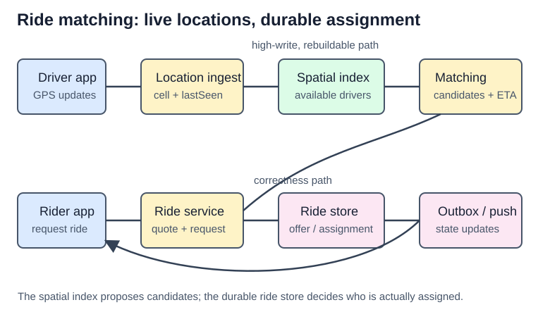
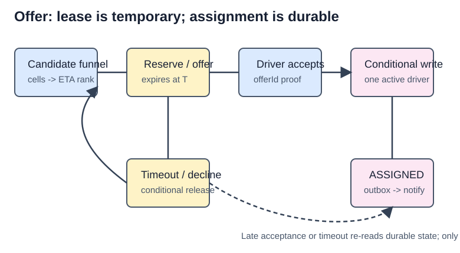

# Design Uber: Nearby Drivers and Correct Matching

## Interview scope

Design the core ride-hailing backend: drivers publish their current location, riders request a ride, the system finds
and offers the ride to nearby eligible drivers, one driver is assigned, and both sides receive trip updates. The base
answer excludes payments, promotions, fraud, support, pooled rides, and routing-engine internals.

| Clarification | Agreed answer | Design consequence |
| --- | --- | --- |
| What is “nearby”? | Candidate discovery first, then road ETA | A cell index narrows the set; it does not choose the driver. |
| What must be correct? | A driver has at most one active offer/ride | Durable conditional assignment decides the winner. |
| What is the hottest path? | GPS updates | Keep latest state in an in-memory spatial index, not the trip database. |
| What freshness is acceptable? | A stale driver must not be matched | Store `lastSeen`; expire and filter old locations. |
| What is local? | A ride and its driver pool | Partition matching and failure domains by city/region. |

## Numbers that change the design

```text
1M active drivers, one update every 5 seconds  -> 200K location writes/sec
100K ride requests/minute at peak              -> ~1,700 requests/sec
```

Location writes dominate and are ephemeral; trip transitions are fewer but financially and operationally important.
That gives two separate sources of truth:

| State | Store and contract |
| --- | --- |
| Latest eligible driver location | Rebuildable in-memory spatial index: `driverId -> cell, point, status, lastSeen`. |
| Ride, offer, and assignment | Durable transactional store with conditional transitions and an audit trail. |

Do not write every GPS point to the primary relational database synchronously. Publish location history to an event
stream for analytics, fraud, and replay after updating the live index.

## Start with the candidate funnel

Latitude and longitude identify a point; they do not make “find drivers within 2 km” cheap. Scanning every driver and
running a distance formula is `O(N)`. A location cell converts one point into a small candidate region; exact distance
and routing happen only after that reduction.



1. Convert pickup coordinates to a geospatial cell and include neighbouring cells to avoid cell-boundary misses.
2. Read only `AVAILABLE`, fresh drivers from those cells.
3. Use a bounding-box/straight-line-distance pass to eliminate clear false positives.
4. Ask a routing/ETA provider for a bounded top set, then rank by ETA, vehicle type, and stated business rules.
5. Try to reserve one candidate; a failed reservation advances to the next candidate rather than restarting the search.

Distance is a candidate filter, not the final choice. A physically closer driver can have a worse ETA because road
direction, traffic, and one-way streets matter. Routing models roads as a graph and selects a time-cost route; naming
Dijkstra or A* is enough unless the interviewer asks for routing internals.

## Spatial index choice

The index is a coarse search accelerator. Keep exact coordinates for precise filtering and maps.

| Option | Useful property | Boundary / trade-off |
| --- | --- | --- |
| Geohash | Hierarchical string prefix fits common indexes and key-value stores | Fixed rectangles, neighbour-cell lookup, and dense-cell hot spots. |
| H3 | Hierarchical global cells with direct neighbour traversal | Still has boundaries; resolution and hot cells remain product choices. |
| S2 | Hierarchical spherical cells | Good global geometry; an implementation choice, not a different matching design. |
| Quadtree | Splits dense areas more finely | A distributed, frequently changing global tree is operationally complex. |
| Bounding box + B-tree | Simple first filter for modest scale | False positives and poor nearest-neighbour behavior at high density. |

H3 is a valid modern choice because it maps a latitude/longitude point to a cell and can retrieve nearby cells. It
does not eliminate boundary cases or replace ETA ranking. For the detailed geohash, H3/S2, quadtree, bounding-box,
and routing notes preserved from this module, read [Spatial Indexing for Nearby Search](/system_design/concepts/spatial_indexing/).

## Location updates: fresh, cheap, and rebuildable

```text
POST /drivers/me/location { lat, lon, clientObservedAt }
```

The ingest service authenticates the driver, rejects clearly old/out-of-order observations, derives a cell, updates
the driver's latest record, and moves the driver between cell memberships only when the cell changed. Matching indexes
only `AVAILABLE` drivers; `ON_TRIP` drivers may still report location for tracking but are not candidates.

Use `lastSeen` as the explicit freshness rule and a TTL as a safety net. If `now - lastSeen` exceeds the matching
threshold, remove the driver from the candidate pool. Adaptive update frequency is an optimization: update more often
while available, moving, or near high demand; update less when parked or offline. The backend still owns freshness.

## Ride request and matching

```text
POST /fare-estimates -> short-lived, server-authoritative quote
POST /rides          -> idempotent REQUESTED ride using that quote
POST /rides/{id}/accept { offerId }
```

The API derives rider and driver identity from authentication, not client-supplied IDs. A quote expires and is checked
when the rider creates the ride, so the client cannot reuse an old price or vehicle rule.



`REQUESTED -> OFFERED -> ASSIGNED -> ARRIVED -> ON_TRIP -> COMPLETED` is a durable ride lifecycle. `CANCELLED` is an
allowed terminal outcome. The exact state names can differ; the transition authority cannot.

## Deep dive: lease reduces work; durable assignment preserves correctness

Two matchers can discover the same driver from eventually consistent location state. A short lease or atomic
compare-and-set can reserve the driver while an offer is sent. It reduces duplicate offers but is not the final truth:
a lease can expire while a late acceptance is in flight.

The accepting endpoint performs a durable conditional transition. In one transactional authority, create an active
assignment record with a uniqueness rule such as “one nonterminal assignment per driver”, update the ride from
`OFFERED` to `ASSIGNED` only if its `offerId` still matches, and append a `RideEvent`. The unique/conditional write
selects the winner even after a lease expiry. An outbox then publishes notifications; lost push messages do not change
the durable ride state.

## Deep dive: offers, timeouts, and retries

An offer includes an expiry. On timeout or decline, a delayed job conditionally verifies that the same offer remains
open, releases the temporary reservation, and tries the next ranked driver. If acceptance won first, the timeout job
is a no-op. Client retries use an idempotency key; queue retries and late accepts re-read durable ride and assignment
state before changing anything.

Use either sequential offers or a small bounded parallel fan-out. Sequential is simpler but slower; parallel offers
improve acceptance time but make the one-winner conditional transition essential. Do not promise a global driver lock
or a broad fan-out without explaining its cost to drivers.

## Deep dive: locality, hot cells, and recovery

Route a ride to the city/region that owns its driver pool. This is workload partitioning; cells are the local spatial
index inside that region. A dense downtown cell can be split to a finer resolution, given more matching workers, and
limited to a bounded candidate set before expensive ETA calls. A rural search can expand one ring at a time until its
deadline rather than querying a massive radius at once.

| Failure | Observable outcome and recovery |
| --- | --- |
| Location update delayed | `lastSeen` becomes stale; driver is excluded from matching. |
| Spatial index unavailable | New matching degrades in that city; durable rides remain visible and location state rebuilds from new updates. |
| Matcher crashes after dequeue | Retry the idempotent ride job while its matching deadline remains valid. |
| Offer push lost | Driver/rider refreshes durable trip state; expiry/retry still runs. |
| Late driver acceptance | Conditional `offerId` and active-assignment write reject a stale winner. |
| Region outage | Fail locally or use an explicitly prepared nearby pool; do not silently perform global matching. |

## Interview delivery

1. Scope ride matching rather than every Uber product.
2. Estimate location writes separately from ride requests.
3. Explain the candidate funnel before naming H3, Redis, or routing algorithms.
4. Walk one offer from request through durable assignment and notification.
5. Deep dive into cell boundaries/freshness and assignment races/timeouts.
6. Close with city locality, hot-cell handling, and recovery.

## Quick recall

**Q. Why is a cell index not enough to select a driver?**

A. It returns geographically plausible candidates. Exact filtering and road ETA decide the usable ranking.

**Q. Why include neighbouring cells?**

A. A close driver can sit across a discrete cell boundary.

**Q. Why keep trip state out of the location index?**

A. Location is high-write, stale-tolerant, and rebuildable; assignment needs durable conditional correctness.

**Q. Does a Redis lease prevent every double assignment?**

A. No. It reduces duplicate work; the durable conditional assignment chooses the final winner.

**Q. What should happen after an offer timeout?**

A. A delayed conditional transition releases only the still-open offer and tries the next candidate.

**Q. What changes for a downtown hot spot?**

A. Use finer cells, more local matchers, a bounded ETA candidate set, and a request deadline.
