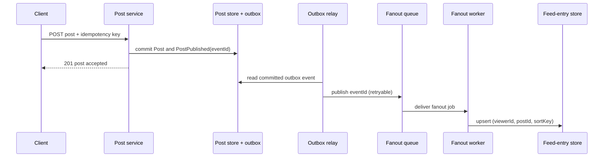

# News Feed System

## The interview prompt

Design a reverse-chronological home feed for a social product. A user publishes a text or media post; people who
follow that author can later open the app and see the post in their feed. The apparent product feature is simple, but
the design must reconcile two conflicting workloads: one publish can affect many feeds, while a feed must still open
quickly for a reader.

This case uses mobile and web clients, 10M DAU, text plus media references, and at most 5,000 follows/friends for an
ordinary account. It deliberately does **not** design ranking ML, ads, comments, full media transcoding, or real-time
push. Those can be added later, but they should not obscure the core question: how a durable post becomes a fast,
personalized feed page.

## Clarify before drawing components

These questions change the design. Asking them first is more useful in an interview than immediately naming Kafka,
Redis, or a database.

| Question | Assumption for this exercise | Consequence |
| --- | --- | --- |
| What order does the product promise? | Reverse chronological order among available candidates | We need an order key and cursor, not a global total order. |
| When may the author call a post successful? | After the post and a durable fanout event commit | The author does not wait for every follower feed to update. |
| Can a follower briefly miss a new normal post? | Yes; propagation is eventually consistent | Fanout can be queued and retried. |
| What happens for a high-follower account? | It must not create an unbounded publish-time write burst | The reader merges that author's recent posts at read time. |
| What does a privacy or delete change require? | It must stop appearing promptly | The read path checks current visibility, then a repair job cleans old entries. |

## First build the small version

The smallest correct implementation stores every post by author. When a reader opens a feed, the service looks up the
people they follow, fetches each author's recent posts, merges the lists by time, and returns the newest page. This is
**fanout on read**: the work of combining posts happens only when someone asks for a feed.

That baseline is useful because it establishes the source of truth. A `Post` is the durable content created by an
author. It is not yet a feed. The feed is a per-viewer ordered list of post candidates. If a reader follows thousands
of active authors, building that list from scratch on every refresh means many reads, a merge, privacy checks, and
content lookups on the latency-sensitive path. Caching helps, but it does not make repeatedly merging a large active
follow set free.

The opposite design is **fanout on write**: when Alice posts, append Alice's `postId` to every eligible follower's
feed list in the background. Bob's next read starts from a prepared list and is fast. The cost moves to publish time;
one post by a very popular author can require millions of writes, including work for followers who never open the app.

The final design is hybrid. It materializes normal-author posts into follower feed lists, then pulls only a bounded
recent window for high-fanout authors when a feed is read. The rest of the page explains what is durable, cached, and
checked again so that this optimization remains safe.

## A mental model for the final design

There are three different pieces of data. Keeping their jobs separate avoids several common mistakes.

| Term | What it is | Why it is separate |
| --- | --- | --- |
| `Post` | The author's durable content, media references, and creation time | Editing or deleting it should not rewrite thousands of feed bodies. |
| `FeedEntry` | A lightweight `(viewerId, postId, sortKey)` candidate in one viewer's feed | It makes normal-author reads cheap and can be partitioned by viewer. |
| Hydrated item | The response object assembled from post, author, action, counter, and media metadata | Viewer-specific data and counters can change independently of the feed order. |

The feed cache stores recent **post IDs**, not fully copied post objects. A content/post cache stores the post itself;
separate user, action, and counter caches hold data with different update rates. This lets the system invalidate one
post or update one counter without rewriting every reader's cached feed.

```text
Publish: post + outbox commit -> fanout event -> durable FeedEntry -> recent-ID cache
Read:    candidate IDs -> merge high-fanout posts -> visibility filter -> hydrate -> media URLs
```

## Numbers that justify the design

Do not invent precise QPS if the interviewer has not supplied a posting and refresh rate. Ask for them. The numbers
below are enough to identify the pressure points.

| Input | Exercise value | Design decision it changes |
| --- | --- | --- |
| Daily active users | 10M | Reads are common and bursty, so the feed page needs a cacheable candidate path. |
| Ordinary follow degree | up to 5,000 | A normal post can still create thousands of entries; fanout must be asynchronous. |
| One hot author | much larger than ordinary users | A publish-time push can become a write storm, so use read-time merge for that class. |
| Feed page | bounded, for example 20 items | Batch hydration and a cursor are practical. |
| Media | images/videos | Responses return URLs and metadata; bytes stay in object storage and a CDN. |

For intuition, 100 posts per second from ordinary authors with an average of 500 eligible followers means roughly
50,000 feed-entry materializations per second. That is a queue-and-worker problem, not a synchronous request problem.
One celebrity post with millions of followers changes the order of magnitude again; sharding workers does not remove
the fundamental write cost, which is why the hybrid split exists.

### Estimate aloud, without pretending unknown inputs are facts

If the interviewer gives a feed-open rate of `R` opens per active user per day, average feed-read QPS is
`10M × R / 86,400`; plan for a several-times-higher peak because people open feeds in bursts. If normal posts arrive
at `P` posts/second and reach `F` eligible followers on average, normal fanout work is approximately `P × F`
feed-entry writes per second. The key output is not an exact shard count: it is the observation that a single hot
author can have an `F` so large that this product becomes unacceptable.

For storage, estimate only the bounded pieces being designed. A recent feed cache needs roughly
`active viewers × retained IDs × bytes per ID`, while durable feed-entry retention depends on the product's history
policy. State that media is a separate object-storage/CDN budget; never hide video bytes inside the feed-entry estimate.

## High-level architecture

The diagram answers one question: which component owns durable state and which components only accelerate delivery.
The next sections trace the publish and read paths in detail.


The post store is authoritative for content. The feed-entry store is the durable materialized index for normal-author
posts. Caches speed up reads but are rebuildable. The outbox relay and queue decouple accepted posting from fanout;
the graph and visibility policy decide who is eligible at the time fanout runs.

## APIs and data contracts

The API needs an idempotency key for a retrying client. A transport timeout does not tell the client whether the
server committed the post; repeating the same logical request must return the original result instead of creating a
second post.

```text
POST /v1/me/posts
Idempotency-Key: client-generated-uuid

{
  "content": "hello",
  "mediaIds": ["media-1"]
}

201 Created
{ "postId": "p-123", "createdAt": "..." }
```

```text
GET /v1/me/feed?cursor=<opaque>&limit=20

200 OK
{
  "items": [{ "post": "...", "author": "...", "viewerAction": "..." }],
  "nextCursor": "..."
}
```

The cursor encodes the last returned `(sortKey, postId)`, not a page number. New posts arriving at the front of a
feed shift page offsets; a stable last-seen key allows the next request to continue below the item the reader already
saw. `postId` is a tie-breaker because timestamps alone can collide.

| Record | Minimum fields | Owner and query shape |
| --- | --- | --- |
| `Post` | `postId`, `authorId`, `content`, `mediaIds`, `createdAt`, visibility state | Post store; lookup by `postId` or author/recent range. |
| Follow edge | `viewerId`, `authorId`, state | Graph store; fanout recipient lookup and read-time high-fanout lookup. |
| `FeedEntry` | `viewerId`, `postId`, `sortKey` | Feed-entry store; range query partitioned by `viewerId`. |
| `PostPublished` | `eventId`, `postId`, `authorClass`, creation time | Outbox and queue; drives retryable fanout. |
| Viewer state | `(viewerId, postId) -> liked/saved/...` | Action store/cache; fetched only during hydration. |

## Publish path: accept once, fan out later

The correct boundary is not “the queue accepted a message.” A broker write and a database write are separate systems;
the process can crash between them. Instead, write the durable post and an outbox event in one database transaction.
Only after that transaction commits may a relay publish the event to the queue. This is the transactional outbox
pattern: it eliminates the gap where a committed post is silently never considered by fanout. The relay can deliver a
message more than once, so downstream materialization must be idempotent. [AWS documents the same dual-write and
duplicate-consumer boundary](https://docs.aws.amazon.com/prescriptive-guidance/latest/cloud-design-patterns/transactional-outbox.html).



Step by step:

1. The edge service authenticates the author, rate-limits posting, and forwards the idempotency key.
2. The post service validates content and media references. In one transaction it persists `Post` and
   `PostPublished(eventId)`.
3. The request returns after that transaction. The author sees a successful post even though every follower's feed
   is not yet updated.
4. The relay reads committed outbox records and publishes them. It may retry after a timeout, producing a duplicate
   `eventId`.
5. Fanout reads the author class, graph edges, and the current visibility, mute, block, and sharing policy.
6. For a normal author, it creates viewer-partitioned jobs. A worker upserts one `FeedEntry`; uniqueness on
   `(viewerId, postId)` makes a replay harmless. It can then update or invalidate that viewer's recent-ID cache.
7. For a high-fanout author, fanout records the post in the author's own recent-post source but does not create a
   feed entry for every follower. The reader will merge a bounded recent range later.

A notification is only a best-effort “new content exists” hint. It must never be the correctness path; delivery can
be delayed or omitted while the post and its eventual feed visibility remain recoverable.

## Read path: select candidates, then hydrate the page

Reading has two jobs that should not be mixed. **Candidate selection** asks “which post IDs could this viewer see in
this page?” **Hydration** asks “what current data should the client display for those IDs?” Separating them keeps a
delete, profile change, action change, or counter update from forcing a rewrite of every feed list.

1. The feed service first reads the viewer's recent ordered IDs from cache. On a miss or deep scroll it performs the
   same range read from durable `FeedEntry` storage.
2. It obtains a small recent window for followed high-fanout authors. This is the pull side of the hybrid design.
3. It merges the two candidate sets, removes duplicate `postId`s, and orders them by `(sortKey, postId)`.
4. Before returning anything, it checks whether a post is deleted or whether the viewer is now blocked, muted, or
   excluded by current privacy policy. This check is the safety boundary, not merely an optimization.
5. It batch-fetches the remaining post objects, author data, viewer actions, counters, and media metadata. Media
   bytes remain in object storage/CDN, so the feed response returns URLs rather than base64 or video bytes.
6. It creates the next cursor from the last **visible** item. If filtering removed entries, fetch more candidates
   before deciding the page is full.

The result is a fast page for ordinary users without claiming strict global freshness. A follower may briefly see a
stale feed while a normal-author fanout job is queued, but never has to depend on a cache being the only feed copy.

## Deep dive: choosing the fanout strategy


| Strategy | Normal path | What it optimizes | Where it fails |
| --- | --- | --- | --- |
| Fanout on write | Write the post ID to each follower's feed at publish time | Low read latency | A hot author produces enormous write fanout and inactive followers waste work. |
| Fanout on read | At request time, read recent posts from followed authors and merge them | Low write amplification | Every feed refresh does more reads and merging; latency grows with active follows. |
| Hybrid | Push normal authors; merge a bounded high-fanout set on read | Fast common reads without celebrity write storms | Read logic is more complex and must deduplicate/order two candidate sources. |

The threshold is a product and capacity policy, not a universal constant. An interview answer should say what it is
protecting: the maximum per-post fanout work and queue lag. A realistic system can promote an author to the
high-fanout class based on follower count and recent activity, then periodically revise that classification.

## Deep dive: cache, pagination, and hydration

The feed-ID cache answers only “which candidates are near the top?” It is deliberately bounded, for example to the
most recent 500–1,000 IDs. A reader who scrolls deeper or hits an evicted key falls back to the durable feed-entry
range and then refills the cache. This prevents cache memory from growing with every historical post while keeping
the common first-page read cheap.

The post cache, user cache, action cache, and counter cache answer different hydration questions. Keep their keys and
invalidations independent. For example, incrementing a like count updates a counter; it must not rewrite every
`FeedEntry` or full post body. Batch gets prevent a 20-item page from becoming 20 serial round trips to each store.

## Deep dive: privacy, deletion, and repair

Fanout evaluates eligibility at one point in time. A viewer can later mute an author, lose access, be blocked, or see
a post deleted. If the system trusted only materialized feed entries, a now-invisible post could remain visible until
every cache and feed partition was rewritten.

Make the authoritative post/relationship policy the read-time gate. A delete marks the authoritative post
unavailable; a block or privacy change changes the authoritative relationship policy. The feed service filters those
entries before hydration, so the user-visible result is immediate. A background repair job removes stale
`FeedEntry`s and cache IDs afterward. Repair reduces future work; it is not the safety mechanism.

## Failure, recovery, and what the user sees

| Failure | What remains true | Recovery and visible result |
| --- | --- | --- |
| Post transaction fails | No accepted post exists | Return an error; do not publish a fanout event. |
| Process dies after post commit | A committed outbox record exists | Relay publishes it after restart; followers may see a short delay, not a lost post. |
| Queue or worker is slow | Post and outbox are durable | Backlog grows; scale workers or drain later. The author sees success; followers see a briefly stale feed. |
| Relay or worker retries | The same event can arrive again | Idempotent feed-entry upsert prevents duplicate entries. |
| Feed cache is evicted | Durable feed entries and author recent posts remain | Read fallback rebuilds the recent candidate cache. |
| Worker writes entry but misses cache update | Durable entry exists | Next read reaches durable storage or repair repopulates cache. |
| Privacy/delete changes after fanout | Old candidates may still exist | Read-time filter hides them immediately; repair removes them asynchronously. |
| CDN is slow | Feed metadata does not depend on media bytes | Return metadata and URLs; the client can lazy-load or retry media. |

## How to present this in an interview

Start with the simple read-time merge. State exactly why it becomes slow for readers. Move ordinary posts to
asynchronous fanout-on-write, then immediately ask what happens when an author has millions of followers. That
pressure motivates the hybrid split. Finally, establish correctness: post plus outbox is the accepted write;
idempotent entries survive replay; durable entries survive cache loss; read-time policy checks make deletes and
privacy changes visible before cleanup completes.

This order sounds like a design being derived from requirements rather than a memorized list of databases.

## Further reading

- [Hello Interview: System Design in a Hurry](https://www.hellointerview.com/learn/system-design/in-a-hurry/introduction)
  is a useful benchmark for concise interview-oriented problem navigation.
- [AWS: Transactional outbox pattern](https://docs.aws.amazon.com/prescriptive-guidance/latest/cloud-design-patterns/transactional-outbox.html)
  explains the database/event dual-write failure boundary used in this design.

## Quick recall

**Why distinguish a `Post` from a `FeedEntry`?**

`Post` is authoritative author content. `FeedEntry` is a lightweight, per-viewer candidate pointer that makes common
reads fast without copying the post body into every feed.

**What is the baseline before hybrid fanout?**

Merge each followed author's recent posts on every read. It is correct but makes a read do work proportional to the
active follow set.

**Why is a queue not enough to prevent lost fanout?**

The service can commit a post and crash before writing to the queue. A transactional outbox makes the post and event
durable together; the relay can retry publication.

**Why must fanout be idempotent?**

An outbox relay and queue normally provide at-least-once delivery. Reprocessing the same event must not add another
copy of the same post to a viewer's feed.

**Why does hybrid fanout help a hot account?**

It avoids turning one celebrity post into a write for every follower. The feed service instead merges a bounded
recent window when a follower reads.

**Why does the feed cache store IDs rather than full posts?**

Content, counters, viewer actions, and privacy can change separately. IDs keep the ordering index compact and let
hydration fetch current data.

**What does a reader see while normal fanout lags?**

A slightly stale feed, not an error. The accepted post and outbox are durable, and workers eventually materialize it.

**Why check privacy on read after checking it during fanout?**

Fanout saw an older relationship snapshot. A later block, mute, delete, or visibility change must be applied before
the response while asynchronous cleanup catches up.
