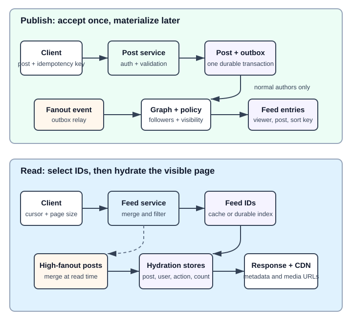
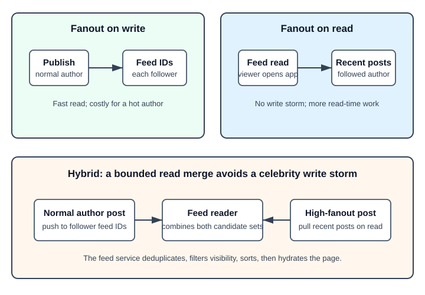

# News Feed System

## What the system does

A news feed system lets users publish posts and read a personalized feed of posts from friends or followed accounts.

Core use cases:

- publish a text/media post
- retrieve a user's feed
- store media in CDN/object storage
- fan out new posts to followers or friends
- hydrate feed items with post, user, media, action, and counter data

Assume the interview scope from Alex Xu pages 166-177:

```text
Mobile and web clients
10M DAU
Users can publish posts and read friends' posts
Feed sorted reverse chronologically
Up to 5000 friends per user
Posts can contain text, images, and videos
```

## Mental model

Separate the system into two paths:

```text
Publish path: user -> post service -> post DB/cache -> fanout -> friends' feed caches
Read path: user -> news feed service -> feed cache -> post/user/action/counter caches -> JSON
```

The feed cache usually stores **IDs**, not full post objects. The post cache stores the actual post content.

## Back-of-envelope numbers

| Question | Estimate | Design impact |
| --- | --- | --- |
| DAU | 10M | Feed reads dominate; optimize retrieval latency |
| Friends/user max | 5000 | Fanout-on-write can be expensive for high-degree users |
| Feed order | reverse chronological | Ranking model is out of scope for the base answer |
| Media | images/videos | Store media in CDN/object storage, not in feed DB rows |

In an interview, ask for post rate and feed-refresh rate. If not given, say the system is read-heavy and bursty: users open feeds many times per day, while they post far less often.

## Interview blueprint

Use this order in an HLD round:

1. Clarify scope: follow/friend model, feed ordering, media, DAU, max followers/friends, ranking, privacy/mute rules.
2. Estimate: DAU, posts/sec, feed reads/sec, fanout size, cache size for recent feed IDs.
3. APIs: publish post and get feed.
4. Data model: users, posts, friend/follow graph, feed entries, actions, counters.
5. HLD: post service, fanout service, graph service, queues, feed cache, post/user caches, CDN.
6. Deep dive: fanout-on-write vs fanout-on-read vs hybrid.
7. Failure modes: hot celebrity accounts, queue lag, cache miss, duplicate feed entries, privacy changes.

## High-level architecture



```text
Publish:
client -> web servers -> post service -> post DB/cache
                       -> fanout service -> queue -> fanout workers -> news feed cache
                       -> notification service

Read:
client -> web servers -> news feed service -> news feed cache
                                      -> post/user/action/counter caches
                                      -> CDN media URLs
```

The write path creates posts and updates feed indexes. The read path retrieves feed IDs and hydrates them into full feed objects.

## APIs

Publish post:

```text
POST /v1/me/feed
Content-Type: application/json

{
  "content": "hello",
  "mediaIds": ["m1", "m2"]
}
```

Retrieve feed:

```text
GET /v1/me/feed?cursor=<cursor>&limit=20
```

Use cursor pagination, not page-number pagination, because feeds change while users scroll.

## Core data

| Data | Example fields | Why it matters |
| --- | --- | --- |
| Post | `post_id`, `author_id`, `content`, `media_ids`, `created_at` | Source of truth for content |
| Social graph | `user_id`, `friend_id` or `follower_id` | Needed for fanout and read-time merge |
| Feed entry | `user_id`, `post_id`, `created_at` | Precomputed feed index |
| Action | `user_id`, `post_id`, `liked`, `replied` | Per-viewer interaction state |
| Counter | `post_id`, `like_count`, `reply_count` | Fast display counts |

## Publish flow

1. Client sends `POST /v1/me/feed`.
2. Web server authenticates the user and rate-limits posting to reduce spam.
3. Post service validates content and stores the post in DB.
4. Post service writes the post object to post/content cache.
5. Fanout service fetches friend/follower IDs from the graph store.
6. Fanout service applies privacy/mute/block/share filters.
7. Fanout service publishes `(targetUserId, postId, createdAt)` fanout jobs to a queue.
8. Fanout workers append the post ID to each target user's news feed cache.
9. Notification service may alert friends that new content is available.

## Read flow

1. Client sends `GET /v1/me/feed`.
2. Web server routes to the news feed service.
3. News feed service reads recent post IDs from the user's feed cache.
4. News feed service fetches full post objects from post cache/DB.
5. It fetches author info from user cache.
6. It fetches media URLs from media metadata/CDN.
7. It fetches viewer-specific actions and counters.
8. It returns hydrated feed JSON to the client.

## Fanout models



| Model | How it works | Good | Bad |
| --- | --- | --- | --- |
| Fanout on write | Push new post ID into friends' feed caches at publish time | Very fast reads; feed is precomputed | Expensive for users with many followers; wastes work for inactive users |
| Fanout on read | Build feed when user opens the app by pulling friends' recent posts | No wasted fanout for inactive users; avoids celebrity hot write | Slower reads; must merge many sources |
| Hybrid | Push for normal users; pull celebrity/high-follower posts at read time | Common interview default | More complex but handles hot accounts |

Use hybrid as the strong default. Most users use fanout-on-write for fast reads. Celebrity or high-follower accounts use fanout-on-read so one post does not create millions of feed writes.

## Cache architecture

The chapter splits cache into layers:

| Cache | Stores | Example |
| --- | --- | --- |
| News feed cache | per-user ordered post IDs | `userId -> [postId1, postId2, ...]` |
| Content/post cache | post objects | `postId -> content, mediaIds, authorId` |
| Social graph cache | friend/follower relationships | `userId -> friendIds` |
| Action cache | per-user actions on posts | `userId, postId -> liked/replied` |
| Counter cache | like/reply/follower counts | `postId -> likeCount` |

Store IDs in the news feed cache, not full objects. This keeps memory bounded and lets post/user/action/counter data update independently.

## Feed cache size

Keep only recent feed IDs in memory:

```text
userFeed:{userId} -> newest 500-1000 post IDs
```

Most users do not scroll through thousands of old posts. On deep scroll or cache miss, rebuild from DB or fall back to read-time aggregation.

## Hot accounts

The hotkey problem appears when one user has a huge number of followers/friends. A single post can create massive fanout writes.

Handling:

- identify high-follower accounts
- do not push their posts into every follower's cache
- store their posts normally
- merge their recent posts into follower feeds at read time
- shard fanout jobs by target user ID for normal users
- use queues so fanout can lag without blocking post creation

Consistent hashing can help distribute fanout/cache ownership, but it does not remove the basic cost of pushing one celebrity post to millions of users. The main fix is hybrid fanout.

## Failure modes

| Failure | Handling |
| --- | --- |
| Post service writes DB but fanout fails | Durable event/outbox; retry fanout |
| Fanout queue lag | Read path still works for existing feed; show slightly stale feed; scale workers |
| Duplicate fanout job | Feed cache append should be idempotent by `(userId, postId)` |
| Cache miss | Rebuild from feed DB or read-time merge |
| Celebrity post overload | Pull high-follower accounts at read time |
| Privacy/mute change | Apply filters before fanout; repair/remove cached entries if needed |
| Media slow | Serve media via CDN and return URLs, not bytes |

## What to skip unless asked

- Full ranking ML model.
- Full comments system.
- Full media transcoding pipeline.
- Real-time WebSocket updates.
- Ad insertion.

Mention these as extensions only. The base interview problem is publish, fanout, feed cache, read hydration, and hot-account tradeoffs.

## Quick recall

**Q. What are the two main flows?**  
A. Feed publishing and feed retrieval.

**Q. What does news feed cache store?**  
A. Ordered post IDs for a user, not full post objects.

**Q. What does post/content cache store?**  
A. Actual post data keyed by `postId`.

**Q. Why not fanout-on-write for celebrities?**  
A. One post can require millions of cache writes and queue jobs.

**Q. What is the default interview fanout strategy?**  
A. Hybrid: push normal users' posts, pull high-follower users' posts at read time.

**Q. Why use queues in fanout?**  
A. Publishing a post should not block while thousands of feed caches are updated.
