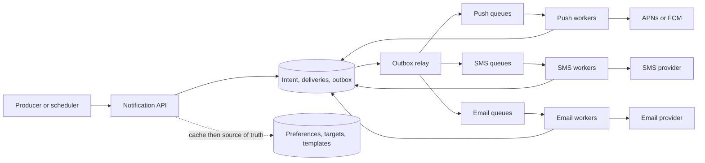

# Design a Notification System

## Problem

Design a scalable notification system that supports push, SMS, and email. Separate our durable acceptance of work,
provider acceptance, and confirmed device delivery; they are not the same guarantee.

## Clarify scope

Ask:

- Which channels are required: push, SMS, email, WhatsApp, in-app?
- Is delivery hard real-time or soft real-time?
- What triggers notifications: services, user actions, scheduled jobs, campaigns?
- Can users opt out by channel and notification type?
- What daily volume and burst traffic should we handle?
- Do we need delivery analytics such as sent, delivered, opened, clicked?
- Are notifications transactional, marketing, or both?

Reasonable interview assumptions:

```text
10M push/day, 1M SMS/day, 5M email/day
Soft real-time delivery
Internal services and schedulers trigger sends
Users can opt out
Provider failures are expected
```

## Functional requirements

- Send push, SMS, and email notifications.
- Store contact info and device tokens.
- Respect user notification settings.
- Support templates.
- Retry transient provider failures.
- Track delivery status and analytics events.

## Non-functional requirements

- Durable notification jobs.
- Horizontally scalable API servers and workers.
- Channel isolation.
- Low latency for transactional notifications.
- Rate limiting to protect users and provider quotas.
- Observability for queues, workers, providers, and delivery status.
- Type-specific expiry, collapse, retry, and duplicate-send policy.

## Chosen boundaries

| Boundary | Decision |
| --- | --- |
| API success | `202` only after intent, eligible deliveries, and outbox event commit together. |
| Queue delivery | At least once; workers make delivery state transitions idempotent by `delivery_id`. |
| Provider response | `SENT_TO_PROVIDER` means provider acceptance, not device display. |
| Device delivery | Advance to `DELIVERED` only when a trustworthy provider callback exists. |
| Expiry/collapse | Chosen by notification type; an obsolete state refresh may collapse, an OTP must not. |

## API sketch

Internal send API:

```text
POST /v1/notifications
Content-Type: application/json
Idempotency-Key: payment-123-receipt

{
  "eventId": "payment-123-receipt",
  "userId": "u123",
  "type": "PAYMENT_RECEIPT",
  "channels": ["PUSH", "EMAIL"],
  "templateId": "payment_receipt_v3",
  "params": {
    "amount": "499.00",
    "merchant": "Acme"
  },
  "priority": "HIGH"
}
```

Response:

```text
202 Accepted
{
  "notificationId": "n789",
  "status": "ACCEPTED"
}
```

Return `202` after durable intent, eligible delivery rows, and outbox event commit. Provider delivery happens
asynchronously, so `ACCEPTED` is not a claim that a provider or device received the notification.

```text
GET /v1/notifications/{notificationId}
```

The producer can inspect `ACCEPTED`, `SENT_TO_PROVIDER`, `DELIVERED` when a callback exists, `SKIPPED`, `EXPIRED`, or
final failure without confusing that status read with an end-user inbox.

## Data model

```text
user_contact(
  user_id bigint primary key,
  email varchar,
  phone varchar,
  updated_at timestamp
)

device_token(
  device_id varchar primary key,
  user_id bigint,
  platform varchar,
  token varchar,
  status varchar,
  updated_at timestamp
)

notification_setting(
  user_id bigint,
  notification_type varchar,
  channel varchar,
  opt_in boolean,
  primary key(user_id, notification_type, channel)
)

notification_log(
  notification_id varchar primary key,
  event_id varchar unique,
  user_id bigint,
  notification_type varchar,
  channel varchar,
  status varchar,
  attempt_count int,
  next_retry_at timestamp,
  created_at timestamp,
  updated_at timestamp
)
```

Keep `event_id` unique for producer-level dedupe. Treat a log row as a per-channel delivery: one logical intent can
fan out to push + email + SMS and each target can succeed, expire, or fail independently. Store template version and
expiry with the intent so a later retry does not render a different message.

## Architecture



Component responsibilities:

| Component | Responsibility |
| --- | --- |
| Producer services | Trigger notification requests |
| Notification API | Auth, validation, preference checks, metadata lookup, enqueue |
| Cache | Hot user/device/settings/template reads |
| DB | Source of truth for contacts, settings, templates, logs |
| Channel queues | Buffer ready delivery jobs independently |
| Workers | Consume jobs and call provider adapters |
| Providers | APNS, FCM, SMS vendors, email vendors |
| Analytics/monitoring | Delivery status, queue health, opens, clicks |

## Flow

1. Producer service calls `POST /v1/notifications`.
2. API authenticates producer and validates payload.
3. API checks dedupe by `eventId`.
4. API loads user contact info, devices, settings, and template metadata.
5. API skips opted-out channel/type pairs.
6. API writes notification log rows and an outbox event in one transaction.
7. An outbox relay publishes one delivery job per target channel; duplicate delivery is expected after a retry.
8. Worker consumes job and calls provider adapter.
9. Worker updates status to `SENT_TO_PROVIDER`, `FAILED_RETRYABLE`, `FAILED_FINAL`, or `DELIVERED` when callbacks exist.
10. Events flow into analytics and monitoring.

## Deep dive decisions

### Queue placement

Put queues after the notification API for the standard design. The API turns a raw business request into validated, authorized, preference-checked delivery jobs.

At very high scale, you can add an ingestion queue before the notification API too:

```text
producer -> ingestion queue -> orchestrator -> channel queues -> workers
```

Mention this only if the interviewer pushes on producer burst absorption.

### Per-channel queues

Use per-channel queues because channels have different limits, costs, providers, and failure modes. A SendGrid slowdown should not stop OTP push notifications.

### Cache usage

Cache metadata needed to build/send notifications:

- user contact info
- device tokens
- notification settings
- templates

Do not treat cache as the durable notification queue. The queue stores jobs; DB/log stores delivery truth.

### Retry and DLQ

Use bounded exponential backoff with jitter, maximum attempts, and an expiry:

```text
attempt 1 -> immediate
attempt 2 -> +30 seconds
attempt 3 -> +2 minutes
attempt 4 -> +10 minutes
then DLQ + alert
```

Tune by type and channel. OTP retries after 10 minutes may be useless; email receipt retries may still be valuable.
Do not retry invalid/unregistered device tokens. For provider `429`, obey provider retry guidance; for an unknown timeout,
use a provider idempotency key where available or accept a type-specific duplicate-send trade-off.

### Priority

Prioritize transactional over marketing:

```text
OTP / security alert > payment receipt > delivery update > marketing
```

Implement with separate priority queues or a priority field consumed by the scheduler. Keep strict rate limits even for high-priority traffic so one bug cannot spam a user.

### Provider failover

Use adapters and routing rules:

```text
SMS India -> Provider A
SMS US -> Provider B
Provider timeout -> retry same provider or fail over based on message type
```

For OTP/payment, avoid aggressive failover that may duplicate sends unless idempotency is strong.

## Failure modes

| Failure | Handling |
| --- | --- |
| Notification API down | Producers retry with idempotency key |
| Cache down | Read from DB; slower but correct |
| DB down | Do not accept jobs that cannot be logged durably |
| Queue lag | Autoscale workers, shed low-priority campaigns |
| Worker crash | Message not acked; retry after visibility timeout/lease expiry |
| Provider outage | Retry, fail over if safe, DLQ after max attempts |
| Duplicate producer request | Dedupe by `event_id` |
| User disabled channel | Skip before enqueue and record skipped status if audit matters |

## Quick recall

**Q. Why return `202 Accepted` from send API?**  
A. The API accepts and queues work; actual provider delivery is async.

**Q. Why not call providers directly from product services?**  
A. It duplicates vendor logic, bypasses preferences/rate limits, and makes failures harder to control.

**Q. Why separate notification type from channel?**  
A. Type is business intent; channel is delivery method. A payment receipt can go through email and push.

**Q. When should DB failure reject a notification request?**  
A. When the system cannot persist the notification log/outbox durably.

**Q. What is the clean worker mental model?**  
A. Stateless consumers pull channel jobs, call provider adapters, update status, and retry/DLQ failures.
