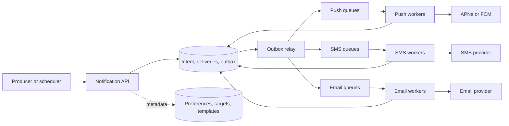
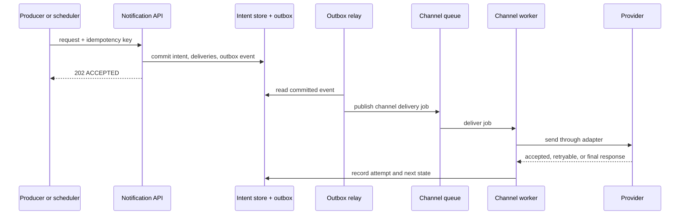
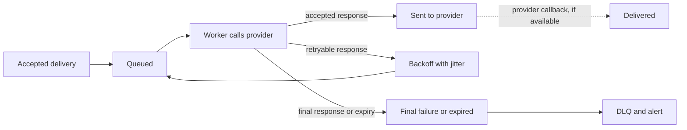

# Notification System

## The interview prompt

Design a notification platform that product services and schedulers use to send push, SMS, and email. A useful design
does more than call a provider API: it decides whether a user should receive a message, makes the request durable,
absorbs provider failures, and tells product teams what actually happened.

This exercise supports iOS, Android, web/desktop push, SMS, and email: 10M mobile pushes, 1M SMS, and 5M emails per
day. Delivery is soft real-time: a short delay during a burst is acceptable, but important transactional notifications
must not disappear silently. It includes opt-out by channel and notification type, templates, scheduled sends, and
delivery status. It excludes a full campaign authoring UI, rich in-app inbox, and provider-specific billing
implementation.

The base answer handles one user and all of that user's eligible targets. Group/campaign audience expansion,
in-app-inbox history, quiet hours, notification digests, A/B content tests, and campaign authoring are deliberate
follow-ups. They are product-important, but including them before the delivery contract would hide the core interview
reasoning.

## Clarify the guarantee before designing queues

“Delivered” is not one state. A provider accepting a request does not prove that an offline phone displayed it or that
a user opened it. This distinction determines the status model and prevents an interview answer from claiming an
impossible end-to-end exactly-once guarantee.

| Question | Assumption | Design consequence |
| --- | --- | --- |
| What does `202 Accepted` mean? | Our system durably accepted a notification intent | It is not a provider or device-delivery promise. |
| Which messages may be collapsed? | State-refresh messages may be; OTP/security messages may not | Collapse and TTL are part of notification type policy. |
| Can users opt out? | Yes, by type and channel | Preferences are evaluated before delivery and checked again when needed. |
| How are provider failures handled? | Transient failures retry; permanent failures stop | Workers classify responses rather than retrying every error. |
| What is the priority policy? | Transactional work wins over bulk marketing | Separate priority/channel capacity prevents campaigns from starving OTPs. |

## Begin with the smallest reliable path

The naive design is for every product service to call APNs, FCM, an SMS vendor, or an email provider directly. It
works for one service and one channel, but each producer must then own device tokens, user preferences, templates,
provider quotas, retry policy, audits, and vendor failover. A provider outage becomes a synchronous failure in every
product workflow.

Centralize that policy in a notification service. The service turns a business request such as “payment receipt for
user U” into one or more **delivery intents**: push to two devices, email to one address, or SMS to a verified phone.
It records the intent durably, then workers deliver each channel asynchronously. Queues absorb a temporary burst and
isolate one channel's outage, but they are not themselves the acceptance boundary.

The final mental model has four layers:

```text
Intent:     producer event -> policy, preferences, targets, template version -> durable intent + outbox
Dispatch:   outbox -> priority and channel queues -> worker -> provider adapter
Observation: provider response / provider callback -> delivery attempt and status
Learning:   queue/provider health -> alerts; opens/clicks -> product analytics
```

## Requirements and estimates that change the design

| Input | Exercise value | Decision it changes |
| --- | --- | --- |
| Push / SMS / email volume | 10M / 1M / 5M per day | Workers and quotas are independent per channel. |
| Average throughput | `16M / 86,400 ≈ 185` delivery attempts/second | Average is modest; burst handling matters more. |
| Burst factor | campaigns, billing runs, incidents, retries | Queue buffering, backpressure, and priority isolation are required. |
| Provider limits | channel and region specific | Workers need per-provider rate limits and response-aware retry. |
| Offline devices | common for push | TTL and collapse policy must be explicit; provider acceptance is not device delivery. |

At a 20× burst, the system can receive thousands of intents per second even when the daily average looks harmless.
Do not solve that with bigger API servers alone: the downstream provider is the constrained resource. The platform must
admit, delay, collapse, or reject lower-priority work deliberately instead of creating an unbounded retry storm.

If a provider permits `L` sends per second, a campaign of `N` recipient deliveries needs at least `N / L` seconds even
with perfect workers. That simple calculation tells the interviewer why campaign expansion belongs behind paced queues
and why a 2FA code must not wait behind it. It also makes a “bulk notification” follow-up concrete without pretending
that the base individual-delivery path already solves audience fanout.

## Data model: intent is not attempt

A logical event may create several channel deliveries. A failed push to one stale device must not turn an already sent
email into a failure, so model the layers separately.

| Record | Key fields | Purpose |
| --- | --- | --- |
| `NotificationIntent` | `intentId`, idempotency key, user, type, payload/template version, priority | One accepted business request and its dedupe boundary. |
| `Delivery` | `deliveryId`, intent, channel, target, status, expiry | One channel-target operation, such as one device token or email address. |
| `DeliveryAttempt` | delivery, provider, attempt number, response class, timestamps | Audit, retry decisions, latency, and provider debugging. |
| `NotificationPreference` | user, type, channel, opt-in | Decides whether a channel is eligible. |
| Device/contact record | user, platform/address, verification/status | Maintains live send targets. |
| Outbox event | intent/delivery identifiers, event type | Reliably starts asynchronous dispatch after durable acceptance. |

Useful states are `ACCEPTED`, `SKIPPED`, `QUEUED`, `SENT_TO_PROVIDER`, `DELIVERED` when a trustworthy callback
exists, `FAILED_RETRYABLE`, `FAILED_FINAL`, and `EXPIRED`. `SENT_TO_PROVIDER` means only that the provider accepted
the request. Firebase explicitly distinguishes provider acceptance from device delivery; an offline message can wait,
expire, or be replaced by a newer message with the same collapse key. [FCM delivery guidance](https://firebase.google.com/docs/cloud-messaging/understand-delivery)
and [message lifetime guidance](https://firebase.google.com/docs/cloud-messaging/customize-messages/setting-message-lifespan)
make this boundary concrete.

## High-level architecture

This diagram answers ownership: where the durable intent lives, where channel isolation begins, and which systems are
only external delivery providers.



The API and scheduler create intents. Metadata cache accelerates target, preference, and template lookup, but the
database holds the durable decision and audit history. The outbox relay and queues separate acceptance from slow
provider calls. Each channel worker pool has its own quota, retry policy, and provider adapter.

## API and acceptance boundary

```text
POST /v1/notifications
Idempotency-Key: payment-123-receipt

{
  "userId": "u123",
  "type": "PAYMENT_RECEIPT",
  "channels": ["PUSH", "EMAIL"],
  "templateId": "payment_receipt_v3",
  "params": { "amount": "499.00" },
  "priority": "HIGH",
  "expiresAt": "..."
}

202 Accepted
{ "intentId": "n789", "status": "ACCEPTED" }
```

```text
GET /v1/notifications/n789

{ "intentId": "n789", "status": "SENT_TO_PROVIDER", "deliveries": [...] }
```

The API authenticates the producer and uses the idempotency key to return the same intent for a producer retry. It
loads contact/device data, preferences, and the selected template version. It records a `SKIPPED` delivery when a
user opted out and an audit is required; it does not quietly call a provider and hope the provider enforces policy.

In one transaction, the service persists the intent and eligible delivery rows with an outbox event. Returning `202`
after that transaction means the system can recover dispatch later. It does **not** promise that a provider was called
or that a device received the message.

## Main path: durable acceptance, asynchronous dispatch



1. A product service calls the API, while a scheduler emits the same type of request at its due time. Scheduled work
   should be persisted before its due time; a timer alone is not a durable business record.
2. The API validates payload size, notification type, producer permission, target eligibility, preference, template,
   expiry, and idempotency.
3. It commits the intent, per-channel delivery rows, and outbox record together. A crash after commit leaves a
   recoverable outbox record rather than a lost notification.
4. The relay publishes channel jobs. Duplicate relay delivery is expected after a timeout, so workers identify a
   delivery by `deliveryId` and avoid creating a second logical delivery.
5. A channel worker renders the versioned template, applies the channel/type policy, acquires rate-limit capacity,
   and calls one provider adapter.
6. The worker records the provider response before acknowledging the job. A callback can later advance
   `SENT_TO_PROVIDER` to `DELIVERED`, but an open/click is product analytics, not proof of provider delivery.

The transactional outbox closes the database/queue dual-write gap. Its duplicate-delivery consequence is normal:
[AWS recommends idempotent consumers for this pattern](https://docs.aws.amazon.com/prescriptive-guidance/latest/cloud-design-patterns/transactional-outbox.html).

## Deep dive: retries, expiry, and duplicate sends

The hard failure is an unknown provider outcome. A worker might time out after the provider accepted the request but
before the response reached the worker. Retrying can create a duplicate; never retrying can lose an important message.
The design makes that trade-off explicit by notification type.

| Response or condition | Worker action | Why |
| --- | --- | --- |
| Validation error, bad payload, expired target | Mark `FAILED_FINAL`; repair target/template data | A retry cannot change the provider's answer. |
| Invalid/unregistered device token | Mark target inactive; do not retry until a new token is registered | Repeated sends waste quota and create noise. |
| Provider `429` or temporary `5xx` | Retry with bounded exponential backoff, jitter, and provider guidance | Immediate synchronized retries amplify an outage. |
| Timeout / unknown provider outcome | Use provider idempotency key when supported; otherwise retry only under type-specific duplicate tolerance | The result is ambiguous, not automatically a safe retry. |
| Delivery expires | Mark `EXPIRED`, stop retries, and let the app fetch current state | A week-old OTP or price alert is worse than no alert. |

FCM recommends respecting `429` retry guidance and using backoff with jitter to avoid retry amplification. It also
supports TTL and collapse semantics for messages where only the newest state matters. [FCM's scale guidance](https://firebase.google.com/docs/cloud-messaging/scale-fcm)
and [collapse-key guidance](https://firebase.google.com/docs/cloud-messaging/customize-messages/collapsible-message-types)
support this policy. For APNs, a `410` identifies an inactive token and a `429` requires delayed retry; a provider
adapter should translate such provider-specific responses into these neutral outcome classes. [APNs response handling](https://developer.apple.com/documentation/usernotifications/handling-notification-responses-from-apns?language=_4)
documents those examples.

## Deep dive: channel, priority, and provider isolation

One global queue makes the first blocked provider everyone else's outage. Use separate queues or partitions at least
by channel and priority:

```text
push.high      push.bulk
sms.high       sms.bulk
email.high     email.bulk
```

This does not mean high priority is unlimited. A per-user/type limit prevents OTP abuse, a per-producer limit stops
one broken service, and provider/channel limits protect quotas and cost. When backlog reaches a defined age or depth,
the platform can pause bulk campaigns, collapse state-refresh notifications, or reject new low-priority work while
preserving capacity for transactional messages.

Provider adapters hide protocol and credentials, not delivery semantics. Routing can choose a provider by region or
health. Failover is safest for messages with strong provider idempotency or low duplicate harm; an aggressive SMS
failover after an unknown timeout can send two OTPs. State that risk rather than promising automatic failover for all
types.

## Deep dive: preferences, templates, and the source of truth

The notification platform owns delivery policy, not business truth. A push should normally point the app to current
server state rather than contain the only copy of a changing order, balance, or message. If a device was offline or a
collapsible notification was replaced, opening the app still fetches the authoritative data.

Evaluate preferences before creating a delivery. For legal or security exceptions, the product must explicitly define
which types bypass a marketing opt-out; “critical” is a policy decision, not an engineering shortcut. Keep template
version and locale with the intent so a queued retry does not silently render against a later, incompatible template.

## Failure, recovery, and what callers observe



| Failure | What remains true | Recovery and visible result |
| --- | --- | --- |
| API transaction fails | No accepted intent exists | Return an error; do not queue anything. |
| API crashes after commit | Intent and outbox are durable | Relay dispatches after restart; producer need not create a duplicate. |
| Cache is unavailable | Durable metadata remains in the database | The API is slower but can still make the correct policy decision. |
| Queue backlog grows | Accepted intents remain durable | Scale workers, throttle providers, and shed/collapse bulk work; callers still see `202`. |
| Worker crashes before acknowledgement | Queue can redeliver | Reprocess the same `deliveryId`; idempotent state transition prevents a second logical delivery. |
| Provider outage | Delivery is not yet final | Backoff/jitter, safe failover where allowed, then DLQ and alert when attempts or expiry are exhausted. |
| Device token becomes stale | The target is no longer valid | Mark it inactive from provider feedback; next app registration refreshes it. |
| User changes preference | Old work may be queued | Recheck policy before send for sensitive/long-lived work; suppress it and record `SKIPPED`. |

## Operational signals versus product analytics

Queue depth, oldest-message age, retry rate, provider latency, provider error class, DLQ count, and expired delivery
count are control-plane signals: they tell on-call engineers whether work is accumulating or a provider is unhealthy.
Sent, provider-accepted, delivered, opened, clicked, and unsubscribed are product or delivery observations. Do not
use open/click events as the retry trigger; they are optional, delayed, and often unavailable.

## How to present this in an interview

Begin by defining the status boundary. Then derive the durable intent/outbox from the post-commit crash problem,
derive queues from slow and bursty providers, and derive channel/priority isolation from the fact that SMS, email, and
push have different limits and failure modes. Close with the ambiguity of a provider timeout: at-least-once delivery,
idempotent state transitions, type-specific duplicate tolerance, expiry, and observability are a stronger answer than
claiming exactly once.

For the object model behind multi-channel dispatch, see the
[Notification System LLD](/low_level_design/case_studies/notification_lld/).

## Quick recall

**What does `202 Accepted` guarantee?**

Only that the notification intent and its dispatch trigger were durably accepted by this system. It does not mean a
provider or device has accepted the message.

**Why separate intent, delivery, and attempt?**

One business event can target several channels and devices. Each target can fail, retry, or succeed independently
without changing the status of the other channels.

**Why is the outbox needed if a queue is durable?**

The service can commit its database rows and crash before publishing to the separate queue. The outbox makes the
accepted business state and pending dispatch durable together.

**When is a notification safely collapsible?**

When only the newest state matters, such as “refresh the latest score.” Do not collapse an OTP, security alert, or
other message where every event matters.

**What is the correct end-to-end delivery guarantee?**

Durable at-least-once dispatch with idempotency and dedupe. Provider acceptance, device display, and user open are
separate observable states.

**Why are channel queues separate?**

They isolate provider quotas, cost, latency, and outages. A slow SMS provider should not block email or push.

**What prevents a retry storm?**

Response-aware bounded backoff with jitter, provider quotas, expiry, and priority-aware admission control.
