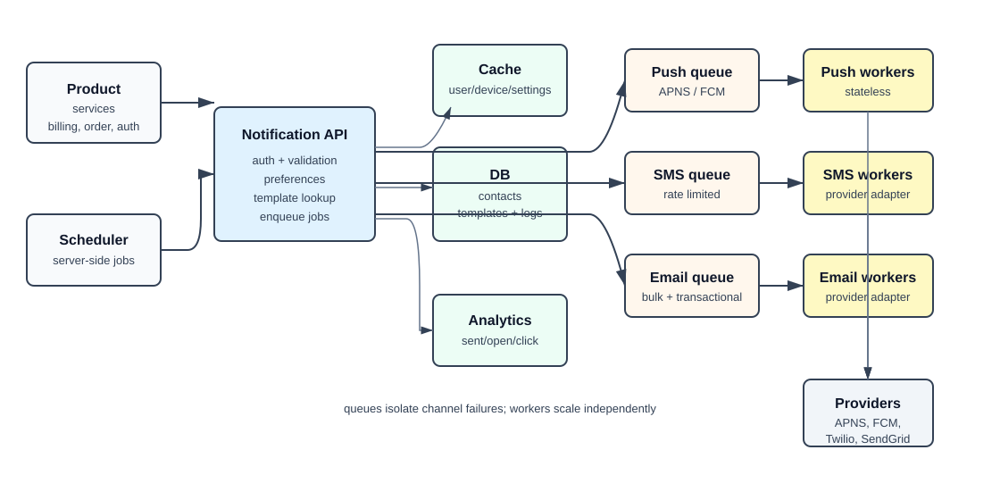
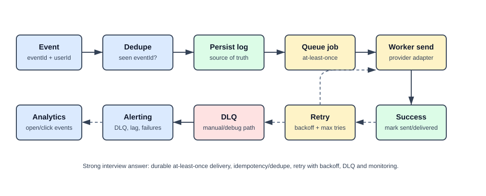

# Notification System

## What the system does

A notification system accepts events from product services and delivers messages to users through push, SMS, and email.

Core use cases:

- send transactional notifications such as OTPs, receipts, payment reminders, and delivery updates
- support multiple channels: iOS push, Android push, SMS, email
- respect user opt-out/settings before sending
- tolerate third-party provider failures without losing notification jobs
- track delivery, opens, clicks, and queue health

Assume the interview scope from Alex Xu pages 151-165:

```text
10M mobile push notifications/day
1M SMS/day
5M emails/day
Soft real-time: send as soon as possible, slight delay allowed under load
iOS, Android, desktop/laptop clients
Notifications can be triggered by services or scheduled server-side
Users can opt out
```

## Back-of-envelope numbers

| Question | Estimate | Design impact |
| --- | --- | --- |
| Push/day | 10M | Push is the largest channel; scale workers independently |
| SMS/day | 1M | Expensive channel; needs stricter rate limits and provider failover |
| Email/day | 5M | Template rendering and provider throughput matter |
| Total/day | 16M | Average throughput is modest, but bursts need queues |
| Average/sec | `16M / 86,400 ~= 185/sec` | Average QPS is not the hard part |
| Burst factor | assume `10x-50x` | Queue buffering and worker autoscaling matter more than average QPS |

The common interview trap is designing for average QPS only. Notifications are bursty: campaigns, incident alerts, billing runs, flash-sale reminders, and retry storms can overload providers even when daily volume looks small.

## Mental model

Separate the system into four paths:

```text
Ingestion path: service event -> validate -> preferences -> enqueue delivery job
Delivery path: queue -> worker -> provider -> user device/inbox
Reliability path: notification log -> retry -> DLQ/alert -> idempotency/dedupe
Learning path: delivery/open/click events -> analytics/monitoring
```

The notification server should decide **what should be sent**. Workers should handle **how to send it through providers**.

## Interview blueprint

Use this order in an HLD round:

1. Clarify scope: channels, real-time expectations, opt-out, triggers, platforms, daily volume, transactional vs marketing.
2. Estimate: per-channel daily volume, average send rate, burst factor, storage/audit retention.
3. APIs: internal send API and optional scheduled-notification API.
4. Data model: user contact info, device tokens, notification settings, templates, notification log.
5. HLD: notification servers, cache, DB, per-channel queues, workers, third-party providers.
6. Deep dive: reliability, duplicate prevention, retries, rate limiting, provider failover, monitoring.
7. Tradeoffs: exactly-once is unrealistic; aim for durable enqueue + idempotent/deduped delivery.

## High-level architecture



```text
Product services / scheduler
  -> Notification API servers
  -> cache + DB lookups for users, devices, settings, templates
  -> per-channel queues
  -> worker pools
  -> APNS / FCM / SMS provider / Email provider
  -> user devices and inboxes
```

Keep API servers stateless and horizontally scalable. Put slow provider calls behind queues. Use separate queues per channel so an SMS provider outage does not block email or push.

## Core data

| Data | Example fields | Why it matters |
| --- | --- | --- |
| User contact info | `user_id`, `email`, `phone` | Needed for email/SMS |
| Device tokens | `user_id`, `device_id`, `platform`, `token`, `status` | One user can have many devices |
| Notification settings | `user_id`, `channel`, `notification_type`, `opt_in` | Enforces opt-out before delivery |
| Templates | `template_id`, `channel`, `subject`, `body`, `version` | Consistent rendering and safer changes |
| Notification log | `event_id`, `user_id`, `channel`, `status`, `attempt_count` | Prevents data loss and supports audit/retry |

Cache user info, device info, settings, and templates because every send needs these lookups. The database remains the source of truth.

## Sending flow

1. Billing, order, auth, marketing, or scheduler service calls the notification API.
2. Notification server authenticates the caller and validates request shape.
3. Server fetches user contact info, device tokens, settings, and template data from cache/DB.
4. Server drops or records skipped notifications when the user opted out.
5. Server persists a notification log row before or atomically with enqueue.
6. Server publishes a delivery job to the right channel queue.
7. Worker consumes the job, renders final channel payload if not pre-rendered, and calls the provider.
8. Worker records success/failure; transient failures retry with backoff.
9. Provider/device events feed monitoring and analytics.

## Reliability and duplicates



Notifications can be delayed or reordered, but important transactional notifications should not be lost. The usual design is at-least-once delivery with dedupe, not true exactly-once delivery.

| Problem | Interview answer |
| --- | --- |
| Job lost before queue | Persist notification log and use transactional outbox or careful enqueue-after-persist handling |
| Worker crashes mid-send | Lease/ack only after provider result; expired jobs retry |
| Provider timeout | Retry with exponential backoff and max attempts |
| Persistent failure | Move to DLQ and alert |
| Duplicate event from producer | Deduplicate by `event_id` or idempotency key |
| Duplicate provider call | Use provider idempotency key where available; otherwise accept rare duplicates and suppress obvious repeats |

Do not claim exactly-once delivery across service, queue, worker, provider, and device. Say: "I design for durable at-least-once with idempotency and dedupe."

## Deep dives

### Queues

Use separate queues/topics for channels:

```text
notification.push
notification.sms
notification.email
```

This lets each channel scale and fail independently. SMS workers can be throttled heavily without slowing email. Push can have separate iOS/Android sub-queues if APNS and FCM limits differ.

### Workers

Workers are stateless service instances running queue consumers. All instances in the same channel worker group share the load. If the design uses Kafka, a topic is partitioned and one consumer group processes each message once within that group.

### Templates

Templates avoid building every message from scratch. They also let product teams keep a consistent format per channel. Version templates so an old queued job can still render against the intended version.

### Notification settings

Check preferences before enqueue for most notifications. For critical transactional messages, clarify product/legal rules: some alerts may bypass marketing opt-out but should still respect channel availability and abuse controls.

### Rate limiting

Rate-limit at several levels:

| Level | Example |
| --- | --- |
| Per user | max OTP/SMS per user per hour |
| Per notification type | OTP stricter than payment receipt |
| Per channel | SMS provider quota |
| Per provider | Twilio/SendGrid/APNS/FCM limits |
| Per producer service | stop one bad service from flooding the system |

Rate limiting protects users, provider quotas, cost, and system health.

### Provider abstraction and failover

Hide vendor APIs behind provider adapters. If SMS provider A fails or is unavailable in a region, route to provider B. Keep failover rules explicit because duplicate sends are worse for OTP/payment messages than for low-priority marketing.

### Monitoring and analytics

Monitor operational health separately from product analytics:

| Area | Metrics |
| --- | --- |
| Queue health | queue depth, oldest message age, consumer lag |
| Delivery | success rate, failure rate, retries, DLQ count |
| Provider | latency, timeout rate, quota errors |
| Product analytics | sent, delivered, opened, clicked, unsubscribed |

Queue depth is the fast signal that workers are not keeping up. Open/click metrics are useful, but they are not the delivery control plane.

## HLD vs LLD link

This page is the HLD architecture. The low-level class design for multi-channel dispatch lives at `system_design/case_studies/notification_lld/`.

## Questions interviewers like

| Question | Strong answer shape |
| --- | --- |
| Why queues after notification servers? | Servers validate, check preferences, fetch metadata, choose channel, then enqueue clean delivery jobs |
| Why separate queues per channel? | Channel isolation: SMS outage or throttling should not block email/push |
| What is cached? | User/contact info, device tokens, settings, templates; not the queue itself |
| Can you guarantee exactly once? | No; use at-least-once with durable log, idempotency key, dedupe, and provider idempotency when available |
| How do you avoid spamming users? | Preferences, per-user/type/channel rate limits, priority rules |
| What do workers do? | Consume delivery jobs, call provider adapters, record result, retry or DLQ failures |

## Quick recall

**Q. What are the three main channels in the book scope?**  
A. Push, SMS, and email.

**Q. Why is the queue placed after the notification service?**  
A. The service first validates, checks settings, fetches metadata, and chooses the channel; the queue stores ready delivery jobs.

**Q. What should be cached?**  
A. User/contact data, device tokens, notification settings, and templates.

**Q. What is the correct delivery guarantee answer?**  
A. At-least-once with idempotency/dedupe; exactly-once across providers/devices is not realistic.

**Q. What metric shows workers are falling behind?**  
A. Queue depth, oldest message age, and consumer lag.
