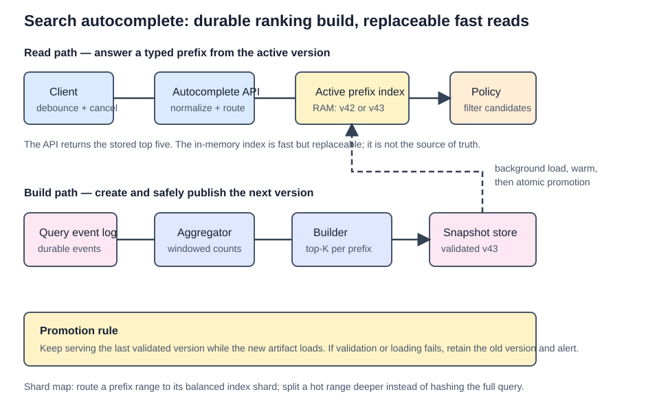

# Search Autocomplete System

Autocomplete, typeahead, and search-as-you-type return a small ranked set of queries while the user is typing. The base problem is a **prefix** search problem: for `dinn`, return the most popular stored queries that start with `dinn`.

## Scope and mental model

The scope from Alex Xu pages 200-219 is deliberately narrow:

```text
10M DAU
English, lowercase alphabetic query strings
Prefix matches only; no spell correction
Return the top 5 suggestions, ranked by historical frequency
Target response time: under 100 ms
```

Separate the design into two paths:

```text
Write path: search events -> append-only logs -> aggregate -> build immutable trie snapshot
Read path: typed prefix -> filter -> trie cache -> top 5 suggestions
```

The read path must not compute popularity from raw events. It serves a precomputed top-K result from memory. The write path can be asynchronous because broad query popularity usually changes much more slowly than a user's keystrokes.

Autocomplete stores **complete historical queries character by character**, including spaces. `how to lose weight` is one path, not a word-level lookup. When a client types `how`, it reaches that prefix node and reads the best complete queries below it.

### Matching boundary

The base design is prefix-only. If `how to lose weight` is stored, `how` matches it but `lose` does not. That boundary matters: a trie is natural for a prefix, while middle/substring search needs a different index such as a token inverted index or character n-grams. Fuzzy matching also belongs to a separate search-infrastructure discussion; do not casually add edit-distance scans to this latency-critical path.

## Back-of-the-envelope estimation

| Assumption | Result | Design implication |
| --- | --- | --- |
| 10M DAU, 10 searches/user/day | 100M completed searches/day | Query logging needs an append-only pipeline. |
| 20 autocomplete requests/search | about 24K average QPS | Every keystroke is a backend request unless browser cache satisfies it. |
| Peak factor of 2 | about 48K peak QPS | The serving tier must be cache-first and horizontally scalable. |
| 20-byte query, 20% new daily queries | about 0.4 GB/day of new raw query text | Raw logs are inexpensive to retain compared with serving them synchronously. |

The exact request multiplier should be clarified. Clients should debounce input and cancel stale requests so a slow response for `ka` does not overwrite a newer result for `kaf`.

## Interview blueprint

1. Clarify prefix-only versus infix matching, number of suggestions, ranking signal, latency target, language, personalization, and freshness/trending needs.
2. Estimate request QPS from keystrokes, not only completed searches.
3. Start with a trie containing the top K suggestions at each prefix node.
4. Split the architecture into the asynchronous analytics/build path and the cache-first query path.
5. Deep dive on immutable snapshot replacement, filtering, locale/trending variants, and balanced prefix-range sharding.

## High-level architecture



```text
Client -> load balancer -> API servers -> filter -> trie cache -> top K suggestions

Search events -> analytics log -> aggregator -> workers -> trie DB -> trie-cache snapshot
```

The trie DB is persistent source storage for a built snapshot. The distributed trie cache holds that snapshot in memory for request latency. API servers are stateless and read the cache only; they do not mutate trie nodes per request.

## Trie and top-K cache

A trie is a prefix tree. The root represents the empty prefix; every path represents a prefix; a terminal node represents a complete stored query.

```text
queries: tree (10), try (29), true (35)

prefix "tr" -> top 2 [true (35), try (29)]
```

A basic trie must find the prefix node, traverse its subtree for all matching completed queries, and rank them. That is too slow when the subtree is large. Store the top `K` query strings and scores on **every prefix node** instead.

```text
node for "be" -> [best (35), bet (29), bee (20), be (15), beer (10)]
```

The request then traverses only the prefix and returns the node's stored top 5. The book calls this `O(1)` after bounding the maximum prefix length. More precisely it is `O(prefix length + K)`, which is effectively constant when prefix length and K are bounded.

This is a deliberate space-for-latency trade-off. Duplicating a small top-K list at each node makes the serving path fast enough for every keystroke.

## Data gathering and snapshot build

1. The Search Service, not the autocomplete client, emits `QuerySearched` after it executes a real submitted search. Keystrokes and abandoned prefixes must not inflate popularity.
2. An aggregator groups queries by a time window and emits `(query, frequency, windowStart)` records.
3. Workers build a new trie snapshot from the aggregated data, including top-K lists at every node.
4. Workers persist the snapshot in a document store or a key-value representation where `prefix -> node data`.
5. The cache loads the completed snapshot, then traffic switches from the old snapshot to the new one.

Weekly rebuilds are reasonable for slowly changing, general search suggestions. Updating a single query in place is possible, but it must update that terminal node and every ancestor whose top-K list might change. That write amplification is why immutable rebuild-and-swap is the better default at scale.

The durable aggregated dataset or a versioned trie snapshot is the recoverable source for serving data. It can live in ordinary replicated durable storage; there is no required product called a "trie database." The live trie belongs in RAM on serving replicas, not on a disk lookup for every keystroke.

### Safe snapshot publication

Do not expire the active trie and let a burst of requests fall through to durable storage. That creates a cache stampede. Instead, build and validate version `v43`, persist it, have replicas load it in the background while they continue serving `v42`, then atomically switch traffic to `v43`. Retire `v42` only after the new version is healthy. A failed serving node is replaced by a replica that loads the active snapshot; it does not rebuild the entire trie from raw events.

## Query serving flow

1. The client debounces a prefix request and sends `GET /v1/autocomplete?q=kaf&limit=5`.
2. The load balancer routes the request to a stateless API server.
3. The server checks a policy/filter layer before returning suggestions.
4. The server reads the prefix node from the trie cache and returns its top 5 suggestions.
5. On a cache miss, the server reads the corresponding node from trie DB and replenishes the cache.
6. The client renders the response without reloading the full page; browser caching can avoid repeated requests for stable prefixes.

Use AJAX/fetch for web clients. Cache suggestions in the browser only when they are not personalized or sensitive to rapid ranking changes. A shared cache is inappropriate for user-specific suggestions.

## Filtering and deletion

Autocomplete can expose abusive, hateful, explicit, or unsafe suggestions. Put a fast filter layer in front of the trie cache so a policy change takes effect immediately, even before the next snapshot rebuild.

Remove blocked suggestions from persistent data asynchronously so they do not return in the next snapshot. The filter is the immediate safety mechanism; physical deletion is the eventual data cleanup.

## Scaling trie storage

Partition the trie by prefix ranges. A simple initial split is `a-m` and `n-z`, then a router sends a prefix to its owning shard. That becomes imbalanced because popular first letters are not evenly distributed.

Use historical query volume to make ranges uneven on purpose. For example, `s` can occupy its own shard while `u-z` share another. A shard-map manager maintains the mapping from prefix range to shard, so ranges can split again at the second or third character as load grows.

```text
"s..." -> shard 7
"u..." through "z..." -> shard 8
"a..." -> route by second-character range when needed
```

Do not use a hash of the full query for the base design: a prefix query must visit the shard that owns that prefix's subtree.

## Freshness, locales, and trending

| Requirement | Extension |
| --- | --- |
| Different language | Use Unicode-aware trie nodes and language-specific analyzers/ranking. |
| Different country popularity | Build and route to a trie per locale; CDN/edge replicas reduce read latency. |
| Trending events | Add a stream aggregation layer and a small recent/trending overlay, then merge it with the base trie results. |
| Personalized suggestions | Add a user-specific recent-search layer ahead of the global trie. |

Trending search is not solved by rebuilding a weekly trie more often. It needs windowed stream aggregation, recency-weighted ranking, bounded hot data, and a safe way to merge an overlay with the stable snapshot.

Keep data lifecycle separate from rebuild frequency. For example, build every hour from a rolling 30-day window, exclude queries below a frequency threshold, and apply time decay so old event-specific queries naturally lose rank. Rebuilding a fresh snapshot is simpler than deleting old trie nodes in place. This also limits RAM growth and suppresses one-off garbage queries without trying to decide whether every submitted string is a "real word."

## Failure modes and trade-offs

| Failure or pressure | Handling |
| --- | --- |
| Trie-cache node unavailable | Route to another replica or read trie DB and replenish cache. |
| New snapshot is incomplete | Keep serving the old immutable snapshot until the new one is fully built and validated. |
| Hot prefix such as `s` | Split by deeper prefix and update shard map using observed volume. |
| Log volume is too high | Sample analytics events when exact counts are unnecessary; do not sample security/audit events. |
| Ranking changes too slowly | Add a streaming trending overlay rather than mutating every trie node for each event. |
| Blocked query is cached | Enforce the filter before the cache result reaches the client. |

## Good to know

- A graph database is not a natural trie store. Its value is flexible multi-hop relationships; a trie is a deterministic prefix structure. A time-series store can retain windowed popularity counts, but it does not serve the trie by itself.
- A priority queue may help a worker maintain a node's top K, but it is an implementation choice. At HLD depth, state the architectural result: precomputed top K at each prefix node.
- Sticky sessions do not fix multiple service instances independently mutating their own tries. They merely make each user consistently see one stale copy. Serving instances should be stateless with respect to the authoritative autocomplete dataset.

## Quick recall

**Q. Why is a trie useful for autocomplete?**
A. A prefix maps directly to a trie node, so the server avoids scanning all query strings.

**Q. Why cache top suggestions at every trie node?**
A. It avoids traversing and sorting the whole prefix subtree for every keystroke.

**Q. Why build the trie asynchronously?**
A. Updating it for every search event creates write contention, while popularity often changes slowly enough for snapshot rebuilds.

**Q. What is the accurate complexity of a cached trie lookup?**
A. `O(prefix length + K)`; it is treated as constant only when both the prefix length and K are bounded.

**Q. Why not shard by hash of the full query?**
A. A prefix query needs one prefix subtree, so prefix-range routing preserves locality.

**Q. How do you suppress unsafe suggestions immediately?**
A. Use a filter layer before the trie cache, then remove the suggestion from persistent data asynchronously.

**Q. Why should a completed-search event come from Search Service?**
A. Search Service knows a search was actually submitted and executed, so abandoned keystrokes do not become popularity writes.

**Q. How do you refresh a large trie without a cache stampede?**
A. Load and validate a versioned snapshot in the background, then atomically switch from the old active version.
