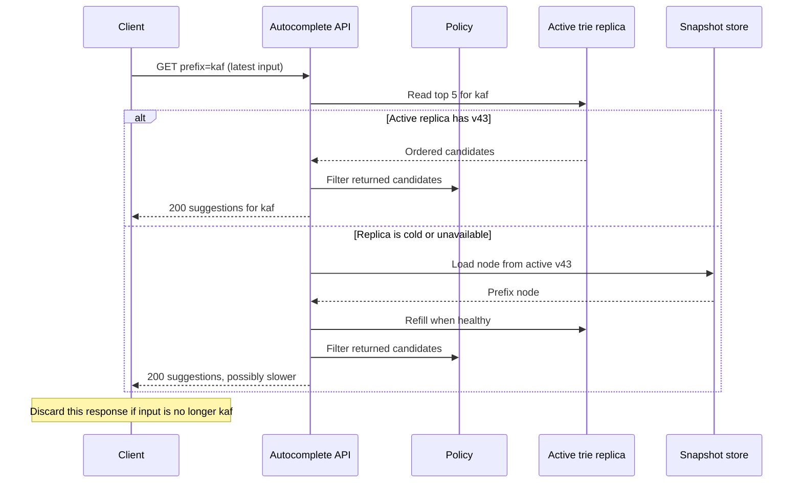
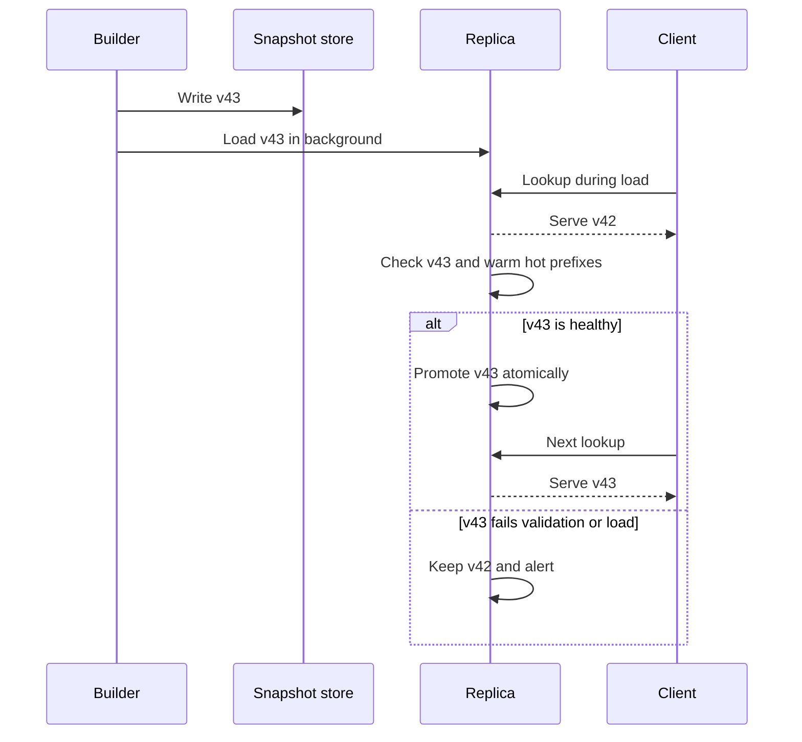

# Search Autocomplete System

When a person types `kaf`, the product should make the dropdown useful before they type the next character. In this case study, that means returning five popular queries that **start** with `kaf`, not running the full search product and not correcting a typo.

This is a read-heavy ranking problem disguised as a small UI feature. The important move is to compute the ranking before the keystroke arrives.

## Prompt, scope, and the first interview decision

Ask whether the interviewer means a global, prefix-only suggestion box or a search product with personalization, typo correction, and infix matching. They lead to different indexes and consistency promises.

For the base answer, agree to this deliberately small contract:

- 10 million daily active users; English, lowercase query strings.
- Return the top five **global** historical queries for a prefix in under 100 ms.
- A completed submitted search, rather than an abandoned keystroke, contributes to popularity.
- Suggestions may be hours old while a new ranking build is in progress; submitted search itself must still work.

`how to lose weight` is one complete query, including spaces. It contributes candidates beneath `h`, `ho`, `how`, and so on. This is prefix matching: `how` can match it, while `lose` cannot. Substring search needs a token or n-gram index; spell correction needs a separate, tightly bounded candidate-generation policy. They are useful follow-ups, not free additions to this latency budget.

## Start with the baseline that fails

The smallest working version stores completed queries and runs a query such as `WHERE query LIKE 'kaf%' ORDER BY frequency DESC LIMIT 5` for each typed prefix. It is acceptable for a small admin tool. At public-search scale, it repeatedly scans and ranks a large candidate set during the interaction that is most sensitive to delay.

The pressure comes from keystrokes, not submissions:

| Assumption | Result | Decision it changes |
| --- | --- | --- |
| 10M users × 10 completed searches/day | 100M completed searches/day | Append events; do not mutate a serving index on every search. |
| About 20 prefix requests per completed search | about 24K average requests/s | Make the online answer an in-memory lookup. |
| 2× peak | about 48K peak requests/s | Replicate and shard the serving index. |
| 20-byte query, 20% newly seen daily | about 0.4 GB/day raw query text | Retaining input for asynchronous aggregation is cheap relative to synchronous ranking work. |

The client debounces input and cancels an older request when the prefix changes. Without that last rule, a late response for `ka` can overwrite the correct results for `kaf` even when the backend is perfect.

## Chosen design: one durable ranking artifact, two workloads

The request path reads a published prefix index; the build path creates the next version of that index. A **trie** is a prefix tree: each path spells a prefix, and a terminal path represents a complete query. The active trie is memory-resident on serving replicas. It is not the durable source of truth.

The reader question for this visual is: *which state is durable, which state is only a fast serving copy, and why do reads not wait for ranking work?*


| State or component | Why it exists | Owner and contract |
| --- | --- | --- |
| `QuerySearched` log | Captures real submitted searches away from keystrokes. | Search Service appends a durable, identified event after executing a search. |
| Aggregated counts | Gives builders a recoverable input such as `(normalizedQuery, window, frequency)`. | Aggregation pipeline; it may reprocess events and deduplicate by event ID within its retention window. |
| Versioned prefix-index artifact | Is the durable, validated output that decides what a version should serve. | Builder writes it to replicated durable storage with a version, watermark, policy version, and checksum. |
| In-memory trie replicas | Meet the keystroke latency target. | Serving tier loads an already validated version; it never updates nodes for an individual request. |
| Policy blocklist | Lets unsafe suggestions disappear before a rebuild finishes. | Policy service is authoritative for an immediate deny decision; snapshot cleanup follows. |

This separation gives a useful acceptance boundary. A submitted search is accepted by the Search Service and its durable event is the input to later popularity ranking. An autocomplete response is only a best-effort read of the currently published version; it does not promise that the latest search is already represented.

### Normal build path: turn completed searches into the next version

1. After it executes a submitted search, Search Service appends `QuerySearched(eventId, query, locale, occurredAt)`. A client cannot call a public “increase this suggestion” endpoint.
2. The aggregator normalizes case and whitespace, applies the selected time window, and counts queries. Its bounded event-ID record prevents an at-least-once log retry from counting the same submitted search twice within that window.
3. A builder filters candidates by policy and minimum frequency, then constructs each prefix's ranked candidates and a new immutable artifact, for example `autocomplete/en/v43`.
4. It validates the artifact with a fixed query set, checksum, source watermark, and policy version before durable publication.
5. Replicas load and warm `v43` beside `v42`; only healthy replicas atomically change their active pointer. `v42` remains available until the promotion is complete.

This is an asynchronous path because global popularity rarely needs to change between two keystrokes. The next sections explain why its precomputation and promotion rules matter.

### Normal read path and the caller's outcome

The API is small because the rank has already been computed:

```text
GET /v1/autocomplete?q=kaf&limit=5&locale=en

200 OK
{ "version": "v43", "suggestions": ["kafka", "kafka consumer group"] }
```

The server normalizes the prefix exactly as the builder did, uses the locale and active policy version in its cache key, and routes to the owning prefix range. The value is a compact ordered list, not an arbitrary database query result.



For normal global results, a short browser cache may eliminate repeated prefixes. Do not share-cache a response whose ranking depends on a user. If a trie replica is down, route to a healthy replica; a protected read from the active durable artifact is a fallback, not permission to let every request stampede storage. If all eligible replicas are unhealthy, return an empty suggestion list quickly and keep the submitted-search flow available.

## Deep dive 1: precompute top K instead of ranking a subtree

**Problem.** A prefix such as `tr` can have a huge subtree. A basic trie can find its `tr` node, but then must walk all complete queries below it and sort them before returning five.

**Naive failure.** That makes the cost depend on how many strings happen to share a prefix. A popular one-character prefix becomes the slowest request precisely when it gets the most traffic. A lexicographic range lookup in a general store has the same missing step: it can find matching strings, but does not itself provide the pre-ranked five.

**Mechanism.** Store the top five completed queries and their scores at every prefix node while building the artifact:

```text
tree (10), try (29), true (35)

node "tr" -> [true (35), try (29), tree (10)]
```

The reader follows `t` then `r` and returns that small list. Lookup is `O(prefix length + K)`, effectively constant only because the maximum prefix length and `K = 5` are bounded. The price is duplicated top-K lists and build work; the benefit is predictable read latency.

**Trade-off and recovery.** A pointer-heavy trie can consume substantial memory, especially with many locales. A flattened `normalizedPrefix -> topK` map is often operationally simpler and has the same serving contract; a compressed finite-state structure is a later memory optimization. Keep a checked, durable artifact so a replacement replica reloads it instead of reconstructing a trie from raw logs.

## Deep dive 2: publish snapshots without a cache stampede

**Problem.** A query's score affects every prefix on its path. Changing it live means updating the terminal query and every ancestor's top five while thousands of requests read those nodes.

**Naive failure.** Expiring the old cache first makes all replicas miss at once; updating node-by-node lets one request observe a partially ranked index. Sticky sessions only make a user consistently see one stale, independently mutated copy.

**Mechanism.** Treat an immutable snapshot as the serving unit. Build and validate `v43` while all reads use `v42`; load and warm `v43` on replicas; then atomically move a replica's active pointer only after its local load is healthy.



**Trade-off and recovery.** Snapshotting delays freshness and temporarily uses space for two versions. It buys an all-or-nothing reader view and a known rollback target. A failed build or failed load is visible as an older `index_age` metric, not as broken suggestions. If the freshness SLO is missed, serve the last validated version and alert; never promote an unvalidated partial artifact.

## Deep dive 3: make safety and hot-prefix policy explicit

**Problem.** Historical frequency can promote unsafe text, and distribution is skewed: `s` may receive far more traffic than `u` through `z`.

**Naive failure.** Waiting for the next rebuild leaves a blocked value visible. Splitting shards as `a-m` and `n-z` spreads letters, not load. Hashing the full query is worse: a prefix request no longer knows which shard owns the required subtree.

**Mechanism.** Run a fast policy check over candidates before returning them and publish an urgent blocklist update independently of snapshot rebuild. Partition by observed prefix volume; a shard map can send `s...` to one shard, `u-z` to another, and split a hot range at a second or third character when measurements justify it.

**Trade-off and recovery.** The filter adds a small request-path dependency and data-balanced ranges require map changes. Keep a replicated, versioned policy copy beside the serving index; if it cannot decide that a candidate is safe, omit that candidate. The user may see fewer than five suggestions during a policy outage or a blocked-result removal; that is preferable to surfacing a forbidden term. A hot shard is relieved by publishing a new range map and warming the new replicas before routing traffic, not by blindly adding identical first-letter partitions.

## Failure policy, observability, and deferred scope

| Event | Recovery rule | What the user sees |
| --- | --- | --- |
| Event-log retry duplicates a search | Aggregator deduplicates `eventId` for the window; exact global counts are not a request-time guarantee. | No intentional double promotion from a retry. |
| Builder or validation fails | Keep the previous validated version; measure index age and alert. | Slightly stale but coherent suggestions. |
| Replica or cache failure | Route to another active replica; use bounded durable fallback and protect it. | Usually normal results; otherwise a fast empty dropdown, never a hung search box. |
| Block arrives after a snapshot was built | Enforce it immediately and exclude it from the next artifact. | The blocked candidate disappears immediately. |
| Popularity changes too slowly | Add a small, bounded recency-weighted overlay and merge before the policy check. | Fresh trends without mutating every base-trie node. |

Monitor p95/p99 latency, requests per typed character, cancellation rate, empty-result rate, cache hit rate by prefix length, per-shard load, index age, snapshot promotion failures, and policy-removal latency. These measurements tell us whether latency, relevance, safety, or skew is the actual constraint.

Locale-specific indexes, Unicode-aware normalization, trending overlays, personalization from recent user searches, fuzzy matching, and substring matching are intentionally deferred. A rolling 30-day window, a frequency threshold, and time decay are enough to bound this base index; rebuilding hourly does not require retaining only one hour of history. Personalization must use a separate bounded layer because putting a user ID in every global cache key destroys shared-cache efficiency and changes the privacy contract.

Further reading:

- [System Design Sandbox: Search Autocomplete](https://www.systemdesignsandbox.com/learn/design-autocomplete) — compared for baseline pressure, versioned build, and operational signals.
- [LeetSys: Design Search Autocomplete](https://www.leetsys.dev/system-design/search-autocomplete) — compared for interview sequence, ownership, and alternatives.
- [Elasticsearch completion suggester](https://www.elastic.co/docs/reference/elasticsearch/rest-apis/search-suggesters) — verifies that a fast completion structure is in-memory and costly to build, and that fuzzy correction is a separate choice.
- [Redis sorted sets](https://redis.io/docs/latest/develop/data-types/sorted-sets/) — verifies that lexicographic range retrieval and ranked range retrieval are distinct primitives.

## How to deliver this in an interview

1. State the prefix-only, global, top-five scope and defer fuzzy/personalized search.
2. Show why a direct database query per keystroke fails at roughly 48K peak requests/s.
3. Draw the split: durable completed-search events and build artifact on one side; memory-resident top-K prefix reads on the other.
4. Trace the build path, then one lookup, naming the immutable version as the reader's correctness boundary.
5. Go deep on precomputed top K, snapshot promotion, and safety-plus-prefix-range sharding.
6. Close with stale-but-coherent degradation, then add trends or personalization only if asked.

## Quick recall

**Q. What does the base product promise?**

A. Five global historical suggestions that begin with a normalized prefix; it does not promise typo correction, substring search, personalization, or instant trend updates.

**Q. Why is a trie useful here?**

A. A prefix reaches one node directly. Precomputing that node's top five avoids scanning and sorting its whole subtree at request time.

**Q. What is durable and what is a cache?**

A. The event log, aggregate inputs, and validated versioned artifact are recoverable. Memory-resident trie replicas are replaceable serving copies.

**Q. Why use snapshots rather than live node updates?**

A. A query can affect every ancestor prefix. Side-by-side validation and atomic promotion avoid partial rankings and cache-miss storms.

**Q. Why not hash the full query to shard?**

A. A prefix lookup needs its prefix subtree together; full-query hashing scatters that locality.

**Q. What happens if autocomplete is unhealthy?**

A. Serve the last validated version or a fast empty dropdown. Never let a ranking outage prevent a submitted search.
