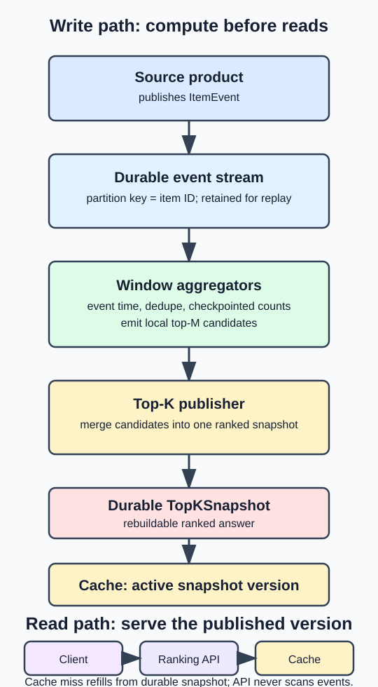
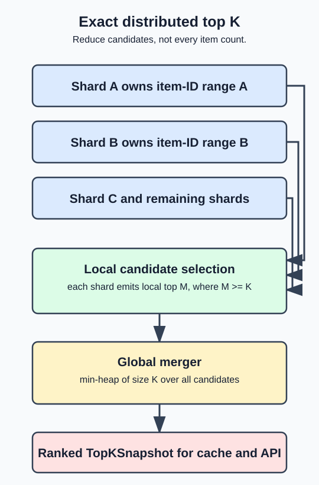

# Top-K Heavy Hitters System Design

Design a service that returns the most frequently occurring items in a recent window: trending YouTube videos, most-played songs, top searched products, or top ad clicks. A **heavy hitter** is simply an item with a very high event count relative to other items.

For an SDE-2 interview, start with an **exact, fixed-window** design. Do not begin with Count-Min Sketch, Flink internals, or a specialised analytics database. Those are follow-ups only if the interviewer asks for more scale or accepts approximate answers.

## Interview frame

The problem is under-specified. Ask enough questions to choose the right design:

- What event is ranked: views, plays, clicks, searches, or purchases?
- What is `K`, and are rankings global or filtered by country, category, or tenant?
- Is "last hour" a fixed calendar hour (**tumbling**) or the continuously moving previous 60 minutes (**sliding**)?
- Must the result be exact? Who notices a small ranking error, and does it matter?
- How fresh must a new event become visible? What read latency is expected?
- Can the ranking service consume an existing durable event stream, or must it own event ingestion too?

Default assumptions: a ranking service consumes an existing `ItemEvent` stream, returns the global top 100 for fixed hourly, daily, monthly, and all-time windows, needs updates visible within one minute, and returns reads in tens of milliseconds. Cap `K` at 1,000: a request for millions of rows is a different analytics/export product, not a top-K API. Historical arbitrary-range analytics and per-user recommendations are out of scope.

## Mental model

Do not calculate a ranking while the user waits. The write path continuously turns many events into small materialized ranking records; the read path returns the already computed list.

```text
events -> partitioned stream -> windowed counts -> top-K materialization -> cache -> API response
```



## API and data model

The ranking service usually does not expose `POST /views`: the video, search, or ad service already publishes the event. Its public interface is mainly a read API.

```text
GET /v1/rankings?metric=views&window=hour&limit=100&region=IN

200 OK
{
  "window": { "type": "hour", "start": "2026-08-11T10:00:00Z" },
  "generatedAt": "2026-08-11T10:00:48Z",
  "items": [
    { "itemId": "video_42", "count": 183421 },
    { "itemId": "video_99", "count": 175820 }
  ]
}
```

An event needs an event ID for deduplication, an item ID, event time, metric, and any supported dimensions:

```text
ItemEvent(eventId, itemId, metric, eventTime, region, category)
WindowCount(metric, windowStart, dimensions, itemId, count)
TopKSnapshot(metric, windowStart, dimensions, rank, itemId, count, generatedAt)
```

The count key includes the window and dimensions. Otherwise, an India-only ranking could accidentally use global counts, or yesterday's count could leak into today's ranking. `limit` is bounded, so the whole ranked response is small and does not need pagination in the base design.

## Derive the design in the interview

Start with a deliberately simple system, name its bottleneck, then replace only that bottleneck. This shows the reasoning behind the final components instead of drawing an unexplained large pipeline.

| Step | Working but limited idea | Why it stops working | Next move |
| --- | --- | --- | --- |
| All-time ranking | Consumer increments `VideoViews(videoId, count)` in one database; an index on `count` can return top K. | Hundreds of thousands of events per second make one indexed write per view too expensive. | Partition by item ID and aggregate before durable writes. |
| Time-window ranking | Store `(videoId, hourStart, count)` and sum rows in the requested range. | A month query must read, group, and sort huge amounts of hourly data. | Maintain the small fixed set of query-window aggregates as events arrive. |
| Fast read | Put the expensive query behind a cache. | A cache miss or expiry sends user traffic back to a slow aggregation query. | Publish and warm a top-K snapshot before users ask for it; retain the previous one for a controlled stale fallback. |

You normally describe this in one or two minutes, then spend the rest of the interview on the final design and one relevant deep dive. The simple database version is a teaching and reasoning step, not the proposed production system.

## Baseline exact design

1. The source product publishes durable events to Kafka or another append-only stream. The event log is retained long enough to replay and rebuild derived data.
2. Partition the topic by `itemId`. All increments for one item reach one stream task, avoiding distributed increments to the same count.
3. Stream workers deduplicate events according to the source's delivery contract, group them by event-time window, and maintain `WindowCount` state. They materialize each supported fixed window separately: current hour, current day, current month, and all time.
4. At a predictable interval or window close, each partition emits its local top `M` candidates, where `M >= K` gives a safety margin.
5. A merger combines those candidates with a min-heap of size `K` and writes an immutable `TopKSnapshot` to a durable store and Redis/cache.
6. The Ranking API reads the snapshot/cache. It never scans raw events or all item counts on a user request.

For a fully global exact ranking, an item must have one global count before it participates in a global top-K. Keying the stream by `itemId` provides that. If counts are already split across shards for another reason, first aggregate each item's partial counts, then select top K.

### Materialize the query shapes you promise

Do not calculate a monthly ranking by scanning and summing every hourly bucket when a user asks. That pushes hundreds of gigabytes of aggregation into a latency-sensitive path. Since the base API supports a small, fixed set of windows, update their materialized counts as events arrive:

```text
VideoViewed at 10:17 -> increment this hour, this day, this month, and all-time count for that video
```

This increases write work, but it makes reads predictable: the corresponding aggregate is already indexed or has already produced its top-K snapshot. If the interviewer instead requires arbitrary historical ranges, state that it becomes an analytics problem and needs a different read model.



### Why local top K is enough

If every item belongs to exactly one shard and each shard reports its local top `K`, the global top `K` must be in the union of those local lists. An item outside its shard's top `K` has at least `K` items ahead of it on that shard, so it cannot be globally top `K`.

Use a larger local `M` when dimensions, partial aggregation, or implementation uncertainty mean that the simple proof no longer applies. The coordinator handles only `shardCount * M` candidates, not every item in the system.

## Windows, freshness, and late events

**Tumbling window:** fixed boundaries, such as 10:00-11:00 UTC. It is the base answer because it is straightforward to aggregate and cache.

**Sliding window:** for example, "the last 60 minutes, refreshed each minute." Store minute buckets. On each minute tick, add the incoming minute and subtract the minute that just fell out. This adds state and writes; do it only when the product genuinely needs a moving ranking.

Use **event time**, not only the worker's clock. Define an allowed lateness policy, such as one minute: keep the window open until its watermark passes `windowEnd + 1 minute`. Events within that bound amend the count and the next snapshot. Events beyond it go to a late-event path for monitoring, correction, or explicit discard according to product policy. Do not silently claim every late event can be ignored.

Freshness controls cache behavior. With a one-minute freshness SLO, publish or invalidate a snapshot at least once per minute. A long cache TTL is safe only if the publisher replaces the entry within the freshness budget. On a publisher failure, serving the last known snapshot with an explicit age is usually safer than stampeding the aggregate store with read-through recomputation.

## Scaling and recovery

At high event rates, writing one database row per event is the wrong shape. Windowed stream aggregation batches many events for the same `(item, window)` into one state update and periodic durable write. A stream framework can manage state and checkpoints, but describe the behavior rather than hiding the answer behind a large "Flink" box.

The durable event log is the replay source; a checkpoint/state store is the fast recovery point. If a worker dies, another worker restores its latest checkpoint and replays only the remaining events. Couple state checkpoints with consumed offsets so retries do not double-count. The derived counts, top-K snapshots, and cache are rebuildable from the event log.

| Failure or concern | Interview-level handling |
| --- | --- |
| Duplicate event or retry | Source event ID/idempotent state update; checkpoint offsets and state consistently. |
| Worker crashes | Restore checkpoint, replay retained events, and republish snapshots idempotently. |
| A slow partition / hot item | Partition by item ID first; split a genuinely hot item's writes with salts only if necessary, then sum its sub-counts before ranking. |
| Snapshot publisher fails | Alert; serve the last known snapshot with its age instead of triggering expensive per-request recomputation. |
| Cache loss | Rehydrate from durable `TopKSnapshot`; cache is not the source of truth. |
| Incorrect aggregation code | Replay retained raw events into corrected derived state. |

## Capacity reasoning

Estimate only numbers that drive a choice. For example, `70B events/day / roughly 100,000 seconds/day` is about `700K events/second`. That tells you a single relational counter table cannot receive one indexed update per event, and motivates partitioned streaming aggregation.

Cardinality matters separately: billions of possible items make a full sort per query impossible, even if most items have zero events. The selected top 100 is tiny; the hard work is performed before the read through windowed aggregation and incremental top-K selection.

## Optional follow-ups

### Approximate heavy hitters

Use approximation only when a small ranking error is acceptable, such as a trending-signal candidate generator, and exact per-item state is too expensive. A Count-Min Sketch has several hash rows of counters. On an event, hash the item once per row and increment each selected counter. To estimate an item, read those counters and take their minimum. Collisions can only inflate the estimate, so it is an upper bound.

The sketch does **not** remember item IDs. Pair it with a bounded candidate min-heap or sorted set: after an event updates the sketch, estimate that event's item; retain it only if it clears the current candidate floor. Keep `M > K` candidates as a buffer. This is an approximation, not the default interview solution, and exact billing or contractual reports must not use it.

For sliding windows, subtraction and candidate eviction make the sketch design significantly more complex. Prefer exact minute buckets unless approximation is explicitly required.

### Technology mapping

A stream processor such as Flink can own window state and checkpoints. A streaming OLAP store such as Pinot, Druid, or ClickHouse can materialize aggregates. These are valid production choices, but naming one is not the explanation: be ready to describe partitioning, aggregation, recovery, and the read model without relying on its internals. Prometheus-style time-series stores are generally better at reading a known metric series over time than discovering the global top K across huge cardinality.

## What to say in the interview

1. "I will consume the existing view-event stream rather than design YouTube's view endpoint. Are fixed hourly and daily windows acceptable, and must counts be exact?"
2. "I partition by item ID so one stream task owns an item's windowed count. It aggregates events by event time and checkpoints its state."
3. "Each shard emits its local candidates; a merger produces a global top-K snapshot. The API serves that precomputed result from cache in milliseconds."
4. "The event log is replayable, while the count state and cache are derived. A worker recovers from a checkpoint and replays the tail."
5. "If you need a moving 60-minute window, I switch to minute buckets and add the newest bucket while subtracting the expired one. If approximate is acceptable, I can discuss Count-Min Sketch plus a candidate heap."

## Common traps

- Do not sort all videos on every request or use the primary database as a fallback after a cache miss.
- Do not treat cache TTL as a replacement for an explicit freshness and late-event policy.
- Do not assume Kafka alone provides exactly-once counting; state, offsets, and idempotency still matter.
- Do not use a Count-Min Sketch alone for top K; it estimates a count only after you supply an item ID.
- Do not lead with staff-level variants before presenting a clear fixed-window exact path.

## Quick recall

**Q. What makes an item a heavy hitter?**
A. It has a count high enough to belong to the top K for a defined metric, window, and dimensions.

**Q. Why partition by item ID?**
A. All events for an item reach one aggregation owner, avoiding distributed counter coordination before ranking.

**Q. Why precompute top K?**
A. Users need low-latency reads; scanning and sorting all counts belongs on the asynchronous write path, not the request path.

**Q. What is the difference between tumbling and sliding windows?**
A. Tumbling windows have fixed boundaries. Sliding windows continuously move and require adding new buckets while removing expired ones.

**Q. When should Count-Min Sketch be proposed?**
A. Only as an optional approximation when small ranking errors are acceptable and exact high-cardinality state is too costly.
