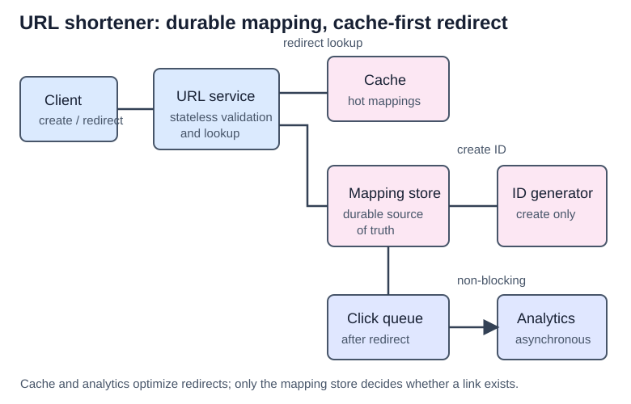
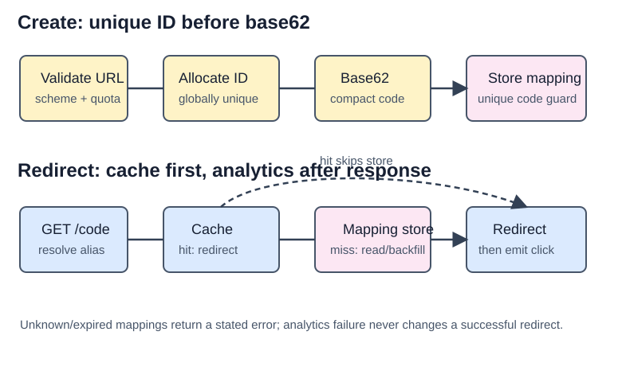

# URL Shortener

## What the system does

A URL shortener creates a compact alias for a long URL and redirects users from the alias back to the original URL.

Core use cases:

- shorten a long URL and return a short URL
- redirect a short URL to its long URL
- stay highly available under read-heavy traffic
- scale writes, reads, cache, and storage independently

Assume the interview scope from Alex Xu pages 119-131:

```text
100 million new URLs/day
10:1 read-to-write ratio
10-year retention
Short code uses [0-9, a-z, A-Z]
No delete/update in the basic version
```

## Back-of-envelope numbers

| Question | Estimate | Design impact |
|----------|----------|---------------|
| New URLs/day | 100M | Write path is not tiny; avoid single-node bottlenecks |
| Writes/sec | `100M / 86,400 ~= 1,160` | Manageable, but must be distributed/HA |
| Reads/sec | `1,160 * 10 ~= 11,600` | Read path needs cache |
| Records over 10 years | `100M * 365 * 10 = 365B` | Need sharding/partitioning plan |
| Average long URL size | ~100 bytes | Raw URL storage is about `365B * 100 ~= 36.5 TB`; indexes/metadata/replicas increase this |
| Short-code alphabet | 62 chars | `62^7 ~= 3.5T`, so 7 chars can cover 365B URLs |

The common book arithmetic writes 365 TB, but with 365B records and 100 bytes per URL the raw long-URL bytes are about 36.5 TB. In an interview, call out assumptions: metadata, indexes, replication, and analytics can push total storage much higher than raw URL bytes.

## Mental model

Think of the system as two separate paths:

```text
Create path: correctness path
longUrl -> validate -> unique ID -> base62 shortCode -> durable mapping

Redirect path: latency path
shortCode -> cache -> DB fallback -> redirect -> async analytics
```

The create path must never create duplicate short codes. The redirect path must be fast, highly available, and should not wait for analytics.

## Interview blueprint

Use this order in an HLD round:

1. Clarify scope: traffic, retention, alphabet, expiration, update/delete, custom aliases, analytics.
2. Estimate: writes/sec, reads/sec, record count, storage, short-code length.
3. APIs: create endpoint and redirect endpoint.
4. Data model: `id`, `short_code`, `long_url`, timestamps/status.
5. HLD: stateless URL service, cache, database, ID generator, async analytics.
6. Deep dive: short-code generation, redirect cache, sharding, 301 vs 302.
7. Failure modes: cache down, DB down, ID generator down, analytics down, abuse spike.

## Short-code generation options

| Approach | How it works | Pros | Cons |
|----------|--------------|------|------|
| Hash + collision resolution | Hash the long URL, take a short prefix, resolve collisions by retrying/salting | Fixed short-code length; no ID generator required; harder to guess sequence | Needs collision checks; DB/Bloom-filter lookup on creation path |
| Base62 of unique ID | Generate a globally unique numeric ID, encode it as base62 | No collision if ID is unique; simple redirect lookup; fast creation | Requires distributed ID generation; sequential IDs can be guessable unless mitigated |

Use base62 over a generated ID as the clean interview default. It keeps the write path easy to reason about and moves uniqueness to a reusable ID generator. For that generator, link to the reusable concept doc: `system_design/concepts/distributed_id_generation/`.

## 301 vs 302 redirect

| Redirect | Meaning | Use when |
|----------|---------|----------|
| `301 Moved Permanently` | Browser/CDN may cache the redirect and skip the shortener on later clicks | Server-load reduction matters more than click analytics |
| `302 Found` / temporary redirect | Browser keeps calling the shortener first | Analytics, abuse detection, experiments, or per-click decisions matter |

For most interview answers, pick `302` first because URL shorteners usually care about click counts, referrers, device, geography, and abuse monitoring. Mention `301` as an optimization when analytics is not required.

## High-level architecture



```text
Client
  -> Load balancer
  -> Stateless web/API service
  -> Cache for hot shortCode -> longUrl mappings
  -> URL mapping database
  -> Distributed ID generator for new mappings
```

The web tier should be stateless. Scale it horizontally behind a load balancer. Cache helps the read-heavy redirect path; the database remains the source of truth.

## Core flows



### Create short URL

1. Validate and normalize `longUrl`.
2. Check whether the same long URL already exists if idempotent create is desired.
3. Ask the distributed ID generator for a new numeric ID.
4. Convert that ID to base62.
5. Insert `(id, shortCode, longUrl, createdAt)` into the database.
6. Return `https://short.domain/{shortCode}`.

### Redirect short URL

1. Parse `{shortCode}` from the request path.
2. Look up `shortCode` in cache.
3. On cache hit, return redirect.
4. On cache miss, read from database.
5. If found, populate cache and return redirect.
6. If not found, return `404`.

## Data model

Minimal table:

| Column | Purpose |
|--------|---------|
| `id` | globally unique numeric ID, primary key |
| `short_code` | base62 code, unique index |
| `long_url` | original URL |
| `created_at` | creation time |

Useful production additions:

| Column | Why it helps |
|--------|--------------|
| `user_id` | ownership, quotas, dashboard |
| `expires_at` | TTL links / cleanup |
| `status` | active, disabled, abuse-blocked |
| `long_url_hash` | dedupe lookup without indexing full long URL |

## Scaling and failure points

- **Cache:** store hot `shortCode -> longUrl` mappings. Use TTL and size limits; avoid caching invalid codes forever.
- **Database sharding:** shard by `short_code` or `id`. Reads are point lookups, so this is straightforward compared with range/search-heavy systems.
- **Replication:** read replicas help redirect traffic, but cache hit rate should carry the hottest reads.
- **Rate limiting:** protect the create endpoint from abuse. Link to `system_design/components/rate_limiting/`.
- **Analytics:** do not block redirects on analytics writes. Emit click events asynchronously to a queue/stream.
- **Availability:** redirects are the critical path. If analytics is down, redirect should still work.

## Questions interviewers like

| Question | Strong answer shape |
|----------|---------------------|
| How long should the short code be? | Derive from alphabet size and expected total records: smallest `n` where `62^n >= record_count` |
| Why not just hash the long URL? | Hash prefixes collide; collision checks add write-path complexity |
| Why base62? | It encodes numeric IDs compactly using URL-friendly characters |
| What happens if ID generator is down? | New short links fail/degrade, but existing redirects still work |
| How do you keep redirects fast? | Cache hot mappings, use point lookups, keep analytics async |
| Which redirect status do you choose? | `302` for analytics; `301` when reducing repeat traffic matters more |

## Quick recall

**Q. What are the two core APIs?**  
A. `POST /api/v1/urls` to shorten and `GET /{shortCode}` to redirect.

**Q. Why is URL shortener read-heavy?**  
A. A link is created once but can be clicked many times.

**Q. Why does 7-character base62 work for the book estimate?**  
A. `62^7 ~= 3.5T`, above the 365B required 10-year record count.

**Q. Why link to distributed ID generation here?**  
A. Base62 conversion needs a unique numeric ID; uniqueness is solved by the ID generator, not by base62 itself.

**Q. Why use `302` instead of `301` when analytics matters?**  
A. `302` keeps future clicks flowing through the shortener, so the service can count and inspect them.
