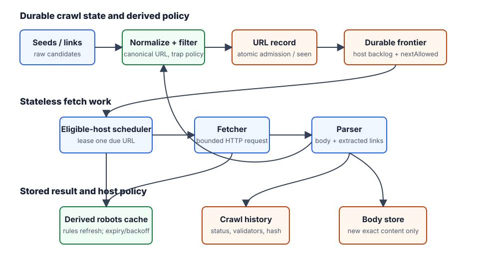
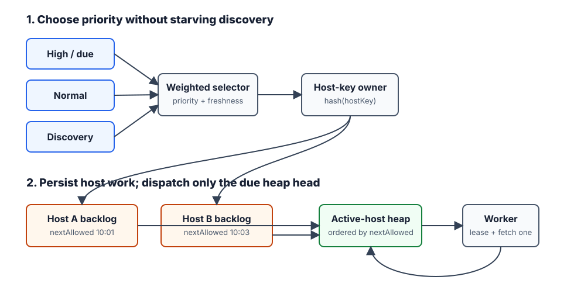

# Web Crawler

## What the system does

A web crawler discovers pages, downloads them, extracts links, deduplicates URLs/content, and schedules future crawls.

Common use cases:

- search indexing
- web archiving
- monitoring pages for changes
- data mining from public pages

For interviews, the crawler is not about writing an HTTP client. The important problem is controlling a huge graph traversal without overloading other people's servers or drowning in duplicate/spam URLs.

## Mental model

Think in four loops:

```text
Discovery loop: seed URLs -> downloaded page -> extracted links -> new URLs
Safety loop: robots.txt -> URL filters -> host politeness -> timeout/retry limits
Dedup loop: URL seen -> content seen -> canonicalization
Freshness loop: crawl history -> recrawl priority -> frontier
```

The hardest component is the **URL frontier**: it decides what URL to crawl next while balancing priority, freshness, and politeness.

## Interview scope

Assume:

```text
Search-engine indexing crawler
1B HTML pages/month
Average page size: 500 KB
Store crawled content for 5 years
Ignore duplicate content
Respect robots.txt
Recrawl changed pages
```

Back-of-envelope:

| Estimate | Value | Design implication |
|----------|-------|--------------------|
| Pages/month | 1B | Need distributed crawlers |
| Average QPS | `1B / 30 / 24 / 3600 ~= 400 pages/sec` | Not huge per system, but spread across many hosts |
| Peak QPS | ~800 pages/sec | Need burst capacity and queues |
| Storage/month | `1B * 500 KB ~= 500 TB` | Disk/object storage, not memory |
| 5-year storage | `500 TB * 12 * 5 = 30 PB` | Partitioned durable storage |

## High-level architecture



```text
Seeds -> URL frontier -> fetchers -> parser -> content dedup -> storage
                                      -> URL extractor -> URL filter -> URL seen -> frontier
```

Core components:

| Component | Job |
|-----------|-----|
| Seed URLs | Starting points by domain/topic/region |
| URL frontier | Stores crawl candidates and schedules next fetches |
| Fetchers | Download pages with timeout, robots, and per-host limits |
| DNS cache | Avoids repeated slow DNS lookups |
| Parser | Validates HTML and extracts metadata/links |
| URL filter | Drops unsupported schemes, bad extensions, blocked hosts, traps |
| URL seen | Prevents re-enqueuing the same normalized URL |
| Content seen | Drops duplicate/similar content using hashes/fingerprints |
| Content storage | Stores fetched HTML and metadata |

## URL frontier: the interview core



Naive BFS is not enough:

- It may crawl too many URLs from one host at once.
- It treats low-value and high-value pages the same.
- It does not model recrawl freshness.
- It can get trapped by infinite calendars/search pages/spam farms.

Use a two-stage frontier:

```text
Front queues = priority/freshness
Back queues = politeness per host
```

### Priority

Front queues group URLs by importance:

- seed/domain quality
- PageRank or link score
- traffic/popularity
- update frequency
- crawl history
- product-specific topic priority

The selector chooses high-priority queues more often, not exclusively. This avoids starving lower-priority discovery.

### Politeness

Politeness means the crawler should not send too many requests to the same host in a short time.

Do this with host-level scheduling:

```text
host -> nextAllowedFetchAt
host -> pending URL list
```

A worker only fetches a URL when that host's `nextAllowedFetchAt` has passed. After a fetch, schedule that host again after a delay from robots.txt, default policy, or observed latency/error rate.

### Do we need a queue for every site?

No. Do not pre-create a queue for every website on the internet.

Practical design:

- keep host state only for hosts currently active in the frontier
- store inactive/large host queues on disk or partitioned queue storage
- keep a memory heap of active hosts ordered by `nextAllowedFetchAt`
- shard host ownership across crawler partitions using a stable hash of host/domain
- cap per-host backlog so one spammy site cannot fill the frontier

So the mental model is "logical per-host scheduling", not "one permanent in-memory queue per site."

## Dedup and canonicalization

URL dedup and content dedup solve different problems.

| Layer | Example duplicate | Technique |
|-------|-------------------|-----------|
| URL seen | same URL discovered from many pages | normalize URL and store hash/Bloom filter |
| Canonical URL | `http`, `https`, tracking params, sort params | canonicalization rules, redirects, `rel=canonical`, sitemap hints |
| Content seen | different URLs with same HTML | content fingerprint/hash |
| Near duplicate | templated pages with small changes | simhash/minhash-style fingerprinting if needed |

Keep exact URL dedup in the core design. Mention canonicalization/content fingerprints as deep dives.

## Robots and crawl policy

Before fetching paths on a host:

- fetch `/{robots.txt}` for that host
- cache parsed rules
- respect `Allow`/`Disallow` for the crawler's user-agent
- set a clear User-Agent identifying the crawler
- apply crawl delays even when robots.txt has no delay rule

Robots.txt is not authorization. It is a convention good crawlers follow to avoid unwanted crawling.

## What matters less

HTML downloader details matter only enough to name:

- HTTP fetch
- DNS cache
- timeout
- retry/backoff
- content-size limits
- compression handling
- server-side rendering only if JavaScript-generated links are in scope

Do not spend half the interview on downloader implementation unless the interviewer asks. It is usually less important than frontier scheduling and dedup.

## Quick recall

**Q. What is the hardest crawler component?**  
A. The URL frontier, because it balances priority, freshness, and per-host politeness.

**Q. Why is naive BFS bad?**  
A. It can hammer one host, ignore page quality, and waste work on duplicate/spam/trap URLs.

**Q. Do we create one queue for every site?**  
A. No. Use logical host scheduling with only active host state in memory and spill large/inactive queues to durable storage.

**Q. URL seen vs content seen?**  
A. URL seen prevents re-fetching the same normalized URL; content seen prevents storing duplicate page content from different URLs.

**Q. What is politeness?**  
A. Respect robots.txt and enforce per-host request spacing so the crawler does not overload a site.

**Q. What details are lower priority?**  
A. HTML downloader internals beyond DNS cache, timeout, retry/backoff, and size/content-type limits.
