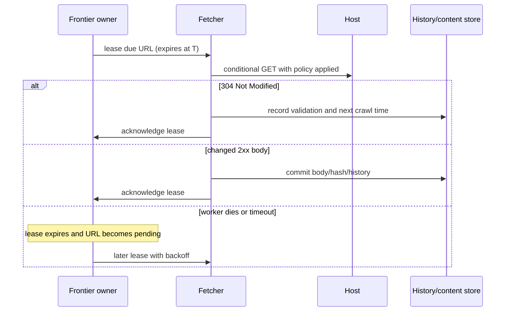

# Web Crawler

## The prompt, scope, and success condition

Design the crawler behind a search index. Starting from known **seed URLs**, it should discover public HTML pages, download allowed pages, extract more links, and keep the useful unique documents fresh. A crawl is successful when it adds a durable record of what happened to a URL without sending an unsafe burst to the host that serves it.

This is deliberately not “design a search engine.” Ranking, query serving, JavaScript rendering, non-HTML media, login-only sites, and a full near-duplicate clustering system are follow-ups. That narrow scope lets us focus on the interview crux: a crawler is a graph traversal whose next edge costs another site's network and capacity budget.

Ask these questions before drawing boxes:

- Is this search indexing, archival, change monitoring, or focused data collection? We choose search indexing.
- Do we crawl only HTML, and must robots rules be respected? Yes to both.
- Is freshness needed after the first crawl? Yes, especially for important changing pages.
- Do we retain raw pages? Yes, for five years; the index itself is out of scope.

## A small baseline, then the pressure

The smallest working crawler is a FIFO queue: put seed URLs in it, fetch one URL, parse its links, add unseen links, and repeat. A `seenUrl` set prevents the obvious loop. This baseline is worth saying aloud because it establishes the real problem rather than starting with Kafka, Redis, or a dozen services.

It breaks quickly. A popular page may link to 100,000 pages on one host, so many workers can hit that host together. FIFO also spends the same budget on a useful homepage and a generated calendar URL, cannot give important changing pages an earlier recrawl, and loses in-flight work if a process dies. Depth-first traversal is worse for coverage because it can stay in one effectively unbounded branch. The solution is not a faster global queue; it is a durable **URL frontier**, the scheduler and record of URLs waiting to be crawled.

Assume 1 billion HTML pages each month, an average compressed-or-stored page of 500 KB, and five-year retention.

| Estimate | Result | Decision it changes |
| --- | ---: | --- |
| Average fetch rate | `1B / 30 / 24 / 3600 ≈ 400 pages/s` | Fetchers scale horizontally, but total rate is not a host-level safety limit. |
| Peak fetch rate | about `800 pages/s` | Durable work claiming absorbs bursts and worker replacement. |
| New content each month | about `500 TB` | Bodies belong in partitioned object storage, never in a queue or memory cache. |
| Five-year body retention | about `30 PB` | Metadata and page bodies must be separate, partitioned records. |

The important number is not 800. One host might receive most of those candidates, while another host must not be touched again for a policy interval. The frontier therefore chooses *eligible hosts*, not merely the next URL.

## The chosen design in one picture

The diagram answers one question: which things survive a worker restart? The durable frontier, URL records, crawl history, robots policy, and bodies do. Fetchers and parsers are replaceable workers; their local buffers are not the source of truth.

| Record or component | Why it exists | Ownership and boundary |
| --- | --- | --- |
| `UrlRecord` | One durable identity for a canonical URL: current state, host key, priority, next crawl time, last result. | Frontier partition owns scheduling state for its host key. A `hostKey` is the normalized scheme and authority here, so it matches the robots-policy scope. |
| `CrawlLease` | A time-bounded claim to fetch one due URL. | A scheduler grants it; only an unexpired lease can be reclaimed after a crash. |
| URL-seen index | Stops many discoveries of the same normalized URL entering the frontier. | A fast filter may reject likely repeats, but a durable URL record decides admission. |
| Robots policy cache | Avoids refetching policy for each path on a host. | Parsed policy is derived and rebuildable; persist the host's last policy outcome, expiry, and backoff, never treat the cache as authority or authorization. |
| Fetcher and parser | Retrieve a response and turn HTML into a body result plus raw links. | Stateless consumers of a lease; they do not make a fetch durable by themselves. They send a clear identifying User-Agent. |
| Content store and history | Retain raw body bytes, response metadata, validators, and the next due time. | Object storage owns byte-identical bodies; history records every URL-to-observed-body relation even when it reuses an object. |

## Normal discovery path: how new work becomes durable

This is the crawler's normal **event/write path**. The acceptance boundary is not “a worker saw a link.” It is the durable frontier transaction that records a canonical URL as pending or updates its next crawl time.

1. A seed service supplies a URL, or a parser emits a link from a successfully fetched page.
2. The normalizer resolves relative links, removes fragments, normalizes safe scheme/host/port details, and applies a conservative query-parameter policy. A **canonical URL** is the stable representation used as this crawler's identity; it is not a claim that every different URL is identical.
3. A policy filter rejects unsupported schemes, obviously non-HTML targets, excessive URL length, and host or pattern caps that protect against spider traps.
4. The URL-seen filter makes the common duplicate cheap. If it says “maybe new,” the host partition atomically creates or updates `UrlRecord` and its pending entry. That durable write is the acceptance boundary; duplicate parser delivery is harmless because the same canonical key converges on one record.
5. The frontier gives the host a priority and makes it eligible only after its `nextAllowedFetchAt` time. A fetcher does not pull arbitrary URLs; it claims one eligible URL with a lease.

The visible outcome for the producer is internal rather than a browser response: the URL is `PENDING`, rejected with a recorded policy reason, or already known. That explicit state prevents “retry” from quietly creating a second crawl.

## Normal retrieval and recrawl path

When a host is eligible, the scheduler grants one `CrawlLease`. The fetcher first uses the host's cached robots policy or obtains it if needed, sends its identifying User-Agent, then performs a bounded HTTP GET: timeout, redirect limit, content-type/size limit, and compression handling are part of the fetch contract. DNS answers are cached to reduce repeated lookup cost, but DNS cache data is never crawl truth; a DNS failure becomes a host-backoff result, not an endless local retry.

A redirect is not followed directly by the current worker when it changes authority. The crawler records the redirect, resolves and normalizes the target, applies the normal filter, and admits the target through its own `hostKey` partition. That partition evaluates the target host's robots policy and spacing before it can be fetched. A same-host redirect still remains subject to the lease's redirect limit and current host policy. `rel=canonical` is a later canonicalization hint, not permission to collapse URLs before the durable policy says so.

For a recrawl, the history record may contain an `ETag` or `Last-Modified` value. The fetcher sends `If-None-Match` or `If-Modified-Since` when appropriate. A `304 Not Modified` means no new body is transferred: the crawler records that validation succeeded, advances `nextCrawlAt`, and releases the lease. A changed successful response is parsed, fingerprinted, stored if it is a new body, and committed with the response metadata before the lease is acknowledged. HTTP defines the validator and conditional-result semantics; a crawler treats missing or unreliable validators as a reason to fetch normally, not as proof that content did not change. [RFC 9110](https://www.rfc-editor.org/rfc/rfc9110.html)

## Deep dive 1: the frontier makes crawling polite and useful

**Problem.** We need many concurrent fetches for global throughput, but a host must receive spaced requests and important changing pages should not wait behind low-value discoveries.

**Naive failure.** A global FIFO queue can hand ten URLs from the same host to ten workers. A global rate limiter only limits the crawler as a whole, so it can still send all permitted requests to one small site. A permanent in-memory queue per internet host is wasteful because most hosts are inactive.

**Mechanism.** First classify a URL into a small number of priority/freshness queues using a score such as seed quality, crawl history, importance, sitemap hints when available, and recrawl due time. Weighted selection chooses high priority more often without starving the rest. Then route the chosen URL by a stable `hostKey` hash to its frontier partition. That partition keeps a durable pending list and `nextAllowedFetchAt` per active host. A small in-memory min-heap contains active hosts ordered by when they may next be fetched; a worker can claim only the due heap head, not every host in the heap. It then moves that host's next time forward and re-inserts it if it still has work.

**Trade-off.** Host ownership and durable queues cost more than FIFO, and weighted priority means exact breadth-first order is deliberately lost. In return, the crawler gets host-level politeness, bounded memory, and a defensible reason why a low-value domain cannot monopolize the crawl.

**Recovery.** A lease has an expiry. The history commit and lease completion are one idempotent state transition keyed by `(canonicalUrl, leaseAttempt)`: the owner accepts it only while that attempt is current. If a worker crashes after the commit but before the acknowledgement reaches the scheduler, replaying that completion is a no-op; if it crashes before commit, expiry returns the URL to `PENDING`. A later worker can repeat HTTP work safely because history remains one durable URL-to-observed-body result per accepted attempt. On repeated `429`, `503`, connection, or DNS failures, host policy increases delay and records a later retry. The crawler's observable result is a delayed or failed crawl record, not a silent disappearance of the URL.

## Deep dive 2: deduplication protects both crawl budget and storage

**Problem.** The same destination is linked from many pages, and different URLs can serve identical pages. Each duplicate wastes host budget, bandwidth, parser work, and tens of petabytes of retention.

**Naive failure.** Marking a URL seen only after fetch allows every concurrent discovery to enter the queue. Deduplicating only URLs misses mirrors, print pages, and redirect variants; deduplicating only content still fetches all those variants.

**Mechanism.** Normalize before admission and use the canonical URL as the `UrlRecord` key. A Bloom filter can cheaply say “definitely not seen” or “possibly seen,” but it is approximate: a false positive intentionally loses coverage by skipping a genuinely new URL. Therefore it is an optimization in front of the durable record, not the only correctness store. After an allowed response arrives, hash its raw body bytes. Byte-identical bodies can point to one stored object, while history preserves every URL-to-observed-body relation and response metadata. A separately normalized text representation may help the index later, but it never replaces retained raw-body evidence. Near-duplicate fingerprints such as SimHash are a later search-quality feature, not needed for the exact-duplicate interview core.

**Trade-off.** Conservative canonicalization can miss harmless variants; aggressive query rewriting can merge different resources. Bloom filters save memory and I/O at the cost of intentional coverage loss. State that policy explicitly rather than claiming every page is discovered exactly once.

**Recovery.** Admission uses an atomic create-or-return-existing operation on the durable canonical key, so parser retries and lease replay cannot create duplicate frontier entries. If a canonicalization rule is found to over-merge URLs, version the rule, retain raw discovery metadata, and schedule affected records for reevaluation; never “fix” it by dropping crawl history.

## Deep dive 3: robots policy and HTTP failure are separate from local politeness

**Problem.** A crawler needs an external path-access policy and a safe response when that policy or a page fetch fails. Neither one is supplied by a queue.

**Naive failure.** Treating a missing robots response as permission during an outage can crawl a host that asked not to be crawled. Treating every failure as a fast retry can amplify an outage. Treating `robots.txt` as access control also leaks a security misconception: listed paths are public strings, not authorization.

**Mechanism.** For each scheme and authority, obtain `/robots.txt`, select the applicable user-agent group, and apply the parseable `Allow`/`Disallow` rules. RFC 9309 says a successfully fetched file's parseable rules must be followed; its standard does **not** define `Crawl-delay`, so our per-host spacing remains a local conservative policy even if a crawler chooses to recognize an extra directive. Cache the policy with expiry. The RFC distinguishes an unavailable robots resource (for example 4xx, where access may proceed) from an unreachable one (for example server/network error, where a compliant crawler assumes complete disallow); it also describes redirect handling and a normal 24-hour cache ceiling. [RFC 9309](https://www.rfc-editor.org/rfc/rfc9309.html)

**Trade-off.** Fail-closed robots handling sacrifices coverage during a host outage, and conservative host delays reduce global completion speed. That is the intentional cost of a polite indexing crawler. A product with a different legal or contractual policy must state it rather than inheriting this choice accidentally.

**Recovery.** Persist the policy result and reason next to the host state. For a transient page failure, retry with capped exponential backoff inside the host's schedule. For repeated failures, pause or lower the host's priority and expose the recorded status to operations. For robots unreachable, do not fetch paths until a successful refresh or the explicit long-unreachable policy is reached. A malformed page goes to parser isolation: record the fetch, skip extracted links, and let the rest of the crawl continue.

## Scaling choice, rejected alternative, and deferred scope

We shard the frontier by stable host key so one owner decides a host's spacing and lease state. Fetchers remain stateless and can scale independently. Large or inactive host queues stay in the durable partition; only currently active hosts occupy heap memory. Consistent hashing reduces the number of host moves when partitions change. A controlled rebalance transfers host state and refuses new claims until the new owner has it, rather than allowing two schedulers to fetch the same host concurrently.

The rejected alternative is a single global priority queue plus a global rate limiter. It is simpler and preserves a rough global ordering, but cannot enforce per-host spacing or prevent a hot domain from filling the queue. The chosen design trades simple ordering for safe, fair progress.

Deferred follow-ups are JavaScript rendering with a browser pool, PDF/image/video parsing, international and focused-crawl scoring, near-duplicate clustering, full sitemap ingestion, legal deletion workflows, and the search index/query path. Mention them only after the core loop works.

## How to deliver this in a 35–40 minute interview

1. Restate HTML-only, robots-respecting indexing scope and defer search serving.
2. Give FIFO plus `seenUrl` as the baseline, then name host politeness, duplicates, freshness, and crash recovery as the pressures.
3. Use the estimate to justify durable body storage and partitioned host scheduling.
4. Trace discovery through durable admission, then a due URL through lease, fetch, body/history commit, and acknowledgement.
5. Deep-dive into the active-host frontier, URL/content dedup, and robots/failure policy.
6. Close with the rejected global queue, concrete recovery outcomes, and deferred browser rendering.

## Quick recall

**Q. What makes a crawler harder than a BFS?**

A. The crawl frontier must maintain per-host politeness, priority, freshness, durable work, and deduplication while the graph keeps growing.

**Q. What is the durable acceptance boundary for a discovered link?**

A. The atomic creation or update of its canonical `UrlRecord` and pending frontier entry, not a parser's local observation.

**Q. Why is a global rate limiter insufficient?**

A. It limits total traffic but can still spend all allowed requests on one host; the safety constraint is per host.

**Q. URL seen versus content seen?**

A. URL seen avoids duplicate scheduling of one canonical destination; content seen avoids storing identical bodies reached through different URLs.

**Q. What does a worker crash look like to the crawler?**

A. The lease expires, the URL returns to pending with backoff, and a later worker may retry without creating a second durable result.

**Q. Is `Crawl-delay` an RFC 9309 rule?**

A. No. RFC 9309 standardizes the robots access rules; per-host spacing is our crawler policy, while extra directives are optional compatibility behavior.
