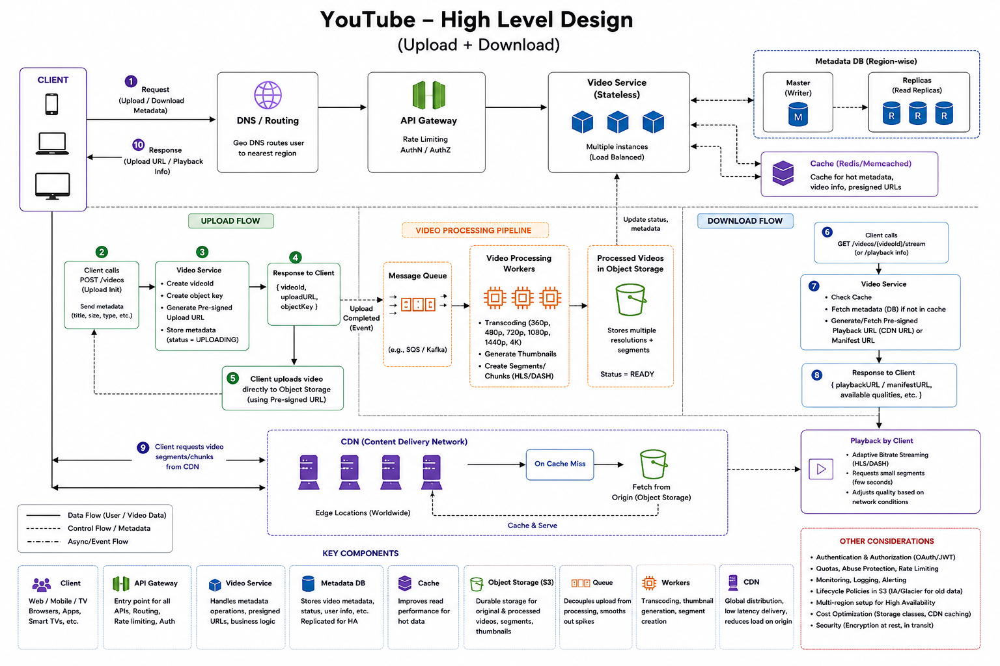
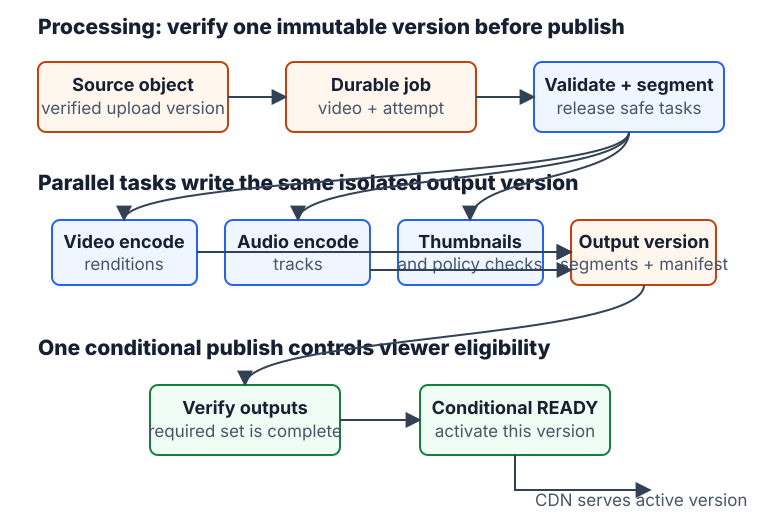

# YouTube / Video Streaming System

Design a global on-demand video platform that accepts uploads up to 1 GB, processes them asynchronously, and streams them with low startup latency across web, mobile, and smart-TV clients. This module covers Alex Xu's YouTube chapter (PDF pages 220-243); live streaming, recommendations, comments, and subscriptions are explicit follow-ups, not the base scope.

## Scope and interview frame

Start by narrowing the question:

- Are uploads, on-demand playback, or live streaming in scope?
- What clients, maximum upload size, regions, resolutions/formats, encryption, and playback latency are required?
- Do we need adaptive quality, resumable upload, video takedown, and global availability?
- Can we use managed object storage and a CDN? In an interview, the default answer should be yes.

Base answer: 5M DAU, five video views per user per day, 10% of users upload one video per day, average upload size 300 MB, international audience, and eventual consistency while a video is processing.

## Back-of-the-envelope estimation

| Assumption from the chapter | Result | Architectural consequence |
| --- | --- | --- |
| `5M DAU * 10% uploaders * 300 MB` | about 150 TB of new source video per day | Store large video bytes in durable object storage, not the metadata database. |
| `5M * 5 views * 0.3 GB` | about 7.5 PB of daily video delivery under this rough assumption | CDN egress is a major cost driver. |
| Historical illustrative CDN price of `$0.02/GB` | about `$150K/day` in delivery cost | Cache and distribute content based on popularity and regional demand. |

The cost number is the book's simplified example, not a current cloud-pricing quote. Its interview value is recognizing that video bytes and CDN egress dominate the cost model.

## Mental model

Keep control-plane metadata separate from the data-plane video bytes:

```text
Control plane: API service -> metadata DB/cache -> upload/playback authorization and status
Data plane: client <-> object storage for upload; CDN -> client for video segments
Async path: original video -> processing DAG -> transcoded segments/thumbnails -> publish readiness
```

The client should not upload a 1 GB file through the API servers. API servers authenticate, create a video record, and issue a short-lived pre-signed object-storage URL. The client uploads directly and the expensive work happens after upload.

### Three flows, not one path

This is the clearest way to place every component during an interview:

```text
1. Upload control: client -> API gateway -> Video Service -> metadata DB/cache -> signed upload URL
2. Upload and processing: client -> object storage -> upload-complete event -> queue/DAG workers -> transcoded storage
3. Playback: client -> Video Service for authorization/manifest -> CDN edge -> origin storage only on a cache miss
```

The queue carries a small reference such as `{ videoId, sourceObjectKey }`, never the multi-GB video itself. Workers retrieve bytes from object storage. Eventual consistency is acceptable because the product permits a processing and propagation delay before `READY`; it is not safe to assume that a new upload cannot become popular immediately.

## Architecture





| Component | Responsibility |
| --- | --- |
| API service | Authentication, upload-session creation, metadata writes, and playback information. Stateless and horizontally scaled. |
| Metadata DB and cache | Video status, ownership, title, formats, manifest location, and authorization-related metadata. Replicate and shard the DB; cache hot reads. |
| Original object storage | Durable source upload before processing. |
| Processing pipeline | Validate, split, transcode, create thumbnails/watermarks, and generate adaptive-streaming outputs. |
| Temporary storage | Durable intermediate chunks and metadata used for retries. |
| Transcoded object storage | Final renditions, manifests, thumbnails, and segments. |
| CDN | Edge delivery of popular video segments close to viewers. |
| Completion events and handlers | Mark a video ready only after outputs are durable and publishable. |

## Interview blueprint

1. Establish the upload/playback-only scope and estimate storage plus delivery cost.
2. State the control-plane/data-plane split and choose object storage plus CDN rather than building either.
3. Walk through direct multipart upload and a separate asynchronous processing DAG.
4. Explain HLS/DASH-style adaptive playback from CDN using a manifest and short segments.
5. Deep dive on resumability, task retries, metadata readiness, global upload routing, security, and CDN cost.

## Key trade-offs

| Decision | Default | Why |
| --- | --- | --- |
| Upload route | Pre-signed direct-to-object-storage URL | Keeps large byte streams off API servers and gives scoped authorization. |
| Video processing | Async queue-backed DAG | CPU-heavy work can retry and fan out into parallel tasks without delaying upload acknowledgement. |
| Playback | CDN segment delivery | Low latency and reduced origin load for a global audience. |
| Consistency | Eventual readiness | A newly uploaded video may be `PROCESSING` until all required renditions are available. |
| Rare content | Origin/high-capacity storage or on-demand encoding | Avoids paying to pre-position every rendition globally. |

## Common interview traps

- Do not choose a metadata database merely because "there are few relationships." Choose based on metadata access patterns, consistency, query needs, scale, partitioning, and operations. The video binary belongs in object storage either way.
- Do not use `GET /upload-presigned-url` to create upload state. `POST /videos` creates a video/upload resource and returns its upload authorization.
- Do not route video playback as `client -> gateway -> API service -> CDN`. The gateway/API path ends after returning metadata or a playback manifest; the player fetches segments directly from CDN.
- Do not describe the player dynamically requesting arbitrary five-minute byte ranges as the base design. The processing pipeline pre-generates short GOP-aligned segments for each rendition, which enables seeking and adaptive switches.
- Do not dive into codec mathematics, HLS packet layouts, CDN-routing algorithms, or Google's private network unless the interviewer explicitly changes the scope.

## Quick recall

**Q. Why should uploads bypass API servers?**
A. Large, long-lived uploads would consume API capacity; API servers should authorize the upload while object storage receives the bytes directly.

**Q. What does transcoding produce?**
A. Multiple codecs, resolutions, bitrates, thumbnails, manifests, and short video segments suitable for different devices and networks.

**Q. Why does video playback use a CDN?**
A. It serves segments from edge locations near viewers, reducing startup latency, origin load, and global network distance.

**Q. When is a video marked ready?**
A. After its required outputs are durably stored and the completion handler updates metadata and cache.

**Q. What belongs in the processing queue?**
A. A small durable job reference, such as the video ID and source object key, not the video bytes.

## Quick recall

**Q. What are the two primary workflows in a video platform?**
A. Upload and asynchronous processing, then low-latency metadata lookup and CDN-backed playback.
