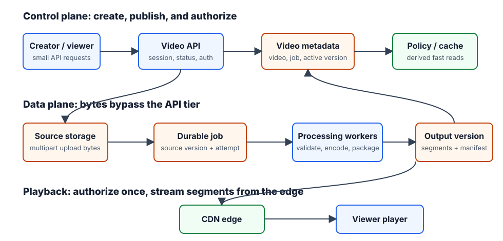
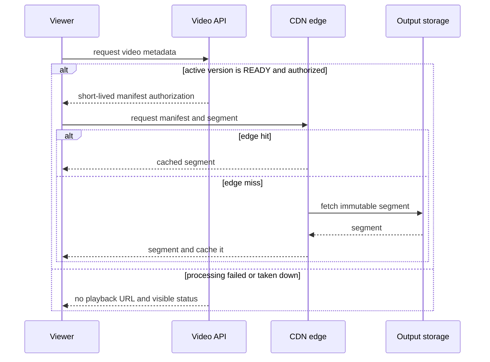

# YouTube / Video Streaming System

## The prompt, scope, and success condition

Design an on-demand video platform: a creator uploads a video up to 1 GB, the system processes it asynchronously, and a viewer starts playback quickly from web, mobile, or TV. Success is not “the upload returned 200.” It is a durable source, then one complete published output version that an authorized viewer can play through a nearby CDN.

This answer covers uploads, processing, and on-demand playback. Live streaming, recommendations, search/feed ranking, comments, subscriptions, DRM implementation, and CDN-provider internals are explicit follow-ups.

Assume 5M DAU, five views per user daily, 10% of users uploading one 300 MB video daily, and an international audience. Ask whether private video, takedown, adaptive quality, and resumable upload are required; here, all are in scope.

## A small baseline, then the pressure

The baseline is `client → API → file store`, followed by a synchronous transcode. It works for a tiny product, but it makes API servers carry long-lived gigabyte streams, blocks the creator while CPU/GPU work runs, cannot adapt one file to varied networks, and sends global viewers to a distant origin.

The workload makes the change concrete:

| Estimate | Result | Decision it changes |
| --- | ---: | --- |
| New source each day | `5M × 10% × 300 MB ≈ 150 TB` | Upload bytes go directly to durable object storage. |
| Daily delivery, rough 300 MB/view assumption | `5M × 5 × 0.3 GB ≈ 7.5 PB` | CDN delivery, not API proxying, dominates playback. |
| Historical illustrative egress at `$0.02/GB` | roughly `$150K/day` | Cache popular segments near demand; do not pre-position every rendition everywhere. |

The price is deliberately historical illustrative math, not current vendor pricing. The design lesson is that video bytes dominate control-plane cost.

## The chosen design and ownership

The API owns small, synchronous control-plane state. Object storage owns source and output bytes. The processing system owns a job's transition from uploaded source to a complete output version. The CDN is a cache/delivery path, never the evidence that a video is published.

| Durable record | Why it exists | Correctness boundary |
| --- | --- | --- |
| `Video` | Creator, title, access policy, `UPLOADING`/`PROCESSING`/`READY`/`FAILED`/`TAKEN_DOWN`, active output version. | Metadata transaction decides the visible status. |
| Upload session | Object key, multipart upload ID, expected size/checksum, expiry. | One creator may resume only its authorized parts. |
| Processing job | `videoId`, source version, attempt, required outputs, state. | Idempotent job key prevents duplicate completion events publishing twice. |
| Output version | Manifest, rendition/segment keys, thumbnails, validation result. | Immutable and publishable only after all required outputs are durable. |
| Playback authorization | Viewer/video policy and short-lived playback token/cookie. | Grants segment access; it does not create new video state. |

## Normal upload and processing path

1. The creator calls `POST /videos` with title, content type, and expected size. The Video Service authenticates the creator, writes `Video(UPLOADING)` plus an upload session, then returns a short-lived, object-scoped multipart authorization.
2. The client uploads parts directly to a nearby object-storage endpoint and records confirmed part numbers/checksums. It retries only a failed part. Multipart upload supports independently uploaded parts and a final completion operation, which is why it is a better fit than replaying a 1 GB request. [AWS multipart upload](https://docs.aws.amazon.com/AmazonS3/latest/userguide/mpuoverview.html)
3. The client calls an idempotent `POST /videos/{id}/complete-upload`, and an object-created notification is also consumed as a reconciliation signal. The service verifies the expected object/version and atomically moves the video to `PROCESSING` while creating one processing job. Either signal may be duplicated or arrive late; neither alone means `READY`. Object storage can emit an object-created event after a completed multipart upload. [AWS S3 EventBridge events](https://docs.aws.amazon.com/AmazonS3/latest/userguide/EventBridge.html)
4. Workers read the source by object key, validate it, then create renditions, short segments, thumbnails, and a manifest in a new immutable output-version prefix. The queue contains `{videoId, sourceVersion, attempt}`, never video bytes.
5. A publisher verifies the required manifest and segment set, then atomically sets `activeOutputVersion` and `READY`. Only this transaction makes a playback URL valid.

The creator sees `UPLOADING`, `PROCESSING`, `READY`, `FAILED`, or `TAKEN_DOWN` from `GET /videos/{id}`. “Upload complete but still processing” is a correct, visible outcome—not a vague eventual-consistency excuse.

## Normal playback path

An authorized viewer calls `GET /videos/{id}`. The Video Service reads metadata/cache, rejects `PROCESSING`, `FAILED`, or `TAKEN_DOWN`, and returns a short-lived manifest URL/token for the active output version. The player requests the manifest, then a few short segments from a nearby CDN edge. On an edge miss, the CDN obtains an immutable segment from output storage, caches it under policy, and returns it. API servers never proxy those segments.

A **manifest** lists the available representations and segment locations. A **rendition** is one resolution/bitrate encoding. The player measures throughput/buffer health and selects a rendition segment by segment; this is adaptive bitrate streaming. HLS is one HTTP-based playlist-and-segment family, and its authoring guidance covers multiple bitrate/resolution variants. [Apple HLS documentation](https://developer.apple.com/streaming/)

## Deep dive 1: resumable upload has a durable acceptance boundary

**Problem.** A creator on an unreliable network must upload a large file without tying up API servers or starting over after one lost connection.

**Naive failure.** Proxying the whole file through the API turns stateless request servers into bandwidth and timeout bottlenecks. Treating “last byte arrived” as success can start processing a partial, replaced, or unauthorized object.

**Mechanism.** `POST /videos` creates the durable video/session before byte transfer, and returns a scoped, expiring direct-upload capability. Each part is independently acknowledged. Completion verifies the expected object version, size/checksum, and session owner before the metadata/job transaction changes `UPLOADING → PROCESSING`.

**Trade-off.** Direct object-store upload adds session state and client multipart logic, but removes expensive bytes from the synchronous API path. A short-lived authorization limits exposure but requires refresh/retry behavior.

**Recovery.** The client lists confirmed parts and resumes only missing ones. Completion is idempotent on `(videoId, sourceVersion)`: duplicated client calls or storage events return the existing job. An expired or mismatched session remains `UPLOADING`/`FAILED` with a reason; no worker reads it as a source.

## Deep dive 2: processing publishes a complete version, never partial outputs

**Problem.** One source must serve devices and networks with different codecs, resolutions, and bandwidth, while transcode tasks can crash or retry.

**Naive failure.** A worker writing directly to the public manifest can expose a video whose high-bitrate segments or thumbnails are still missing. Retrying a partially completed job can overwrite another attempt's output or mark `READY` twice.

**Mechanism.** Validate/demux first, then run independent encoding, audio, thumbnail, and watermark tasks in a durable dependency graph. A **GOP** is a short independently decodable group of frames; segmenting on appropriate boundaries makes independently encoded/playable pieces feasible. Every attempt writes to an immutable output-version prefix. The publisher validates the required outputs and performs a conditional metadata update from that job attempt to `READY`.

**Trade-off.** Immutable output versions consume temporary storage and require cleanup; they buy simple retry safety and make CDN objects cache-friendly. Pre-encoding many renditions costs compute/storage, while encoding rare long-tail formats on demand trades first-play latency for cost.

**Recovery.** A lease expiry lets another worker retry an unfinished task with the same input and output key or a new attempt prefix. The publisher's conditional state transition makes a repeated completion a no-op. Malformed input, malware/moderation rejection, or an unsupported format stops dependent tasks and records `FAILED` or `TAKEN_DOWN`; the source is retained/quarantined according to policy, never published accidentally.

## Deep dive 3: segmented CDN playback protects startup latency and origin

**Problem.** Global viewers need quick start and smooth playback, but forwarding every byte through a regional API or one origin cannot survive a viral video.

**Naive failure.** A full-file download delays playback and cannot adapt to changing bandwidth. A CDN URL issued before status checks can keep serving a taken-down or incomplete version. A CDN hit metric is not a publication guarantee.

**Mechanism.** The control API authorizes the viewer against the `READY` active version, then the player receives a manifest plus short immutable segments. The CDN serves a nearby edge hit or fetches the segment from origin on a miss. The player changes rendition between segment boundaries; it does not ask the API to pick every video byte.

**Trade-off.** Short segments improve adaptation and seeking but add manifest/request overhead. Warm popular regional content lowers startup latency but wastes cache space for content that never gets watched.

**Recovery.** On a CDN miss, the viewer waits for an origin fetch rather than failing the entire video; if origin is unavailable, the player retries another edge/origin route and shows playback unavailable. A takedown changes metadata eligibility, revokes future manifest authorization, and invalidates/purges CDN paths according to policy. Already issued short-lived tokens may work until expiry; state that bounded window rather than claiming instant global removal.

## Failure policy, scaling choice, and follow-ups

| Boundary | Recovery | Visible outcome |
| --- | --- | --- |
| Upload part/network loss | Resume missing parts; retain confirmed parts. | Creator continues upload. |
| Duplicate completion event | Idempotent job creation and conditional publish. | One processing job/version becomes active. |
| Worker crash | Lease expires; retry task from durable source/intermediate state. | `PROCESSING` lasts longer. |
| Cache/API replica loss | Read replica/metadata store and repopulate cache. | Playback authorization may be slower, not byte-proxied. |
| Output/origin failure | CDN retries origin route; alert and retain `READY` metadata only for verified output. | Viewer may see temporary unavailable playback. |
| Takedown | Revoke eligibility, invalidate CDN paths, retain audit state. | New playback requests are denied. |

Operations watch processing-job age and queue age (page the processing owner when videos remain `PROCESSING` beyond the target), upload-completion records without a matching job (reconcile from source storage), output-validation failures (quarantine the version and investigate the worker/input class), and CDN/origin error and startup-failure rates (route to the delivery owner and protect origin). These are product signals: each has an owner and a recovery action, not merely a dashboard.

Use managed object storage and a CDN in the interview baseline. Building a private CDN, bespoke codec scheduling, global active-active object replication, recommendations, live ingest, and DRM license service are follow-ups. The rejected alternative is one API-mediated upload-and-download path: it simplifies code but destroys the control-plane/data-plane separation that the workload demands.

## How to deliver this in a 35–40 minute interview

1. Scope on-demand upload, processing, and playback; defer live/recommendations.
2. Start with the naive API proxy and use the byte estimates to reject it.
3. Name durable video/session/job/output-version records, then trace direct upload to `PROCESSING` and atomic `READY` publish.
4. Trace viewer authorization to manifest, CDN edge, and origin miss.
5. Deep-dive upload acceptance, immutable processing publish, and CDN/takedown recovery.
6. Close with cost/long-tail trade-offs and the explicit deferred work.

## Quick recall

**Q. What accepts an upload for processing?**

A. The verified source object plus idempotent metadata/job transaction from `UPLOADING` to `PROCESSING`, not the final part upload alone.

**Q. Why is `READY` separate from upload completion?**

A. `READY` means all required outputs in one immutable version are durable and the publisher has made that version active.

**Q. What does a CDN serve?**

A. Immutable manifest/segment bytes near viewers; the API serves authorization and metadata, not video bytes.

**Q. How do task retries avoid a partial public video?**

A. Tasks write an isolated output version and an idempotent conditional publisher exposes it only after validation.
