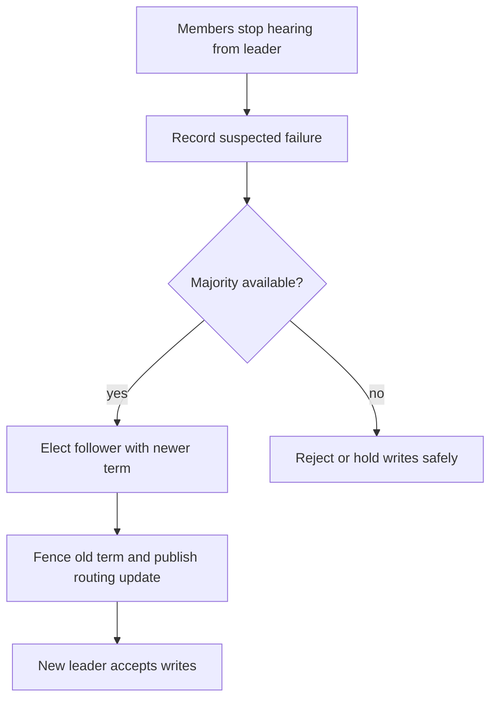

# Design

## Design drill: recover ownership of one partition

Design a three-member replicated partition group. One leader accepts writes, two followers replicate, and a
router sends each key to the current leader. A leader may fail or become unreachable from part of the group.

The key design decision is not the heartbeat itself. It is the promotion authority: only a quorum may move
ownership. The leader's acknowledgement rule separately decides whether a recently accepted write can be
lost if it had not reached enough replicas.

## Interview prompt

"A partition leader is unreachable. How do you avoid both a long outage and two leaders accepting writes?"

Answer with failure suspicion, quorum-based election, a newer term/epoch, routing refresh, and a clear
acknowledgement/durability boundary.
