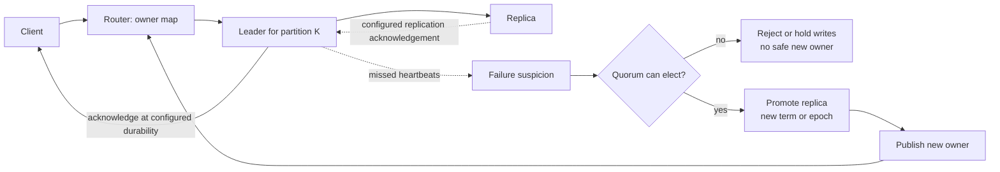

# Clustering: Cooperating Nodes, Failure Detection, and Failover

A cluster is a set of nodes that coordinate membership, ownership, or durable state. Multiple servers
behind a load balancer are not automatically a cluster: independent app instances can serve the same API
without knowing that their peers exist. A cluster needs coordination when a node owns a partition, leads a
replicated log, or manages shared control-plane state.

## Start with the distinction

| Concern | Load balancing | Clustering |
|---|---|---|
| Main purpose | Spread incoming requests | Coordinate nodes that share ownership or state |
| Do peers need to communicate? | Not necessarily | Yes, directly or through a coordination protocol |
| Failure action | Stop routing to an unhealthy instance | Detect a failed owner, choose a successor, and update membership/routing |
| Typical example | Stateless API instances | Redis, Kafka, a database replica group, or a control plane |

The two are often used together. A load balancer routes client traffic to stateless APIs; those APIs may
then talk to a cluster that owns data or coordination.

## One normal path and one failover path

Consider a partitioned store. A router uses a key-to-owner map. The leader/primary for that partition
accepts a write and replicates it to a follower according to the system's acknowledgement rule.

The solid path is the normal write. The dashed path starts only after a suspected failure. The diagram
intentionally leaves the acknowledgement rule configurable: a leader may acknowledge before or after a
replica catches up, trading latency against the risk of losing a recent write during promotion.

## Failure detection is uncertain

Heartbeats, gossip, or a coordination service can tell a node that it has not heard from a peer for some
timeout. That is a **failure suspicion**, not proof that the peer crashed: the peer may be slow or isolated
by a network partition. A short timeout fails over faster but creates more false suspicions; a long timeout
reduces flapping but extends outage time.

This is why a sound failover design needs more than "a heartbeat was missed":

1. A membership protocol records which nodes are considered alive.
2. A quorum or other election rule decides which side may promote a replacement.
3. Clients/routing refresh to the new owner.
4. The old node must not keep accepting conflicting work if it returns late.

The exact mechanism differs by product. In an interview, state the generic safety boundary rather than
claiming every clustered system has identical election semantics.

## Replication, promotion, and split-brain risk

Replication gives a potential successor a copy of a leader's data. It does not by itself say which copy is
allowed to accept writes. If two isolated nodes both believe they are leader, they can accept divergent
writes: a split brain.

Quorum-based leadership reduces that risk by allowing only the side that can reach the required majority to
elect or continue a leader. The cluster may intentionally reject writes on the minority side rather than
return a success that a later failover discards. A returned leader also needs fencing or an epoch/term check
so stale work cannot overwrite a newer leader's result.

### The promotion rule is a safety boundary

| Cluster observation | Safe action | Why |
|---|---|---|
| One member misses a heartbeat | Mark it suspected; continue checking | A delayed or partitioned node can look dead. |
| A majority can agree on a successor | Promote with a new term/epoch and update routing | The old leader's writes can be rejected as stale. |
| No quorum can decide | Reject or hold writes for that partition | Serving two writable owners is worse than a visible availability loss. |
| Old leader returns | Rejoin as follower or recover state before serving | It must not resume ownership from an obsolete term. |

| Requirement | Mechanism | Cost or boundary |
|---|---|---|
| Keep a partition available after one node fails | Leader plus replicas, then promotion | Replication may lag; some systems can lose recent acknowledged writes. |
| Avoid two active owners | Quorum election plus term/fencing check | Minority side may become unavailable. |
| Route clients after promotion | Membership/metadata refresh or redirect | Clients can briefly use stale routing. |
| Avoid flapping | Conservative failure timeout and health policy | Slower genuine-failure recovery. |

## Redis and Kafka: transferable examples, not interchangeable guarantees

**Redis Cluster** shards keys across hash slots, keeps cluster metadata among its nodes, uses gossip/ping
traffic for discovery and failure detection, and can promote replicas. Its replication is asynchronous, so
there is a window in which a leader can acknowledge a write that has not reached a replica; a failover can
lose that write. Redis Cluster also does not promise availability on every side of a large network split.

**Kafka** partitions a topic, assigns each partition a leader, and replicates it to followers. Producers
send records to the current partition leader; Kafka's configured acknowledgement and in-sync replica rules
define the durability boundary. The control plane manages metadata and leader changes. The transferable
lesson is partition ownership plus replicated recovery, not that Kafka and Redis share the same consistency
or election protocol.

## When a cluster is unnecessary

Do not introduce leader election for a stateless service merely because it runs on several instances. Use
the simplest arrangement that meets the ownership requirement:

- Stateless request handlers: load balancing and shared durable state are usually enough.
- A scheduled task that must run once: use a durable lease/conditional state transition; add leader
  election only when one active coordinator is truly required.
- Independent queue workers: competing consumers and idempotency are usually enough; they need not elect a
  leader for every message.

Clustering adds coordination traffic, operational states, failover delays, and more difficult testing. It
earns its complexity when a shared owner or replicated state needs a defined successor.

## Interview delivery

Say what is clustered, who owns a partition or control-plane decision, and what happens after a missed
heartbeat. A concise answer is:

> "The API instances are only load-balanced. The data store is the cluster: each key range has a leader and
> replicas. Membership detects a suspected failure, but a quorum elects a new leader before routing moves.
> The acknowledgement rule determines whether a recent write can be lost during promotion, and a term or
> fencing check prevents the old leader from committing after it returns."

## Further reading

- [Redis Cluster specification](https://redis.io/docs/latest/operate/oss_and_stack/reference/cluster-spec/)
- [Apache Kafka design: replication](https://kafka.apache.org/41/design/design/#replication)
- [Microsoft: reliable scaling strategy](https://learn.microsoft.com/en-us/azure/well-architected/reliability/scaling)

## Quick recall

**Q. Is a load-balanced API fleet automatically a cluster?**

**A.** No. It becomes a cluster only when nodes coordinate membership, ownership, or shared state.

**Q. What does a missed heartbeat prove?**

**A.** Only that a node was not heard from before a timeout; the node could be slow or partitioned.

**Q. Why is a quorum useful during promotion?**

**A.** It limits split brain by allowing only a sufficiently connected side to select a leader.

**Q. Does replication guarantee no lost acknowledged write?**

**A.** No. The answer depends on the replication mode and acknowledgement rule.

**Q. Why must clients refresh routing after failover?**

**A.** A key range or partition may now have a different owner; stale routing can target the old leader.

**Q. When is leader election unnecessary?**

**A.** When independent, idempotent workers or stateless request handlers have no single shared owner to
elect.
