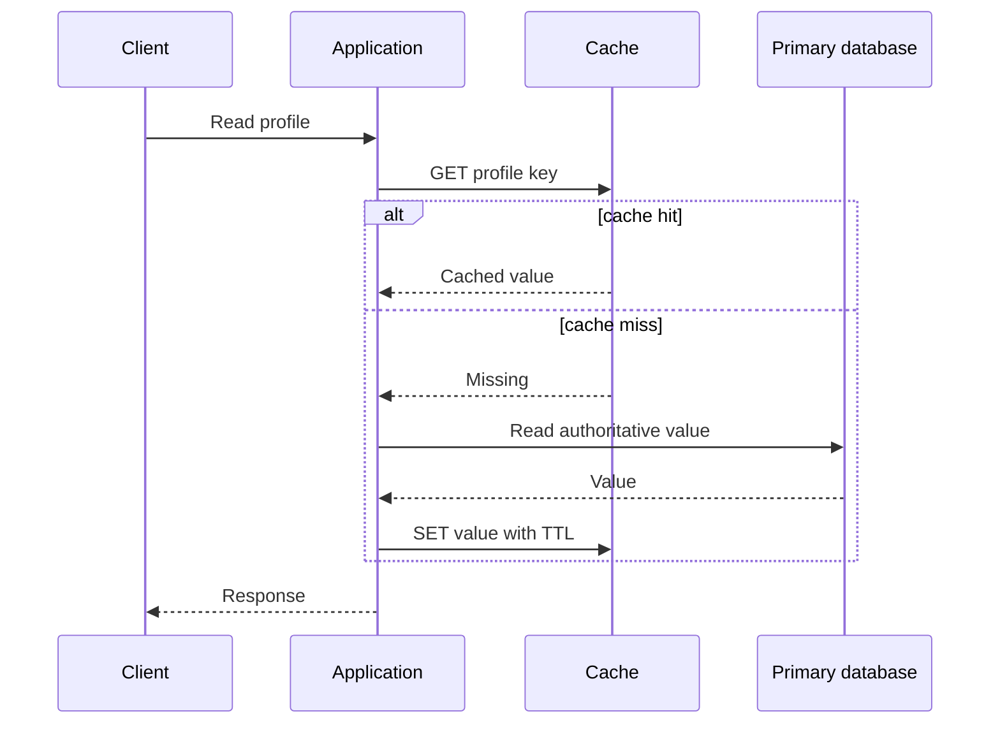
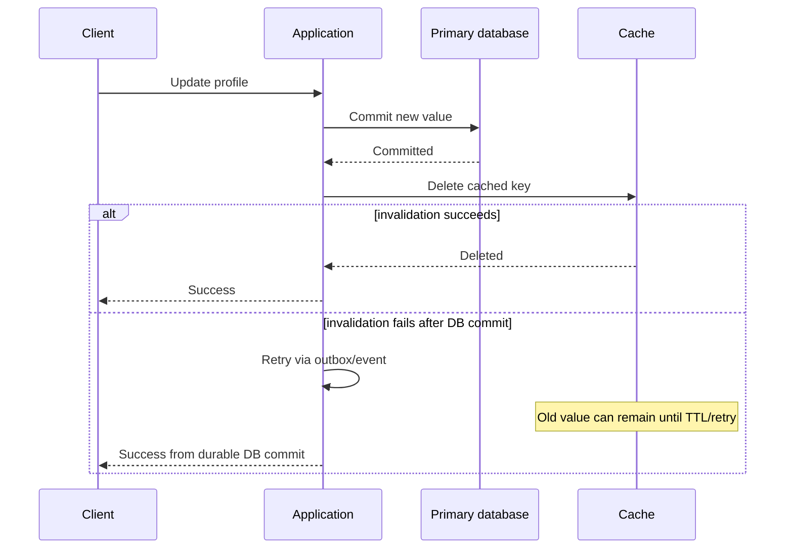
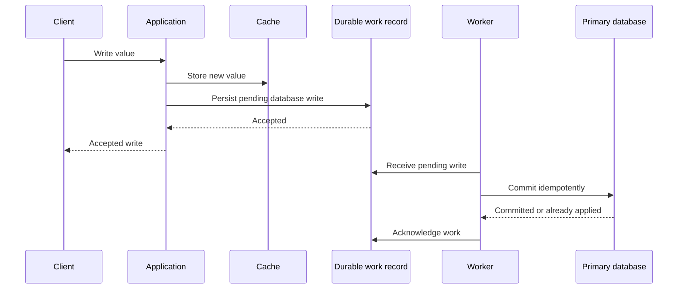

# Caching, Distributed Cache, Redis Cluster, and Consistent Hashing

Caching is a read-latency and origin-load optimization, not a second source of truth by default. Before
adding it, state what data may be stale, for how long, and which durable store decides a write. A cache is
worth its invalidation and failure behavior only when repeated reads or an expensive computation justify it.

## How it works

### Why caching exists

Repeatedly fetching the same data from a database is expensive. With a cache between the application and the database, frequently accessed data is served from memory instead of disk-backed storage — significantly reducing latency and database load.

```text
User → Application → Cache → Database
```

For a cache-aside read, the normal ownership is explicit: the application checks the cache, the database
remains authoritative on a miss, and the application repopulates the cache. A cache restart therefore
causes extra origin reads, not loss of durable business data.



### Cache hit vs cache miss

- **Hit:** requested data exists in cache — the database is never touched.
- **Miss:** data is absent → fetch from DB → store in cache → return. Future requests become hits.

### Cache invalidation

The hardest problem in caching is keeping cache and database synchronized. If the DB says `name = John` but the cache still says `name = Swapnil`, users see stale data. Common approaches after a committed DB write:

- **Delete the cache entry** (`UPDATE DB` + `DEL cache_key`) — next read repopulates the cache.
- **Update the cache entry** (`UPDATE DB` + `UPDATE CACHE`) — useful only when its retry behavior is explicit.

Neither sequence is atomic across the database and cache. A process can crash after the database commit and
before invalidation. The recovery is bounded staleness through TTL plus a retryable invalidation event or
outbox for changes whose freshness matters. The database still resolves a disagreement.

The normal update path and its failure boundary are different from a read miss:



### Expiration policy

Every cache entry should usually have a TTL. No TTL risks serving stale data forever and slowly filling memory with dead keys. Too-short TTLs cause constant reloads from the database; too-long TTLs make stale reads more likely.

Interview answer: set TTL from the data's freshness requirement and update frequency, then measure hit rate, stale-read impact, and origin/database load.

### Cache states

| State | Meaning |
|-------|---------|
| **Cold** | Little/no useful data — hit rate ≈ 0% (e.g. right after a Redis restart); most requests hit the DB |
| **Warm** | Some frequently used data present — moderate hit rate |
| **Hot** | Most requests served from cache — high hit rate, optimal performance |

## Cache read patterns

### Cache-aside (lazy loading)

The most common production pattern. The **application** manages both cache and DB:

```text
Read → check cache → hit? return
                   → miss → read DB → store in cache → return
```

This is the pattern most Java/Spring + Redis applications use: service code checks Redis, falls back to the database, then writes the value back to Redis.

### Read-through

The application talks **only to the cache**; on a miss the *cache itself* fetches from the DB.

| Cache-aside | Read-through |
|-------------|--------------|
| Application manages cache population | Cache manages cache population |
| App talks to cache and DB | App talks only to cache |

Naming caveat: some system-design material loosely calls the generic "check cache, then DB" flow read-through. In most production Redis discussions, if the application performs the DB fallback, call it **cache-aside**.

## Cache write patterns

Choose the acknowledgement boundary before choosing a name. Cache-aside and write-around leave the database
as the immediate durable owner. Write-through tries to update both synchronously. Write-back accepts a
temporary cache-owned state and needs durable protection before it can safely acknowledge important data.

| Pattern | Caller receives success after | Update path | Main recovery concern |
|---|---|---|---|
| Cache-aside invalidation | Database commit | DB, then delete cache key | Retry missed invalidation; TTL bounds staleness. |
| Write-through | Required synchronous writes finish | Cache and DB in defined order | Compensate/retry the partial write; no implicit transaction. |
| Write-around | Database commit | DB only; later read populates cache | First read after write is a cache miss. |
| Write-back | Cache accepts the write | Cache, then asynchronous durable write | Do not lose pending writes on cache/worker failure. |

### Write-through

Writes go to cache and database **synchronously**: write → cache → DB → success. It can reduce stale
cache reads, but two independent writes do not automatically provide a distributed transaction or strong
consistency. Define write ordering, retry behavior, and which store is authoritative after a partial
failure. It is slower than bypassing the cache.

Use this when stale reads are more damaging than write latency. Example: a user's entitlement/subscription status should not lag behind payment state for long.

### Write-around

Writes **bypass the cache** and go straight to the DB; the cache is populated later during reads (read-after-write is a miss). Useful for many-writes/few-reads workloads — avoids wasting cache space.

Use this when most written data is never read again soon. Example: append-heavy audit events where caching each write would evict useful hot data.

### Write-back (write-behind)

Writes go to **cache first**, success returns immediately, and the database is updated asynchronously later. Very low write latency, eventual consistency, **risk of data loss if the cache crashes before the DB sync**.

Important detail: **Redis does not magically update the database** — a background worker, queue consumer, or application process performs the eventual DB write.

Use this only when the application can tolerate delayed persistence or has a durable queue/write-ahead mechanism protecting the pending write.



If the design returns success before a durable queue or equivalent record exists, a cache failure can lose an
accepted write. That may be acceptable for a rebuildable derived value, but not for a business record.

## Cache eviction

When the cache is full, entries must be removed. **LRU (Least Recently Used)** — removes entries not accessed recently — is the most important policy for interviews. FIFO and others exist but are far less commonly discussed; understanding LRU well is usually sufficient.

Do not run caches at the memory cliff. Keep headroom so traffic spikes, hot-key growth, or failover from another cache node do not immediately trigger mass eviction.

### Stampede, hot key, and cold-start recovery

When a popular key expires, many concurrent misses can hit the database together. Add expiry jitter, let one
request refresh the key while others wait briefly or receive a stale-allowed value, and limit origin
concurrency. A cache restart or topology change can create the same cold-cache burst, so protect the origin
with admission control and warm only the genuinely hot working set.

## Cache layers

### CPU-style intuition

L1/L2/L3 caches come from CPU architecture. General principle: **closer = faster = smaller; farther = slower = larger.** System design borrows the same idea:

```text
Application memory → Redis → Database
```

Each layer trades speed for capacity.

### Multi-level caching

Multiple layers are common because each solves a different problem:

- **Local (in-process) cache** — extremely fast, no network hop, lives inside the app process.
- **Redis** — shared across instances, larger capacity.

## Local vs global vs distributed cache

### Local cache

Each app server maintains its own cache. Fastest possible access (no network hop), but **invalidation becomes difficult** — when data changes, every server's copy is stale and all must be updated.

### Global cache

A single logical cache stores all data — **no sharding**. It can absolutely have replicas and failover:

```text
Applications → Redis primary → replicas
```

Key correction: global cache does NOT mean "no failover." The defining property is **no data partitioning**. With a 100 GB primary and two 100 GB replicas, useful capacity is still 100 GB — replicas hold duplicates.

### Distributed cache

Data is **partitioned** across nodes — each stores different keys (Node A → user set 1, B → set 2, C → set 3). Effective capacity is the sum: three 100 GB nodes = **300 GB useful cache**.

## Redis Cluster architecture

Common production deployment — sharding + replication + automatic failover:

```text
Master A → Replica A
Master B → Replica B
Master C → Replica C
```

If Master B dies, Replica B is promoted and the cluster continues operating. (Cluster mechanics — heartbeats, leader election — in `system_design/clustering/Clustering.md`.)

**Important clarification:** a distributed cache is not fault tolerant merely because multiple nodes exist. If Node A dies, B and C do NOT automatically have A's data — without replication, A's data is gone. **Multiple nodes provide scaling; replication provides fault tolerance.**

### Redis sharding — hash slots

Redis Cluster uses **16384 hash slots**. Every key maps to a slot; slots are assigned to nodes:

```text
user:1 → slot 250      Node A → slots 0–5000
user:2 → slot 7000     Node B → slots 5001–10000
user:3 → slot 12000    Node C → slots 10001–16383
```

Hash slots are Redis Cluster's fixed partitioning scheme. They are not the same mechanism as the generic
consistent-hash ring below; both distribute keys, but they rebalance and expose routing differently.

## Consistent hashing

### The problem with modulo hashing

Naive: `hash(key) % N`. With 3 nodes → `% 3`; add a fourth → `% 4` — **most keys remap to different nodes**, causing massive cache misses and a nearly cold cache.

### Core idea — the hash ring

Nodes are placed on a hash ring; keys are mapped onto the same ring. A key belongs to the **first node encountered clockwise**.

```text
A ---- B ---- C ---- D          (add E)
A ---- B ---- E ---- C ---- D
```

Only keys in E's newly acquired range move; everything else is untouched. E.g. if Node C owned range 40–70, after adding E: 40–55 → E, 55–70 → C — only that slice moves.

### How much data moves?

Adding a node to an N-node cluster moves roughly the share the new node should own:

| Before | After | Approx keys moved |
|--------|-------|-------------------|
| 4 nodes | 5 nodes | ~20% |
| 10 nodes | 11 nodes | ~9% |
| 100 nodes | 101 nodes | ~1% |

Compare with modulo hashing: almost everything moves.

### Virtual nodes (vnodes)

Real systems don't place one position per server — each physical node appears **multiple times** on the ring (`A1 A2 A3 A4`, `B1 B2 B3 B4`, ...). Benefits: better load balancing, more even distribution, and a new node steals small amounts from *many* nodes instead of one large chunk from a single neighbor.

## Gotchas / Trick questions

1. **"Multiple cache nodes means fault tolerance."** Incorrect — if A dies, B and C don't automatically have A's data. **Replication provides fault tolerance; sharding provides scaling.**
2. **"Global cache means no failover."** Incorrect — a global cache can have primary + replicas with failover. The actual distinction: global = no sharding; distributed = sharding.
3. **"Redis updates the database in write-behind."** Incorrect — Redis stores the write; a background worker or application process eventually updates the DB.
4. **"Consistent hashing means no keys move."** Incorrect — keys still move, but only the keys needed by the new node, instead of nearly all keys.
5. **"Going 4 → 5 nodes shifts every node's data."** True for modulo hashing / repartitioning a line — NOT consistent hashing, which changes ownership only for ranges affected by the inserted node.
6. **"Distributed cache nodes all contain some of the same data."** Not by default — each node owns its keys; shared copies exist only when replication is configured.
7. **"Cache can be the source of truth."** Usually incorrect. Most caches are volatile; if Redis/Memcached restarts, important data must still exist in durable storage.

## Performance characteristics

| Approach | Read speed | Write speed | Consistency | Risk |
|----------|-----------|-------------|-------------|------|
| Cache-aside | Fast after warm-up | Fast | Depends on invalidation/TTL | Stale cache |
| Read-through | Fast | Fast | Depends on cache policy | Stale cache |
| Write-through | Very fast reads | Slower writes | Depends on partial-failure policy | Split cache/DB writes |
| Write-around | Slower reads after writes | Fast writes | Source of truth stays DB | Cache misses |
| Write-back | Fast reads | Fastest writes | Eventual | Data loss if cache fails |

## Good to know

Multiple cache layers (local cache → Redis → database) exist because each solves a different latency/capacity problem — mirroring the CPU's L1 → L2 → L3 hierarchy where closer layers are faster but smaller.

Further reading:

- [Redis: cache-aside][redis-cache-aside]

[redis-cache-aside]: https://redis.io/docs/latest/develop/use-cases/cache-aside/

## Quick recall

**Q. Cache-aside vs read-through?**
A. Cache-aside is managed by the application; read-through is managed by the cache layer.

**Q. Most common caching pattern in production?**
A. Cache-aside with Redis.

**Q. Biggest risk of write-back caching?**
A. The cache may fail before the asynchronous DB synchronization completes.

**Q. Sharding vs replication?**
A. Sharding increases capacity; replication increases availability.

**Q. Global cache vs distributed cache?**
A. Global stores all data on one logical node (no partitioning); distributed partitions data across nodes.

**Q. Why is modulo hashing problematic?**
A. Adding/removing nodes remaps most keys → massive cache misses.

**Q. Why does consistent hashing help?**
A. Only the subset of keys needed by the new node remaps instead of nearly all keys.

**Q. Why does cache TTL matter?**
A. It bounds staleness and memory growth, but too-short TTLs can create database reload storms.
