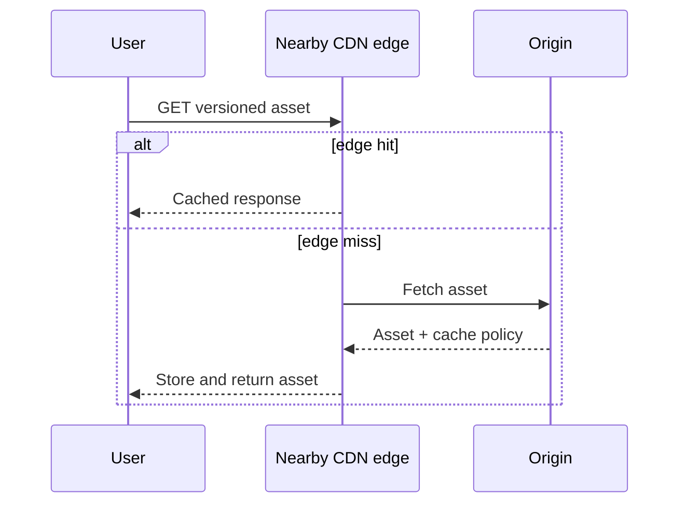
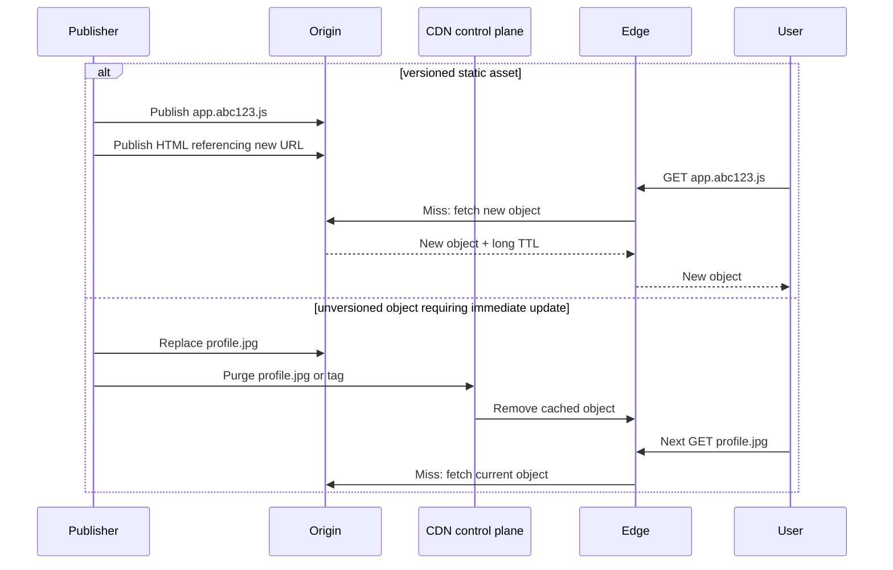
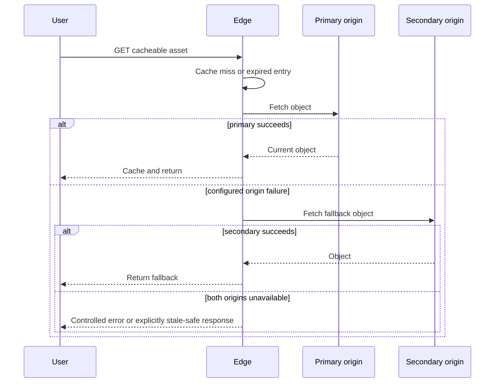

# CDN — Edge Caching, DNS Routing, Push vs Pull

A CDN is an edge cache for content whose freshness contract permits copies near users. Start by deciding
which response can be cached, its TTL, and what happens when the edge or origin is unavailable. A CDN is not
a substitute for application authorization or a generic solution for per-user dynamic data.

## How it works

### Core idea

A CDN (Content Delivery Network) is a **geographically distributed cache** that stores copies of content closer to users. Instead of every request traveling to the origin server, users are served from nearby CDN nodes whenever possible.

Typical CDN content: images, videos, CSS, JavaScript, software downloads, other static assets.

### Origin server

The origin is the **source of truth** — an application server, object storage (e.g. S3), or file server. CDN nodes only store copies; missing content is fetched from the origin.

### Cache hit vs cache miss

- **Hit:** content exists in the CDN node → served directly, no request reaches the origin. Benefits: lower latency, lower backend load, reduced bandwidth.
- **Miss:** the CDN fetches from origin, stores a copy locally, returns it — future requests become hits.

### DNS-based routing

One of the most important CDN concepts. When a user requests `example.com`, the CDN's routing layer selects
an edge from signals such as resolver location, network health, and capacity; DNS is often one part of that
selection. It aims for a good edge, not a guaranteed geographically nearest server:

| User location | DNS returns |
|---------------|-------------|
| India | Often a nearby India or regional edge |
| UK | Often a nearby UK or regional edge |
| USA | Often a nearby US or regional edge |

(Resolution mechanics in `networking/dns/DnsResolution.md`.)

### PoP (Point of Presence)

A PoP is simply a CDN location (Mumbai PoP, London PoP, Singapore PoP), usually containing multiple cache servers.

### Pull CDN

The most common model — content is fetched **only when requested**: user request → cache check → miss → fetch from origin → store locally. Advantages: no preloading needed; storage used only for requested content.

Example flow:

```text
User requests logo.png from CDN URL
        ↓
Nearby CDN PoP checks cache
        ↓
Miss: PoP fetches logo.png from origin/S3
        ↓
PoP stores it with TTL and returns it
        ↓
Next user near that PoP gets a cache hit
```

This is why popular assets naturally become fast worldwide, while rarely requested assets may still miss and hit origin.



### Push CDN

Content is **proactively distributed** to CDN nodes before users request it — e.g. large software updates, game patches, OS releases. The content is already at CDN locations when users begin downloading.

### Architecture diagram

```text
             +----------------+
             | Origin Server  |
             +----------------+
                     |
     ---------------------------------
     |               |              |
     v               v              v
+---------+    +---------+    +---------+
| Mumbai  |    | London  |    |  NYC    |
|  CDN    |    |  CDN    |    |  CDN    |
+---------+    +---------+    +---------+
     |               |              |
 India Users    Europe Users    US Users
```

### Cache invalidation

When origin content changes (e.g. a new `profile.jpg` replaces an old one), the CDN will still serve the old cached copy. Solutions:
- **Versioning (most common):** Changing the filename or content hash (for example, `profile.abc123.jpg`) so the CDN treats it as a completely new object.
- **Purge / Invalidate:** Explicitly telling the CDN to delete the old copy, forcing it to fetch the fresh version on the next request.

Versioning is usually simpler for static assets because you avoid racing every cache location in the world. New deploy references `app.abc123.js`; old cached `app.old.js` can expire naturally.

For versioned static assets, a long `Cache-Control` lifetime with `immutable` is safe because the URL itself
changes on content change. For an unversioned object, use a freshness window the product can tolerate or
purge it deliberately. Never put user-specific private data behind a shared cache key without a correct
authorization and cache-control policy.



### CDN failure and fallback

A CDN reduces origin load, but it also becomes part of the request path for static assets. For important clients, know the fallback behavior:

- Can the client retry the origin URL if the CDN is unavailable, without bypassing the same authorization and
  abuse controls?
- Can the page still render if non-critical assets fail?
- Are cache-control TTLs short enough for time-sensitive assets and long enough to avoid origin reload storms?

If a response is safe to serve briefly stale, an edge may use a controlled stale-on-error policy while the
origin recovers. Do not use that for content whose freshness is a correctness or authorization requirement.



Origin failover is normally a read-path feature. Do not assume a CDN can safely replay a client write to a
second origin: failover rules, idempotency, and the authoritative write location must be designed separately.

For interviews, this is the practical nuance: CDN is not only a latency optimization; it changes cache freshness, failure handling, and cost.

## Gotchas / Trick questions

1. **"Aren't CDN and Redis basically the same thing?"** They're both caches, but they solve different problems:

   | Redis | CDN |
   |-------|-----|
   | Close to backend services | Close to end users |
   | Caches application data | Caches static content |
   | Reduces database load | Reduces network latency and origin load |

2. **"Do Redis and CDN both have hits and misses?"** Yes — the caching concept is identical (hit → serve; miss → fetch from source and cache). The difference is *where* the cache sits and *what* it stores.
3. **"CDN drawbacks mention cost and complexity — isn't it actually reducing complexity vs building global infra ourselves?"** Good observation: the stated drawbacks are relative to *not using a CDN at all*. Cost = paying providers for bandwidth/distribution; complexity = cache invalidation, asset versioning, cache-control policies. Compared to building worldwide infrastructure yourself, a CDN reduces complexity dramatically.
4. **"Do I need to modify application logic to use a CDN?"** Not usually — core business logic is unchanged. Typical additions: asset versioning, cache-control headers, CDN configuration. The CDN is an optimization layer around the application.
5. **"Is live streaming push CDN?"** Not exactly — live streams are delivered as small segments continuously distributed through CDN infrastructure in near real-time. Think of it as a specialized streaming architecture rather than pure push or pull.
6. **"Do governments restrict CDN distribution?"** Sometimes — data sovereignty requirements, regional regulations, content restrictions, licensing. CDN providers may need regional controls or local infrastructure to comply.
7. **"How does the CDN know which node is nearest to me?"** It uses routing signals such as DNS resolver location, network health, and capacity. It selects a suitable edge; it cannot always infer the user's exact location.

## Performance characteristics

**Benefits:** lower latency (nearby nodes), reduced origin load (many requests never reach it), reduced bandwidth consumption, better user experience for static assets, high availability (content can still be served even if the origin is overloaded), and DDoS protection (most CDN providers add security layers before traffic reaches the origin).

**Trade-offs:** cost (global CDN infrastructure isn't free) and cache-invalidation complexity (updated content may persist in CDN caches until invalidated or refreshed).

Avoid placing rarely requested large assets on an expensive CDN path unless latency or origin protection justifies the transfer cost.

## Good to know

### Push CDN in the wild

Major OS updates and large game patches are distributed to CDN locations *before* release so millions of users can immediately download them.

### Interview depth guidance

For most SDE2 interviews this is sufficient: why CDN exists · origin server · hit vs miss · CDN vs Redis · DNS routing to the nearest node. Deep CDN internals are only expected for infrastructure-heavy roles.

Further reading:

- [MDN: Cache-Control][cache-control]
- [MDN: HTTP caching][http-caching]
- [AWS: content delivery, cache misses, and invalidation][cloudfront-delivery]
- [AWS: origin failover][cloudfront-failover]

[cache-control]: https://developer.mozilla.org/en-US/docs/Web/HTTP/Reference/Headers/Cache-Control
[http-caching]: https://developer.mozilla.org/en-US/docs/Web/HTTP/Guides/Caching
[cloudfront-delivery]: https://docs.aws.amazon.com/AmazonCloudFront/latest/DeveloperGuide/HowCloudFrontWorks.html
[cloudfront-failover]: https://docs.aws.amazon.com/AmazonCloudFront/latest/DeveloperGuide/high_availability_origin_failover.html

## Quick recall

**Q. What problem does a CDN solve?**
A. Serving content from geographically nearby locations to reduce latency and origin load.

**Q. What is an origin server?**
A. The source of truth that stores the original content.

**Q. What happens on a CDN cache miss?**
A. The CDN fetches from origin, stores a local copy, and returns it.

**Q. How does a CDN route users to nearby nodes?**
A. DNS-based geolocation — location-aware DNS responses.

**Q. Redis vs CDN?**
A. Redis caches application data near backend services; CDNs cache static content near users.

**Q. Pull vs push CDN?**
A. Pull fetches on demand (most common); push proactively distributes content before requests (OS updates, game patches).

**Q. What is a PoP?**
A. A Point of Presence — a CDN location containing cache servers.

**Q. CDN TTL too short vs too long?**
A. Too short reloads origin too often; too long serves stale assets after origin changes.
