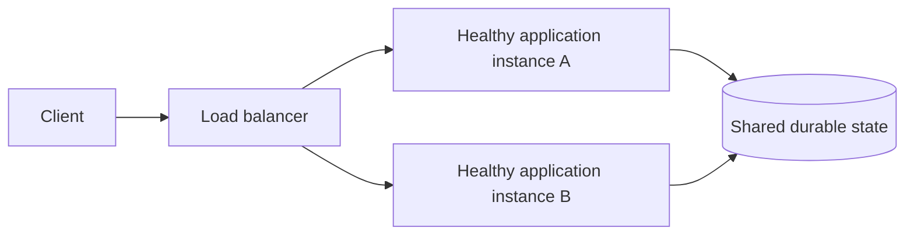
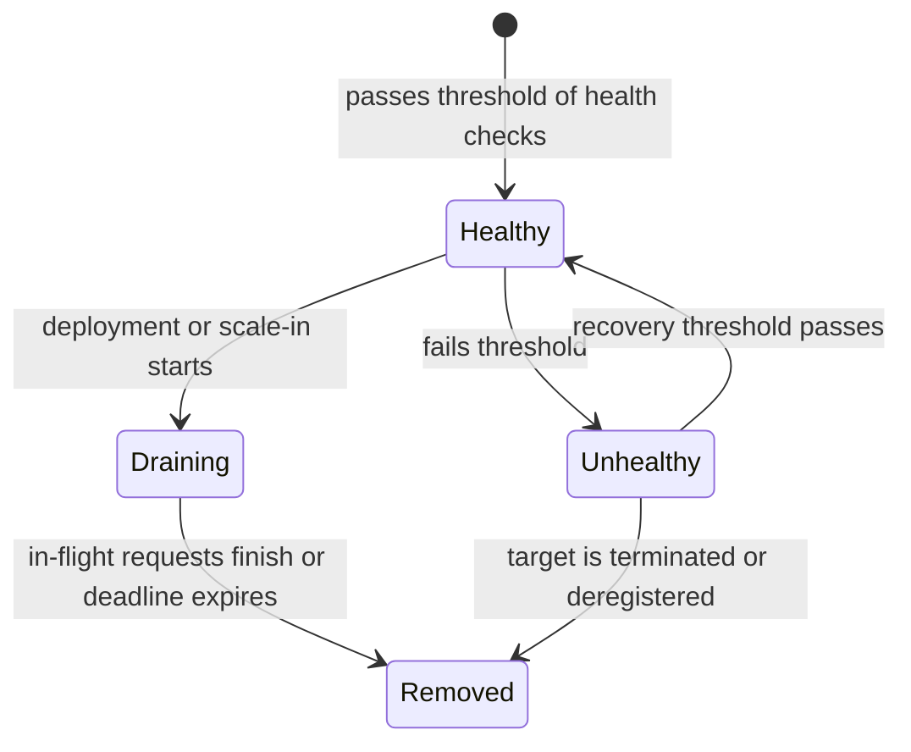

# Load Balancing — Routing, Health, and the Load-Balancer Boundary

A load balancer is useful when several application instances can serve the same request. It accepts client
connections, chooses a healthy target, and gives the application tier an independent scaling and failure
boundary. It does not make a stateful or saturated downstream dependency scale automatically.

## Start with one request path

The load balancer owns connection routing and health-based target selection. Application instances should
remain stateless where possible so a retry can reach another instance. Session stickiness is an exception
that trades simpler legacy session handling for weaker balancing and failover behavior.

## Choose routing from the workload

| Need | Useful policy | Trade-off |
| --- | --- | --- |
| Similar request cost | Round robin | Ignores slow or long-running requests. |
| Requests vary in duration | Least outstanding connections/requests | Needs current load signals. |
| Session-affine legacy flow | Sticky routing | A failed or hot target affects its bound clients. |
| Route by host, path, or headers | Layer-7 routing | Terminates/inspects HTTP and adds policy complexity. |
| Very high connection throughput | Layer-4 routing | Cannot make rich HTTP routing decisions. |

## Health checks and connection draining

Health checks remove a target only after an agreed failure threshold; they are not proof that every
dependency behind the target is healthy. A shallow process check can keep traffic flowing during a database
outage, while an overly deep check can remove every target because one optional dependency is down. Choose
the check from the request class being protected.

During deployment or scale-in, stop sending new requests to a target and let bounded in-flight work finish.
This connection-draining period avoids cutting an accepted request in the middle. It must have a deadline so
one stuck connection cannot block rollout forever.

The routing consequence matters: the balancer sends new requests only to **Healthy** targets. A draining
target can finish work already accepted, while an unhealthy target is removed from new routing. A retry after
a connection failure must still be safe at the application layer; a balancer cannot know whether a timed-out
write reached the service.

A load balancer sits in front of your servers to distribute traffic and prevent any single server from becoming a Single Point of Failure (SPOF). However, this introduces a new problem: **the load balancer itself becomes a SPOF**.

If you add a second load balancer to fix this (`LB-A` and `LB-B`), how do clients choose between them? Do you need a third load balancer in front of those two? 

> **Misconception:** *To eliminate the load balancer SPOF, you just keep putting another load balancer in front of it.*
> 
> **Correction:** This creates infinite recursion (`LB for LB for LB...`). In reality, the recursion stops at the infrastructure level. Traffic is distributed across your load balancers using **DNS**, **Virtual IPs (VIPs)**, or **Anycast routing**. 

## 1. DNS-Based Load Balancing
DNS can return multiple IP addresses for a single domain name (e.g., `myapp.com` returns the IPs for `LB-A` and `LB-B`). Different clients can receive different answers, distributing traffic. A platform can withdraw a failed address from new answers, but clients and recursive resolvers may retain the old answer until its TTL expires.

**The Drawback:** DNS caching. If the TTL (Time to Live) is 30 seconds, some clients will continue sending traffic to the dead `LB-A` for up to 30 seconds until their cache expires.

> **Misconception:** *Doesn't this just make DNS the new SPOF?*
> 
> **Correction:** DNS is natively distributed. Your domain doesn't rely on one server; it relies on multiple authoritative name servers (ns1, ns2, ns3) operated globally by providers like Cloudflare or Route53.

## 2. Virtual IP (VIP) & Active/Standby
You assign a single Virtual IP to a pair of load balancers. Clients connect to the VIP. 
- `LB-A` is Active and owns the VIP.
- `LB-B` is Standby and monitors `LB-A`.

If `LB-A` fails, the protocol can move the VIP to `LB-B`. The recovery time depends on heartbeat detection,
network convergence, and the deployment; do not promise a universal millisecond failover in an interview.

> **Misconception:** *Doesn't the VIP need a separate server to manage the failover? Doesn't that manager become the new SPOF?*
> 
> **Correction:** The failover protocol (e.g., VRRP or Keepalived) runs **distributed on the load balancers themselves**. They exchange heartbeat messages (`"I'm alive"`). If `LB-B` stops hearing from `LB-A`, `LB-B` independently assumes ownership of the VIP. There is no central manager.

## 3. Anycast Routing
In Anycast, multiple geographical locations advertise the **exact same IP address**. BGP routes a client to a
suitable advertised path according to network policy; this is not necessarily the geographically nearest
location. If an unhealthy location withdraws its route, the internet converges on another path, with recovery
time depending on routing propagation.

> **Misconception:** *Doesn't BGP routing become a SPOF?*
> 
> **Correction:** Internet routing is fully decentralized. Thousands of routers independently exchange routes. There is no single router in charge.

## Capacity Planning (N+1 Redundancy)

It is not enough to just have multiple load balancers; they must have the capacity to handle a failure. 

If your total traffic is 100k RPS, and you have two load balancers (`LB-A` and `LB-B`) that each have a maximum capacity of 100k RPS, they will normally run at 50% utilization (50k each).
If `LB-A` dies, all 100k RPS shifts to `LB-B`. Because `LB-B` was provisioned with spare capacity, the system survives.

**N+1 Redundancy** means you always have at least one more component than you strictly need to handle the peak load, specifically to absorb the traffic during a failure.

## The Deeper Systems Design Lesson

When asked how to eliminate a SPOF, the conversation inevitably moves up the chain:
* *App fails?* Add Load Balancer.
* *Load Balancer fails?* Add VIP/DNS.
* *DNS fails?* Rely on Anycast/BGP.
* *Datacenter fails?* Go multi-region.

> **Misconception:** *A perfectly reliable architecture is built by entirely eliminating every single SPOF.*
> 
> **Correction:** You can never mathematically eliminate the possibility of failure. Instead, **you push failure downwards into increasingly distributed infrastructure**. You delegate responsibility from your application code to infrastructure (DNS/BGP) that is engineered at a massive global scale to be exponentially more reliable than the layer above it.

Further reading:

- [AWS: how Elastic Load Balancing works][aws-elb]
- [AWS: target-group health checks][aws-health-checks]

[aws-elb]: https://docs.aws.amazon.com/elasticloadbalancing/latest/userguide/how-elastic-load-balancing-works.html
[aws-health-checks]: https://docs.aws.amazon.com/elasticloadbalancing/latest/application/target-group-health-checks.html

## Quick recall

**Q. Why not just put another load balancer in front to solve the load balancer SPOF?**
A. It creates infinite recursion. Instead, traffic distribution stops at network-level mechanisms: DNS, Virtual IPs (VIP), or Anycast routing.

**Q. How does Virtual IP (VIP) failover work without a central manager?**
A. Load balancers run a distributed protocol (like VRRP or Keepalived) exchanging heartbeats. If the active node fails, the standby takes over the VIP after failure detection and network convergence.

**Q. What is the main drawback of DNS-based load balancing?**
A. DNS caching. If a load balancer fails and DNS stops returning its IP, clients with the IP cached locally (for the duration of the TTL) will continue sending traffic to the dead node.

**Q. What is Anycast routing?**
A. Multiple geographic locations advertise the same IP address. BGP directs traffic to a suitable advertised path; unhealthy locations must withdraw their route.

**Q. Doesn't relying on DNS or BGP just make them the new SPOF?**
A. No, they are natively distributed. You are pushing the failure concern from your application infrastructure to a lower, globally distributed infrastructure layer that is exponentially more reliable.

**Q. What is N+1 redundancy in load balancing?**
A. Keeping enough spare capacity so that if one load balancer dies, the remaining healthy nodes can absorb the full traffic load without being overwhelmed.
