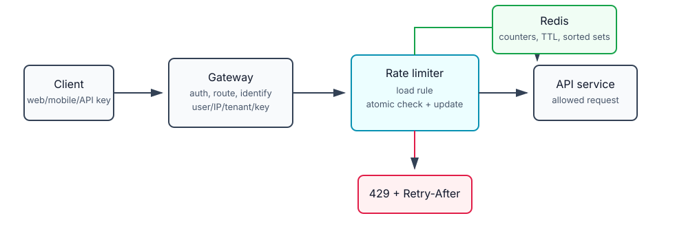

# Design a Distributed Rate Limiter

## Problem

Design a server-side API rate limiter that protects HTTP APIs from excessive traffic.

The limiter should:

- enforce limits accurately enough for production APIs
- add very low latency
- work across multiple app servers
- support different rules per user, IP, tenant, API key, endpoint, or global system limit
- return clear throttling responses
- avoid taking the whole service down if limiter storage has trouble

## Clarify scope

Ask these before drawing boxes:

- Are limits per user, IP, API key, tenant, endpoint, or global?
- Is this for one service or many services?
- Are rules static config or dynamically changed by plans/tenants?
- Should rejected requests be dropped, delayed, or queued?
- Is strict accuracy required, or are small approximations acceptable?
- What should happen if Redis or the rate-limit service is unavailable?

Reasonable assumption for an interview:

```text
Server-side HTTP API limiter
Distributed across many app servers
Redis-backed counters
Return 429 for rejected requests
Support configurable rules
```

## Functional requirements

- Apply limits by user, IP, API key, tenant, endpoint, or global rule.
- Allow requests under quota.
- Reject or delay requests over quota.
- Return a clear throttling response for HTTP APIs.
- Support different rules for different endpoints/plans.
- Allow rules to change without redeploying every API service.

## Non-functional requirements

- Very low added latency because the limiter is on the request path.
- Distributed correctness across many API servers.
- Memory efficient counter storage.
- High availability: limiter failures should not take down the whole API unless the endpoint requires fail-closed behavior.
- Observable: operators must know which rules are rejecting traffic and whether valid users are blocked.

## Back-of-envelope estimation

Use estimates to justify Redis/shared in-memory storage:

```text
Peak API traffic: 100K requests/sec
Limiter check per request: 100K checks/sec
Average counter key size: ~100 bytes including metadata
Active identities in a 1-minute window: 10M
Counter memory: 10M * 100 bytes ~= 1 GB before overhead
```

Design implications:

| Estimate | Implication |
|----------|-------------|
| One check per request | Limiter must be in-memory/nearby, not relational DB backed |
| Many active keys | Use TTL so inactive counters expire automatically |
| Hot global limits | Watch Redis hot keys and shard high-traffic counters if needed |
| Multi-region traffic | Decide regional vs global quota accuracy |

Exact numbers do not matter. The interview point is that the limiter is hot-path infrastructure, so disk-backed writes per request are not acceptable.

## API sketch

External clients mostly see normal API responses plus rate-limit headers:

```text
HTTP 200 OK
X-RateLimit-Limit: 100
X-RateLimit-Remaining: 42
```

When throttled:

```text
HTTP 429 Too Many Requests
Retry-After: 30
X-RateLimit-Limit: 100
X-RateLimit-Remaining: 0
```

Internal limiter API:

```text
checkAndConsume(identity, ruleId, cost = 1) -> ALLOW | REJECT
```

Rule examples:

```text
login:user:{email}        -> 5 requests/minute
post:user:{userId}        -> 2 requests/second
payments:tenant:{tenant}  -> 100 requests/minute
global:/api/v1/search     -> 10K requests/second
```

## Data model

Rules:

```text
Rule(ruleId, dimension, endpoint, algorithm, limit, window, burst, action)
```

Runtime counters in Redis:

```text
rate:{ruleId}:{identity}:{window} -> count/tokens/timestamps
ttl = rule window + small buffer
```

For token bucket:

```text
bucket:{ruleId}:{identity} -> {tokens, lastRefillTimestamp}
```

For sliding window log:

```text
zset:{ruleId}:{identity} -> sorted timestamps
```

## High-level architecture



```text
Client
  ↓
API Gateway / Rate-limit middleware
  ↓              ↘
API Service       Redis / shared counter store
```

Request flow:

1. Client sends request.
2. Middleware identifies the rate-limit key: user, IP, API key, tenant, endpoint, or combination.
3. Middleware loads the applicable rule.
4. Middleware checks and updates the counter atomically in Redis.
5. If allowed, request goes to API service.
6. If rejected, middleware returns `429 Too Many Requests`.

## Key design decisions

### Gateway vs application service

Use a gateway when limits are generic: IP, API key, tenant plan, endpoint quota.

Use app-service logic when the rule needs domain context: "verified sellers can publish more listings" or "KYC vendor calls are limited by partner contract."

Many real systems do both:

```text
Gateway: broad abuse/cost limits
Service: domain-specific limits
```

### Algorithm choice

For a general API limiter, token bucket is a strong default:

- allows short bursts
- enforces sustained average rate
- memory efficient
- easy to explain

For strict "no more than N requests in any rolling minute," use sliding window log or sliding window counter.

Practical interview answer:

```text
Use token bucket for most API traffic.
Use sliding window counter for stricter per-login/per-account abuse rules.
Keep a global limit to protect downstream systems from aggregate bursts.
```

### Counter storage

Redis is a common fit because it is fast, shared, and supports TTL:

```text
key = rate:{rule}:{identity}:{window}
value = counter/tokens/timestamps
ttl = rule window
```

Examples:

```text
rate:login:user:alice@example.com
rate:post:user:123
rate:payments:tenant:acme
rate:global:/api/v1/search
```

Do not use a relational database for every rate-limit check. The limiter is on the hot path; disk-backed writes per request are too expensive.

## Atomicity

This naive sequence is unsafe:

```text
read counter
if counter < limit
  write counter + 1
```

Two concurrent requests can read the same value and both pass. The decision must be atomic.

Use:

- Redis `INCR` + `EXPIRE` carefully for simple fixed windows
- Lua script for check-and-update as one operation
- Redis sorted sets for sliding-window log

## Distributed concerns

### Synchronization

Local counters do not work when requests can hit different servers:

```text
Request 1 → App A local count = 1
Request 2 → App B local count = 1
Request 3 → App C local count = 1
```

The user effectively gets more quota than intended. Use shared Redis or a dedicated rate-limit service.

### Hot keys

Global limits and massive tenants can overload one Redis key. Mitigations:

- shard the counter key into multiple subkeys
- aggregate approximate counts
- use local pre-checks for cheap rejection
- separate high-traffic tenants/rules

### Multi-region

Global, perfectly accurate, low-latency rate limiting across regions is hard. Pick the tradeoff:

| Design | Benefit | Tradeoff |
|--------|---------|----------|
| Regional counters | Low latency | A user may consume quota in multiple regions |
| Central global counter | Stronger global quota | Cross-region latency and availability risk |
| Hybrid local + async global | Practical at scale | Eventually consistent, approximate |

For most APIs, regional enforcement plus a higher-level global abuse detector is acceptable. For expensive vendor calls, use stricter centralized quota or route the tenant to one owning region.

## Throttled response

Return:

```text
HTTP 429 Too Many Requests
Retry-After: 30
X-RateLimit-Limit: 100
X-RateLimit-Remaining: 0
```

`Retry-After` is the most client-useful header because it tells clients when to retry.

## Failure mode

Decide by endpoint:

- **Fail-open:** allow request if limiter storage is unavailable. Better availability, weaker protection.
- **Fail-closed:** reject request if limiter storage is unavailable. Better protection, worse availability.

For a normal read API, fail-open is often acceptable. For login, payment, SMS, or KYC vendor calls, fail-closed or degraded strict local limits may be safer.

## Monitoring

Watch:

- allowed/rejected request count
- rejection rate per rule
- top limited users/IPs/tenants
- Redis latency/errors
- limiter-added latency
- hot keys
- queue lag if rejected work is queued
- customer-impacting false positives

If valid users are blocked, rules are too strict. If downstreams still overload, rules or algorithm choice are too loose.

## Quick recall

**Q. Where should the limiter live?**  
A. Gateway/middleware for generic rules, service code for domain-specific rules; many systems use both.

**Q. Why Redis?**  
A. Shared, fast, TTL-friendly, and supports atomic operations for distributed counters.

**Q. Why is local in-memory counting wrong in distributed systems?**  
A. Requests hit different servers, so each server sees only part of the user's traffic.

**Q. Why does atomicity matter?**  
A. Concurrent requests can read the same counter and both pass unless check-and-update is atomic.

**Q. What HTTP status code for throttling?**  
A. `429 Too Many Requests`, usually with `Retry-After`.

**Q. Hardest multi-region tradeoff?**  
A. Global accuracy vs low latency/availability.
