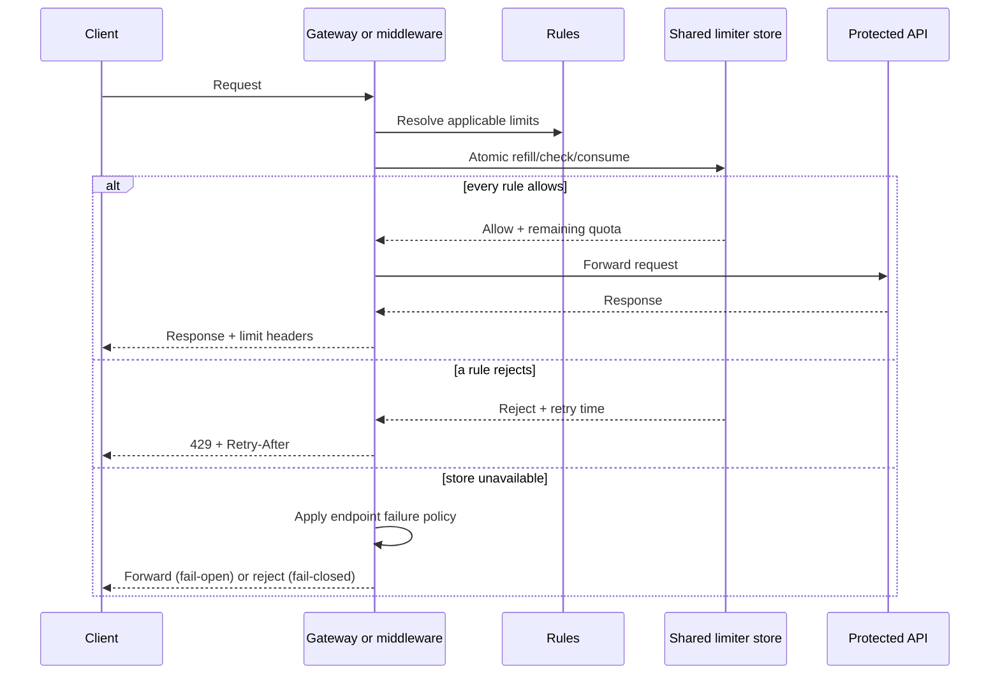
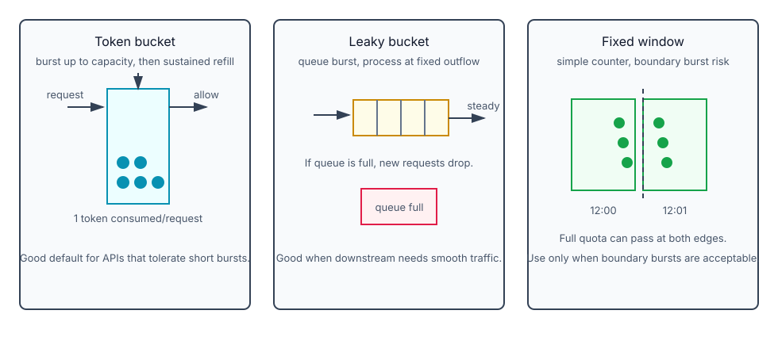

# Rate Limiting

Rate limiting is an admission-control decision: before accepting work, decide whether this caller and this
request class may consume scarce capacity now. Start from the downstream that must be protected and state
whether rejected work should receive `429`, wait in a bounded queue, or be handled by a separate asynchronous
workflow. Do not treat every overload problem as a token-bucket problem.

## How it works

A rate limiter controls how many requests a client, user, tenant, IP, API key, or whole system can send in a time period.

Examples:

- `user_id=123` can create 2 posts/second.
- One IP can create 10 accounts/day.
- One API key can call `/payments` 100 times/minute.
- The whole service accepts at most 10K requests/second.

The point is not only abuse prevention. Rate limiting also protects cost, downstream capacity, third-party API quotas, and user-facing latency.

## Why rate limit

- **Prevent abuse:** bots, scraping, credential stuffing, accidental loops.
- **Protect availability:** reject excess work before it overloads API servers or databases.
- **Control cost:** paid verification calls, payment checks, SMS/email providers, and compute-heavy actions.
- **Preserve fairness:** one tenant or user should not consume all shared capacity.

## Multi-Dimensional Rate Limits
Most production systems enforce multiple limits simultaneously rather than relying on a single rule. A request succeeds only if it passes all dimensions.

Common dimensions include:
- **Per-IP:** Limits requests from a single address to prevent simplistic brute-force attacks.
- **Per-Account / Per-User:** Limits requests per authenticated user.
- **Per-API-Key:** Limits automated traffic from registered clients.
- **Global Limit:** A system-wide threshold (e.g., max 10k req/sec) to protect backend infrastructure regardless of who is sending the traffic.

### Login Page Rate Limiting
Login endpoints are prime targets for attacks (credential stuffing, brute forcing). They usually combine:
1. **Per-IP limit:** Stops attackers running scripts from a single machine.
2. **Per-Account limit:** Stops attackers rotating through 1,000 IPs to attack a single target account (since email/username is provided before auth succeeds).
3. **Global limit:** Stops massive distributed botnets from overwhelming the service even if neither IP nor Account limits are breached individually.

## Adaptive challenges

CAPTCHA or another risk challenge is not a replacement for a server-side limiter. It is an additional,
selective control after suspicious behavior or repeated limit failures. It raises the cost of automated abuse
but has accessibility, UX, and false-positive costs, so apply it to a narrow risky flow rather than every API.

## Backpressure vs Rate Limiting
Controlling Kafka consumer counts or enforcing queues is conceptually similar to rate limiting (protecting downstream systems from load), but is classified differently.
- **Rate Limiting:** Usually an API gateway / edge concept where excess requests are immediately rejected (e.g. `429 Too Many Requests`).
- **Backpressure / Flow Control:** Internal system mechanics (like Kafka consumer throughput limits) where excess load is queued, delayed, or shed internally to prevent component collapse.

## Where to enforce it

| Placement | Use when | Caveat |
|-----------|----------|--------|
| Client-side | UX hints, local retry pacing | Not trusted; malicious clients can bypass it |
| App server | Custom business rules close to domain logic | Every service must implement it consistently |
| API gateway / middleware | Common edge rules: auth, quotas, IP/API-key limits | Limited by gateway features unless you build custom logic |
| Dedicated rate-limit service | Many services share complex rules | Adds network hop and operational dependency |

For interviews, server-side or gateway-side enforcement is the real control point. Client-side throttling is helpful but not sufficient.

## Requirements to clarify

Before designing, ask:

- Are limits per user, IP, device, tenant, API key, endpoint, or global?
- Is this single-region or distributed?
- Do we need hard limits or can we allow short bursts?
- Should excess requests be dropped, delayed, or queued?
- What response should throttled clients receive?
- What happens if Redis/rate-limit storage is unavailable?
- Do rules change dynamically by plan, tenant, or endpoint?

## One request: allow, reject, or degrade

The limiter has to make a single atomic admission decision before the protected service receives work. A
per-user rule does not by itself protect the service from the sum of many users, so apply any relevant global
or downstream budget too.



## Common Rate Limiting Algorithms



### Fixed Window Counter

Count requests in fixed windows like `12:00:00-12:00:59`. If the limit is 100/minute, reject after the counter reaches 100.

- **Benefit:** simplest and memory efficient.
- **Problem:** boundary burst. A client can send 100 requests at `12:00:59` and 100 more at `12:01:00`, effectively sending 200 requests in about one second.

### Sliding Window Log
Stores the exact timestamp of every request. When evaluating a new request, it counts timestamps within the window (`Current Time - Window Size`). 
- **Benefit:** very accurate.
- **Gotcha:** memory heavy for high-throughput systems because each request timestamp is stored.

### Sliding Window Counter
Divides the window into discrete buckets (e.g., 0-10 sec, 10-20 sec) and stores request counts per bucket. 
- **Benefit:** memory efficient compared to the raw log while still smoothing out boundary bursts.
- **Trade-off:** approximate, because it assumes requests are spread evenly inside the previous bucket.

### Token Bucket
Buckets have a fixed **Capacity** and a constant **Refill Rate** (e.g., 10 tokens/sec, max 100).
- **Gotcha:** Allows burst traffic. If a system is idle overnight, the bucket fills to its max capacity. When traffic spikes, the initial burst is allowed up to the full capacity. Aggregate bursts can still overwhelm a downstream. Add a global or downstream-specific budget when that shared capacity needs protection; a per-user bucket alone does not provide it.

Token bucket has two knobs:

- **Bucket capacity:** maximum burst allowed.
- **Refill rate:** sustained average rate.

Use token bucket when short bursts are acceptable but sustained abuse is not.

The token-bucket decision is small enough to state precisely: calculate tokens earned since the stored
timestamp, cap at capacity, consume the request cost only if enough remain, then persist the new token count
and timestamp atomically. With several app instances, the entire refill-check-consume operation must be one
shared-store operation; splitting it lets simultaneous requests overspend the bucket.

### Leaky Bucket
Incoming requests enter a queue. The system processes them at a strict, constant outgoing rate (the "leak").
- **Trade-off:** Rate Limiting (Token Bucket) rejects excess traffic; Leaky Bucket queues it. The last request in a burst will wait significantly longer for processing.

Use leaky bucket when the downstream needs a steady outflow. It smooths bursts, but queueing creates latency and old requests can block newer ones.

## Algorithm choice

| Algorithm | Best for | Main weakness |
|-----------|----------|---------------|
| Fixed window | Simple low-risk limits | Boundary bursts |
| Sliding window log | Strict rolling-window accuracy | High memory |
| Sliding window counter | Good accuracy with lower memory | Approximation |
| Token bucket | Bursts + sustained average limit | Tuning capacity/refill |
| Leaky bucket | Stable downstream processing rate | Queue delay and stale work |

## Redis Hot Keys in Rate Limiting
Redis is frequently used for distributed rate limiting because it is fast, shared, and supports atomic
operations. The whole check-and-update must be atomic; separate `INCR` and `EXPIRE` calls need a safe
pattern or a script.
- **Hot Key Problem:** Occurs when a single key (e.g., a global limit counter or a massive tenant's key) receives disproportionate traffic, melting a single Redis node while the rest of the cluster is idle.
- **Mitigation:** shard the key only when an approximate aggregate is acceptable, because aggregation changes
  the enforcement decision. For a hard global budget, keep one atomic owner or allocate bounded local quotas
  from a central authority.

## Distributed design

Single-server rate limiting is easy because all counters live in one process. Distributed rate limiting is harder because requests for the same user can hit different app servers:

```text
Request 1 → App A
Request 2 → App B
Request 3 → App C
```

If each app has its own local counter, the user gets more quota than intended. Use a shared fast store:

```text
API Gateway / App
        ↓
Rate limiter middleware
        ↓
Redis counters / sorted sets
        ↓
API service
```

Avoid sticky sessions as the main answer. They make the limiter less flexible and break down during autoscaling/failover.

### Race condition

This sequence is unsafe under concurrency:

```text
read counter
check counter < limit
write counter + 1
```

Two requests can read the same old value and both pass. Use atomic Redis operations, Lua scripts, or sorted-set operations so "check and update" happens as one atomic decision.

### Rules storage

Rules usually live in configuration or a control-plane service, then get cached by the limiter:

```text
Rule: auth login → 5 requests/minute
Rule: marketing messages → 5 requests/day
Rule: tenant free_plan → 1000 requests/day
```

Keep rule lookup fast; the limiter sits directly on the request path.

## Throttled response

For HTTP APIs, return `429 Too Many Requests`.

Useful headers:

```text
X-RateLimit-Limit: 100
X-RateLimit-Remaining: 0
Retry-After: 30
```

Clients should use these headers to back off. For internal job systems, sometimes excess work is queued instead of dropped, but do not queue blindly at the API edge or you can turn overload into long-tail latency.

## Failure mode

Decide fail-open vs fail-closed:

| Mode | Meaning | Use when |
|------|---------|----------|
| Fail-open | If limiter storage is down, allow requests | Availability matters more than strict quota |
| Fail-closed | If limiter storage is down, reject requests | Abuse/cost/security risk matters more |

Many product APIs fail-open for ordinary traffic but fail-closed for expensive or risky endpoints such as
payment, login, SMS, or external verification calls.

## Monitoring

Track:

- allowed vs rejected request counts
- rejection rate by rule, tenant, endpoint, IP/user/API key
- Redis latency and error rate
- hot keys
- p95/p99 latency added by the limiter
- false positives: valid users being blocked
- false negatives: abuse still passing through

If too many valid requests are rejected, rules are too strict. If flash-sale traffic still overloads downstreams, the algorithm or global limits are wrong.

## Quick recall
**Q. Why isn't an IP-based rate limit enough for a login page?**
A. Attackers can easily bypass it by rotating through proxy IPs. A per-account limit based on the submitted email/username is required alongside it.

**Q. What is the fundamental purpose of a CAPTCHA?**
A. To add selective friction to suspicious traffic. It complements server-side limits; it does not enforce a quota by itself.

**Q. Token Bucket vs Leaky Bucket — what happens to a sudden traffic burst?**
A. Token Bucket allows the burst to pass immediately (up to bucket capacity). Leaky Bucket queues the burst and processes it at a strict, constant rate.

**Q. Why is fixed window inaccurate at boundaries?**
A. A client can use the full quota at the end of one window and again at the start of the next, exceeding the intended rolling rate.

**Q. Why use Redis for distributed rate limiting?**
A. It is fast, shared across app servers, supports TTL counters, and can perform atomic updates.

**Q. What response should an HTTP API return when throttling?**
A. `429 Too Many Requests`, ideally with limit/remaining/retry headers.

**Q. What is fail-open vs fail-closed?**
A. Fail-open allows traffic if the limiter fails; fail-closed rejects traffic if the limiter fails.

**Q. What is the Redis "Hot Key" problem and how is it mitigated?**
A. A single key receives massive traffic, overloading one node. Sharding can distribute it when approximate enforcement is acceptable; a hard global limit needs one atomic owner or bounded quota allocation.

## Resources / References

- [Hello Interview: distributed rate limiter](https://www.hellointerview.com/learn/system-design/problem-breakdowns/distributed-rate-limiter)
- [Redis: rate limiter](https://redis.io/docs/latest/develop/use-cases/rate-limiter/)
