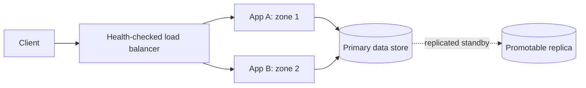

# Design

## Failure boundary

The main page explains availability through a single order request. This diagram adds the design question
that matters: which failures can one healthy replica actually survive?

App A failing should only remove one route. A database failure is different: traffic can recover only after a
tested promotion path and a correct retry/idempotency policy. The diagram is a baseline, not proof of
multi-region disaster recovery.

## Interview prompt

"This API has a 99.9% successful-request SLO. Where are its single points of failure, and what would you
change first?"

Answer in this order: define the user-facing success SLI, identify the app and database failure domains,
add independently placed replicas plus health checks, then describe failover and idempotent retries.

<ArchitectureBoard src="availability-demo.drawio" />
