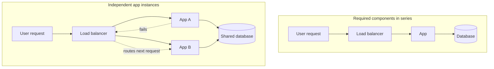
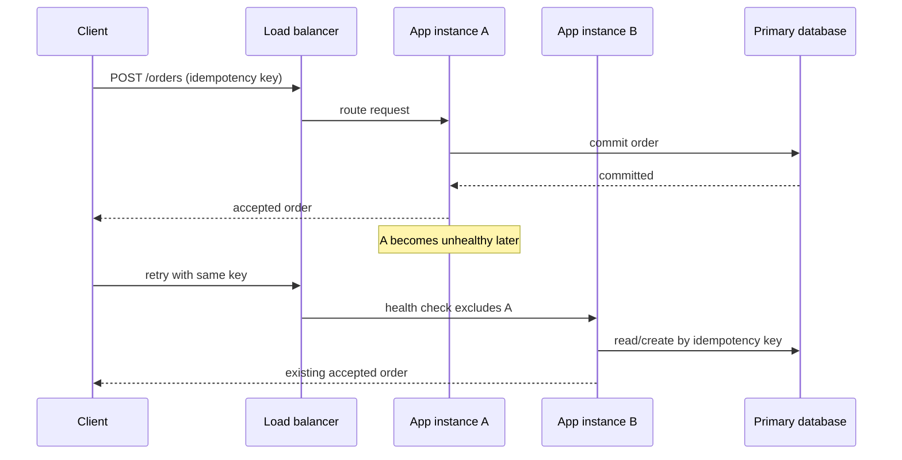

# System Availability, Reliability & Fault Tolerance

Start with one user-visible operation: a client sends `POST /orders` and expects either one accepted
order or a clear failure. Availability is not "number of healthy machines"; it is the fraction of
well-formed operations for which the service can give that promised outcome over a stated window.

The first design is one application instance and one database. It is easy to reason about, but either
machine is a single point of failure. Add replicas only when the allowed interruption, measured by an
SLI/SLO, justifies the coordination and failover cost.

## Measuring availability

**Formula:** `Availability = Uptime / (Uptime + Downtime)`

**The "Nines":** Companies measure availability in percentages. Every extra 9 increases complexity and cost.

| Availability | Downtime per year | Expected Setup |
|------------|------------|-------|
| 99% | ~3.65 days | 1 server |
| 99.9% ("Three nines") | ~8.7 hours | |
| 99.99% ("Four nines") | ~52 minutes | |
| 99.999% ("Five nines") | ~5 minutes | Multiple servers, AZs, replication, automatic failover |

For monthly SLA math, use the same idea:

```text
30 days × 24 hours × 60 minutes = 43,200 minutes/month
99.9% availability allows 0.1% downtime
0.001 × 43,200 = 43.2 minutes/month
```

Interview habit: convert the "nines" into downtime. Saying "99.9%" is abstract; saying "about 43 minutes per month" makes the reliability target concrete.

## Sequence vs Parallel availability

This is the mathematical reason why load balancers and clusters exist.

### Components in Sequence (Series)

```text
User → Load Balancer → API → Database
```

For a request to succeed, **all** components must work. 
If each component has 99.9% availability:
`0.999 × 0.999 × 0.999 ≈ 99.7%` overall availability.
**Adding more required components in series reduces total availability.** (Analogy: Christmas lights — one bulb breaks, the whole chain dies).

### Components in Parallel

```text
          Server A
        /
User ——
        \
          Server B
```

Request succeeds if **A OR B** works. Both need to fail simultaneously for the service to die.
Two 99.9% servers in parallel jump to approximately 99.9999% availability.
**Adding components in parallel increases total availability.** (Analogy: Owning two cars — if one breaks, you can still drive).



Parallel application instances help only when the path after them can still serve the request. If both
instances depend on one unavailable database, the database remains the series failure in the user path.

## How it works

### The three definitions

| Concept | Question it answers | Property of |
|---------|--------------------|-------------|
| **Reliability** | How often does a component fail? | The component itself |
| **Availability** | Can users use the service *right now*? | The service |
| **Fault tolerance** | Can the system keep operating *while* failures occur? | The system design |

**Reliability** — frequency/probability of failure; how long a component runs before breaking. A server that runs 5 years without crashing is highly reliable. *Reliable = breaks rarely.*

**Availability** — whether the system can continue serving traffic: the website responds, users can send messages, customers can place orders. *Available = users can use it.*

**Fault tolerance** — designed so that when a failure occurs, the system keeps working and users don't notice.

### Reliability helps availability

Fewer failures → less downtime → higher availability. That's why reliability *contributes* to availability.

### Availability does NOT require reliability

A system can be highly available even if components fail frequently. 100 app servers with 1 crashing every hour sounds unreliable — but if the load balancer removes failed servers and traffic shifts, users never notice:

```text
Component reliability = low
System availability  = high
```

This is one of the most important distributed-systems concepts.

### Reliability does NOT guarantee availability

A single database server that crashes only once every 3 years is highly reliable — but when it crashes, the entire application stops for hours:

```text
Reliability  = high
Availability = low
```

### Fault tolerance = availability in the presence of failures

Availability asks "can users use the system?" Fault tolerance asks "can users still use it *while things are failing*?"

## High Availability vs Fault Tolerance

**High Availability (HA)** — goal: very little downtime. Primary DB fails → replica promoted in ~30 seconds. Users may see a short outage, a few failed requests, a brief interruption.

**Fault Tolerance (FT)** — goal: near-zero *visible* interruption. Primary fails → replica takes over immediately; users keep working, no noticeable downtime.

```text
HA:  failure → small interruption → recovery
FT:  failure → service continues  → users don't notice
```

## Practical examples

| Setup | Reliability | Availability | Fault tolerance | Why |
|-------|-------------|--------------|-----------------|-----|
| 1 app server, crashes once per 5 yrs | High | Low | None | When the server dies, the entire service dies |
| LB + 100 servers, failures common | Average per server | Very high | Moderate | Traffic shifts automatically; users continue |
| Primary + replica DB, promote on failure | Depends | High | Partial | Brief interruption still exists during promotion |
| Multi-node cluster, one node fails | Not necessarily perfect | Extremely high | High | Designed assuming failures will happen |

## Gotchas / Trick questions

1. **"If a system is reliable, is it automatically highly available?"** No — a single DB server failing once every 3 years is reliable, but its one failure takes the whole application down for hours.
2. **"If a system is highly available, is it automatically reliable?"** No — 100 servers with one crashing every hour are individually unreliable, yet the load balancer keeps the service available.
3. **"Availability and reliability are the same thing."** Reliability measures failures (component focus); availability measures whether users can use the service (service-continuity focus).
4. **"Fault tolerance means failures never happen."** Failures absolutely happen — fault tolerance means the system continues operating *despite* them.
5. **"If there's even a tiny interruption, is it still fault tolerant?"** Nuance: in theory FT aims for no visible interruption; in practice perfect zero impact is extremely difficult — a few failed requests, millisecond-level disruption, or tiny switchover delays may remain. The goal is making failures *effectively invisible* to users.
6. **Understanding check (correct):** HA = system works again after a short interruption; FT = system continues without users noticing.

## How availability is increased (SDE-2 level)

When asked "How can we improve availability?", SDE-2s are expected to identify single points of failure and apply **redundancy**:

1. **Replication:** 1 DB → 3 DB replicas (no single point of failure).
2. **Multiple App Servers:** 10 servers instead of 1.
3. **Load Balancers:** Route traffic away from failed instances (turns sequence failure into parallel availability).
4. **Multi-AZ Deployment:** Survives a datacenter death.
5. **Health Checks:** Detect failures automatically.
6. **Automatic Failover:** Move traffic without human intervention.

Key insight: modern distributed systems **assume hardware failures will happen**. The goal is not preventing all failures — it's *surviving* them. CDNs, Caching, Clustering, and DNS Routing are all fundamentally techniques to improve Latency and **Availability**.

## Redundancy has a failure boundary

Two instances improve availability only when their failures are sufficiently independent and traffic can
actually move. Two processes on one host still share the host; replicas in one availability zone can share
a zone outage; and a healthy standby is useless if promotion, credentials, or DNS routing has never been
tested.

For the order request, a practical failure path is:



Health checks should test the capability that matters. A process-level check is enough to remove a dead
process; it does not prove that a request can reach a required datastore. Keep dependency checks bounded:
failing every instance merely because one optional dependency is slow can turn a partial outage into a
full outage. Use the same idempotency key across a client retry and failover so recovery does not create a
second order.

## Measure the user outcome, then spend an error budget

An SLI should classify an operation from the user's perspective, such as the proportion of order requests
that complete within the promised latency and return the correct durable outcome. CPU utilisation is useful
for diagnosis, but it is not an availability SLI by itself. The allowed failures within an SLO window are
the **error budget**; teams can use the remaining budget to decide whether to keep shipping changes or
first restore reliability.

## Good to know

### Hospital analogy

- **Hospital A:** 1 doctor who never takes leave — doctor reliability high, hospital availability low (doctor sick → hospital closes).
- **Hospital B:** 50 doctors, some always sick or on leave — individual reliability lower, hospital availability very high (always open).

That's exactly how distributed systems use redundancy.

## Further reading

- [Google SRE: defining service level objectives](https://sre.google/sre-book/service-level-objectives/)
- [Google SRE: availability table](https://sre.google/sre-book/availability-table/)

## Quick recall

**Q. What does reliability measure?**
A. How often a component fails.

**Q. What does availability measure?**
A. Whether users can use the service right now.

**Q. Does high reliability guarantee high availability?**
A. No — a single highly reliable server still creates downtime when it eventually fails.

**Q. Does high availability guarantee high reliability?**
A. No — components may fail frequently while redundancy keeps the service running.

**Q. High availability vs fault tolerance?**
A. HA allows small interruptions; FT aims for no noticeable interruption.

**Q. What is the core distributed-systems mindset?**
A. Assume failures will happen and design the system to continue operating.

**Q. How does adding components in sequence vs parallel affect availability?**
A. Sequence (A → B → C) reduces total availability (all must work). Parallel (A || B) increases total availability (both must fail simultaneously to cause an outage).
