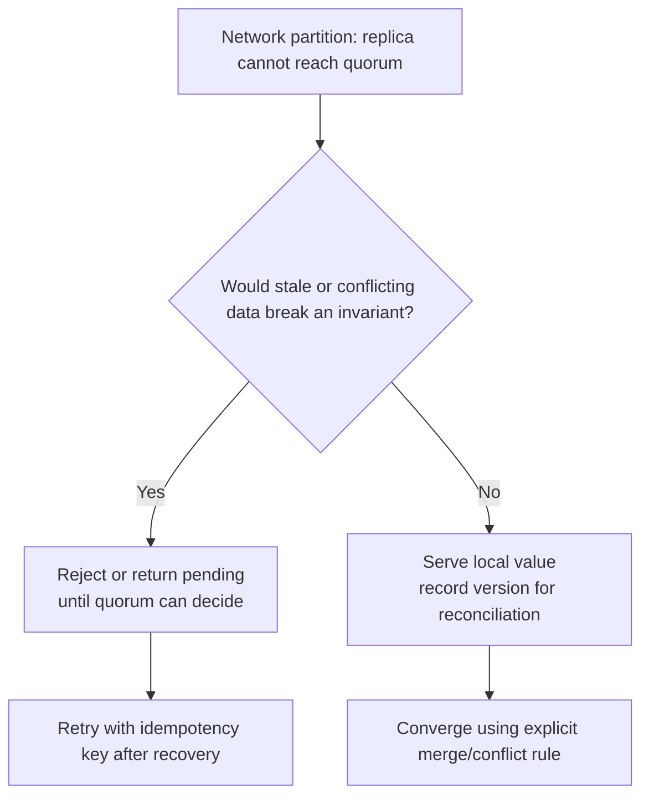

# Design

## Partition-time decision

This is a decision per operation, not a permanent label for an entire application. The reservation write
may be CP while a catalogue read is AP.

## Healthy-path decision

Even without a partition, synchronous replication can improve read-after-write guarantees at added latency.
Asynchronous replication lowers the latency but exposes a replication-lag window. That is the PACELC
"Else" trade-off.
