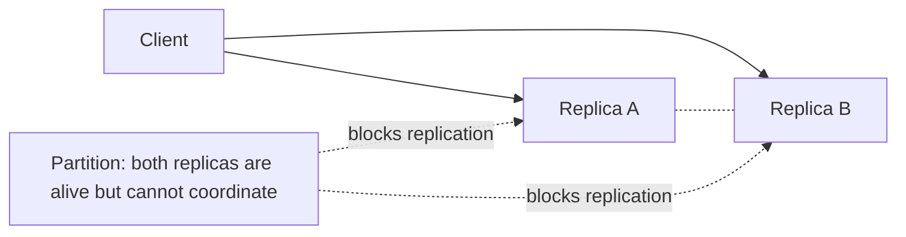

# CAP & PACELC

Two theorems about the consistency/availability/latency trade-offs distributed systems must make. The interview value is mostly in *correcting the common misreadings*.

## CAP theorem

- **C — Consistency:** every read returns the latest write (or fails). A read can't return stale data.
- **A — Availability:** every request gets a non-error response (possibly stale).
- **P — Partition tolerance:** the system keeps working despite the network dropping messages between nodes.

**Misconception:** *"pick any two of C, A, P."*
**Correction:** in a real distributed system, **partitions will happen**, so P is not optional. CAP is really a statement about what you do *during a partition*: **when a partition occurs, you must choose Consistency or Availability.**

### The partition scenario



Write `Balance = 500` lands on A; B never receives it. A read hits B:

- **AP choice** — B returns its stale value (`300`). Available, partition-tolerant, *not* consistent.
- **CP choice** — B refuses/errors. Consistent, partition-tolerant, *not* available.

### CP vs AP philosophy

- **CP** sacrifices availability: *better to say "I don't know" than return wrong data* (banking, config stores like ZooKeeper/etcd).
- **AP** sacrifices immediate consistency: *better to show slightly old data than an error* (shopping carts, social feeds, DNS).

**Why "CA" doesn't really exist:** you can't drop P in a system that spans a network, so real systems are CP or AP. "CA" only describes a single-node database where partitions aren't a thing.

## Make the choice per operation, and define recovery

Do not label an entire product "CP" or "AP" and stop there. A system may require a consistent conditional
write for inventory, while serving an eventually consistent product description during the same incident.
For each operation, state the invariant and the partition-time response:

| Operation | Invariant | Partition-time policy | Recovery |
| --- | --- | --- | --- |
| Reserve the last item | Never reserve it twice | Reject or return pending when quorum is unavailable | Retry with the same idempotency key after quorum returns |
| Read a catalogue description | A brief stale value is acceptable | Serve a local replica | Replicas converge; invalidate stale cache if needed |

An AP policy is not permission to lose conflicts silently. It needs a merge rule, a version or conflict
record, and a way to reconcile after communication resumes. A CP policy is not automatically safe either:
the caller must see a retryable/pending response rather than treating an unavailable quorum as a completed
business action.

### Eventual consistency

The typical AP convergence model: replicas are briefly out of sync, then converge once messages flow again.

```text
just after write:  Node1 = new,  Node2 = old
later:             Node1 = new,  Node2 = new   (converged)
```

The convergence step needs an explicit rule. Last-write-wins is sometimes acceptable for a preference;
it is not automatically safe for a counter, reservation, or transfer. If the business invariant cannot
survive concurrent updates, choose a coordination mechanism for that operation instead of calling it AP.

## PACELC — the practical extension

CAP only describes behavior *during a partition* — but partitions are rare and trade-offs exist even when the system is healthy. Consider replicas in India / US / Europe with no partition:

- Wait for all replicas to confirm → strong consistency, ~300 ms latency.
- Respond immediately, replicate later → ~10 ms latency, weaker consistency.

CAP says nothing about this; PACELC does:

```text
if Partition:  choose Availability  or Consistency      (the CAP part)
Else:          choose Latency       or Consistency      (the new part)
```

### Categories

- **PA/EL** — on partition favor Availability; else favor Latency over consistency (Cassandra, Dynamo-style).
- **PC/EC** — on partition favor Consistency; else favor Consistency over latency (traditional RDBMS, strongly-consistent stores).

**Memory hook:** CAP = the failure-time trade-off only; PACELC = failure-time trade-off **plus** the normal-time latency-vs-consistency trade-off.

## Interview delivery

Start with the data invariant, not the acronym: "During a partition, this reservation cannot safely be
accepted without its quorum, so I choose a CP write and return pending. Reads of the catalogue can use a
local replica because a short stale window is acceptable." Then name the healthy-path choice: synchronous
replication buys a stronger read-after-write guarantee at added latency; asynchronous replication lowers
latency but exposes a replication lag window.

## Further reading

- [AWS: CAP theorem](https://docs.aws.amazon.com/whitepapers/latest/availability-and-beyond-improving-resilience/cap-theorem.html)
- [Google SRE: critical state and CAP](https://sre.google/sre-book/managing-critical-state/)

## Gotchas / Trick questions

1. **"CAP means pick two of three."** No — P is mandatory in a distributed system; CAP is the C-vs-A choice forced *during a partition*.
2. **"CAP Consistency = ACID Consistency."** Different concepts. CAP-C = all nodes see the latest write; ACID-C = a transaction preserves constraints/invariants (`databases/transactions/Transactions.md`).
3. **"My system is CA."** Only meaningful for a single node. Anything spanning a network must tolerate partitions, so it's CP or AP.
4. **"CAP covers all distributed trade-offs."** It only covers partition-time behavior; PACELC adds the healthy-state latency-vs-consistency trade-off.

## Quick recall

**Q. What does CAP actually force you to choose, and when?**
A. Consistency vs Availability, *during a network partition* — because partition tolerance (P) isn't optional in a distributed system.

**Q. CP vs AP in one line each?**
A. CP: refuse/err rather than serve stale data (consistency over availability). AP: serve possibly-stale data rather than err (availability over consistency).

**Q. Why doesn't "CA" exist in practice?**
A. You can't ignore partitions across a network; CA only describes a single non-distributed node.

**Q. What does PACELC add over CAP?**
A. The Else branch: even with no partition, you trade Latency vs Consistency (e.g. wait for all replicas vs respond immediately).

**Q. PA/EL vs PC/EC?**
A. PA/EL favors availability on partition and latency otherwise (Cassandra/Dynamo); PC/EC favors consistency in both cases (classic RDBMS).

**Q. Is CAP Consistency the same as ACID Consistency?**
A. No — CAP-C = nodes agree on the latest write; ACID-C = a transaction keeps constraints valid.
