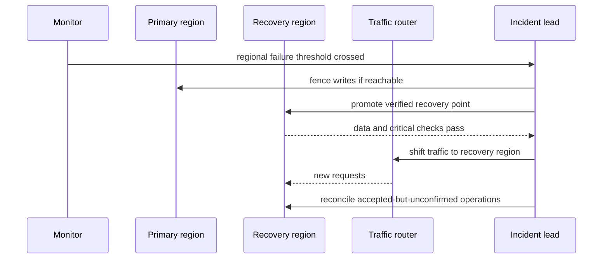

# System Design: Disaster Recovery (DR)

Disaster recovery is the plan for restoring a service and its data after a failure that exceeds one normal
deployment boundary: a region outage, destructive data corruption, or loss of a critical control plane.
High availability inside one zone is not automatically disaster recovery.

Start with a business operation such as accepting an order. Before choosing regions or replicas, agree on
two limits: how long order acceptance may be unavailable, and how much recent committed order data may be
lost. Those limits select the recovery strategy; infrastructure names do not.

## Recovery objectives

| Objective | Question | Example interpretation |
| --- | --- | --- |
| **RTO** — recovery time objective | How long may the operation remain unavailable? | Order acceptance must recover within 15 minutes. |
| **RPO** — recovery point objective | How much committed data may be lost? | At most five minutes of committed orders may be lost. |

RTO is measured from disruption to restored service; RPO is the age of the latest recoverable data. They
are business limits, not promises created by calling a database replica "DR".

## Backup vs Replication

**Misconception:** Replication = Backup.
**Correction:** Replication and backup solve different problems.

### Replication
Replication copies current state. If someone executes `DELETE USERS;`, both the primary and the replica become corrupted because replication copies changes.

Replication:
- Improves availability
- Reduces RPO
- Does NOT replace backups (corruption/accidental deletion replicate)

### Backup
Backup stores historical recoverable states. Backups preserve history.

---

## Choose the smallest strategy that meets both limits

| Strategy | Normal state | Recovery path | Typical trade-off |
| --- | --- | --- | --- |
| Backup and restore | Backups and deployable artifacts exist elsewhere | Recreate infrastructure, restore a chosen recovery point, verify, then route traffic | Lowest cost; highest RTO/RPO |
| Pilot light | Core data replication is running; application fleet is absent or minimal | Scale/deploy application layer, promote or attach recovered data, verify, route traffic | Faster than restore; still depends on control plane and scale-up |
| Warm standby | Smaller functional secondary service and replicated data are running | Promote/scale secondary, shift traffic, reconcile writes | Minutes rather than hours; pays for idle capacity |
| Active-active | Multiple sites serve traffic | Isolate the failed site and continue in surviving site(s) | Lowest interruption target; hardest data consistency and operational model |

These are ranges, not guarantees. A warm standby with untested promotion can miss its RTO; an active-active
system still needs a conflict policy and protection from a bad deployment or corrupted replicated write.

## A recoverable failover flow

Fencing prevents both regions from accepting conflicting writes during an ambiguous failure. Verification
must include a restore drill: can the service start, can it read and write the required data, and does the
measured recovery point meet the RPO? A backup that has never been restored is only an assumption.

## Interview trade-offs and traps

- Replication improves failover and can reduce RPO, but it is not a historical backup: deletion,
  corruption, and bad application writes can replicate too.
- A multi-availability-zone design handles many local failures; cross-region DR is justified only when
  the stated disaster scope includes a regional loss.
- DNS or global routing has propagation and health-detection time. Include it in the RTO rather than
  claiming instant failover.
- Define where writes go during failover and how retries are deduplicated. Otherwise a client retry can
  create an order in both sites.

## Further reading

- [AWS: recovery objectives and DR strategies](https://docs.aws.amazon.com/whitepapers/latest/disaster-recovery-workloads-on-aws/disaster-recovery-options-in-the-cloud.html)

## Quick recall

**Q. RTO vs RPO?**
A. RTO is acceptable restoration time; RPO is acceptable age of lost data.

**Q. Why is replication not a backup?**
A. It can copy accidental deletion or corruption; backups preserve recoverable history.

**Q. When is warm standby useful?**
A. When backup restore cannot meet the RTO, but active-active cost and coordination are unjustified.

**Q. What proves a DR plan works?**
A. A repeated restore/failover drill that measures RTO, RPO, and critical operation correctness.
