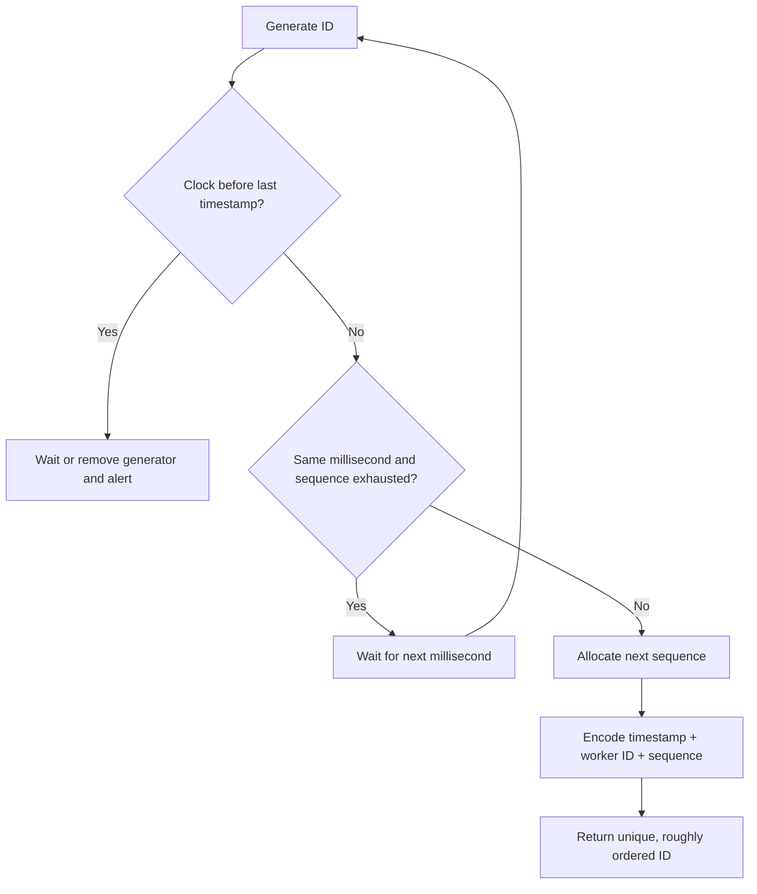

# Distributed ID Generation

## How it works

The interview problem is simple: many machines must generate IDs without collisions, with low latency, and without one database sequence becoming the bottleneck.

Common requirements:

- unique
- numeric
- fits in 64 bits
- roughly time-sortable
- high throughput, e.g. 10K+ IDs/second

Ask one more question before choosing an algorithm: must the identifier be numeric and compact, or is a
128-bit opaque identifier acceptable? A database primary key, a public URL, and a time-ordered event key
often have different answers.

## Common options

| Approach | Good | Problem |
|----------|------|---------|
| Database `AUTO_INCREMENT` | Simple on one database | One DB becomes the coordinator; hard across shards/regions |
| Multi-master increments | Each DB increments by a step, e.g. DB1: 1,3,5 and DB2: 2,4,6 | IDs are not globally time-ordered; adding/removing DBs is awkward |
| UUID | No coordination; easy to generate anywhere | 128-bit, often non-numeric, not naturally ordered unless using time-ordered variants |
| Ticket server | Numeric and simple | Central service can become a SPOF/bottleneck unless replicated carefully |
| Snowflake-style ID | 64-bit, time-sortable, distributed | Requires machine/datacenter ID assignment and clock discipline |
| UUIDv7 | No coordinator, time-ordered 128-bit identifier | Larger than 64-bit; ordering within one millisecond depends on implementation |

For a basic system-design answer, Snowflake-style IDs are the useful pattern to know.

UUIDv7 is a current standards-based alternative when 128 bits are acceptable. It puts a Unix-epoch
millisecond timestamp in the high-order bits and uses the remaining space for uniqueness. It is often the
simple choice when no numeric or tightly compact ID requirement exists.

## Snowflake-style layout

A 64-bit ID is split into fields:

```text
sign | timestamp | datacenter | machine | sequence
 1   |    41     |     5      |    5    |   12
```

Meaning:

- **Sign bit:** usually `0`, reserved.
- **Timestamp:** milliseconds since a custom epoch. This makes newer IDs larger than older IDs.
- **Datacenter ID:** identifies the region/datacenter.
- **Machine ID:** identifies the generator machine inside that datacenter.
- **Sequence:** counter for multiple IDs generated in the same millisecond on the same machine.

With 5 datacenter bits and 5 machine bits:

```text
2^5 = 32 datacenters
2^5 = 32 machines per datacenter
```

With 12 sequence bits:

```text
2^12 = 4096 IDs per machine per millisecond
```

The timestamp field being 41 bits gives roughly 69 years from the custom epoch:

```text
2^41 milliseconds ~= 69 years
```

Use a custom epoch near the product launch time so those 69 years start from a useful date.

## One ID-generation decision

The fields alone do not prevent duplicates. The generator keeps the last timestamp and the sequence for
that millisecond as local state, and refuses an unsafe clock or worker-identity condition.



This works only while the worker ID is unique among live generators. A deployment registry, lease, or
controlled assignment is therefore part of the design, not an implementation detail.

## Gotchas / Trick questions

1. **"Why not just use `AUTO_INCREMENT`?"** It is fine on one DB, but distributed systems need many writers without a single coordination point.
2. **"Why not UUID?"** UUID is great when opacity and no coordination matter, but it may fail numeric/64-bit/sortable requirements.
3. **"What can break Snowflake?"** Clock rollback can generate duplicate or out-of-order IDs if a machine's timestamp moves backward.
4. **"Can you change machine IDs casually?"** No. Datacenter/machine IDs must be assigned carefully; accidental reuse can create collisions.
5. **"Are Snowflake IDs strictly globally ordered?"** They are roughly time-ordered. IDs generated in the same millisecond across machines may not reflect exact real-world order.

## Failure policy is part of the design

The generator must define what happens in the two boundary cases; neither should be silently ignored.

| Condition | Safe default |
| --- | --- |
| Sequence is exhausted within one millisecond | Wait for the next millisecond, then reset the sequence. If the wait violates the latency budget, add generator capacity or revise the ID scheme. |
| Clock moves backward | Refuse/wait until the previous timestamp is reached, or move the generator out of service and alert. Never emit the same timestamp, machine ID, and sequence tuple twice. |
| Machine ID assignment is uncertain | Do not start the generator. Use a durable lease/registry or a deployment-controlled unique assignment. |

The compact interview flow is: validate that the local time is not behind the last timestamp; increment a
per-millisecond sequence; wait on exhaustion; then encode timestamp, worker identity, and sequence. The
timestamp makes IDs time-sortable, while the worker identity and sequence avoid collisions for concurrent
generators.

## Further reading

- [RFC 9562: UUID version 7](https://www.rfc-editor.org/rfc/rfc9562.html)

## Quick recall

**Q. When is DB auto-increment enough?**  
A. Single database or low-scale centralized writes.

**Q. Why does distributed ID generation need coordination?**  
A. Without coordination or unique machine ranges, two machines can emit the same ID.

**Q. What is the Snowflake mental model?**  
A. Timestamp + datacenter ID + machine ID + per-millisecond sequence.

**Q. Why are Snowflake IDs sortable?**  
A. The high-order timestamp bits grow over time.

**Q. Biggest Snowflake operational risk?**  
A. Clock skew/rollback and duplicate machine IDs.
