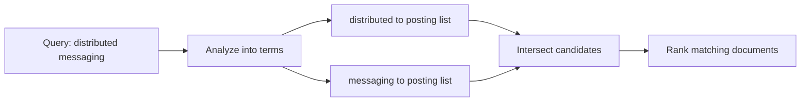
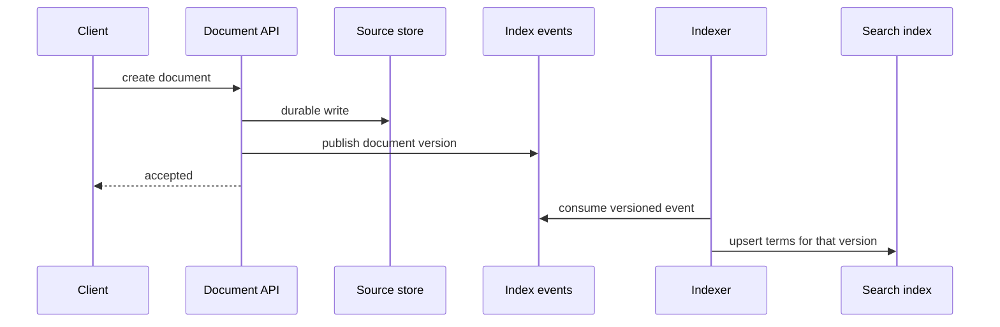

# Inverted Index

An inverted index maps a searchable term to the documents containing it. It makes full-text lookup fast without scanning every document.

## The core model

Suppose the system contains millions of documents. Without an index, searching for `kafka` requires checking the text of every document, which is roughly `O(number of documents)` before accounting for document length.

An ordinary representation is document-to-words:

```text
Doc1 -> kafka, distributed, messaging
Doc2 -> redis, in-memory, database
Doc3 -> kafka, high, throughput
```

An inverted index reverses that lookup. It starts from a term and tells us which documents contain that term:

```text
kafka       -> [Doc1, Doc3]
redis       -> [Doc2]
distributed -> [Doc1]
```

Conceptually:

```java
Map<String, List<DocumentId>> invertedIndex;
```

The document-ID list is called a **posting list**. When a user searches for `kafka`, the system reads the `kafka` posting list and considers `Doc1` and `Doc3`; it does not scan every document.

## Multi-word search

For an AND query such as `kafka distributed`, the search engine fetches both posting lists and returns only document IDs that occur in both lists:

```text
kafka       -> [Doc1, Doc3]
distributed -> [Doc1]
result      -> [Doc1]
```

Posting lists are normally sorted. The engine can therefore intersect two lists with two pointers in `O(m + n)`, where `m` and `n` are the list lengths. It should start with the rarest query term because that creates the smallest candidate set.

For an OR query, the engine takes the union of the posting lists instead. The inverted index finds matching candidates; a separate ranking step decides their display order.

## Building the index

When a new document arrives, the indexing pipeline analyzes its text and adds the document ID to the posting list for each searchable term:

```text
Doc100: "Kafka is awesome"

tokenize + normalize -> [kafka, awesome]
kafka   -> add Doc100
awesome -> add Doc100
```

An analyzer usually applies the following steps before creating index terms:

| Step | Example | Why it matters |
| --- | --- | --- |
| Tokenization | `I love Kafka!` becomes `I`, `love`, `Kafka` | It decides which pieces of text are searchable terms. |
| Normalization | `Kafka` becomes `kafka` | It makes case-insensitive matching consistent. |
| Stop-word policy | `the`, `is`, and `of` can be dropped or specially handled. | It avoids large, low-value posting lists when product semantics allow it. |
| Stemming or lemmatization | `running` and `runs` can become `run`. | It allows related word forms to match. Know the concept, not the algorithm. |

The exact analyzer is a product decision. For example, do not remove stop words when users need literal or phrase-search semantics, because those words may change the meaning of the query.

## Elasticsearch and Lucene

The relationship is:

```text
Your application
      -> Elasticsearch (distributed search engine)
      -> Apache Lucene (search library on each shard)
      -> inverted index
```

When the application indexes a document, Elasticsearch routes it to a shard. Lucene on that shard runs the configured analyzer and adds the resulting terms to its inverted index:

```json
{
  "title": "Kafka Guide",
  "content": "Kafka is a distributed messaging system."
}
```

```text
tokenize + lowercase + configured stop-word/stemming rules

kafka       -> [Doc1]
distributed -> [Doc1]
messaging   -> [Doc1]
system      -> [Doc1]
```

For a search such as `Kafka`, Elasticsearch queries Lucene's inverted index on the relevant shards, combines the matching candidates, and ranks them. It does not scan every document. Elasticsearch adds distribution, shard routing, replication, APIs, and cluster operations. Lucene provides the local indexing and search mechanics on each shard.

The fundamental lookup is a term-to-posting-list map; the search engine then intersects or unions those
lists before ranking the smaller candidate set.



## Phrase queries and ranking

The basic index answers: "Which documents contain these terms?" It does not prove that terms were adjacent, and it does not say which result is best.

- A phrase query such as `"distributed messaging"` additionally needs the position of each term in a document. The engine checks that `distributed` is immediately followed by `messaging`.
- Ranking uses a separate scorer such as BM25, TF-IDF, or an ML model. In an SDE-2 interview, say: **the inverted index produces candidate documents; a ranking algorithm orders them.**

## Freshness is a separate contract

Indexing is usually asynchronous: the source document is accepted first, then an indexer analyzes it and
writes its terms. That makes the write path fast and isolates search work, but a search immediately after a
write can miss the document until indexing finishes. State that freshness window explicitly instead of
claiming read-after-write search consistency.



Use a document version or idempotency key so an older delayed event cannot overwrite newer indexed content.
Monitor queue age and indexing failures; retrying an idempotent upsert is safe, while silently dropping an
event leaves the source store and search results permanently inconsistent.

## Further reading

- [Elasticsearch: match phrase query](https://www.elastic.co/docs/reference/query-languages/query-dsl/query-dsl-match-query-phrase)
- [Apache Lucene: core documentation](https://lucene.apache.org/core/)

## Interview boundary

You should be able to explain:

- How a term maps to its posting list.
- How an AND query intersects posting lists and an OR query unions them.
- How tokenization, normalization, stop words, and stemming affect indexed terms.
- Why phrase queries need term positions.
- Why candidate retrieval and ranking are separate responsibilities.

You can skip the following unless the interviewer asks for search-engine internals:

- Lucene and Elasticsearch implementation details beyond their relationship to the inverted index.
- Posting-list compression and segment merges.
- BM25 or TF-IDF formulas.
- Stemming algorithms and on-disk layouts.

## Quick recall

**Q. What problem does an inverted index solve?**  
A. Fast full-text lookup without scanning every document.

**Q. What is a posting list?**  
A. The sorted list of document IDs containing one term.

**Q. How does an AND query work?**  
A. Intersect the posting lists, preferably beginning with the rarest term.

**Q. Why is it called inverted?**  
A. It reverses the normal document-to-words view into a word-to-documents lookup.

**Q. Does the index rank results?**  
A. No. It retrieves candidates; a separate ranking layer orders them.

**Q. What extra data enables phrase search?**  
A. The positions of each term within each document.

**Q. How do Elasticsearch, Lucene, and the inverted index relate?**
A. Elasticsearch distributes search across shards; Lucene on each shard builds and queries the inverted index.

**Q. Why can a newly created document be absent from search?**
A. An asynchronous indexing pipeline may not have processed its version yet; that is a freshness contract, not a retrieval failure.
