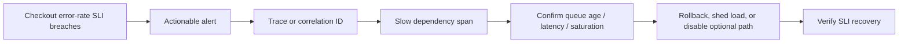

# Design

## From symptom to cause

Logs carry detailed event context, metrics reveal aggregate change, and traces connect one request across
boundaries. The flow starts with user impact so a noisy infrastructure signal does not become an incident
by itself.
