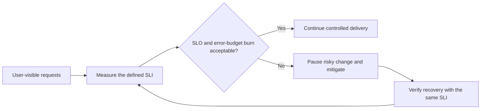

# SLA, SLO, and SLI: Technical Overview

Start with one user operation, not an infrastructure graph. For a checkout API, a useful question is:
"Did a valid request receive a durable result within the promised time?" The answer can become an SLI.
CPU, heap, and database connection counts help diagnose that outcome, but they are not automatically the
user-facing measure of service quality.

## Core Definitions

The relationship between the three forms a continuous chain:
**SLA (Business Promise) → SLO (Target to Meet Promise) → SLI (Measurement to Verify Target)**

### 1. SLA (Service Level Agreement)
An SLA is a formal agreement between a company and its customers. It contains external promises regarding service quality, typically defined by business, legal, and sales teams.
* **Examples:** Guarantees of 99.9% monthly uptime, defined response times, or overall availability.
* **Violations:** Failing to meet an SLA often results in customer compensation, service credits, or contractual penalties.

### 2. SLO (Service Level Objective)
An SLO translates the business promises of the SLA into specific, measurable engineering targets.
* **Examples:**
  * Monthly availability ≥ 99.9%
  * 95% of requests complete within 200ms
  * 99% of incidents acknowledged within 5 minutes

### 3. SLI (Service Level Indicator)
An SLI is the actual quantitative measurement of the service's performance. It is the observed metric used to determine whether the SLO is being achieved.
* **Examples:**
  * Actual measured availability of 99.95%
  * Actual measurement of 96.2% of requests completing within 200ms
* **Common Metrics Used for SLIs:**
  * **Availability:** (e.g., 99.95%)
  * **Latency:** (e.g., 150ms)
  * **Error Rate:** (e.g., 0.02%)
  * **Throughput:** (e.g., 5000 requests/sec)
  * **Incident Response Time:** (e.g., 3 minutes)

## Define an SLI before choosing a target

An SLI needs an explicit numerator, denominator, window, and treatment of ambiguous outcomes. For example:

```text
availability SLI = successful eligible checkout requests
                   / all eligible checkout requests
window           = rolling 28 days
success          = durable accepted result in under 1 second
excluded         = malformed requests rejected before normal processing
```

The exact rule is product-specific. Counting every HTTP 200 as success can hide accepted-but-never-finished
work; counting caller cancellations as server failure can incorrectly burn the budget. Pick the definition
that matches what the user experiences, then keep it stable enough to compare periods.

## Error budget closes the loop

For a 99.9% availability SLO, the allowed failure fraction is 0.1%. That allowance is the **error budget**.
It is not a target to waste; it is a decision input. If the service is spending budget too quickly, pause
risky releases and prioritise reliability work. If it has budget remaining, controlled changes are
reasonable. This turns "be reliable" into a repeatable engineering decision.



The loop starts with a pre-defined SLI. An alert on high CPU can help diagnose a breach, but it cannot by
itself decide whether to halt a release because it does not say whether users received the promised outcome.

## Choose the SLO from the user promise

| User promise | Useful SLI | Action when budget burns too fast |
| --- | --- | --- |
| A command creates one durable outcome | Eligible successful commands / eligible commands | Pause risky releases; mitigate errors and verify the durable outcome. |
| A page is responsive | Requests below the chosen latency threshold / eligible requests | Protect the slow dependency, shed non-critical work, or add capacity. |
| Background work finishes on time | Jobs completed before deadline / eligible jobs | Scale workers, reduce intake, or surface a delayed status. |

One service can need more than one SLO, but each should protect a distinct user promise. Do not combine a
fast but incorrect response with a correct result into one vague "health" metric.

---

## Real-World Scenarios

### Scenario 1: Availability
* **SLA:** "We promise 99.9% monthly availability."
* **SLO:** Availability ≥ 99.9%.
* **SLI:** Actual Availability = 99.95%.
* **Result:** 99.95% > 99.9%, so the SLO is achieved and the SLA is satisfied.

**Availability Calculation Example (SDE2 Interview Context):**
For an SLO of 99.9% uptime over a standard 30-day month:
* **Total minutes:** 30 days × 24 hours × 60 mins = 43,200 minutes.
* **Allowed downtime:** 0.1% of 43,200 = 43.2 minutes.
* *Takeaway:* To meet the 99.9% SLO, the service can only experience ~43 minutes of downtime per month.

### Scenario 2: Response Time
* **SLA:** "Users should receive fast responses."
* **SLO:** 95% of requests complete within 200ms.
* **SLI:** 92% of requests completed within 200ms.
* **Result:** 92% < 95%, meaning the SLO is violated, leading to a potential SLA violation.

---

## Common Misconceptions & Clarifications

1. **Misconception:** SLI and SLO are interchangeable, or SLO is the metric itself.
   * **Correction:** An SLI is the *measured metric value* (e.g., actual uptime = 99.95%). An SLO is the *target threshold* for that metric (e.g., target uptime = 99.9%).
2. **Misconception:** SLA, SLO, and SLI are independent, unrelated concepts.
   * **Correction:** They depend on one another. The SLA dictates the business promise, which defines the target SLO, which is monitored using measured SLIs.

## Further reading

- [Google SRE: service level objectives](https://sre.google/sre-book/service-level-objectives/)

## Quick recall

**Q. SLI, SLO, and SLA in one line each?**
A. SLI is the measured indicator, SLO its target, and SLA the external agreement with consequences.

**Q. Why is CPU not a good availability SLI?**
A. It measures a component condition, not whether users received the promised outcome.

**Q. What is an error budget?**
A. The fraction of SLO-allowed failure remaining in its measurement window.

**Q. Why define an SLI before an SLO?**
A. A target is meaningless until success, denominator, window, and exclusions are unambiguous.
