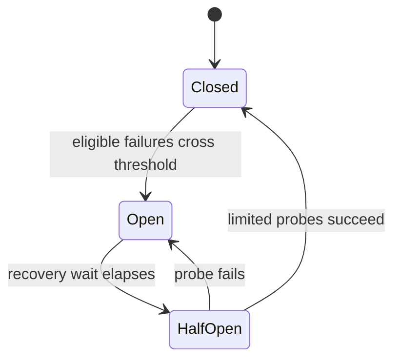

# Design

## Protected downstream call

Each allowed call has a bounded timeout. Retrying is only safe when the operation is idempotent or its
outcome can be reconciled. An open circuit fails fast; a bulkhead separately limits the resources this
dependency can consume.
