# Circuit Breaker and Resiliency Patterns

## Start with a bounded remote call

An API calls a downstream dependency to enrich a response. The simplest path waits indefinitely and retries
every error; under a slow dependency, waiting requests consume threads and connections until the caller also
fails. Resilience patterns make the dependency boundary explicit: bound one attempt, retry only safe
transient failures, isolate resources, and stop sending known-bad traffic.

## Circuit Breaker State Machine
The circuit breaker operates in three primary states:

1. **Closed**: Normal state. All traffic flows normally to the dependency. If failures (e.g., within a moving window or consecutive failures) exceed the configured threshold, the circuit trips and transitions to the Open state.
2. **Open**: The downstream service is not called. Any request immediately returns an error. This prevents wasted network calls, stops threads from waiting, and gives the downstream dependency time to recover. After a configured timeout period, the state transitions to Half-Open.
3. **Half-Open**: The circuit breaker allows a limited number of "probe" or "test" requests to pass through to test if the dependency has recovered. 
   - *Correct behavior*: Send a small number of requests (e.g., 5). If they succeed, transition back to Closed. If they fail, transition back to Open.
   - *Common misconception*: Reopening all traffic immediately after recovery. Doing so can flood the recovering service and cause it to crash again.

```mermaid
stateDiagram-v2
    [*] --> Closed
    Closed --> Open: eligible failures cross threshold
    Open --> HalfOpen: recovery delay elapsed
    HalfOpen --> Closed: limited probes succeed
    HalfOpen --> Open: probe fails
    Open: fail fast; do not call dependency
```



The threshold should count only failures that represent dependency health. Do not open a breaker for
validation failures caused by the caller, and do not treat one expected business rejection as an outage.

## Comparing Resiliency Patterns

### Circuit Breaker vs. Timeout
- **Timeout**: Every request attempts the network call, waits for a response up to a specified limit, and fails if the time limit is exceeded. Resources (threads, network connections) are still consumed while waiting.
- **Circuit Breaker**: Knows immediately if a dependency is unhealthy and fails fast without making a network call or consuming waiting resources.

### Circuit Breaker vs. Retry
- **Retry**: Attempts to recover from transient failures by re-sending the request.
- **Circuit Breaker**: Prevents endless attempts and protects the system by stopping requests when failures become systemic.
- *How they work together*: They solve different problems and are highly complementary. Retry attempts recovery on the first few failures. If failures persist, the Circuit Breaker records them, exceeds its threshold, and opens the circuit to prevent further useless retries.

### Circuit Breaker vs. Bulkhead
- **Circuit Breaker**: Protects the system against unhealthy dependencies by failing fast.
- **Bulkhead**: Protects against resource exhaustion by isolating resources (e.g., separating thread pools for different downstream services). If one service hangs, only its dedicated pool is exhausted, keeping other services operational.

## External-call timeout boundary

A timeout does **not** prove that the vendor did no work. The request may have reached the vendor, the vendor may have created a verification, and only the response may have been lost. Treat a timeout as an **unknown outcome**, not as an automatic failure or an automatic retry.

At the boundary, translate transport/client exceptions into a small internal outcome model. The concrete Java exception differs by client: a `CompletableFuture#get` can throw `TimeoutException`; HTTP clients may expose `SocketTimeoutException`, a wrapped `IOException`, or a client-specific exception. Do not make the business decision by matching one exception class alone.

```text
downstream call times out
  -> record operation as PENDING_UNKNOWN with correlation ID and idempotency key
  -> do not blindly repeat a non-idempotent request
  -> if the dependency supports lookup: query status using the same correlation ID
  -> otherwise retry only when its contract guarantees idempotency
  -> reconcile asynchronously or move to review after the retry/time budget
```

The request must carry an idempotency key or correlation ID that is durably recorded before the call. It lets a retry, callback, status lookup, and support investigation refer to the same operation. For a read-only or explicitly idempotent request, a bounded retry with exponential backoff and jitter can be reasonable. For a create/charge/start request without that guarantee, retrying after a timeout can create duplicates.

| Outcome at the boundary | Default handling |
| --- | --- |
| Validation or known permanent dependency error | Map to a stable client-visible failure; do not retry. |
| Connect/read timeout | Mark outcome unknown; resolve through status lookup, idempotent retry, or reconciliation. |
| Transient 5xx / overload | Bounded retry only when safe; then circuit-break or queue for later processing. |
| Circuit open | Fail fast or return a pending/degraded state; do not wait for another network timeout. |

The API response should reflect what is known. Returning a final failure immediately after an unknown outcome
is misleading. A `PENDING` response plus later callback/polling completion is often the correct product
behavior.

## Fallback Responses
Instead of returning generic errors when the circuit is open, applications should use fallback mechanisms:
- **Product Catalog**: Return cached data instead of failing.
- **Recommendation System**: Show popular or default recommendations.
- **Payment Gateway**: Switch to a secondary payment provider.

## Real Production Resilience Stack
In practice, production systems rarely rely on a single pattern. A typical resilience flow combines several mechanisms, such as:
1. **Timeout** (e.g., 2 seconds max wait)
2. **Retry** (e.g., 3 attempts for transient issues)
3. **Circuit Breaker** (monitors failure rates and stops traffic if necessary)
4. **Fallback** (graceful degradation if the circuit is open or retries are exhausted)

*Note on Implementation: In Java/Spring Boot ecosystems, libraries like Resilience4j are commonly used to implement these patterns.*

## Composition and observability

Use one timeout budget for the whole user request and a smaller timeout per downstream attempt. A retry
must consume that budget; otherwise retries can outlive the caller and amplify an overload. The circuit
breaker observes the final outcomes of eligible attempts and must not retry a circuit-open result. A
bulkhead limits how much one dependency can consume, so its exhaustion degrades that path rather than the
whole application.

Measure timeout rate, retry count, circuit state changes, fallback rate, and bulkhead saturation. These
signals prove whether the fallback is protecting users or merely hiding a persistent dependency failure.

## Further reading

- [Microsoft: circuit breaker pattern](https://learn.microsoft.com/en-us/azure/architecture/patterns/circuit-breaker)
- [Microsoft: retry storm antipattern](https://learn.microsoft.com/en-us/azure/architecture/antipatterns/retry-storm/)

## Quick recall

**Q. Timeout vs circuit breaker?**
A. A timeout bounds one attempt; an open circuit breaker fails future attempts fast after a failure pattern.

**Q. When is retry safe?**
A. For bounded transient failures only when the operation is read-only or protected by a durable idempotency contract.

**Q. Why half-open?**
A. It probes recovery with limited traffic instead of immediately flooding a recovering dependency.

**Q. What does a bulkhead protect?**
A. Unrelated work from resource exhaustion caused by one slow or failing dependency.
