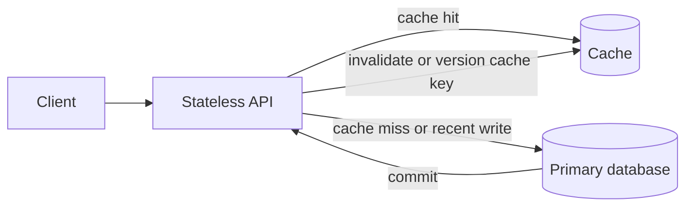

# Design

## Design drill: scale an account API without skipping the trigger

An account API currently uses one application process and one primary database. Reads are ten times more
common than updates; callers tolerate up to one minute of staleness for profile reads but not immediately
after changing a profile. Request latency rises because repeated reads saturate the primary.

Use cache-aside for the stale-tolerant read. Route the read-after-write path to the primary, or return the
fresh value from the completed write. The cache lowers primary read load; it is not the source of truth.

## Next design question

If primary writes, storage, or a hot partition becomes the limiter, state the shard key before adding
databases. Explain how a request reaches the right shard and how each shard remains recoverable through
replication and promotion.

## Quick recall

**Q. Why is the cache lookup not enough after a profile update?**

**A.** The cache may still contain the old value; the design needs invalidation/versioning and a
read-after-write policy.
