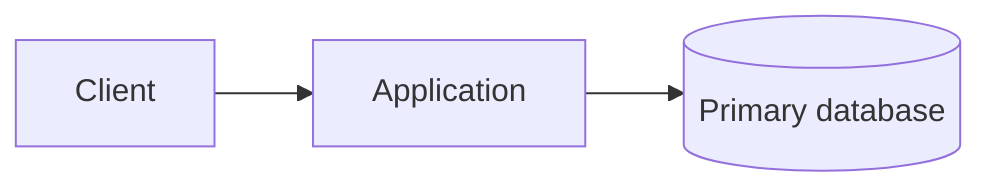
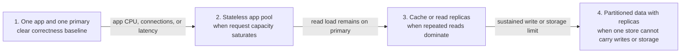
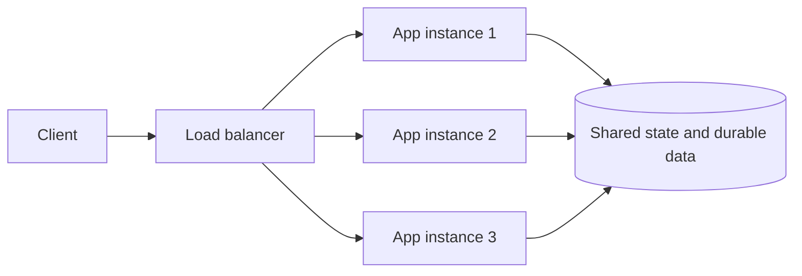
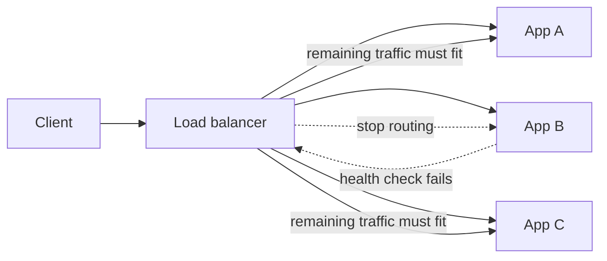

# Scalability, Redundancy, and Storage Access Patterns

Scalability is the ability to keep a useful latency and throughput as load grows. It is not a list of
components to add. Start with one request, find the resource that limits that request, then make the
smallest change that removes that limit without breaking its correctness requirement.

This page uses a simple API that reads and updates an account record. The same reasoning applies to a
feed, booking service, search system, or message pipeline.

## Start with a working baseline

At small scale, one application and one primary database are often the right answer:

For `GET /accounts/{id}`, the application reads the database and returns the record. For an update, it
validates the request, commits the durable change, then returns success. This baseline is valuable because
it gives clear transactions, easy debugging, and one authoritative place to inspect data.

Add a component only when a measured pressure justifies it. More application instances do not help when a
database lock, slow query, or connection limit is the real bottleneck.

## A scale-out design evolves by pressure, not by a fixed checklist

The order below is a reasoning aid, not a mandatory architecture. Stop as soon as the measured bottleneck
is removed. For example, a write-heavy service may need partitioning before it needs a cache.

Each move adds a boundary that must be explained. A load balancer requires replaceable request handlers;
a cache or replica introduces stale-read rules; partitioning introduces routing, skew, and migration.

| Observed pressure | Smallest useful change | New question introduced |
|---|---|---|
| App CPU, connections, or request latency saturate | Run stateless application instances behind a load balancer | Where does session or workflow state live? |
| Repeated reads dominate primary-database load | Add an index, cache, or read replica depending on the access pattern | How stale may a response be? |
| Slow or bursty work holds request threads | Persist work in a queue and run workers | When is the request accepted versus completed? |
| One data store reaches write or storage limits | Partition or shard by a stable, high-cardinality key | How are hot keys, migrations, and cross-shard queries handled? |
| A regional outage or distance breaks the product target | Add regional routing and replicated data | Which writes may be lost or stale after failover? |

This pressure-first sequence is the main interview signal. The goal is not to reach the last row in every
design.

## Vertical and horizontal scaling

**Vertical scaling** gives one machine more CPU, memory, IOPS, or network capacity. It is usually the
lowest-complexity first move: application code and data placement need not change. Its limits are cost,
hardware ceilings, and the fact that one machine is still a failure domain. Some changes can also require
a restart or a brief capacity reduction while they happen.

**Horizontal scaling** adds peer instances and distributes work. It increases capacity incrementally and
can tolerate an instance loss, but only after the service has no hidden per-instance ownership.

An autoscaler needs headroom and a useful signal. CPU can work for CPU-bound APIs; queue age or lag is
usually more meaningful for asynchronous workers; latency and connection saturation can expose pressure
that average CPU hides. Scaling upstream before its downstream dependency has capacity can make an outage
worse.

### Stateless does not mean state-free

An app tier is stateless when any healthy instance can serve the next request. User sessions, idempotency
records, jobs, and durable business state still exist; they live in a shared store or travel in a signed
token rather than only in one process's memory.

Sticky sessions can postpone this work by pinning a user to one instance. They make deploys, scale-in, and
instance failure harder: losing that instance loses the local session. Prefer a shared session store or a
stateless token when the product must scale or survive instance replacement.

## Scale reads and writes differently

A database is normally the source of truth. Decide from the access pattern before changing the data layer.

| Need | Appropriate move | Boundary to state in an interview |
|---|---|---|
| Find a small subset of rows quickly | Add an index matching the query | Indexes speed reads but add write and storage cost. |
| Serve repeated, stale-tolerant reads | Cache-aside with expiry and invalidation/versioning | Cache is not authoritative; define a stale window and stampede protection. |
| Read-heavy durable data | Read replicas | Replication lag can violate read-after-write; route that read to primary or wait for a consistency condition. |
| Smooth a burst of non-immediate work | Durable queue and workers | A queue changes the acknowledgement contract; consumers must be idempotent. |
| Exceed one database's write or storage capacity | Shard by a stable, high-cardinality key | A shard key selects the machine; an index finds a row inside it. |

Sharding is not simply "more databases." It distributes different data. A shard key should be stable,
present in common requests, and spread load evenly. A low-cardinality or skewed key creates a hot shard;
a query without the shard key may require a lookup service or an expensive scatter-gather query. See
[Sharding, Data Partitioning & Consistent Hashing](/databases/sharding/) for the full routing discussion.

Use a queue only when completion can be asynchronous or workers need to absorb a short burst. Do not queue
a freshness-sensitive decision merely to reduce write QPS. Persist the work record before it is accepted,
give the caller a status resource or callback, and acknowledge queue delivery only after the worker's
durable/idempotent effect succeeds.

## Capacity is not availability

**Scalability** asks whether the system handles more work. **Redundancy** asks whether another component
can take over when one fails. They are related but independent:

| Design | More capacity? | Survives one node failure? | Why |
|---|---:|---:|---|
| Three stateless app instances behind a load balancer | Yes | Usually | Peers can serve the same requests if enough capacity remains. |
| Three independent database shards with no replicas | Yes | No for the failed shard's data | Each node owns different data; another shard cannot replace it. |
| One primary database with a replica | Read capacity may improve | Potentially | The replica is a failover candidate, subject to replication and promotion semantics. |

This is **active redundancy**: all app instances can serve traffic now and still replace a peer later. An
idle standby is only one form of redundancy. A real sharded data layer normally gives each shard its own
replicas, backups, and tested promotion/recovery path.

### Redundancy needs spare capacity and a failure path

The fleet survives App B only when the load balancer detects the failure and A plus C have headroom.
Three busy instances are not automatically highly available if losing one overloads the other two.

## Multi-region is a data decision, not only traffic routing

Global routing can send a client to a nearby healthy region, but failover is useful only if the receiving
region has compatible software and enough correct data to serve the user. A compact design conversation is:

1. Start in one region.
2. Add a second region for a measured latency target, disaster-recovery objective, or regulatory need.
3. Choose active-passive when one writable authority is simpler and a failover delay is acceptable.
4. Choose active-active only when both regions must accept writes; then define ownership, conflict handling,
   and cross-region replication lag.

Regional caches also start cold after a failover. A credible recovery plan names the traffic cutover,
replication state, cache/origin protection, and the product behavior while recent data is unavailable or
stale. DNS failover alone is not disaster recovery.

## Sequential and random access: why the access pattern still matters

Storage has a throughput/latency distinction. **Sequential access** reads or appends nearby bytes in order;
**random access** jumps between unrelated locations. Mechanical disks pay especially heavily for random
seeks, but sequential I/O, batching, and operating-system page cache remain valuable on modern storage too.

| Workload | Dominant pattern | Design consequence |
|---|---|---|
| Append-only event or log segment | Sequential append | Batch writes and read contiguous chunks when possible. |
| Video/object transfer | Sequential read | Stream ranges and use a CDN/object store. |
| Lookup by account ID | Targeted/random read | Use an index and keep hot pages/records in memory. |
| Full table scan | Mostly sequential page reads | Can be reasonable for analytics, dangerous on a hot transactional path. |

This does **not** mean random lookups are wrong. Online systems need them constantly. The practical goal is
to avoid unnecessary disk-backed random I/O: use an index to reduce pages touched, a database buffer pool
to retain hot pages, and an application cache only when its consistency cost is justified. Kafka's
append-oriented log and batched transfer are a useful example of turning many small writes into efficient
sequential work; they do not make every workload append-only.

## A concise interview delivery

For any design, begin with the smallest synchronous path and state the dominant load shape: read-heavy,
write-heavy, bursty, locality-sensitive, or contention-heavy. Estimate only the number that changes the
choice. Then add one component at a time and say both its benefit and its new failure mode:

> "The API tier is stateless behind a load balancer because request concurrency is the first bottleneck.
> The primary database remains authoritative. Repeated profile reads are stale-tolerant, so cache-aside
> removes most of them from the primary. If writes or storage exceed one database, I would shard by account
> ID and give each shard replicas; that improves capacity but makes cross-shard queries and migration more
> expensive."

That explanation is stronger than listing load balancing, cache, replicas, and shards without a trigger.

## Further reading

- [Microsoft: architecture strategies for reliable scaling](https://learn.microsoft.com/en-us/azure/well-architected/reliability/scaling)
- [Apache Kafka design: persistence and efficiency](https://kafka.apache.org/41/design/design/)
- [Hello Interview: core system-design patterns](https://www.hellointerview.com/learn/system-design/in-a-hurry/patterns)

## Quick recall

**Q. Vertical versus horizontal scaling?**

**A.** Vertical adds capacity to one resource; horizontal adds peer resources and needs distributed-state
discipline.

**Q. Why must a horizontally scaled app tier be stateless?**

**A.** Any healthy instance must serve a request, so scale-out, scale-in, and instance failure do not depend
on local session or workflow state.

**Q. Does sharding create redundancy?**

**A.** No. Sharding splits capacity and data; replication and a failover plan make each shard resilient.

**Q. What is the first question before adding a queue?**

**A.** Whether the caller needs a completed result now or can receive durable acceptance and observe
completion later.

**Q. Why are cache and replica reads not automatically interchangeable?**

**A.** Both can be stale. The design must state the tolerated staleness and route read-after-write paths
accordingly.

**Q. Why does sequential I/O matter to HLD?**

**A.** It explains why logs, batches, and streaming can offer high throughput, while indexed lookups and
caches reduce expensive random I/O.
