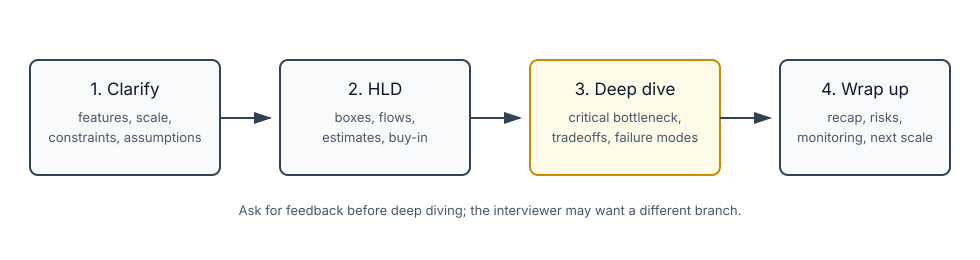

# System Design Interview Framework

## How it works

A system design interview is not a trivia round. The interviewer is watching how you handle an ambiguous problem with another engineer in the room.

Strong signal:

- You ask clarifying questions.
- You state assumptions.
- You start broad, then deepen.
- You explain tradeoffs.
- You adapt when the interviewer redirects.
- You leave time for bottlenecks, failures, and operations.

Weak signal:

- You jump into a memorized architecture.
- You over-engineer before understanding scale.
- You go deep on one component too early.
- You silently think for long stretches.
- You defend the first design as if it is perfect.

## The 4-step flow



### Step 1: Clarify scope

Spend the first few minutes narrowing the problem:

- What are the must-have features?
- Is this web, mobile, backend API, or all of them?
- What is the scale: DAU, QPS, data size, regions?
- What is the read/write ratio?
- What consistency or latency expectations matter?
- Are media files, search, notifications, ranking, payments, or external vendors involved?
- Can we use existing infrastructure such as object storage, CDN, queue, gateway, or managed DB?

Do not skip this. If you design the wrong product, the rest of the answer is noise.

Example for news feed:

```text
Candidate: Is feed chronological or ranked?
Interviewer: Chronological is fine.

Candidate: Text only or media too?
Interviewer: Images and videos.

Candidate: Scale?
Interviewer: 10M DAU, max 5000 friends per user.
```

Those answers decide whether you talk about media storage, CDN, fanout, ranking, and celebrity users.

### Step 2: Propose high-level design

Draw the first usable architecture:

```text
Clients
  ↓
API / Gateway
  ↓
Services
  ↓
Database / Cache / Queue / Object Storage
```

Then ask for buy-in:

```text
"At this level, does this match the scope you want me to solve?"
```

This is important because the interviewer may want you to focus on one branch: storage, caching, consistency, feed generation, rate limiting, failure handling, or capacity.

Use concrete flows, not just boxes. For a feed system:

- Publishing flow: user writes post → store post → fan out or enqueue feed update.
- Retrieval flow: user opens feed → read timeline/cache → hydrate post/user/media details.

### API and schema timing

Do not always start with API endpoints and database schema. For broad questions like "Design YouTube" or "Design Google Search," API/schema is too low-level early. For narrower backend problems like URL shortener, rate limiter, parking reservation, or chat message send/read, a small API sketch helps anchor the design.

Good rule:

```text
Broad product HLD → flows and components first
Narrow backend service → API + core data model can appear early
```

Ask the interviewer:

```text
"Would you like me to define the API/data model now, or stay at component level first?"
```

### Step 3: Deep dive on the critical parts

Pick the components that carry the design risk. Senior interviews usually care about bottlenecks and tradeoffs, not every table column.

Good deep dives:

- URL shortener: ID generation, collision handling, read-heavy cache, DB sharding.
- Chat: connection management, online/offline state, message delivery, ordering.
- News feed: fanout-on-write vs fanout-on-read, celebrity users, cache strategy.
- Rate limiter: algorithm choice, Redis atomicity, distributed counters, 429 behavior.
- KYC platform: vendor orchestration, idempotency, state machine, retries, data residency.

Bad deep dives:

- Spending 15 minutes on exact CSS/media rendering.
- Designing a perfect ranking algorithm when the interview is about scalable feed delivery.
- Writing every API field before agreeing on the architecture.

### Step 4: Wrap up

End by showing critical thinking:

- Recap the design in 30-60 seconds.
- Name bottlenecks.
- Name failure modes.
- Mention monitoring and rollout.
- Explain the next scale step.
- Mention what you would refine with more time.

Good closing:

```text
"The current design supports the required scale by caching reads, using a queue for async fanout, and storing media in object storage behind CDN. The risks are hot users, queue lag, and cache invalidation. I would monitor feed publish latency, queue depth, cache hit rate, DB QPS, and p99 feed read latency."
```

## Time allocation

For a 45-minute round:

| Phase | Time |
|-------|------|
| Clarify scope | 3-8 min |
| High-level design | 10-15 min |
| Deep dive | 15-20 min |
| Wrap-up | 3-5 min |

Adjust if the interviewer steers you. Some interviewers want a broad architecture; some want a narrow deep dive.

## Interview checklist

- Clarify requirements before drawing.
- Write assumptions where both of you can see them.
- Start with a simple design, then scale it.
- Use back-of-envelope estimates when scale affects the architecture.
- Add API/schema only when it clarifies the design at the right level.
- Explain tradeoffs, not just choices.
- Ask for feedback after the high-level design.
- Deep dive into the risky components first.
- Discuss failures, retries, monitoring, and rollout before time ends.

## Gotchas / Trick questions

1. **"There is one correct design."** No. There are designs that fit or do not fit stated requirements.
2. **"More components means senior design."** No. Senior design is choosing the smallest architecture that meets scale, reliability, and operational needs.
3. **"I should answer immediately to show confidence."** No. Clarifying questions show judgment.
4. **"API schema always comes first."** Not for broad HLD. Start with flows and components; add API/schema only if the problem needs it.
5. **"Once I draw the design, I am done."** No. The wrap-up is where you show bottleneck awareness and production thinking.

## Quick recall

**Q. First step in an HLD interview?**  
A. Clarify scope, features, scale, and assumptions before proposing architecture.

**Q. What is the high-level design phase for?**  
A. Get interviewer buy-in on the main boxes and flows before deep-diving.

**Q. How do you choose what to deep dive?**  
A. Pick the highest-risk or most scale-sensitive parts of the design.

**Q. What should the wrap-up include?**  
A. Recap, bottlenecks, failure modes, monitoring, rollout, and next scale step.

**Q. Biggest red flag?**  
A. Jumping to a memorized solution without understanding requirements.

**Q. Senior signal?**  
A. Tradeoff reasoning: why this component now, what it costs, and what breaks next.
