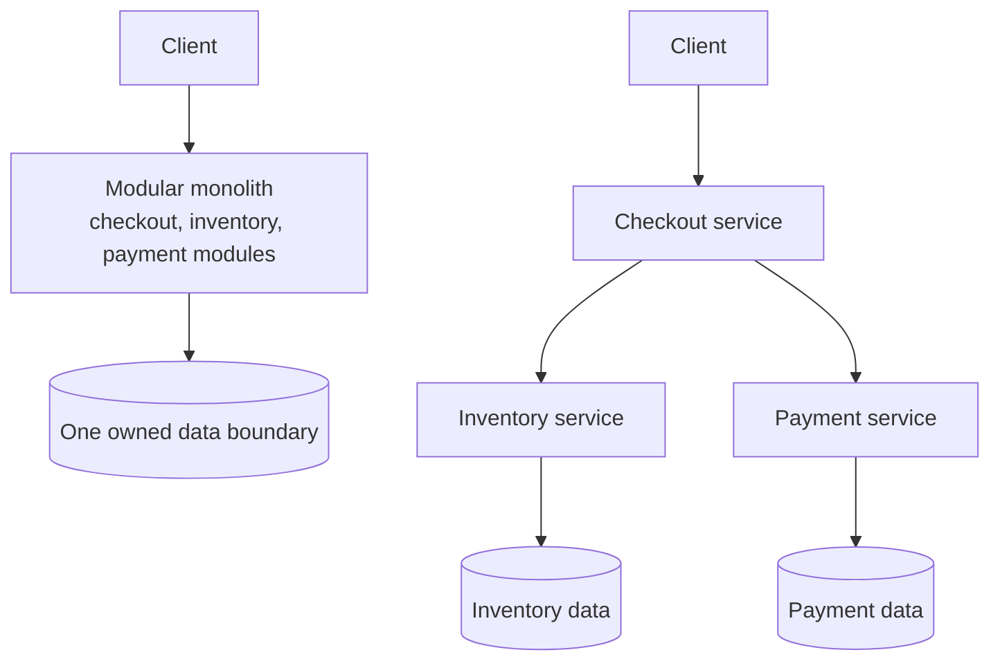

# Monoliths vs Microservices

The senior-interview framing is not "which is better?" It is: what pressure makes a distributed boundary
worth its cost? Microservices trade local simplicity for independent scaling, deployment, and team
ownership. That trade is valuable only when those needs are real and the team can operate the distributed
system it creates.

## Start from one change and one request path

Assume a team changes checkout behavior. In a monolith, the request and change remain in one deployable
unit and can use one local transaction. After extraction, that same request becomes a network path with
timeouts, contracts, data ownership, and partial-failure states. This is the first comparison to make:

Neither drawing is automatically more scalable or reliable. The second earns its extra calls only when a
boundary has independent load, deployment, ownership, or failure-isolation needs.

## Monolith

One deployable application where all business functionality lives together — one codebase, one runtime, one deployment, usually one database. `User → Monolith → DB`.

**Why monoliths win early:**
- **Easy development** — one repo, clone-and-run, no service-to-service plumbing.
- **Easy debugging** — a single stack trace `Controller → Service → DAO → DB`.
- **Fast communication** — in-process method calls (`orderService.placeOrder()`), no HTTP / serialization / network.
- **Easy ACID** — `createOrder() + deductInventory() + makePayment()` in one local DB transaction.

**Where it hurts at scale:**
- **Huge codebase** — 500 devs on 5M lines is hard to reason about.
- **Deployment coupling** — changing one module redeploys the whole app.
- **Coarse scaling** — if Search needs 100× capacity, you scale *every* module ×10, not just Search.
- **Technology lock-in** — hard to add a Python service to a Java monolith.
- **Single failure domain** — a Notification memory leak can crash Orders, Payments, everything.

## Modular monolith — the underrated middle

One codebase / one deployment / usually one DB, but **internally divided into modules** that talk only through each other's **public APIs/interfaces** — never reaching into another module's internal classes. Think *"monolith + good boundaries"* rather than *"monolith + spaghetti."*

**Recommended evolution:** `Monolith → Modular Monolith → Microservices`, *not* `Monolith → 100 microservices`. The reason is decisive: **if your modules are messy inside one process, they won't magically become clean microservices** — you'll just distribute the mess.

## When an extraction earns the distributed cost

Do not split a module because it is large or because the architecture style is fashionable. Look for a
repeatable pressure and a boundary that can own its data and contract:

| Trigger | Extraction may help | First check |
| --- | --- | --- |
| One module has materially different traffic or compute needs | Scale that workload without scaling the whole application | Is the bottleneck actually the shared database? |
| A team needs an independent release cadence | Deploy its change without coordinating unrelated releases | Is its API and data ownership stable enough? |
| A failure should not affect another path | Bound timeouts and fallback around that dependency | Does the request still need its result synchronously? |
| A domain has clear rules and owned data | Enforce a stable public contract at that boundary | Can other modules stop reading its tables directly? |

If these answers are not clear, a modular monolith is usually the smaller correct design. It provides real
module boundaries while preserving local calls, local transactions, and simpler debugging.

## Extract a boundary, not a database table

An extraction should begin by routing one narrow responsibility through a stable module API. Stop new code
from reaching into that module's internal data. Then choose whether to keep it in-process, deploy it
separately, and eventually transfer data ownership. Running two services that still update the same tables
does not create independence; it creates a shared-database distributed monolith.

For an asynchronous boundary, publish a durable domain event after the local state change and make the
consumer idempotent. For a synchronous boundary, define a timeout, an error contract, and a fallback or
explicit failure result. Do not replace every method call with an event; a caller that needs an immediate
payment or authorization result still needs a synchronous decision.

## Microservices

Independent services, each with its own deployment, runtime, often its own database and team. `Client → Order Svc → Payment Svc → Inventory Svc → …` with network calls between.

**What you gain:**
- **Independent deployment** — Payment team ships v12 without touching Order/Inventory.
- **Independent scaling** — scale only the Search service when Search spikes.
- **Fault isolation** — Notification can die while Orders/Payments/Inventory keep serving.
- **Team autonomy** — Team A owns User, Team B owns Payment, etc.
- **Technology flexibility** — Payment in Java, Recommendation in Python, chat in Go.

**What you pay (distributed-systems problems you didn't have before):**
- **Network failures** — an in-process call becomes an HTTP call that can time out, drop, or partition.
- **Distributed transactions** — one local ACID transaction becomes a cross-DB problem → 2PC / 3PC / **Saga** (`databases/distributed_transactions/DistributedTransactions.md`).
- **Service discovery** — how does Order find Payment?
- **Observability** — logs spread across services → need distributed tracing, correlation IDs, centralized logging.
- **Data consistency** — multiple databases make consistency harder.

## High cohesion, loose coupling

- **High cohesion** — everything *inside* a service belongs together. Good: a Payment service owning card/UPI/refund/settlement. Bad: a Payment service that also does user login, email, and product search.
- **Loose coupling** — services shouldn't heavily depend on each other. A long synchronous chain `Order → Payment → Inventory → User → Notification → Analytics` means one failure cascades to all.

**Misconception:** *loose coupling = event-driven architecture, and direct calls should always be avoided.*
**Correction:** loose coupling is the **goal**; event-driven architecture is **one tool** for it. Publishing `OrderCreated` to Kafka — where Order doesn't know who consumes it or how many consumers exist — is looser coupling. But **direct synchronous calls are not bad**: at checkout, `Order → Payment` with a customer waiting needs an immediate success/failure, so a synchronous call is the right choice.

**Interview answer:** use **synchronous** when an immediate response is required; use **asynchronous/event-driven** when eventual consistency is acceptable and you want to decouple services. Real systems use both — sync for `Order → Payment`, async for `OrderCreated → {email, analytics, recommendation, fraud}`.

## Distributed monolith — the anti-pattern

A system that *looks* like microservices but *behaves* like a monolith. If creating an order runs `Order → Payment → Inventory → Shipping → Analytics → Email` synchronously and **Email failing fails the order**, you've built a distributed monolith — all the operational cost of microservices with none of the independence.

**Tell-tale signs:** a shared database across many services; synchronous dependency chains (`A → B → C → D`); can't deploy one service without the others; can't scale one without scaling all.

## Microservices vs SOA

| SOA | Microservices |
|---|---|
| Enterprise-wide | Application-focused |
| Larger services | Smaller services |
| Centralized governance | Decentralized teams |
| Enterprise Service Bus (ESB) | Lightweight APIs / events |
| Reuse focus | Team-autonomy focus |

**Framing:** microservices are an *evolution* of SOA emphasizing autonomy, independent deployment, and decentralized ownership (and dropping the heavy central ESB).

## When you don't need microservices

**Misconception:** *microservices = modern, monolith = old.*
**Correction:** microservices solve **organizational** scaling problems more than technical ones. For 5 developers on a single product they usually hurt — you take on networking, service discovery, tracing, monitoring, retries, circuit breakers, containers, Kubernetes for little benefit. Match architecture to org size: small startup → monolith; growing team → modular monolith; large org → microservices.

## Failure behavior is the boundary test

For every proposed service call, say what happens when it is slow, unavailable, or succeeds after the caller
timed out. A checkout service may require a synchronous payment decision, so it needs a short timeout,
idempotent retry rules, and an explicit pending or failed result. Email or analytics do not need to block
checkout; publish a durable event after the local order state commits and retry consumers independently.

This is where a distributed monolith reveals itself. If every service is in one synchronous chain, one weak
dependency exhausts request threads and turns an unrelated outage into a full outage. Independent deployment
only helps when data ownership, timeout policy, observability, and fallback behavior are also independent.

Further reading:

- [Martin Fowler: Monolith First][monolith-first]
- [Martin Fowler: Microservice Trade-Offs][microservice-trade-offs]

[monolith-first]: https://martinfowler.com/bliki/MonolithFirst.html
[microservice-trade-offs]: https://martinfowler.com/articles/microservice-trade-offs.html

## Quick recall

**Q. The one-sentence trade-off?**
A. Microservices trade simplicity for scalability and organizational independence — they're not universally "better."

**Q. What is a modular monolith and why does it matter?**
A. One deployment with strict internal module boundaries (public APIs only). It's the safe intermediate step — clean modules now become clean microservices later; messy ones don't.

**Q. Loose coupling vs event-driven architecture?**
A. Loose coupling is the goal; event-driven is one tool to achieve it. Direct synchronous calls are still correct when a caller needs an immediate result (e.g. checkout payment).

**Q. What is a distributed monolith?**
A. Services that can't be deployed/scaled independently and fail together (shared DB, synchronous chains) — microservice cost with monolith coupling. An anti-pattern.

**Q. Microservices vs SOA?**
A. SOA is enterprise-wide with a central ESB and reuse focus; microservices are smaller, decentralized, API/event-based with team-autonomy focus — an evolution of SOA.

**Q. When should you NOT use microservices?**
A. Small teams/products — the distributed-systems overhead (discovery, tracing, retries, orchestration) outweighs the benefit; microservices mainly solve organizational scaling.
