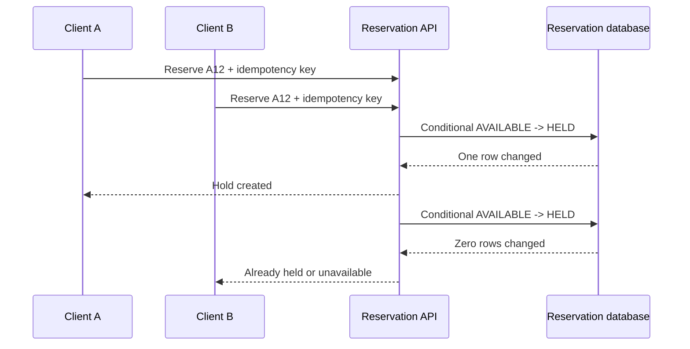

# Dealing With Contention

Contention is not simply high traffic. It is many requests trying to make incompatible changes to the
same logical thing at once: the last concert seat, one inventory unit, an auction's current bid, or one
available driver. The requirement is usually precise: one request may win, but two requests must not both
believe they won.

Start with the durable store that owns that business fact. A distributed lock can reduce duplicate work,
but it is not proof that a reservation, sale, or assignment happened.

## Start with one durable winner

Assume two clients reserve seat `A12` at the same instant. The smallest correct path is one conditional
transition in the database:

```sql
UPDATE seats
SET state = 'HELD', hold_expires_at = :expiry
WHERE seat_id = :seatId
  AND state = 'AVAILABLE';
```

Exactly one transaction can change the row from `AVAILABLE` to `HELD`; the affected-row count tells each
caller whether it won. The successful caller receives the short hold. The other caller receives a clear
conflict or availability response. A payment step later changes the same hold to `SOLD`, while a timeout
or expiry releases it. Do not hold a database transaction open while waiting for the user to pay.



The idempotency key handles a different problem: a caller that retries after losing the response must get
its original result rather than create another hold. Keep it with the command record or result so retries
are durable too.

## Choose the smallest coordination mechanism

| Pressure | First mechanism | Boundary and cost |
| --- | --- | --- |
| One record decides the result | Unique constraint or conditional update | The database is the durable winner. |
| A local read-modify-write needs a short critical section | Row lock in one database transaction | Lock waits can rise; never hold it across remote calls. |
| Several instances duplicate expensive temporary work | Lease with expiry | Coordinates work only; final state still needs a durable check. |
| Strict per-key order matters at high concurrency | Partitioned queue or single key owner | Adds delay, retries, and queue-lag monitoring. |
| Several services change one business outcome | Persisted state machine and compensation | Cross-service rollback is not an ACID rollback. |

Use a row lock when a transaction must read a row, validate a local invariant, and write it back before
commit. It serializes the short local critical section. Prefer a conditional update when the invariant can
be expressed in the update itself because it is simpler and normally holds the lock for less time.

A lease is useful for work ownership, such as ensuring only one worker computes an expensive quote. Its
expiry is not a business verdict: a slow worker can resume after its lease expires. Before committing an
external effect, it must still verify the durable version or state it owns.

## Reduce the conflict before adding a lock

The best lock is often a smaller conflict domain. Hold one seat rather than the whole event, allocate from
separate inventory pools rather than a global counter, and partition queue traffic by the resource key so
unrelated requests remain concurrent. If a single popular resource is inherently hot, no hash function
removes that conflict; the product may need a waiting room, a bounded offer window, or an explicit
first-come policy.

For a short burst where order matters but callers may wait, route each resource key to one queue partition.
The consumer serializes that key's commands, while other keys use other partitions. The consumer must still
be idempotent because redelivery occurs after crashes.

## Failure and recovery policy

| Failure or signal | Correct response | Why |
| --- | --- | --- |
| Client timeout after a hold request | Look up the idempotency key | The first command may have committed. |
| Worker retries a reservation command | Reapply the guarded transition | Repeating a safe transition must not double-book. |
| Hold expires while payment is in flight | Check hold ownership and expiry at final transition | A client-visible timer is not authoritative. |
| Lock waits or transaction latency rise | Shorten transaction, reduce concurrency, inspect hot keys | More retries can amplify the storm. |
| Lease holder crashes | Let another worker acquire work, then verify durable state | Lease expiry enables recovery but proves nothing alone. |

Measure conflict rate, conditional-update failures, lock-wait time, queue age, and successful completion by
resource class. Average CPU does not reveal that one hot seat or tenant is blocking the business path.

## How to present this in an interview

Say: "I will make the durable record choose the winner with a guarded transition or constraint. I will add
an idempotency key for retried commands. Only if the workload needs temporary cross-instance ownership or
ordered per-key processing will I add a lease or partitioned queue, and neither replaces the final durable
state check."

Further reading:

- [PostgreSQL explicit locking][postgres-locking]
- [PostgreSQL transaction isolation][postgres-isolation]

[postgres-locking]: https://www.postgresql.org/docs/current/explicit-locking.html
[postgres-isolation]: https://www.postgresql.org/docs/current/transaction-iso.html

## Quick recall

**Q. What is the first answer to double booking?**
A. A conditional durable update or constraint in the store that owns the booking.

**Q. When should a row lock be used?**
A. For a short local read-validate-write transaction. Do not retain it while calling another service or
waiting for a user.

**Q. Why is a distributed lease insufficient for a sale?**
A. It gives temporary work ownership, but expiry does not prove a prior worker failed or decide durable
business state.

**Q. What does an idempotency key protect against?**
A. Retried client commands that may already have committed after a timeout or lost response.

**Q. What does a partitioned queue solve?**
A. Per-key ordering and serialized ownership when waiting is acceptable; it adds delayed completion and
recovery work.
