# Handling Large Blobs

Suppose a user uploads a passport image for a verification journey. The product must accept the image, remember which
transaction owns it, and let an authorized reviewer retrieve it later. The image itself may be several megabytes, so
the request path cannot treat it like ordinary JSON forever.

The design goal is simple: the application owns **who may upload or read a document and what state it is in**; object
storage owns **the bytes**. This pattern applies to images, documents, audio, and video. It does not attempt to design
video transcoding, OCR, malware-scanner internals, or full CDN infrastructure.

## Start with the simple design

The obvious first version is `client -> API -> storage`: the client posts a file, the API authenticates it, then the
API writes the bytes to storage. It is a reasonable MVP for a tiny trusted upload. The API sees every byte, so it can
validate the request and create the document record in one place.

Large or slow uploads break that model. A 10 MB file is received once by the API and sent again to storage, so the
application fleet pays for both network legs. A user on a weak mobile connection can also occupy an API connection for
far longer than a normal request. Adding more API servers treats the symptom; the design has put byte transfer on the
wrong hot path.

The first design decision follows directly: let the API authorize an upload but let the client send bytes straight to
object storage.

## Scope the contract before drawing boxes

For the first interview version, assume:

- A caller starts an upload for a known transaction.
- Only an authorized user or service may upload or download that transaction's document.
- A document becomes visible only after required verification completes.
- The client may retry, disconnect, or receive a delayed response.

Below the line are public file sharing, cross-region replication policy, content-transformation algorithms, and
storage-provider-specific APIs. Calling these out keeps the design focused on the lifecycle that makes direct transfer
safe.

## Happy path: authorize first, transfer second

The API creates a document record before it grants upload access. That record receives a server-generated blob ID and
storage key; the user-supplied filename is display metadata, not the storage path. The API then returns a short-lived,
scoped upload URL. It is a temporary capability to write one object, not a permanent storage credential.

```mermaid
sequenceDiagram
    participant Client
    participant API
    participant Metadata as Document metadata
    participant Storage as Object storage
    participant Worker as Verification worker

    Client->>API: 1. Start upload for transaction T
    API->>Metadata: 2. Create document D as PENDING
    API-->>Client: 3. D + short-lived upload URL
    Client->>Storage: 4. Upload bytes for D directly
    Storage-->>Worker: 5. Object-completed event
    Worker->>Metadata: 6. Mark D READY or REJECTED
```

The API no longer transports the image, but it still controls the business operation. The metadata record answers
questions that object storage cannot: which transaction owns document `D`, whether the caller was allowed to create it,
whether it passed verification, and whether retention policy has deleted it.

| Part | Owns | Why it exists |
|---|---|---|
| API | Authorization, generated key, and upload intent | Keeps client access narrow and attaches the blob to business state. |
| Metadata store | Owner, lifecycle, timestamps, and retention data | Separates product truth from the existence of raw bytes. |
| Object storage | Multipart byte transfer and durable object data | Handles large transfers without consuming application-server bandwidth. |
| Verification worker | Scanning, checksum/policy checks, and lifecycle advancement | Prevents an unverified object from becoming visible merely because upload finished. |

## Pressure one: storage success is not product success

After step 4, storage may contain the object even though the document is not safe to serve. It could have the wrong
content type, fail a checksum, require virus scanning, or be attached to an abandoned flow. A boolean such as
`uploaded=true` loses the distinction between “bytes exist” and “the product may use them.”

Use a small durable lifecycle instead. The names can differ, but the transition rule matters: normal download is allowed
only from `READY`.

| State | Meaning | Typical next transition |
|---|---|---|
| `PENDING` | Upload intent exists but no completed object is known. | Upload completes or intent expires. |
| `UPLOADED` | Storage reports bytes present. | Verification starts. |
| `VERIFYING` | A worker checks the object or performs required processing. | `READY` or `REJECTED`. |
| `READY` | The document may be retrieved through application authorization. | Retention deletes it later. |
| `REJECTED` | The bytes or metadata failed policy. | Audit or cleanup. |
| `DELETED` | The document must no longer be served. | Terminal state. |

This is a deliberate trade-off: the document is not immediately readable after an upload. In return, the design makes
the security and processing boundary explicit. If the product truly needs instant serving for trusted public assets,
it can choose a shorter lifecycle; it should not silently reuse that policy for KYC documents.

## Pressure two: clients and events are unreliable

Imagine the client finishes the storage upload but loses its network connection before it receives a response. The API
must not depend on a client callback to discover completion. Storage completion events are a better trigger because
they describe the object that actually exists.

Events still do not provide a global transaction. An event can arrive twice, arrive late, or be missed. Make the worker
idempotent: when it receives an event for document `D`, it reads `D`'s lifecycle and advances it only when that
transition is valid. Reprocessing the completion event for an already `READY` document must not send duplicate
downstream effects.

Recovery needs a second path. A periodic reconciler compares metadata and storage: it expires `PENDING` intents that
never received bytes, finds orphaned objects with no valid metadata, and revisits `UPLOADED` records whose verification
never finished. Events keep the normal path fast; reconciliation repairs the cases distributed systems eventually
leave behind.

The start-upload API should also accept an idempotency key. When a mobile client retries after a timeout, it receives
the existing valid intent instead of creating two documents for one user action. For large files, the same record can
store a multipart or resumable-upload session so a new connection continues rather than restarts the transfer.

## Pressure three: private documents and read-heavy delivery

Downloads use the same separation of control and bytes. A reviewer first asks the API for document `D`. The API checks
that the reviewer may access the transaction and that `D` is `READY`, then returns a short-lived download URL or signed
cookie. A CDN may serve the object after this check, which protects the application servers from repeated reads without
making the document publicly addressable.

This is not the right policy for every blob. A public product image can use a stable CDN URL because discoverability is
part of the product. A passport image, invoice, or medical document should not. The access and cache policy must follow
the data classification, not the convenience of a single URL format.

## What to draw and defend in an interview

Draw four boxes: client, API plus metadata, object storage, and an asynchronous verification worker. Walk the upload
arrows in order, then say why direct storage transfer removes API bandwidth from the hot path. The strongest follow-up
is usually the lifecycle: explain why `READY`, not storage existence, controls visibility.

If the interviewer pushes on reliability, discuss idempotent events and reconciliation. If they push on large files,
discuss multipart resume. If they push on downloads, discuss the API authorization check followed by a signed CDN or
storage URL. Do not introduce a queue, CDN, or transcoding service unless that question creates the need.

Related material: [CDN](../../components/cdn/) for edge delivery and
[Google Drive](../../case_studies/google_drive_system_design/) for file synchronization and conflict handling.

## Quick recall

**Q. Why does the client upload directly to object storage?**
A. It keeps application servers responsible for authorization and metadata, while storage handles the large byte
transfer.

**Q. Why create metadata before returning an upload URL?**
A. The API establishes ownership and a durable lifecycle before bytes exist, so later events can be tied to one product
record.

**Q. Why is an uploaded object not immediately readable?**
A. Storage success does not prove that the object passed policy or verification; only `READY` is normally servable.

**Q. Why are events alone insufficient?**
A. They can be duplicated, delayed, or missed. Idempotent processing and reconciliation repair those cases.

**Q. How does a protected CDN download work?**
A. The API authorizes the caller for a `READY` document, then issues short-lived access that the CDN or storage serves.

**Q. What is the main trade-off of direct upload?**
A. It removes API bandwidth pressure but requires explicit metadata state, asynchronous verification, and recovery logic.
