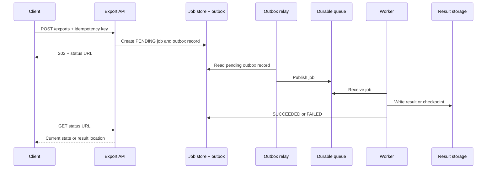

# Long-Running Tasks

Use this pattern when a request cannot produce a final answer within the caller's latency budget: generate a
large export, process a bulk import, transcode media, or send a campaign. The API must give a useful answer
quickly without pretending that the work already succeeded.

Do not introduce this pattern for short, correctness-sensitive commands whose final result the caller needs
now. A queue adds delayed completion, duplicate delivery, status ownership, and recovery work.

## Accept durable work, then expose its lifecycle

Assume a client requests a large report. The API validates the request, creates a durable job record, and
records an outbox message in one local transaction. Once that transaction commits, it can return `202
Accepted` with a job ID and a status location. A relay publishes the job; workers process it separately.

`202` means accepted for processing, not completed. The status resource should distinguish at least
`PENDING`, `RUNNING`, `SUCCEEDED`, `FAILED`, and optionally `CANCELLED`. It should show a structured error
on failure and only expose progress when the worker can calculate it honestly.

## Make submission and execution replay-safe

The API's idempotency key prevents a client retry from creating two logical export jobs after a lost
response. The worker needs its own durable effect key or checkpoint because a queue can redeliver after a
crash. A worker either resumes from a stored checkpoint or repeats a safe operation; it never assumes that
receiving a message exactly once means it performed the effect exactly once.

The outbox closes a common failure gap: if the job record commits but the process crashes before publishing,
the relay can still publish it later. If publishing succeeds twice, the worker's idempotency makes the
extra delivery harmless.

## Bound execution to protect the rest of the system

Workers may scale independently, but more workers are not always better. Set concurrency by the bottleneck:
database connections, downstream rate limits, CPU, or storage bandwidth. A queue smooths a temporary burst;
if arrival rate remains above safe processing rate, oldest-job age grows until the product deadline is
missed.

| Pressure | Decision | Trade-off |
| --- | --- | --- |
| A transient dependency failure | Bounded retry with backoff and jitter | Completion takes longer. |
| A permanently malformed or failing job | Retry limit, visible failure queue, repair/replay path | An operator needs an ownership process. |
| Backlog threatens the completion window | Cap intake, defer low-priority work, or raise capacity | A product class must be allowed to degrade. |
| Worker crashes mid-job | Resume from checkpoint or restart idempotently | Checkpoints add storage and state management. |
| Client needs completion notification | Status endpoint first; webhook or push when justified | Callbacks require delivery and authentication policy. |

Keep the status store, queue, result storage, and worker ownership distinct in the explanation. A queue says
what remains to be attempted; the job record says what the client may observe; result storage holds the
large output.

## Cancellation, expiry, and recovery

Cancellation is a state transition, not necessarily an immediate kill. The API marks the job as cancelling;
the worker checks that state at safe boundaries, avoids starting new side effects, cleans up what it owns,
and then records `CANCELLED`. If work cannot be safely interrupted, explain that cancellation applies to
future steps and the final result may complete or be discarded according to the product rule.

Persist deadlines and result-retention expiry. A periodic reconciler finds jobs that have been `RUNNING` too
long, checks whether a worker still owns them, and retries or fails them deliberately. Do not leave an
in-memory timer as the only recovery mechanism.

## How to present this in an interview

Say: "I will validate the request, durably create a job and its outbox event, then return `202` with a
status URL. A bounded worker pool consumes idempotent jobs. Queue age and oldest-job age drive backpressure;
retries are bounded, poison jobs are visible, and a reconciler repairs work stuck beyond its deadline."

Further reading:

- [Microsoft: asynchronous request-reply][async-request-reply]
- [Microsoft: background-job guidance][background-jobs]

[async-request-reply]: https://learn.microsoft.com/en-us/azure/architecture/patterns/asynchronous-request-reply
[background-jobs]: https://learn.microsoft.com/en-us/azure/architecture/best-practices/background-jobs

## Quick recall

**Q. What does `202 Accepted` promise?**
A. The request was durably accepted for later processing; it does not promise final success.

**Q. Why is a queue not enough?**
A. The system still needs durable job state, replay-safe workers, retry limits, deadlines, and a client
visible outcome.

**Q. What should drive backpressure?**
A. Oldest-job age and backlog relative to the promised completion window, plus the real downstream
bottleneck—not only queue depth.

**Q. How does a worker recover after a crash?**
A. It resumes from a durable checkpoint or repeats an idempotent operation using the same effect key.

**Q. When is a webhook preferable to polling?**
A. When the caller can receive and authenticate callbacks and needs notification; polling is the simpler
default status contract.
