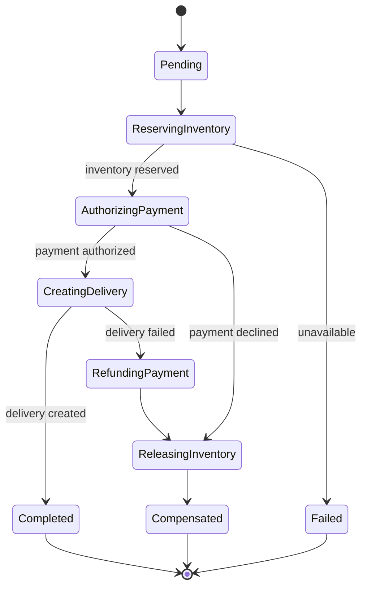

# Multi-Step Processes

Use this pattern when one business outcome requires several durable steps that cannot share one database
transaction. A checkout may reserve inventory, authorize payment, and create delivery. A fulfillment flow
may wait for a human decision. The key question is not "should I use a saga?" but "what final state must a
client see when one of those independently owned steps fails?"

Keep the action synchronous and local if all required changes belong to one service and one transaction.
Add workflow coordination only when an external dependency, a separate service, or durable waiting makes
that transaction boundary impossible.

## Begin with a persisted state, not a chain of calls

For a checkout, create a durable workflow record before triggering downstream work. It tells every retry,
operator, and client what the system believes happened.

Each transition is a durable business decision. The service updates the workflow state and records an
outbox event in one local transaction; an outbox relay publishes the next command afterward. Without that
pairing, a process can commit `PAYMENT_AUTHORIZED` and crash before sending the delivery command, leaving
the workflow stuck with no reliable trigger.

## Choose coordination based on the workflow, not fashion

| Workflow shape | Suitable starting point | Cost to name in an interview |
| --- | --- | --- |
| A few local steps and short retries | Persisted state machine plus a scheduled reconciler | The application owns timers and recovery. |
| A few independent consumers reacting to one event | Choreography | Flow ownership becomes harder to discover. |
| Many dependent steps, branches, timers, or human waits | Orchestrator or durable workflow engine | The coordinator itself needs availability and versioning. |

Choreography is useful when services can independently react to a fact such as `OrderCreated`. It becomes
hard to reason about when every participant must know which event comes next. An orchestrator instead owns
the workflow state and sends explicit commands. It makes a long, conditional path visible, but is not a
permission to put every unrelated event through one central service.

## A compensation is a new business action

There is no automatic rollback across databases or external providers. If delivery cannot be created after
payment authorization, the recovery might be `refund payment` and `release inventory`. Those are new,
idempotent commands with their own failure states; "undo" may be impossible, delayed, or intentionally
different from the original action.

Use a forward retry for a transient failure only when it is safe and bounded. Persist deadlines rather than
relying on an in-memory timer. Add jitter to retry bursts. When a timeout expires, move the workflow to a
visible recovery state and let a reconciler inspect evidence from participants before retrying or
compensating.

## Retries, duplicates, and client visibility

A caller can retry after a timeout, an outbox relay can publish twice, and a consumer can receive the same
message again after crashing. Give the initiating request an idempotency key, give each downstream effect a
stable operation key, and make transitions conditional on the expected prior state. The goal is not a broad
claim of exactly-once delivery; it is an outcome that remains correct under at-least-once execution.

Expose a workflow ID and status when completion is not immediate. A status such as `PROCESSING`, `FAILED`,
or `COMPENSATING` is more honest than returning success after only the first local write. Include a terminal
error or next action where the client needs it, and retain enough transition history to investigate a stuck
workflow.

## Failure policy and observability

| Signal or failure | Response | Reason |
| --- | --- | --- |
| An outbox event has not been published | Relay it until recorded as delivered | A committed state change needs a reliable next trigger. |
| A participant times out | Retry only if operation key makes it safe | A timeout does not prove the participant did nothing. |
| A workflow exceeds its deadline | Reconcile, then retry or compensate | Durable waiting needs an owner. |
| Compensation fails | Keep a visible recovery state and alert | A partial rollback is still business state. |
| Transition rate or age grows | Inspect the failing state and dependency | Aggregate success rate hides stuck workflows. |

## How to present this in an interview

Say: "I will keep one local transaction per service, persist the workflow state, and use an outbox to
reliably trigger the next step. Each effect is idempotent and keyed, and each transition has a deadline.
If a later business step cannot complete, I will use an explicit compensating action rather than pretending
there is a distributed rollback."

Further reading:

- [AWS saga patterns][aws-saga]
- [Microservices.io: saga pattern][microservices-saga]

[aws-saga]: https://docs.aws.amazon.com/prescriptive-guidance/latest/cloud-design-patterns/saga-patterns.html
[microservices-saga]: https://microservices.io/patterns/data/saga.html

## Quick recall

**Q. When is a persisted state machine enough?**
A. For a small workflow whose retries, deadlines, and recovery rules remain understandable in one service.

**Q. Choreography or orchestration?**
A. Use choreography for a small set of independent reactions; use orchestration when one visible,
conditional process needs central state and control.

**Q. Why is an outbox needed?**
A. It records the next trigger in the same transaction as the state transition, avoiding a commit-then-crash
gap.

**Q. Is compensation a rollback?**
A. No. It is a separate idempotent business action that attempts to reach an acceptable final state.

**Q. What makes a workflow safe under retry?**
A. Durable conditional transitions, idempotent effect keys, bounded retries, deadlines, and reconciliation.
