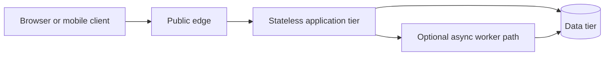
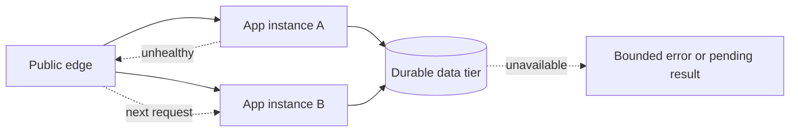

# N-Tier Architecture

N-tier is vocabulary for physical boundaries in a request path. Interviewers rarely ask only "define
N-tier," but they expect you to place public traffic, application logic, and data behind sensible security,
scaling, and failure boundaries while designing a service.

Start with the smallest deployable web system. Add a tier only when it has a different trust boundary,
scaling behavior, failure profile, or deployment lifecycle—not because a diagram looks more complete.

## Layer and tier answer different questions

A **layer** is a logical code boundary: a Spring controller calls a service, which calls a repository. All
three can run in one JVM. A **tier** is a physical deployment boundary: browser, API service, and database
run on separate infrastructure and communicate across a network.

Several code layers can share one tier, and one layer can run across many instances in a tier. Say this
first in an interview; it prevents the common mistake of treating Controller → Service → Repository as a
three-tier deployment.

## Begin with a three-tier request path

For a normal web application, the smallest useful shape is presentation, application, and data:

The application tier authenticates the caller, applies business rules, decides which data is visible, and
controls database access. The database should not be exposed to arbitrary clients. Keeping the application
tier stateless lets a load balancer send the next request to another instance; durable state belongs in the
data tier or a deliberately selected state store.

An application-tier failure need not become a user-visible outage when another healthy instance can read
the same durable state. A data-tier failure is different: more API instances cannot repair the unavailable
authority, so the response must follow that dependency's failover or pending-result policy.

## Split only for a concrete reason

| Boundary | Add it when | What it costs |
| --- | --- | --- |
| Public edge or gateway | Internet-facing security, routing, rate limiting, or protocol concerns differ from app logic | Another hop and a policy owner. |
| Separate application tier | Business logic must scale or deploy independently from UI delivery | Network calls and operational ownership. |
| Cache tier | Read latency or database load justifies freshness/invalidation rules | Stale data and invalidation complexity. |
| Worker tier | Work can complete after the request and needs independent concurrency | Job state, retries, and user-visible status. |
| Separate data tier | Durability, backup, access policy, or storage scaling differs from compute | Data network latency and recovery design. |

This is why "each tier scales independently" needs qualification. A tier can be independently scaled only
if it is sufficiently stateless or has an explicit state, routing, and dependency plan. Scaling application
instances does not fix a saturated database writer.

## Closed and open layering

In a **closed** layered design, each logical layer calls only the next lower layer. It constrains
dependencies and makes it easier to replace or test an implementation, but it can add pass-through code.
In an **open** design, an upper layer may call a lower one directly. That can be justified by a measured
performance path, but it couples the caller to a deeper implementation detail.

This is mainly a code-structure decision. Do not confuse it with whether two physical tiers are separated
by a network. A service may expose a cache-backed repository internally while still running all code layers
in one application tier.

## Security, failure, and scaling boundaries

The useful interview reasoning is what each boundary protects:

- Only the public edge accepts untrusted internet traffic; private application instances need not be
  directly reachable.
- Only the application or worker tier receives database credentials; clients never receive arbitrary SQL
  access.
- Each tier gets its own timeout, retry, and capacity policy. A slow downstream dependency should consume a
  bounded pool, not every request thread.
- Data remains the recovery authority. Backups, replication, and restore goals belong to the data design,
  not to a generic three-box diagram.

Avoid placing every familiar component in one line. CDN, load balancing, cache, queues, and replicas each
need a workload reason. A request may bypass a cache on a write, and a worker may use the same data tier as
the request service; N-tier describes ownership and placement, not a mandatory hop sequence.

## How to present this in an interview

Say: "I will begin with a client, a stateless application tier, and a private data tier. The application is
the trust and business-rule boundary. I will split out a cache, worker, or separate service only if its
freshness, latency, concurrency, or deployment needs differ. Layers describe code dependencies; tiers
describe physical deployment and therefore security and scaling boundaries."

Further reading:

- [Microsoft: N-tier architecture style][microsoft-n-tier]

[microsoft-n-tier]: https://learn.microsoft.com/en-us/azure/architecture/guide/architecture-styles/n-tier

## Quick recall

**Q. Layer vs tier?**
A. A layer separates code responsibilities; a tier separates deployed infrastructure and network trust.

**Q. Why not let a client call the database directly?**
A. The application tier centralizes authorization and business rules and keeps database access private.

**Q. What makes a tier independently scalable?**
A. It must be stateless or have explicit state/routing and a downstream capacity plan; adding instances
alone does not scale the database.

**Q. Closed vs open layering?**
A. Closed layers call only the next lower layer; open layers may bypass one at the cost of deeper coupling.

**Q. Is every component a required tier?**
A. No. Add cache, queue, gateway, or replica only for a stated workload, trust, or failure requirement.
