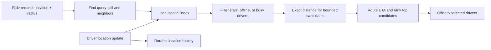

# Proximity Services

Use this pattern when a request means "find entities near this latitude and longitude": available drivers
near a rider, restaurants near a customer, or stores near a delivery address. The design is a candidate
funnel, not one magical geo query: make a small local candidate set first, then spend expensive ranking work
only on plausible results.

For a few hundred or roughly a thousand entities, scan and calculate distance. A distributed spatial index
is unnecessary overhead until the global scan, update rate, or locality requirement proves otherwise.

## Start with the request, not the index name

Assume a rider asks for nearby available drivers. The response must use recent locations, exclude busy or
offline drivers, and rank a manageable set by an accurate distance or estimated arrival time. A driver's
latest location is volatile; location history and latest searchable state have different jobs.

A grid or spatial index makes the candidate lookup proportional to nearby cells rather than every driver in
the world. It does not decide who is available or who should receive an offer; those are later filters and
business decisions.

## Cell lookup narrows the work

Geohash, H3, S2, a database spatial index, and an in-memory geo index are implementation choices. Their
shared idea is to map a coordinate to a cell and retrieve entities in that cell plus neighboring cells.
Always include neighbours: two drivers can be metres apart while a cell boundary puts them in different
cells.

Cell size is a trade-off. A larger cell means fewer keys but more candidates and ranking work. A smaller
cell means tighter candidates but more neighboring-cell lookups and sparse areas. Pick a resolution from
the search radius and density; do not claim that one global precision fits a city centre and a rural area.

| Workload | Smallest useful choice | Boundary to state |
| --- | --- | --- |
| Small, mostly static set | In-process scan or database query | Measure before maintaining a second index. |
| Moderate durable locations | Database spatial index | Query and update rate must fit the database path. |
| Frequent latest-location updates | Rebuildable in-memory geo index plus durable history | Expire stale entries and rebuild after failure. |
| Wide geographic footprint | Regional or city ownership plus local index | Region ownership is distinct from cell geometry. |

## Treat freshness and availability as correctness inputs

The index must record an update timestamp or version. A delayed location event must not overwrite a newer
one, and a driver that stopped reporting must be filtered before ranking. Exact distance to a stale point is
precisely wrong.

Availability also changes rapidly. Use the proximity index to find candidates, then reserve or offer to a
driver through the durable contention-safe path that owns assignment. Do not treat seeing a driver in a
geo query as a successful allocation; another request can see the same driver at the same moment.

## Control hot areas and expensive ranking

Dense city cells can return too many candidates. Cap the first candidate set, rank by a cheap distance
approximation, and call a route or ETA service only for the best few. If no eligible entity is found,
expand the search ring or radius in bounded steps and stop at a product-defined limit. An unbounded radius
turns a local lookup into a slow global scan.

Partition update and query ownership by a geographic region when cross-region latency or data volume makes
one global index impractical. Boundary cells need an adjacent-region query or replicated border data; that
is an explicit consistency/cost trade-off, not a reason to silently miss nearby entities.

## Failure and observability

| Failure or signal | Response | Why |
| --- | --- | --- |
| In-memory index is lost | Rebuild from durable update stream or latest-state store | Search state is an index, not the only truth. |
| Location update arrives late | Ignore it using timestamp or version check | It must not move an entity backward. |
| A cell is unusually dense | Cap candidates and fan out within a bounded ring | Ranking cost must stay predictable. |
| No match found near a boundary | Search neighboring cells or border owner | Grid boundaries are not geographic walls. |
| Assignment race | Use a durable reservation/conditional transition | Proximity lookup does not grant ownership. |

Track location age, update lag, candidates per query, expansion rate, ranking latency, and allocation
success. Those signals show whether the issue is stale data, poor cell resolution, sparse supply, or the
assignment path.

## How to present this in an interview

Say: "I will first use a spatial cell index to reduce the world to nearby candidates, include neighboring
cells, filter stale and unavailable entities, and run costly ETA ranking only on a bounded set. The latest
location index is rebuildable; durable assignment still uses a contention-safe reservation because a geo
query is not a lock."

Further reading:

- [Uber: H3 spatial index][uber-h3]

[uber-h3]: https://www.uber.com/us/en/blog/h3/

## Quick recall

**Q. Why not scan every location?**
A. It makes query cost proportional to global population. A spatial index first narrows work to a local
candidate set.

**Q. Why search neighboring cells?**
A. Nearby entities can lie on opposite sides of a grid boundary.

**Q. Why is an exact distance sometimes wrong?**
A. It can be calculated perfectly from a stale location, so freshness must be filtered first.

**Q. Does a geo query assign a driver?**
A. No. It finds candidates; durable allocation needs a separate contention-safe reservation.

**Q. When should the search radius expand?**
A. After no eligible local result, in bounded product-defined steps so a local query cannot become a global
scan.
