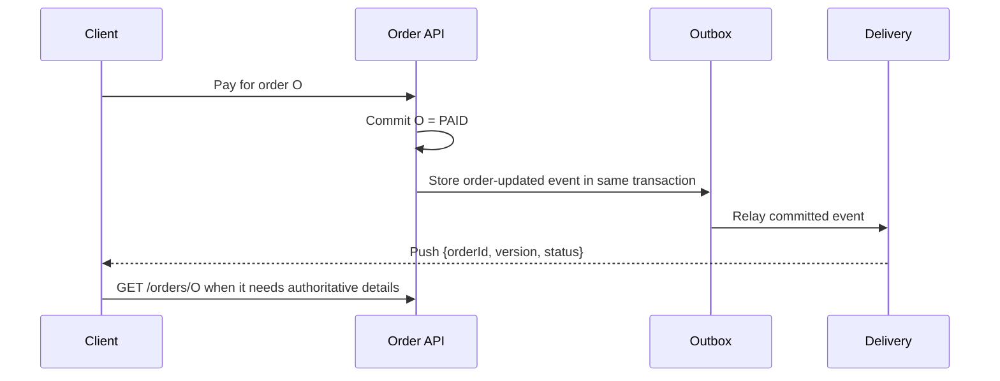

# Real-Time Updates

Imagine a customer watching an order-status screen. The payment service changes the order to `PAID`, but
the browser did not make a new request. The system now needs a way to tell that browser about the change
without making the notification itself the source of truth.

Use this pattern when the server must initiate delivery after the original request has completed: chat
messages, notifications, a driver moving on a map, or job progress. Ordinary commands and reads should
still use normal request/response APIs. This page covers getting a durable change to connected clients
and recovering from missed updates; collaboration conflict resolution and push-provider internals are
separate problems.

## Start with polling

The smallest design is polling: after a customer opens an order screen, the browser calls
`GET /orders/{orderId}` every few seconds. It is easy to deploy, works through ordinary HTTP
infrastructure, and is often correct for infrequent updates. The read response remains authoritative,
so a tab that misses one poll simply learns the latest state on the next one.

Polling stops being a good default when the product needs fast delivery to many idle clients. Most polls
return nothing new, yet each still reaches the API and its dependencies. Reducing the interval improves
freshness but increases that empty-read load. That is the pressure that justifies server-initiated
delivery; it does not automatically justify WebSockets.

## Choose the delivery mechanism

| Need | Start with | Move up when | Cost |
|---|---|---|---|
| Updates can be seconds late | Polling | Poll volume or latency becomes unacceptable | Wasted requests and delayed visibility |
| Server only pushes events to client | SSE | Client must also send frequent low-latency messages | One-way connection, reconnect handling |
| Bi-directional, low-latency interaction | WebSocket | The product truly needs it | Connection lifecycle, fan-out, backpressure |
| Mobile device may be offline | Push notification plus refresh | User opens the app | Delivery is not a durable source of truth |

Do not select WebSockets by default. SSE is usually simpler when the server only streams events; choose
WebSockets when the client and server both need an ongoing low-latency conversation, such as chat or
collaborative editing. A push notification wakes an offline device, but the app must still refresh state
after opening.

## The durable change comes first

The event is a delivery hint, not the order record. If an event says `PAID` but the database update was
rolled back, clients briefly see a state that never existed. Write the business state first and publish
only a committed change. A transactional outbox is a common way to store the change and the pending
event together, then relay it after commit.

The delivery service owns open connections, not order data. The Order API owns authorization and the
current order representation. Keeping those responsibilities separate lets a client reconnect to any
delivery node and still repair its view with a normal API read.

## A reconnect is part of the normal flow

An event can be delayed, duplicated, or lost while the browser is offline. Include an event ID or a
monotonic per-order version in each payload. The client remembers the last version it applied, ignores a
duplicate, and refreshes from the Order API when it observes a gap or reconnects. The refresh is what
makes the design correct; the push only makes it timely.

For a simple order screen, fetching the latest order after reconnect is enough. A chat room or live
activity feed may need `GET /events?after={cursor}` so the client can replay a bounded history before it
resumes live delivery. Choose replay only when the product needs every intermediate event.

## Deliver to the right connections without unbounded buffering

The delivery tier keeps a mapping from user or channel to active connections. For many stateful sessions,
consistent hashing can route the same user or document to the same delivery node; a shared registry is an
alternative when that ownership cannot stay local. When one order event is relevant to several sessions,
pub/sub can distribute it from the producing service to whichever delivery node owns each connection.
Pub/sub solves fan-out; it does not prove that a user read an event.

Each connection needs a bounded outbound buffer. A slow client cannot be allowed to retain every update
in memory while the rest of the system continues producing them. For status-style data, drop stale
intermediate updates and send the latest state or request a refresh. For an event stream where every
item matters, disconnect after a limit and require the client to replay from its cursor. The correct
policy follows the product's loss tolerance.

## Failure choices worth saying out loud

| Failure or pressure | Design response | Trade-off |
|---|---|---|
| Client disconnects | Reconnect, then read current state or replay after a cursor. | The client and API need a recovery contract. |
| Event is delivered twice | Event ID or version lets the client ignore duplicates. | Clients keep small delivery state. |
| Event is never delivered | Authoritative refresh repairs the screen. | Push is not a complete audit trail. |
| One client is slow | Bound its buffer; coalesce, disconnect, or force refresh. | It may miss intermediate updates. |
| Many nodes own connections | Route by connection owner or use a shared registry. | Connection ownership becomes operational state. |

## Interview delivery

Say: "The command commits business state and an outbox event together. A delivery tier pushes that
committed change to connected clients, but the next read remains authoritative. Versions plus a refresh
or cursor make reconnects, missed events, and duplicates safe."

Do not spend time on WebSocket frame internals unless asked. First establish the delivery contract, then
explain protocol choice, connection ownership, fan-out, and recovery in response to follow-ups.

## Quick recall

**Q. Why is a push event not the source of truth?**
A. Connections and notifications are lossy. Durable state and a refresh API repair missed or duplicated events.

**Q. When is polling sufficient?**
A. When updates are infrequent or seconds of delay are acceptable; it is the simplest operational choice.

**Q. Why include a version in an event?**
A. It lets a client ignore duplicates and notice that it missed an update, after which it can refresh or replay.
