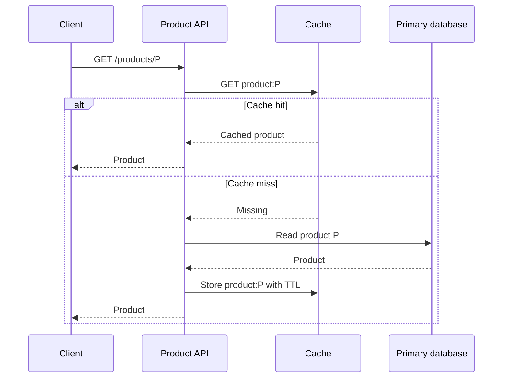
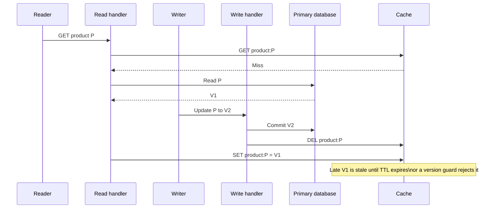

# Scaling Reads

Consider `GET /products/{productId}` for a popular product page. One catalog update may be followed by
thousands of reads: a search page, product page, recommendation widget, and mobile retry can all request
the same product. The first version is straightforward: an API service reads the primary database and
returns the result. It is also the right starting point when traffic is small.

Read scaling begins when that simple path makes the primary database or a downstream dependency the
bottleneck. The goal is not to add Redis, replicas, and a CDN by default. It is to keep the required read
freshness while removing unnecessary work from the hot path.

This page focuses on data that already has a durable source of truth. It does not design full-text search,
write sharding, or global file delivery; those have different query and consistency requirements.

## Start with the request, not a component

For the initial request, the API validates the caller, performs a point lookup, and returns the product.
Before distributing that read, first check that the database is doing reasonable work: the query uses the
right predicate and sort index, avoids an N+1 access pattern, returns only necessary columns, and has an
appropriate connection-pool limit. A cache only hides a bad query until a cold start, invalidation, or new
key exposes it again.

The next choice follows the access pattern rather than a fixed architecture.

| Read pressure | First useful move | Why it helps | Important limit |
|---|---|---|---|
| A selective query is slow | Fix query and index | Cuts work on every request | Indexes cost writes and storage. |
| Broad durable data has high QPS | Read replicas | Offloads eligible reads | A replica may lag the primary. |
| The same keys repeat | Cache-aside | Avoids database reads for the hot set | The cache can be stale or cold. |
| Public static content is global | CDN | Serves nearby | Cache policy becomes part of the contract. |
| The query needs text relevance | Search index | Optimizes text retrieval | Indexing is often eventually consistent. |

One product may use more than one row of this table. A catalog API can cache hot products, send colder
catalog reads to replicas, and deliver public images through a CDN. Each layer must still have a clear
freshness policy.

## Default pattern: cache-aside for repeated reads

For a cacheable product, the API owns the cache policy and the database remains authoritative. On a cache
hit, it returns the value without reaching the database. On a miss, it reads the database, places the
result in the cache with a bounded TTL, and returns it.

The TTL is not a performance constant. It is a product decision: it bounds how long an unchanged cached
value may be reused before expiry, while eviction can remove it earlier. It also limits memory held by keys
that are no longer requested. Choose it from update rate and tolerated staleness, then observe hit rate,
primary QPS, p95/p99 latency, eviction rate, and stale-read incidents. Do not claim that a cache makes a
read "consistent" merely because it is fast.

## A write defines the freshness contract

Suppose a merchant changes the price of product `P`. The durable update commits first. The API then
invalidates or versions `product:P`; the next read repopulates it. This keeps the primary database as the
source of truth and avoids trying to make every cache entry a second transactional database.

There is still a race: a reader may fetch the old value just before invalidation and populate it after the
write. For data where that brief window is acceptable, a TTL bounds the damage. For stricter data, include
a version in the cached value or key and reject values older than the committed version. The right answer
depends on the product, not a Redis command.

This race is about ordering, not a failed cache command. The late cache write happens after the writer has
already deleted the key, so the old value can survive until its TTL expires unless the design adds a version
check or routes the freshness-sensitive reader to the primary.

State the policy explicitly in an interview:

- A browsing catalog may tolerate a short stale window.
- An immediately updated account setting or entitlement should read from the writer, or use a known
  committed version until a replica/cache is caught up.
- A payment balance or availability decision should not silently use a stale cache merely to reduce QPS.

This is read-after-write consistency: the user who just completed a write should not be sent to a path that
cannot yet observe it.

## Replicas scale eligible reads, not correctness-sensitive ones

When cache misses are still numerous, the working set is too large to cache, or many reads are unique,
read replicas can absorb load from the writer. The API writes to the primary and routes only eligible reads
to a replica. It should not round-robin every request without considering freshness.

Most replica deployments apply primary changes asynchronously. A successful write can therefore be visible
on the primary before a replica has applied it. Track replication lag and define a fallback: a caller who
needs read-after-write goes to the primary, while a feed or catalog read that accepts bounded staleness can
use a healthy replica. If lag crosses the agreed limit, stop routing that class of reads to the replica.

Replicas are not a cache and not a backup strategy. They still execute database queries and have their own
capacity, connection, failover, and lag limits. They help with broad database read load; a cache handles a
small set of repeatedly requested keys much more efficiently.

## Keep a hot key from becoming a miss storm

A popular key can create a burst of database reads when it expires or when the cache restarts. If hundreds
of requests see the same miss, each independently rebuilding the value defeats the cache precisely when
load is highest.

For an expensive hot-key load, coalesce concurrent requests so one request refreshes the key and
the others briefly wait for the result. For data that can be slightly stale, serve the last known value
while one worker refreshes it. Add small TTL jitter so many keys do not expire together. These are targeted
protections; a lock on every cache miss adds latency and can become a new bottleneck.

A hot key may also be too popular for one cache node. Replicating read capacity, using a local cache for a
carefully bounded immutable value, or moving public bytes to a CDN can help. The choice depends on whether
the bottleneck is a database, cache node, API network hop, or global delivery path.

## Failure policy and observability

The cache is an optimization, so a cache outage should normally fall back to the durable read path. That
fallback must be protected: cap database concurrency, shed optional work, and alert before all requests
overwhelm the primary. Returning stale catalog data may be preferable to an outage; returning stale fraud,
balance, or authorization data may not be. Make that degradation choice per endpoint.

Monitor the signals that reveal the real pressure rather than only cache availability:

| Signal | What it tells you |
|---|---|
| Cache hit rate and eviction rate | Whether the cache holds the requested working set. |
| Cache latency and error rate | Whether the optimization is itself becoming the bottleneck. |
| Primary and replica QPS, pool saturation, and p99 | Whether read load is actually leaving the database. |
| Replica lag and unhealthy replicas | Whether replica-routed reads still meet the freshness contract. |
| Misses and origin loads per key | Whether a hot key or coordinated expiry is causing a stampede. |

## How to present this in an interview

Start with the assumption: "I am treating this as repeated catalog reads where a bounded stale window is
acceptable. If this endpoint makes a balance, entitlement, or immediate price decision, I will not send it
through an ordinary cache or lagging replica path." Then say: "I will first make the read query efficient.
For repeated product reads, I use cache-aside with a TTL chosen from the stale-data budget. The primary
remains authoritative; writes commit there and invalidate or version the cache. Broader non-critical reads
can use replicas, but a user who just changed data is routed to the primary or a version-aware path until
it is safe to read elsewhere."

If asked to go deeper, discuss the one pressure the interviewer names: cache stampede, invalidation race,
replica lag, hot keys, or a cache outage. That demonstrates a decision process instead of a memorized list
of infrastructure components.

Related material: [Caching](../../components/caching/), [CDN](../../components/cdn/),
[scalability](../../concepts/scalability/), and [scaling writes](../scaling_writes/).

Further reading:

- [Redis cache-aside](https://redis.io/docs/latest/develop/use-cases/cache-aside/)
- [AWS read-replica monitoring](https://docs.aws.amazon.com/AmazonRDS/latest/UserGuide/USER_ReadRepl.Monitoring.html)
- [Hello Interview's scaling-reads pattern](https://www.hellointerview.com/learn/system-design/patterns/scaling-reads)

## Quick recall

**Q. When do read replicas help more than a cache?**
A. When many eligible reads are unique or the working set is too broad to keep hot; replicas still execute
database queries, while a cache avoids repeated queries for hot keys.

**Q. Why can a replica break read-after-write?**
A. The write can commit on the primary before asynchronous replication applies it to the replica.

**Q. What does a TTL guarantee?**
A. It bounds cache-entry lifetime, not perfect freshness. A write/invalidation race can still require
versioning or primary routing for stricter data.

**Q. How do you prevent a cache stampede?**
A. Coalesce refreshes for an expensive hot key, optionally serve bounded stale data, and avoid synchronized
expiry with small TTL jitter.

**Q. What happens when the cache is down?**
A. Fall back only where the primary can safely handle it; cap load and use endpoint-specific degradation
instead of treating stale data as universally safe.
