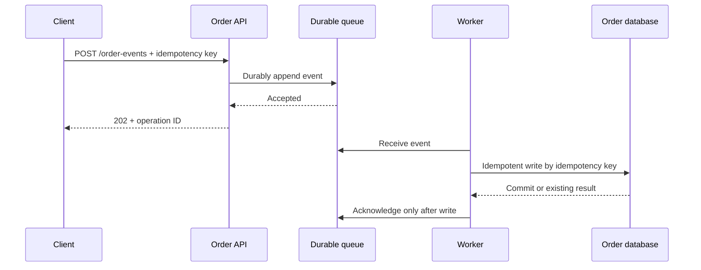
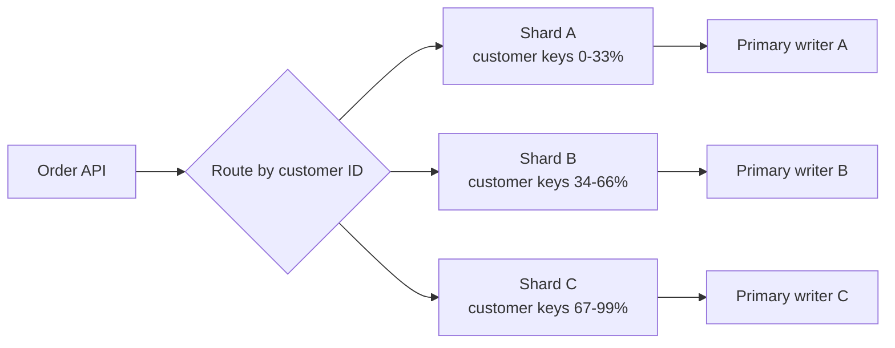

# Scaling Writes

Consider `POST /orders` during a short flash-sale surge. The first correct design is simple: validate the
request, write the order durably to one primary database, and return success only after the commit. That
path is still the right choice while its write latency, lock waits, storage, and connection capacity meet
the product's needs.

Write scaling begins when durable work cannot finish at the required rate or when a temporary burst would
overwhelm an otherwise adequate writer. It is not a reason to add a queue or shard by default. This page
focuses on durable, keyed business writes. It does not design read caching, distributed analytics, or every
storage engine's replication protocol.

## Prove the pressure before splitting the path

First identify which work limits the current writer. An index or transaction that is correct for a point
write may still be slow because of lock contention, an expensive secondary index, too many round trips, or
a connection pool that is already saturated. Fix an avoidable write-path cost before distributing data;
sharding an inefficient transaction only creates several inefficient transactions.

| Write pressure | First useful move | What it does not solve |
| --- | --- | --- |
| Avoidable work in one transaction | Remove round trips, indexes, or synchronous side effects | A true single-writer capacity ceiling |
| Short burst over safe database concurrency | Durable queue with bounded consumers | Sustained demand above destination capacity |
| One large table mixes unrelated access patterns | Vertical partition by feature or data type | A single hot logical key |
| One writer cannot store or accept the required steady rate | Shard by a stable, high-cardinality key | Cross-shard transactions or skew |
| A per-operation network cost dominates and delayed visibility is safe | Batch operations | Per-item immediate success semantics |
| Overload threatens all writes | Reject, defer, or rate-limit low-priority work | An undefined degradation policy |

The interview question to ask is: "Must the caller know that the order committed now, or is it enough to
know that the system durably accepted work?" That answer decides whether a queue belongs on the request
path.

## A queue changes the acknowledgement contract

For an order that must immediately reserve inventory or return a final payment result, the API should wait
for the required database transaction and return the result synchronously. Putting that command in a queue
only hides its latency and makes the client's result uncertain.

For work that may complete shortly after acceptance—such as generating an invoice, updating a materialized
view, or ingesting a non-critical event—the API can durably enqueue an item and return an accepted state.
The worker later performs the database write. The queue absorbs a burst and lets the system bound concurrent
database work, but a permanently slow worker still grows backlog; the queue has not increased destination
capacity.

The idempotency key is part of correctness, not a convenience. A client can retry after a timeout and a
queue can redeliver after a worker failure. The write must therefore create the order once or return the
existing result for the same idempotency key. A worker acknowledges only after durable success; otherwise it
leaves the item eligible for retry or moves it to a visible failure path after the chosen retry limit.

The client needs an operation-status or resource-read endpoint because `202 Accepted` means the system
accepted work, not that the final order state exists. State that difference explicitly in an interview.

## Scale sustained writes by routing related data deliberately

When a single writer remains the sustained bottleneck after fixing its path, split one logical dataset
across independent writers. A router sends each order to the shard selected by a key such as `customerId`:
related customer data stays local and many customers spread across shards. Replication can improve reads and
availability for each shard, but it does not spread a write across primary writers by itself.

A good shard key has three properties:

- It distributes expected writes, not merely stored rows, evenly.
- It is stable so an update does not normally move data between shards.
- It appears in common reads and writes, allowing direct routing instead of scatter-gather.

There is no universally good key. `customerId` is often useful for customer-owned orders, but a global
counter, a celebrity tenant, or a single popular product can still concentrate writes on one partition. Do
not promise that hash sharding fixes a hot logical key; it only distributes independent keys. That workload
may need a separate aggregation design, an isolated tenant, or a product decision to reduce synchronous
writes.

## The cost of a shard is coordination

Sharding trades one capacity limit for data-placement and coordination work. A transaction that must change
two shard-owned records is no longer an ordinary local transaction. Prefer a data model that keeps the
common invariant on one shard; use an explicit workflow with retries and compensation only when the
business operation genuinely crosses that boundary.

Adding shards also requires a migration plan. With fixed `hash(key) % shardCount`, changing the count moves
many keys. A routing layer or consistent-hashing-style placement can limit movement, but the operational
plan still needs copy, validation, cutover, and rollback. In a normal SDE2 interview, name resharding and
the key-migration risk; do not invent a full migration platform unless it is the deep dive.

Vertical partitioning solves a different problem: moving infrequently used or large columns away from a hot
write table can reduce per-write I/O, but it does not spread one table's write throughput over machines.
Keep partitioning, shard ownership, consumer ownership, and geographic placement separate in your answer.

## Batch and shed load only with product permission

Batching reduces per-operation overhead by committing multiple independent writes together. It is a good
fit for telemetry, counters, or asynchronous imports where a small visibility delay and a larger retry unit
are acceptable. It is a poor fit for a caller that needs immediate confirmation of one order or payment.

When overload remains, decide which writes may be rejected, deferred, or coalesced before the system is in
trouble. A rate limit is a product contract: for example, reject a non-critical analytics event before
rejecting an order. Preserve that decision in the response and monitoring rather than silently dropping
work to make a dashboard look healthy.

## Failure policy and observability

| Signal or failure | What to watch or do | Why it matters |
| --- | --- | --- |
| Queue depth and oldest-item age | Alert before delay exceeds the completion window | A queue can hide sustained capacity deficit. |
| Consumer failures or retries | Retry idempotently, then expose failed items | Redelivery is normal; infinite retries are not recovery. |
| Database commit latency and lock waits | Reduce worker concurrency or fix the write path | More consumers can make contention worse. |
| Per-shard QPS, storage, and p99 | Detect skew before a hot shard fails | Average cluster metrics hide unequal ownership. |
| Idempotency-key conflicts | Return the existing result or a clear conflict | Retries must not create duplicate business state. |

If a queue or database is unavailable, choose the behavior before production: reject the request, accept it
only after another durable store confirms it, or temporarily defer a non-critical operation. Never claim
that an in-memory buffer makes a write durable.

## How to present this in an interview

Start with: "I will keep a synchronous primary write while it meets the required completion latency. If the
pressure is a temporary burst and delayed completion is acceptable, I will durably queue work, bound worker
concurrency, and make the worker idempotent. If steady write rate or storage exceeds one writer, I will
shard by a key that keeps the dominant operation local, then call out hot keys, cross-shard coordination,
and resharding as the new costs."

If the interviewer chooses a deep dive, discuss the contract change around `202`, the shard-key test, hot
partition mitigation, resharding, or overload policy. That shows a pressure-driven design rather than a
memorized list of queues and databases.

Related material: [Sharding](../../../databases/sharding/), [scaling reads](../scaling_reads/), and
[handling contention](../contention/).

Further reading:

- [PostgreSQL table partitioning][postgres-partitioning]
- [AWS: queue throughput and batching][sqs-throughput]
- [Hello Interview's scaling-writes pattern][hello-scaling-writes]

[postgres-partitioning]: https://www.postgresql.org/docs/current/ddl-partitioning.html
[sqs-throughput]: https://docs.aws.amazon.com/AWSSimpleQueueService/latest/SQSDeveloperGuide/sqs-throughput-horizontal-scaling-and-batching.html
[hello-scaling-writes]: https://www.hellointerview.com/learn/system-design/patterns/scaling-writes

## Quick recall

**Q. When does a queue belong on a write path?**
A. When durable acceptance is enough and later completion is allowed. It absorbs bursts and bounds worker
concurrency; it does not make an underprovisioned destination faster.

**Q. What does `202 Accepted` promise?**
A. Only that the system accepted durable work. The caller needs a status or resource endpoint for final
completion.

**Q. What makes a shard key useful?**
A. It distributes expected write load, stays stable, and appears in dominant operations so routing is local.

**Q. Why does a hot logical key remain a problem after sharding?**
A. All writes for that key still route to one owner. More shards distribute other keys, not that key's work.

**Q. Why is idempotency required for queued writes?**
A. Clients and workers can retry. The same business operation must not create duplicate durable state.

**Q. What should trigger overload action?**
A. Queue age/depth, commit latency, lock waits, and per-shard saturation relative to an agreed completion
window—not only average cluster CPU.
