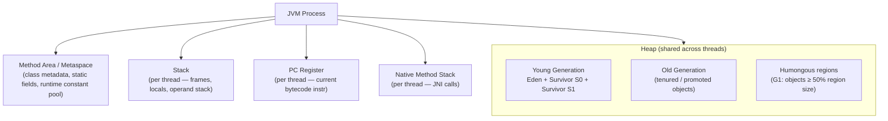
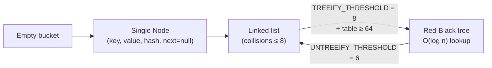

# Part 1 — Language & Runtime (Java/JVM)

> **Sprint allocation:** Week 1 (shared with Part 2). **Budget: ~5-6 hrs.**

## 1 Java/JVM — topic inventory

| # | Topic | Tags | Tier | Time | Done | Partial | Grilling | Visit Again | Notes | Resources |
|---|-------|------|------|------|------|---|----------|-------------|-------|-----------|
| 1 | Object model, inheritance, interfaces, abstract classes — when each fits | 🔴 💼 | M | 1 hr | [x] | [ ] | [ ] | [ ] | ~56 min | 💻 Warm-up: type a basic class with ctor/equals/hashCode/toString from memory (15 min) |
| 1a | String immutability — string pool, heap vs pool, why final, hashCode caching, StringBuilder | 🔴 💼 🎯 | D | 2 hrs | [x] | [ ] | [ ] | [ ] | ~15 min | 📖 `java/foundations/string/StringImmutability.md` |
| 2 | Generics — wildcards, bounds, type erasure, PECS rule | 🔴 💼 | D | 3 hrs | [x] | [ ] | [ ] | [x] | ~2 hrs 10 min | 📖 `java/foundations/generics/Generics.md` · *Effective Java* Items 26-33 (Bloch) |
| 3 | equals / hashCode / Comparable / Comparator contracts — most-broken contract in practice | 🔴 💼 | D | 2 hrs 45 min | [x] | [ ] | [ ] | [x] | ~33 min | 📖 `java/foundations/equals_hashcode/EqualsHashCode.md` · *Effective Java* Items 10-14 |
| 4 | Exception handling — checked vs unchecked, exception translation, try-with-resources | 🔴 💼 | M | 1 hr 10 min | [x] | [ ] | [ ] | [x] | ~50 min. Redo Resource/AutoCloseable exercise from scratch — AutoCloseable not deeply covered yet | 💻 Warm-up: try-with-resources for a custom AutoCloseable + observe close ordering with multiple resources (10 min) |
| 5 | Memory areas — heap (+ string pool inside heap), stack, metaspace, code cache | 🔴 💼 | D | 2 hrs | [x] | [ ] | [ ] | [ ] | ~30 min | 📖 `java/foundations/memory_areas/MemoryAreas.md` |
| 6 | Garbage collection — generational hypothesis, young/old, GC pauses | 🔴 💼 | D | 2.5 hrs | [x] | [ ] | [ ] | [ ] | ~10 min | 📖 `java/foundations/gc/GarbageCollection.md` |
| 7 | HashMap internals — bucket array, hashing, resizing, treeify threshold (8/6), load factor | 🔴 💼 🎯 | D | 3 hrs | [x] | [ ] | [ ] | [ ] | ~15 min | 📖 `java/foundations/hashmap/HashMap.md` · 📖 Baeldung "Guide to HashMap" + JEP 180 (treeification) |
| 8 | ConcurrentHashMap — CAS for empty bins, synchronized on head node, compute/merge atomicity | 🔴 💼 🎯 | D | 2.5 hrs | [x] | [ ] | [ ] | [x] | ~35 min | 📖 `java/foundations/concurrent_hashmap/ConcurrentHashMap.md` |
| 9 | LinkedHashMap — insertion vs access order, LRU cache implementation | 🔴 💼 | MP | 1.5 hrs | [ ] | [ ] | [ ] | [ ] | | 📖 `java/foundations/linked_hashmap/LinkedHashMap.md` · 💻 LeetCode "LRU Cache" — implement using LinkedHashMap then from scratch |
| 10 | TreeMap — Red-Black tree, sorted operations, ceilingKey / floorKey | 🔴 💼 | MP | 1.5 hrs | [ ] | [ ] | [ ] | [ ] | | 📖 `java/foundations/treemap/TreeMap.md` |
| 11 | Collections framework architecture (interfaces vs implementations) | 🟠 💼 | M | 1 hr | [ ] | [ ] | [ ] | [ ] | | |
| 12 | Streams API — intermediate vs terminal, lazy evaluation, parallel streams (and when NOT to use) | 🔴 💼 🎯 | D | 3 hrs 20 min | [ ] | [ ] | [ ] | [ ] | | 📖 Baeldung "Java 8 Streams" · 💻 Warm-up: 5 stream ops from scratch — filter / map / sum / groupingBy / partitioningBy (20 min) |
| 13 | Optional — proper use vs misuse | 🟠 💼 | M | 45 min | [ ] | [ ] | [ ] | [ ] | | |
| 14 | Functional interfaces — Function, Predicate, Consumer, Supplier, BiFunction | 🔴 💼 | M | 45 min | [ ] | [ ] | [ ] | [ ] | | |
| 15 | GC algorithms — G1 (default), ZGC, Shenandoah, Parallel; tuning intuition | 🟠 💼 | D | 3 hrs | [ ] | [ ] | [ ] | [ ] | | |
| 16 | Class loaders — bootstrap, platform, app; classloader hierarchy | 🟠 💼 | MP | 2 hrs | [ ] | [ ] | [ ] | [ ] | | |
| 17 | JIT compilation — C1, C2, tiered compilation, inlining | 🟠 💼 | MP | 2 hrs | [ ] | [ ] | [ ] | [ ] | | |
| 18 | WeakHashMap, IdentityHashMap, EnumMap — when each is right | 🟠 💼 | M | 1 hr | [ ] | [ ] | [ ] | [ ] | | |
| 19 | Hashtable vs HashMap vs ConcurrentHashMap — history & differences (Hashtable is legacy — know for comparison only) | 🟠 💼 | M | 45 min | [ ] | [ ] | [ ] | [ ] | | |
| 20 | Collisions, load factor, rehashing cost | 🟠 💼 🎯 | MP | 1.5 hrs | [ ] | [ ] | [ ] | [ ] | | |
| 21 | Annotations & meta-annotations | 🟡 💼 | M | 1 hr | [ ] | [ ] | [ ] | [ ] | | |
| 22 | Reflection — uses, costs, when to avoid | 🟡 | MP | 1.5 hrs | [ ] | [ ] | [ ] | [ ] | | |
| 23 | Heap dumps & analysis (Eclipse MAT, jmap) | 🟡 💼 | MP | 2 hrs | [ ] | [ ] | [ ] | [ ] | | 🎓 Eclipse MAT tutorial — load a sample heap, find a leak |
| 24 | Thread dumps & analysis (jstack) | 🟡 💼 | MP | 2 hrs | [ ] | [ ] | [ ] | [ ] | | |
| 25 | JFR (Java Flight Recorder) & JMC | 🟡 💼 | MP | 1.5 hrs | [ ] | [ ] | [ ] | [ ] | | |
| 26 | JVM flags worth knowing (Xmx, Xms, +HeapDumpOnOutOfMemoryError, GC logs) | 🟡 | M | 45 min | [ ] | [ ] | [ ] | [ ] | | |
| 27 | Map.of(), Map.copyOf(), Collections.unmodifiableMap — immutability flavors | 🟡 | L | 30 min | [ ] | [ ] | [ ] | [ ] | | |
| 28 | Set family — HashSet, LinkedHashSet, TreeSet, CopyOnWriteArraySet | 🟡 | M | 45 min | [ ] | [ ] | [ ] | [ ] | | |
| 29 | List family — ArrayList vs LinkedList (and why LinkedList is rarely the right choice) | 🟡 | M | 45 min | [ ] | [ ] | [ ] | [ ] | | |
| 30 | Queue / Deque — ArrayDeque, PriorityQueue, BlockingQueue family | 🟡 | M | 45 min | [ ] | [ ] | [ ] | [ ] | | |
| 31 | Records, sealed classes, pattern matching (Java 17+) | 🟢 | MP | 1 hr 45 min | [ ] | [ ] | [ ] | [ ] | | 💻 Warm-up: define `sealed interface Shape permits Circle, Rectangle` + records + pattern match in switch (15 min) |
| 32 | Text blocks, switch expressions, var | 🟢 🆕 | L | 30 min | [ ] | [ ] | [ ] | [ ] | | |

## Time summary

| Scope | Hours (zero baseline) | Weeks @ 10–12 hrs/wk | Actual time |
|-------|-----------------------|----------------------|-------------|
| 🔴 MUST only (Sprint priority — 3-month plan) | ~20.92 hrs | ~1.9 wk | ~6 hrs 14 min so far (rows 1, 1a, 2, 3, 4, 5, 6, 7, 8 done) |
| 🔴 + 🟠 HIGH (must + high — senior coverage) | ~36.92 hrs | ~3.35 wk | |
| Full Part (all items including 🟡 + 🟢) | ~50.67 hrs | ~4.6 wk | |

> Time estimates assume zero baseline (you've never seen the topic). Subtract whatever you already know.
> Fill in "Actual time" after finishing the Part — useful for calibrating future Parts.

## Key diagrams

**JVM memory layout:**



> Heap is shared; stack / PC / native stack are per-thread. Metaspace replaced PermGen in Java 8 — it grows from native memory, not heap.

**HashMap bucket evolution:**



> Treeification only kicks in when the bucket array is ≥ 64. Below that, the map resizes instead of converting bins. The 8/6 hysteresis avoids thrashing on the boundary.

## Frequently asked

1. **Q:** Walk through what happens internally when you `put()` 10,000 entries into a HashMap. What's the resize cost, when does treeification kick in, and what's the amortized complexity?
   - **Why asked:** Tests understanding of bucket array, load factor (0.75), resize doubling, treeify threshold (8 entries in one bucket → red-black tree), and untreeify (6 entries → back to list). Senior-canonical.
2. **Q:** ConcurrentHashMap.compute() races with put() on the same key. What's the atomicity guarantee, and how does it differ between Java 7 (segment lock) and Java 8+ (CAS + synchronized bin)?
   - **Why asked:** Tests JMM understanding + atomic compound operations + the actual mechanism (CAS on bin head + synchronized when contended).
3. **Q:** The equals/hashCode contract has 4 rules. Name them, and give a real-world bug that violates each.
   - **Why asked:** Most-broken contract in practice. Senior should know reflexive/symmetric/transitive/consistent + the hashCode equality rule.
4. **Q:** When would you NOT use parallel streams, even though the data is "embarrassingly parallel"?
   - **Why asked:** Tests judgment — small data sets, IO-bound operations, ordered collection requirements, shared mutable state, the ForkJoinPool.commonPool() trap with web servers.
5. **Q:** Explain the PECS rule with a concrete example. When would you use `List<? extends T>` vs `List<? super T>`?
   - **Why asked:** Generics depth. "Producer Extends, Consumer Super" — `extends` for read-only producers (covariance), `super` for write-only consumers (contravariance).
6. **Q:** Walk through what generational GC does on a typical web request: where do objects allocate, when do they promote, and what causes a full GC?
   - **Why asked:** Real-world GC understanding. Young-gen TLAB allocation → eden → survivor → old-gen promotion after N collections → full GC on old-gen pressure or System.gc().
7. **Q:** What's the difference between `volatile` and `synchronized`? Where would each be insufficient on its own?
   - **Why asked:** JMM core. volatile = visibility + ordering, no atomicity for compound ops. synchronized = mutex + visibility + happens-before. Neither alone fixes "check then act" races.

## Trick questions / gotchas

1. **Q:** This passes all unit tests in dev but causes silent data corruption in prod under concurrency. What's wrong?
   ```java
   class Point {
       int x, y;
       public boolean equals(Object o) { return o instanceof Point && ((Point)o).x == x && ((Point)o).y == y; }
       // hashCode() not overridden
   }
   Map<Point, String> map = new ConcurrentHashMap<>();
   map.put(new Point(1, 2), "a"); // works
   map.get(new Point(1, 2)); // returns null sometimes
   ```
   - **Gotcha:** `equals()` overridden without `hashCode()`. Two equal Points have different hash codes → land in different buckets → map.get() can't find the entry. The "sometimes" is misleading — it always fails unless hash codes coincide by chance.
2. **Q:** `String s = new String("abc"); String t = "abc";` — what does `s == t` return, and `s.equals(t)`?
   - **Gotcha:** `==` is false (different references — `new String` always allocates), `.equals()` is true. People conflate the two. `s.intern() == t` would be true.
3. **Q:** Does `ArrayList.subList(2, 5)` return a copy?
   - **Gotcha:** No, it returns a *view* backed by the original list. Modifying the original list while you hold the sublist will throw `ConcurrentModificationException` on next sublist access. And modifying the sublist mutates the parent.
4. **Q:** Can you have both `void foo(List<String> s)` and `void foo(List<Integer> i)` as method overloads?
   - **Gotcha:** No — type erasure removes generic parameters at runtime, so both methods have signature `foo(List)` after erasure. Compile error.

## Mastery candidates (top 3–5 from this Part — suggestions, not commitments)

- **HashMap + ConcurrentHashMap deep walkthrough** (~5 hrs combined) — interview-canonical for senior Java. Walk through put/get/resize/treeify mechanics, then atomic compound ops on CHM. Build LinkedHashMap-based LRU cache as the practical exercise.
- **Java Memory Model end-to-end** (~4 hrs) — volatile semantics, happens-before, synchronized monitor + reordering. Connect to Part 2 concurrency primitives.
- **equals/hashCode/Comparable/Comparator contracts with worked examples** (~2.5 hrs) — drill the 4-rule equals contract + Comparator chaining + the "consistent with equals" trap (TreeMap vs HashMap behavior diverges).
- **GC algorithms walkthrough** (~3 hrs) — G1 region-based collection vs ZGC concurrent vs Parallel. When to tune what. Read 1-2 GC log samples.

## Hands-on exercises (Practice + Advanced)

Warm-up exercises are listed inline in the topic-table Resources column (counted in main Time summary). The longer exercises below are tracked separately — do them during Mastery phase when you have deeper time blocks.

### Practice — mid-level gotchas (~30-60 min each)

1. **HashMap from scratch** (~60 min) — implement `put(K,V)` / `get(K)` / `resize()` with chaining (no treeify needed). Use a simple `int hash()` like `key.hashCode() & (capacity - 1)`. Compare to JDK source after.
2. **LRU cache via LinkedHashMap** (~30 min) — extend `LinkedHashMap<K,V>` with `accessOrder=true` and override `removeEldestEntry()`. Then implement same from scratch using `HashMap + Doubly Linked List` for the LeetCode version.
3. **equals/hashCode contract violations** (~45 min) — write a `Point` class with broken `equals` (or broken `hashCode`), insert into HashMap, observe lookup failures. Fix one rule at a time, observe progressive correctness.
4. **Generics compile errors via PECS** (~30 min) — write `void copyAll(List<? extends T> src, List<? super T> dst)`. Try removing the wildcards or swapping them — observe the specific compile errors. Builds PECS intuition.

### Advanced — senior-grade depth (~60+ min each)

5. **Induce + analyze an OOM** (~60 min) — write a loop that adds to a static `List<byte[]>` until OOM. Run with `-XX:+HeapDumpOnOutOfMemoryError -XX:HeapDumpPath=/tmp/heap.hprof`. Open in Eclipse MAT, find the leak suspect via Dominator Tree. Practice for the production debugging case.
6. **Observe GC behavior across collectors** (~60 min) — short program allocating 1M temp objects in a tight loop with `-Xlog:gc*` (Java 9+). Run with `-XX:+UseG1GC` then `-XX:+UseZGC` then `-XX:+UseParallelGC`. Compare pause times + throughput. Read 2 log entries from each to identify generation behavior.

### Hands-on time summary (Practice + Advanced only)

| Tier | Total time | Weeks @ 10–12 hrs/wk | Actual time |
|------|------------|----------------------|-------------|
| Practice (mid-level) | ~2.75 hrs | ~0.25 wk | |
| Advanced (senior-grade) | ~2 hrs | ~0.2 wk | |
| **Combined hands-on (Practice + Advanced)** | **~4.75 hrs** | **~0.45 wk** | |

> Warm-up exercises (counted in main Time summary above) total ~1 hr 15 min for Part 1 across 5 in-table warm-ups.

## Quick recall

**Q. What's the HashMap treeify threshold?**
A. 8 entries in one bucket → convert to red-black tree. Drops back to linked list at 6 (hysteresis to avoid thrashing). Treeification only happens if the bucket array is ≥ 64 entries; smaller maps just resize instead.

**Q. ConcurrentHashMap's `compute(k, fn)` — is the function call atomic?**
A. Yes, atomic with respect to other CHM operations on the same key. Internally uses CAS on bin head + `synchronized` block on the bin when contention. The function may be called multiple times under heavy contention, so it should be side-effect-free.

**Q. PECS rule in one sentence?**
A. Producer Extends, Consumer Super. Use `<? extends T>` when reading T out (covariance). Use `<? super T>` when writing T in (contravariance).

**Q. The 4-rule equals contract?**
A. Reflexive (`x.equals(x)`), Symmetric (`x.equals(y) ⇔ y.equals(x)`), Transitive (`x=y ∧ y=z ⇒ x=z`), Consistent (multiple calls return same result if objects unchanged). Plus: `equals(null) = false`. Plus: equal objects MUST have equal hashCodes.

**Q. Generational hypothesis in one sentence?**
A. Most objects die young — so collect young-gen frequently and cheaply, promote survivors to old-gen, and collect old-gen rarely.

**Q. What does `volatile` NOT give you?**
A. Atomicity for compound operations. `volatile int counter; counter++` is read-modify-write, which is 3 ops — `volatile` makes each visible but the sequence isn't atomic. Use `AtomicInteger` instead.
