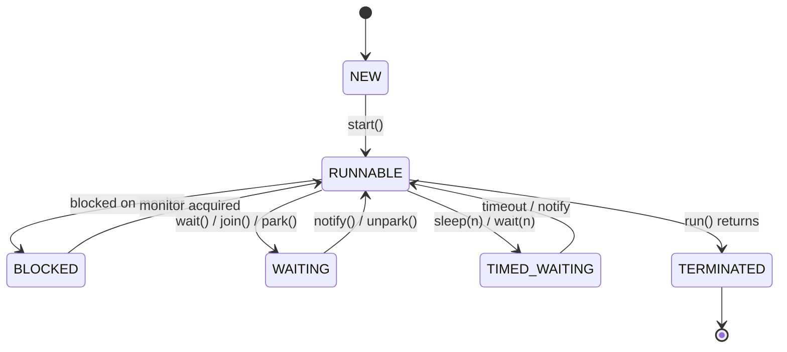
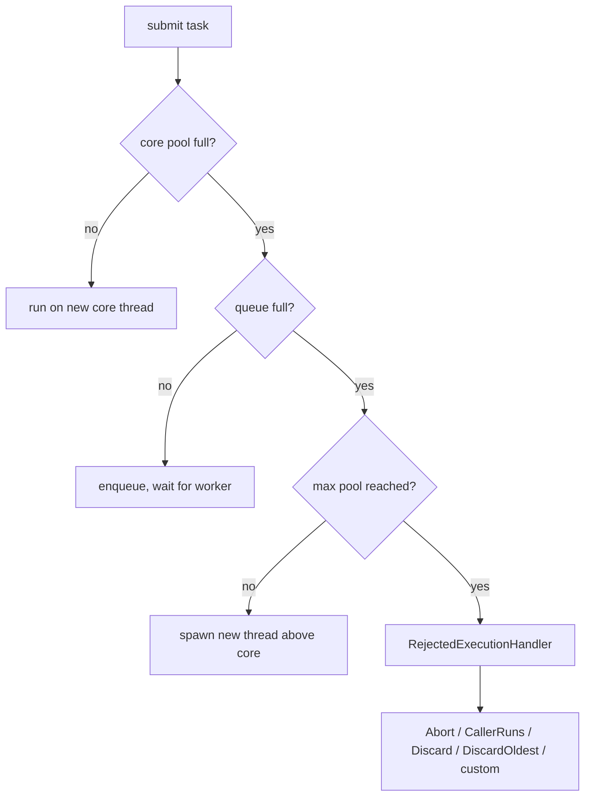

# Part 2 — Concurrency & Threads

> **Sprint allocation:** Week 1 (shared with Part 1). **Budget: ~5-6 hrs.**

## 2 Concurrency & Threads — topic inventory

| # | Topic | Tags | Tier | Time | Done | Partial | Grilling | Visit Again | Notes | Resources |
|---|-------|------|------|------|------|---|----------|-------------|-------|-----------|
| 1 | Process vs Thread — memory isolation, IPC vs shared memory, context switching, CPU scheduling | 🔴 💼 | M | 1 hr | [x] | [ ] | [ ] | [ ] | Notes: Covered in OS/Containers notes |  |
| 2 | Thread lifecycle — NEW, RUNNABLE, BLOCKED, WAITING, TIMED_WAITING, TERMINATED | 🔴 💼 🎯 | M | 1 hr | [x] | [ ] | [ ] | [ ] | Covered with interview-focused lifecycle page + exercises | 📖 `java/concurrency/thread_lifecycle/index.md` · 💻 `java/concurrency/thread_lifecycle/exercise/index.md` |
| 3 | Race conditions, atomicity, visibility, ordering | 🔴 💼 🎯 | D | 1.5 hrs | [x] | [ ] | [ ] | [ ] | Covered with race-condition notes + lost-update exercises | 📖 `java/concurrency/race_conditions/index.md` · 💻 `java/concurrency/race_conditions/exercise/index.md` |
| 4 | Java Memory Model — happens-before, volatile, synchronized semantics | 🔴 💼 🎯 | VD | 1.5 hrs | [x] | [ ] | [ ] | [ ] | Covered with happens-before, safe publication, DCL, static holder exercise | 📖 `java/concurrency/jmm/index.md` · 💻 `java/concurrency/jmm/exercise/index.md` |
| 5 | synchronized — intrinsic locks, monitor, biased locking history | 🔴 💼 | D | 1 hr | [x] | [ ] | [ ] | [ ] | Covered; biased locking treated as history, not a current interview focus | 📖 `java/concurrency/synchronized_keyword/index.md` · 💻 `java/concurrency/synchronized_keyword/exercise/index.md` |
| 6 | volatile — what it guarantees, what it doesn't | 🔴 💼 | D | 1 hr | [x] | [ ] | [ ] | [ ] | Covered with stop flag, join/start interaction, broken counter, immutable snapshot | 📖 `java/concurrency/volatile_keyword/index.md` · 💻 `java/concurrency/volatile_keyword/exercise/index.md` |
| 7 | ExecutorService, ThreadPoolExecutor — core / max pool, queue strategy, rejection policies | 🔴 💼 🎯 | D | 1.5 hrs | [ ] | [ ] | [ ] | [ ] |  | 📖 `java/concurrency/executor_service/index.md` · 📖 Baeldung "Guide to ThreadPoolExecutor" · 💻 Warm-up: run 1000 threads via fixed pool + virtual pool, compare (20 min) |
| 8 | Future, CompletableFuture — composition, exception handling, thenCompose vs thenApply | 🔴 💼 🎯 | D | 1.5 hrs | [ ] | [ ] | [ ] | [ ] |  | 📖 `java/concurrency/completable_future/index.md` · 📖 `java/concurrency/completable_future/basics/index.md` · 📖 `java/concurrency/completable_future/composition/index.md` · 📖 `java/concurrency/completable_future/failure_timeouts/index.md` · 📖 `java/concurrency/completable_future/backend_workflows/index.md` · 💻 Warm-up: supplyAsync().thenApply().join() chain (15 min) |
| 9 | Locks — ReentrantLock, ReentrantReadWriteLock, fair vs unfair | 🔴 💼 | MP | 1 hr | [x] | [ ] | [ ] | [ ] | Covered at interview depth; StampedLock/fairness intentionally kept recognition-level | 📖 `java/concurrency/locks/index.md` · 💻 `java/concurrency/locks/exercise/index.md` |
| 10 | Deadlock, livelock, starvation — causes and prevention | 🔴 💼 🎯 | MP | 1.5 hrs | [x] | [ ] | [ ] | [ ] | Covered with lock ordering, pool starvation, and exercises | 📖 `java/concurrency/deadlock_livelock_starvation/index.md` · 💻 `java/concurrency/deadlock_livelock_starvation/exercise/index.md` |
| 11 | Atomic family — AtomicInteger, AtomicReference, LongAdder | 🔴 💼 | MP | 1 hr 40 min | [x] | [ ] | [ ] | [ ] | Covered with CAS, read-and-reset, AtomicReference, LongAdder | 📖 `java/concurrency/atomic_classes/index.md` · 💻 `java/concurrency/atomic_classes/exercise/index.md` |
| 12 | ThreadLocal — uses, leaks in pooled threads | 🔴 💼 🎯 | M | 1 hr | [ ] | [ ] | [ ] | [ ] |  |  |
| 13 | Semaphore, CountDownLatch, CyclicBarrier, Phaser — when each fits | 🔴 💼 | MP | 1 hr | [ ] | [ ] | [ ] | [ ] |  |  |
| 14 | BlockingQueue family — ArrayBlockingQueue, LinkedBlockingQueue, SynchronousQueue, DelayQueue | 🔴 💼 | MP | 1.5 hrs | [ ] | [ ] | [ ] | [ ] |  |  |
| 15 | Virtual threads (Loom) — what they are, when they help, pinning gotchas | 🔴 💼 🆕 | MP | 1 hr | [ ] | [ ] | [ ] | [ ] |  | 📖 JEP 444 (Virtual Threads) + Oracle Loom intro |
| 16 | Reentrancy | 🟠 💼 | M | 45 min | [x] | [ ] | [ ] | [ ] | Covered under `synchronized` and `ReentrantLock` | 📖 `java/concurrency/synchronized_keyword/index.md` · 📖 `java/concurrency/locks/index.md` |
| 17 | wait / notify / notifyAll — and why you should rarely use them today | 🟠 💼 | M | 1 hr 20 min | [x] | [ ] | [ ] | [ ] | Covered; practical stance is prefer higher-level APIs | 📖 `java/concurrency/wait_notify/index.md` · 💻 `java/concurrency/wait_notify/exercise/index.md` |
| 18 | StampedLock — optimistic reads | 🟠 💼 | MP | 1.5 hrs | [x] | [ ] | [ ] | [ ] | Recognition-level only; intentionally not deep-studied because it is advanced/rare for SDE-2 interviews | 📖 `java/concurrency/locks/index.md` |
| 19 | Concurrent collections — ConcurrentHashMap vs CopyOnWriteArrayList vs ConcurrentSkipListMap — when each fits | 🟠 💼 | MP | 1 hr | [x] | [ ] | [ ] | [ ] | Covered for CHM, CopyOnWrite, atomic map operations; ConcurrentSkipListMap recognition is enough for now | 📖 `java/concurrency/concurrent_collections/index.md` · 💻 `java/concurrency/concurrent_collections/exercise/index.md` |
| 20 | Structured concurrency | 🟠 💼 🆕 | M | 1 hr | [ ] | [ ] | [ ] | [ ] |  |  |
| 21 | Producer-consumer, futures composition, fan-out / fan-in | 🟠 💼 | MP | 1.5 hrs | [ ] | [ ] | [ ] | [ ] |  |  |
| 22 | Double-checked locking — pre / post Java 5 (volatile fix) | 🟠 💼 | M | 45 min | [x] | [ ] | [ ] | [ ] | Covered under JMM safe publication and DCL | 📖 `java/concurrency/jmm/index.md` |
| 23 | Immutable objects as a concurrency strategy | 🟠 💼 | M | 45 min | [ ] | [x] | [ ] | [ ] | Partial: safe publication and immutable config snapshot covered; broader confinement/immutability strategy pending | 📖 `java/concurrency/jmm/index.md` · 📖 `java/concurrency/volatile_keyword/index.md` |
| 24 | Thread confinement | 🟠 💼 | M | 45 min | [ ] | [x] | [ ] | [ ] | Partial: concept appears in examples, but no focused page yet |  |
| 25 | ForkJoinPool, common pool, parallel streams under the hood | 🟡 | MP | 1.5 hrs | [ ] | [ ] | [ ] | [ ] |  |  |
| 26 | ScheduledExecutorService — proper way to do periodic tasks | 🟡 | M | 1 hr | [ ] | [ ] | [ ] | [ ] |  |  |
| 27 | Scoped values (replacing ThreadLocal) | 🟡 🆕 | M | 45 min | [ ] | [ ] | [ ] | [ ] |  |  |
| 28 | Reactive — Reactor (Mono / Flux), backpressure | 🟡 | MP | 1.5 hrs | [ ] | [ ] | [ ] | [ ] |  |  |

## Time summary

Reading + warm-up exercises (warm-ups are listed inline in the Resources column of the topic table and counted into the Time cells):

| Scope | Hours (zero baseline) | Weeks @ 10–12 hrs/wk | Actual time |
|-------|-----------------------|----------------------|-------------|
| 🔴 MUST only (Sprint priority — 3-month plan) | ~18.67 hrs | ~1.7 wk | |
| 🔴 + 🟠 HIGH (must + high — senior coverage) | ~28 hrs | ~2.55 wk | |
| Full Part (all items including 🟡) | ~32.75 hrs | ~2.98 wk | |

Heavier hands-on practice (Practice + Advanced) is tracked separately at the bottom of the Hands-on section.

## Key diagrams

**Thread lifecycle state machine:**

**ThreadPoolExecutor task submission flow:**

## Frequently asked

1. **Q:** Explain happens-before with a concrete example. How does it relate to volatile writes and synchronized blocks?
   - **Why asked:** JMM bedrock. happens-before defines what one thread is guaranteed to see from another. Volatile write happens-before subsequent volatile read of same variable; unlock happens-before subsequent lock of same monitor; thread.start() happens-before any action in the started thread.
2. **Q:** Design a ThreadPoolExecutor for: (a) CPU-bound batch processing of 1000 tasks; (b) I/O-bound web request handler. Walk through corePoolSize, maxPoolSize, queue choice, rejection policy.
   - **Why asked:** Senior-canonical. CPU-bound = pool size ≈ cores; I/O-bound = much higher (Little's Law: pool = cores × (1 + wait/compute)). Queue choice: bounded for backpressure, SynchronousQueue forces direct handoff, LinkedBlockingQueue unbounded = OOM risk.
3. **Q:** `thenCompose` vs `thenApply` — when do you use which? Show a chain that would fail with the wrong one.
   - **Why asked:** Tests functional composition. `thenApply(f)` where `f: T → U` returns `CompletableFuture<U>`. `thenCompose(f)` where `f: T → CompletableFuture<U>` also returns `CompletableFuture<U>` (flatMap). Using `thenApply` with an async function gives `CompletableFuture<CompletableFuture<U>>` — nested futures.
4. **Q:** Virtual threads vs platform threads — when does each fit, and what's "pinning"?
   - **Why asked:** Modern Java (JEP 444). Virtual threads excel for I/O-bound workloads (10k+ concurrent connections). Pinning = a virtual thread holding a platform carrier thread (synchronized blocks, native calls, file I/O on some FS) — defeats Loom's benefits.
5. **Q:** Why doesn't pre-Java-5 double-checked locking work? What changed?
   - **Why asked:** JMM evolution. Pre-Java-5: the instance reference could be published *before* the constructor finished (compiler reordering) — another thread could see a non-null but partially-constructed object. Post-Java-5: `volatile` provides happens-before guarantee that fixes this.
6. **Q:** When would you reach for ReentrantLock over `synchronized`?
   - **Why asked:** API-level features `synchronized` lacks: try-lock with timeout, interruptible lock acquisition, fairness, multiple Condition objects, lock-with-no-block-release (across methods). For simple critical sections, `synchronized` is preferred (less ceremony).
7. **Q:** Walk through how you'd detect and resolve a production deadlock.
   - **Why asked:** Senior operational skill. jstack thread dump → look for BLOCKED threads waiting on each other in a cycle. Resolution: consistent lock ordering, tryLock with timeout, eliminate one lock via single-lock or lock-free design.

## Trick questions / gotchas

1. **Q:** This service uses `ThreadLocal<DateFormat>` to avoid sharing. After 2 weeks in prod it OOMs. Why?
   - **Gotcha:** Tomcat/Undertow thread pools recycle threads — but `ThreadLocal` values persist for the thread's lifetime. If you set a `ThreadLocal<HeavyObject>` on every request and never remove it, each pooled thread accumulates references → heap leak. Always call `tl.remove()` in a finally block. Modern alternative: Scoped Values (Java 21+).
2. **Q:** `synchronized` on an instance method locks what? On a static method?
   - **Gotcha:** Instance method → locks `this`. Static method → locks the `Class` object. Mixing them does NOT mutually exclude — instance and static locks are different monitors. Common bug: `synchronized` static factory + `synchronized` instance method don't serialize.
3. **Q:** Why might `CompletableFuture.exceptionally()` silently swallow your bug?
   - **Gotcha:** It only fires for `CompletionException` from the upstream stage. If you also have `whenComplete(...)` after it and that throws, you've now suppressed the original failure. Prefer `handle((v, ex) -> ...)` when you need to both inspect and propagate. Also: a CompletableFuture you create but never `.join()` on — exceptions never surface anywhere.
4. **Q:** `volatile int counter; counter++;` — is this thread-safe?
   - **Gotcha:** No. `counter++` is read-modify-write (3 ops). Volatile guarantees each individual read/write is visible across threads, but the increment is non-atomic. Two threads can both read 5, both write 6 → lost update. Use `AtomicInteger` or `LongAdder` (better for high contention).

## Mastery candidates (top 3–5 from this Part — suggestions, not commitments)

- **Java Memory Model end-to-end** (~5 hrs — VD) — the foundational mental model. happens-before, volatile semantics, synchronized monitor, reordering. Connects to Part 1 ConcurrentHashMap, Part 6 isolation levels, Part 17 cert rotation atomicity. Mastery candidate across multiple Parts.
- **ThreadPoolExecutor configuration walkthrough** (~3 hrs) — sizing math (Little's Law), queue strategies, rejection policies, monitoring. Daily operational lever — your KYC platform tunes these constantly.
- **CompletableFuture composition patterns** (~3 hrs) — thenCompose/thenApply/exceptionally/handle/allOf/anyOf. Build a fan-out vendor-call pattern (relevant to your KYC vendor orchestration).
- **Virtual threads + pinning gotchas** (~2 hrs) — modern Java story. Where they help, where they don't, what `synchronized` does to them.

## Hands-on exercises (Practice + Advanced)

Warm-up exercises are listed inline in the topic-table Resources column (counted in main Time summary). The longer exercises below are tracked separately — do them during Mastery phase (Weeks 8-12) when you have deeper time blocks.

### Practice — mid-level gotchas (~30-60 min each)

1. **Reproduce a race condition + fix three ways** (~30 min) — `int counter = 0;` incremented 100k times by 10 threads (no synchronization). Run repeatedly, observe final value < 1,000,000. Then fix three ways: `synchronized`, `AtomicInteger`, `LongAdder`. Compare performance under contention.
2. **Observe memory visibility** (~45 min) — one thread runs a `while (!flag)` loop; another sets `flag = true` after a delay. Without `volatile`, JIT can optimize the loop's flag read to a register read → thread hangs forever. Add `volatile`, observe fix.
3. **Build producer-consumer with BlockingQueue** (~60 min) — 3 producer threads + 1 consumer + bounded `ArrayBlockingQueue(10)`. Add backpressure logging. Observe what `put()` does when queue is full vs `consume` is slow.
4. **Custom ThreadPoolExecutor + rejection policies** (~60 min) — pool with `corePoolSize=2`, `maxPoolSize=4`, `queue=ArrayBlockingQueue(2)`. Submit 10 tasks at once. Observe queue fills first, then maxPool spawns, then RejectedExecutionException. Swap in 3 different `RejectedExecutionHandler` policies (AbortPolicy / CallerRunsPolicy / custom log+drop).

### Advanced — senior-grade depth (~60+ min each)

5. **CompletableFuture fan-out pipeline** (~60 min) — simulate 5 vendor API calls (some succeed, some fail, varying latencies). Use `allOf` to wait for all, but collect successful results without aborting on individual failures (`handle()` per future + `allOf` on the handled list). Mirrors your KYC vendor orchestration.
6. **Make a deadlock + detect with jstack** (~45 min) — two threads, two locks acquired in opposite order. Run, observe hang. In another terminal: `jstack <pid>` → find "deadlock detected" in output + the cycle. Then fix via consistent lock ordering.
7. **Virtual thread vs platform thread benchmark + pinning observation** (~60 min) — 10,000 concurrent tasks each doing `Thread.sleep(100ms)`. Run once with `Executors.newFixedThreadPool(200)`, once with `Executors.newVirtualThreadPerTaskExecutor()`. Then wrap the sleep in a `synchronized` block — observe the pinning slowdown. Use `-Djdk.tracePinnedThreads=full`.
8. **AtomicInteger vs synchronized vs LongAdder under contention** (~45 min) — 16 threads incrementing a counter 1M times each. Compare wall times across the three. Observe LongAdder's striped-counter advantage under high contention.

### Hands-on time summary (Practice + Advanced only)

| Tier | Total time | Weeks @ 10–12 hrs/wk | Actual time |
|------|------------|----------------------|-------------|
| Practice (mid-level) | ~3.25 hrs | ~0.3 wk | |
| Advanced (senior-grade) | ~3.75 hrs | ~0.35 wk | |
| **Combined hands-on (Practice + Advanced)** | **~7 hrs** | **~0.65 wk** | |

> Warm-up exercises (counted in main Time summary above) total ~1 hr 55 min for Part 2 across 7 in-table warm-ups.

## Quick recall

**Q. Define happens-before in one sentence.**
A. If action A happens-before action B, the JMM guarantees the effects of A are visible to B and A is ordered before B from B's perspective.

**Q. ThreadPoolExecutor sizing rule of thumb for CPU-bound vs I/O-bound work?**
A. CPU-bound: pool ≈ available cores (HikariCP-style). I/O-bound: pool ≈ cores × (1 + wait time / compute time) — Little's Law. Web servers with downstream calls often need pools much larger than core count.

**Q. `thenCompose` vs `thenApply` — one-line distinction?**
A. `thenApply` is map (function returns plain value). `thenCompose` is flatMap (function returns another CompletableFuture). Use `thenCompose` to avoid nested futures when chaining async ops.

**Q. What is "pinning" in virtual threads?**
A. A virtual thread is "pinned" to its carrier (platform) thread when inside a `synchronized` block, native method, or some file I/O. The carrier can't be released to run other virtual threads — defeating Loom's scalability. Use `ReentrantLock` instead of `synchronized` in hot paths to avoid this.

**Q. What does `volatile` guarantee — exactly?**
A. (1) Reads always return the most recent write from any thread (visibility). (2) Writes happen-before subsequent reads of the same variable (ordering). (3) NOT atomic for compound operations (read-modify-write).

**Q. Why is `volatile` necessary in modern double-checked locking?**
A. Without it, the instance reference assignment can be reordered to happen *before* constructor completion. Another thread could see a non-null reference to a partially-constructed object. Volatile prevents this reordering via happens-before.
